# 🗺️ Dify Learning Map

🌍 [English Version](./Dify-learning-map_en.md) | [中文版本](./Dify-learning-map.md)

> **Complete Learning Path from Beginner to Expert in Dify Architecture**  
> Suitable for architects, developers, and AI engineers to systematically learn Dify


---

## 📚 How to Use This Learning Map

This learning map is designed based on **cognitive difficulty progression** and **practical application scenarios**, divided into 5 stages:

```mermaid
graph LR
    A[🎯 Stage 1: Quick Start] --> B[🏗️ Stage 2: Architecture Understanding]
    B --> C[⚙️ Stage 3: Core Modules]
    C --> D[🔌 Stage 4: Integration Extension]
    D --> E[🚀 Stage 5: Production Practice]
    
    style A fill:#e1f5e1
    style B fill:#e3f2fd
    style C fill:#fff3e0
    style D fill:#f3e5f5
    style E fill:#ffebee
```



**Estimated Learning Time**:
- **Quick Path** (Core Capabilities): 3-5 days
- **Deep Path** (Architecture Design): 2-3 weeks
- **Expert Path** (Source Code Level): 1-2 months

---

## 🎯 Stage 1: Quick Start (1-2 days)

**Learning Goal**: Understand what Dify is, what it can do, and how to get started quickly

### 📖 Required Documents

| No. | Document | Key Takeaways | Reading Time |
|-----|----------|---------------|--------------|
| 1.1 | [01-overview/README.md](./01-overview/README.md) | Project goals, core capabilities, tech stack | 20 minutes |
| 1.2 | [Official README](../README.md) | Quick deployment and experience | 15 minutes |
| 1.3 | [AGENTS.md](../AGENTS.md) | Development workflow and standards | 10 minutes |

### 🎬 Practical Tasks

- [ ] **Task 1.1**: Deploy Dify local environment using Docker Compose
- [ ] **Task 1.2**: Create your first simple workflow (LLM Q&A)
- [ ] **Task 1.3**: Experience knowledge base functionality (upload documents and Q&A)
- [ ] **Task 1.4**: Try creating a simple Agent

### ✅ Clearance Standards

- [ ] Able to independently deploy Dify and access the frontend interface
- [ ] Understand Dify's 4 major core capabilities (Workflow, Agent, RAG, Model Runtime)
- [ ] Know Dify's tech stack (Frontend Next.js, Backend Flask)

---

## 🏗️ Stage 2: Architecture Understanding (3-5 days)

**Learning Goal**: Master Dify's system architecture, layered design, and component relationships

### 📐 Architecture Diagram Learning Path


### 📖 Required Documents

| No. | Document | Key Takeaways | Reading Time |
|-----|----------|---------------|--------------|
| 2.1 | [02-architecture/README.md](./02-architecture/README.md) | Complete system architecture and component relationships | 30 minutes |
| 2.2 | [02-architecture/dify_componet_architecture.puml](./02-architecture/dify_componet_architecture.puml) | Architecture diagram source code (editable) | 20 minutes |
| 2.3 | [03-layers/api/README.md](./03-layers/api/README.md) | API layered design | 25 minutes |
| 2.4 | [04-core-modules/README.md](./04-core-modules/README.md) | Core modules overview | 20 minutes |

### 🖼️ Key Architecture Diagrams

**Must-see Architecture Diagrams** (by priority):
1. ⭐ [Dify Complete Component Architecture Diagram.png](./02-architecture/png/Dify完整组件架构图.png)
2. [Dify Agent Technology Component Architecture Diagram.jpg](./02-architecture/png/Dify智能体技术组件架构图.jpg)
3. [Dify Workflow Management Core Scenario Sequence Diagram.png](./02-architecture/png/Dify工作流管理核心场景时序图.png)

### 🎬 Practical Tasks

- [ ] **Task 2.1**: Draw your own understanding of Dify architecture (using PlantUML or hand-drawn)
- [ ] **Task 2.2**: Read `api/controllers/console/app/workflow.py`, understand how API layer calls Service layer
- [ ] **Task 2.3**: Understand DDD layering: Controller → Service → Core → Repository
- [ ] **Task 2.4**: Find entry code for 3 core modules (Workflow, Agent, RAG)

### ✅ Clearance Standards

- [ ] Able to draw Dify's three-layer architecture (Frontend, Backend, Infrastructure)
- [ ] Understand benefits of DDD layered design (decoupling, testable, extensible)
- [ ] Know responsibilities and relationships of 8 major core modules

---

## ⚙️ Stage 3: Core Modules Deep Dive (7-10 days)

**Learning Goal**: Deeply understand the design and implementation of Dify's 8 major core modules

### 🗂️ Module Learning Order (Recommended)

Designed learning path based on **dependency relationships** and **complexity**:


### 📖 Module-by-Module Learning Path

#### 🔹 3.1 Model Runtime ⭐ Foundation Module

**Why learn first**: All modules depend on it to call LLMs

| Document | Key Takeaways | Difficulty |
|----------|---------------|------------|
| [model_runtime/README.md](./04-core-modules/model_runtime/) | Model abstraction layer design | ⭐⭐ |
| Source Code: `api/core/model_runtime/` | Factory pattern, adapter pattern | ⭐⭐⭐ |

**Practical Tasks**:
- [ ] Understand how to uniformly call different LLMs (OpenAI, Claude, local models)
- [ ] Read `model_runtime/model_providers/openai/llm/llm.py`
- [ ] Try adding a custom model provider

---

#### 🔹 3.2 Prompt Engineering ⭐ Foundation Module

**Why second**: Both Workflow and Agent depend on Prompt management

| Document | Key Takeaways | Difficulty |
|----------|---------------|------------|
| [prompt/README.md](./04-core-modules/prompt/) | Prompt template system | ⭐⭐ |
| Source Code: `api/core/prompt/` | Variable injection, context management | ⭐⭐ |

**Practical Tasks**:
- [ ] Understand Prompt template variable replacement mechanism
- [ ] Analyze multi-turn conversation context concatenation strategy
- [ ] Read [07-others/Context Engineering Concept Clarification.md](./07-others/上下文工程概念澄清.md)

---

#### 🔹 3.3 Workflow Engine ⭐⭐⭐ Core Module

**Why important**: Dify's most powerful capability, understanding it means understanding Dify's design philosophy

| Document | Key Takeaways | Reading Time |
|----------|---------------|--------------|
| [workflow/workflow_management_technical_doc.md](./04-core-modules/workflow/workflow_management_technical_doc.md) | Event-driven architecture | 40 minutes |
| [workflow/workflow_types_documentation.md](./04-core-modules/workflow/workflow_types_documentation.md) | Workflow types | 20 minutes |
| [workflow/workflow_nodes_documentation.md](./04-core-modules/workflow/workflow_nodes_documentation.md) | Node development guide | 30 minutes |
| [workflow/workflow_component_development_guide.md](./04-core-modules/workflow/workflow_component_development_guide.md) | Custom node development | 50 minutes |

**Key Sequence Diagrams**:
- [Dify Workflow Management Core Scenario Sequence Diagram.png](./02-architecture/png/Dify工作流管理核心场景时序图.png)

**Practical Tasks**:
- [ ] Understand Workflow's event-driven architecture
- [ ] Read `api/core/workflow/nodes/llm/llm_node.py` (LLM node implementation)
- [ ] Create a custom node (e.g., call third-party API)
- [ ] Understand workflow state management (running, paused, completed, failed)

---

#### 🔹 3.4 Agent System ⭐⭐⭐ Core Module

**Why important**: Understand AI Agent engineering implementation

| Document | Key Takeaways | Reading Time |
|----------|---------------|--------------|
| [agent/agent_capability_technical_documentation.md](./04-core-modules/agent/agent_capability_technical_documentation.md) | Agent strategy pattern | 45 minutes |
| [agent/README.md](./04-core-modules/agent/README.md) | Agent architecture overview | 15 minutes |

**Key Sequence Diagrams**:
- [Dify Agent Core Scenario Sequence Diagram.png](./02-architecture/png/Dify智能体核心场景时序.png)

**Practical Tasks**:
- [ ] Understand Function Calling, ReAct, Plan & Execute three strategies
- [ ] Read `api/core/agent/agent_runner.py`
- [ ] Create a custom Agent strategy
- [ ] Understand complete tool invocation process

---

#### 🔹 3.5 Knowledge Base (RAG System) ⭐⭐⭐ Core Module

**Why important**: RAG is the core capability of AI applications

| Document | Key Takeaways | Reading Time |
|----------|---------------|--------------|
| [knowledgeBase/README.md](./04-core-modules/knowledgeBase/) | Complete RAG pipeline | 30 minutes |
| [07-others/Dify Knowledge Q&A Scenario - Context Engineering Application Details.md](./07-others/Dify知识问答场景-上下文工程应用详解.md) | Context engineering practice | 35 minutes |

**Key Sequence Diagrams** (Document Processing Flow):
- [Dify-PDF Document Processing Sequence Diagram.png](./02-architecture/png/Dify-PDF文档处理时序.png)
- [Dify-Word Document Processing Sequence Diagram.png](./02-architecture/png/Dify-Word文档处理时序.png)
- [Dify-Excel Document Processing Sequence Diagram.png](./02-architecture/png/Dify-Excel文档处理时序.png)

**Practical Tasks**:
- [ ] Understand RAG pipeline: Extractor → Splitter → Embedding → Retrieval → Rerank
- [ ] Read `api/core/rag/retrieval/`
- [ ] Test different text chunking strategies (fixed length vs semantic chunking)
- [ ] Compare different retrieval strategies (semantic retrieval vs hybrid retrieval)

---

#### 🔹 3.6 Tools & Plugins ⭐⭐

| Document | Key Takeaways | Difficulty |
|----------|---------------|------------|
| [tools&plugins/README.md](./04-core-modules/tools&plugins/) | Tool invocation mechanism | ⭐⭐ |

**Practical Tasks**:
- [ ] Create a custom tool (e.g., weather query API)
- [ ] Understand tool registration and auto-discovery mechanism
- [ ] Read `api/core/tools/`

---

#### 🔹 3.7 Observability ⭐⭐

| Document | Key Takeaways | Difficulty |
|----------|---------------|------------|
| [observability/README.md](./04-core-modules/observability/) | Logging, tracing, monitoring | ⭐⭐ |

**Practical Tasks**:
- [ ] Understand distributed tracing implementation (OpenTelemetry)
- [ ] Configure Sentry error monitoring
- [ ] Read `api/core/ops/`

---

#### 🔹 3.8 Permission ⭐

| Document | Key Takeaways | Difficulty |
|----------|---------------|------------|
| [permission/README.md](./04-core-modules/permission/) | RBAC model | ⭐ |

**Practical Tasks**:
- [ ] Understand Dify's multi-tenant isolation mechanism
- [ ] Read `api/services/account_service.py`

---

### ✅ Stage 3 Clearance Standards

- [ ] Able to independently develop a custom workflow node
- [ ] Able to create a custom Agent strategy
- [ ] Understand complete RAG process and optimize retrieval effectiveness
- [ ] Able to add a new tool to Dify

---

## 🔌 Stage 4: Integration Extension (3-5 days)

**Learning Goal**: Master Dify's integration solutions with third-party services

### 📖 Third-party Integration Learning Path

Dify supports **10+ categories of third-party service integration**, recommended learning order by usage frequency:

| No. | Document | Integration Type | Key Takeaways |
|-----|----------|------------------|---------------|
| 4.1 | [06-third-party/01-Large Language Model Integration.md](./06-third-party/01-大语言模型集成.md) | LLM | 40+ model providers |
| 4.2 | [06-third-party/02-Vector Database Integration.md](./06-third-party/02-向量数据库集成.md) | Vector Database | 28+ vector databases |
| 4.3 | [06-third-party/03-Object Storage Integration.md](./06-third-party/03-对象存储集成.md) | Object Storage | S3, Alibaba Cloud OSS |
| 4.4 | [06-third-party/05-Document Processing Integration.md](./06-third-party/05-文档处理集成.md) | Document Parsing | PDF, Word, Excel |
| 4.5 | [06-third-party/04-Messaging Platform Integration.md](./06-third-party/04-消息平台集成.md) | Messaging Platform | Slack, DingTalk, WeCom |

### 🎬 Practical Tasks

- [ ] **Task 4.1**: Switch Dify's vector database (Weaviate → Qdrant)
- [ ] **Task 4.2**: Add a new LLM provider (e.g., domestic large model)
- [ ] **Task 4.3**: Configure object storage (local → S3)
- [ ] **Task 4.4**: Integrate DingTalk bot

### ✅ Clearance Standards

- [ ] Able to add new third-party service integration to Dify
- [ ] Understand application of adapter pattern in integration
- [ ] Know how to choose appropriate vector database

---

## 🚀 Stage 5: Production Practice (Ongoing)

**Learning Goal**: Master Dify's production deployment, performance optimization, and troubleshooting

### 📖 Practical Documents

| No. | Document | Key Takeaways | Difficulty |
|-----|----------|---------------|------------|
| 5.1 | [docker/README.md](../docker/README.md) | Docker deployment | ⭐⭐ |
| 5.2 | `analysis/_deployment_guide.md` | Deployment best practices | ⭐⭐⭐ |
| 5.3 | [05-data-architecture/](./05-data-architecture/) | Database design | ⭐⭐⭐ |

### 🎬 Practical Tasks

- [ ] **Task 5.1**: Deploy Dify to cloud server (Alibaba Cloud/AWS)
- [ ] **Task 5.2**: Configure HTTPS and domain
- [ ] **Task 5.3**: Configure Nginx reverse proxy and load balancing
- [ ] **Task 5.4**: Performance stress testing (tools: Locust, JMeter)
- [ ] **Task 5.5**: Monitor Dify's performance metrics (CPU, memory, response time)
- [ ] **Task 5.6**: Database optimization (indexing, query optimization)

### ✅ Clearance Standards

- [ ] Able to independently deploy Dify to production environment
- [ ] Know how to troubleshoot performance issues
- [ ] Understand Dify's scalability design (horizontal scaling)

---

## 🎯 Recommended Learning Paths (By Role)

### 👨‍💼 Architect Path

**Goal**: Understand Dify's architecture design and technology selection

```
Stage 1 → Stage 2 → Stage 3 (Core modules overview) → Stage 4 → Stage 5 (Focus: scalability and performance)
```

**Key Documents**:
- 02-architecture (Architecture design)
- 04-core-modules (Module design)
- 05-data-architecture (Database design)

---

### 👨‍💻 Developer Path

**Goal**: Conduct secondary development or contribute code based on Dify

```
Stage 1 → Stage 2 → Stage 3 (Deep learning Workflow & Agent) → Stage 4 (Integration development)
```

**Key Documents**:
- 04-core-modules/workflow (Workflow development)
- 04-core-modules/agent (Agent development)
- 04-core-modules/tools&plugins (Tool development)
- AGENTS.md (Development standards)

---

### 🤖 AI Engineer Path

**Goal**: Understand engineering best practices for AI applications

```
Stage 1 → Stage 3.3 (Workflow) → Stage 3.4 (Agent) → Stage 3.5 (RAG) → Stage 4.1 (LLM integration)
```

**Key Documents**:
- 04-core-modules/workflow (AI workflow)
- 04-core-modules/agent (Agent strategies)
- 04-core-modules/knowledgeBase (RAG implementation)
- 06-third-party/01-Large Language Model Integration.md

---

### 🎓 Student/Beginner Path

**Goal**: Quick start and understand Dify's core capabilities

```
Stage 1 → Stage 2 (Focus: architecture diagrams) → Stage 3 (Choose 1-2 modules of interest)
```

**Key Documents**:
- 01-overview (Project overview)
- 02-architecture (Architecture diagrams)
- 04-core-modules/workflow (Workflow)

---

## 📊 Learning Progress Tracking

### 📈 Self-Assessment Completion Table

| Stage | Estimated Time | Completion | Clearance Date |
|-------|----------------|------------|----------------|
| 🎯 Stage 1: Quick Start | 1-2 days | ☐ | - |
| 🏗️ Stage 2: Architecture Understanding | 3-5 days | ☐ | - |
| ⚙️ Stage 3: Core Modules | 7-10 days | ☐ | - |
| 🔌 Stage 4: Integration Extension | 3-5 days | ☐ | - |
| 🚀 Stage 5: Production Practice | Ongoing | ☐ | - |

### 🎖️ Skill Badge System

Unlock corresponding badges after completing specific learning goals:

- 🏆 **Dify Beginner**: Complete Stage 1
- 🏆 **Architecture Understander**: Complete Stage 2
- 🏆 **Workflow Master**: Deeply master Workflow module
- 🏆 **Agent Expert**: Deeply master Agent module
- 🏆 **RAG Engineer**: Deeply master Knowledge Base module
- 🏆 **Integration Expert**: Complete Stage 4
- 🏆 **Production Practitioner**: Complete Stage 5
- 🏆 **Dify Contributor**: Contribute code to Dify and get merged

---

## 🛠️ Recommended Learning Tools

### 📖 Document Reading

- **PlantUML Preview**: VS Code plugin `PlantUML`
- **Markdown Preview**: VS Code plugin `Markdown Preview Enhanced`
- **Architecture Diagram Drawing**: draw.io, Excalidraw

### 🔍 Code Reading

- **IDE**: VS Code + Python plugin
- **Code Navigation**: Sourcegraph, GitHub CodeSpaces
- **AI Assistance**: GitHub Copilot, Cursor

### 🧪 Experimental Environment

- **Local Deployment**: Docker Desktop
- **Cloud Server**: Alibaba Cloud, AWS, Azure
- **Database Tools**: pgAdmin (PostgreSQL), RedisInsight (Redis)

---

## 📚 Supplementary Resources

### 🌐 Official Resources

- **Official Documentation**: https://docs.dify.ai/
- **GitHub Repository**: https://github.com/langgenius/dify
- **Community Discussion**: GitHub Discussions

### 📝 Recommended Reading

- **DDD Domain-Driven Design**: "Domain-Driven Design" (Eric Evans)
- **Clean Architecture**: "Clean Architecture" (Robert C. Martin)
- **AI Application Development**: "Building LLM Applications" (O'Reilly)

### 🎥 Video Tutorials

- Dify Official YouTube Channel
- Bilibili Dify Tutorial Collection

---

## 🤝 Learning Suggestions

### ✅ Recommended Practices

- **Learn by Doing**: Combine theory with practice, experiment immediately after learning each module
- **Draw to Understand**: Use PlantUML or hand-drawn architecture diagrams to deepen understanding
- **Read Source Code**: Don't just read documents, learn combined with source code
- **Take Notes**: Record learning insights in Markdown
- **Ask Questions**: Go to GitHub Discussions for questions you don't understand

### ❌ Avoid Pitfalls

- **Don't Skip Learning**: Follow the learning path step by step
- **Don't Just Read Without Doing**: Practice is the best teacher
- **Don't Get Stuck on Details**: Understand the whole first, then dive into details
- **Don't Go It Alone**: Join the community, communicate with other learners

---

## 📞 Get Help

### 🆘 What to do when you encounter problems?

1. **Check Documents**: First search for relevant documents in the `analysis/` directory
2. **Look at Source Code**: Understand implementation details combined with source code
3. **Ask the Community**: Go to GitHub Discussions to ask questions
4. **Contact Author**: Follow WeChat Official Account `柒叔代码阁`, get in-depth content and one-on-one Q&A

---

## 🎓 Conclusion

Dify is an elegantly designed, powerful open-source AI application development platform. By systematically learning this learning map, you will:

- ✅ Master Dify's complete architecture design
- ✅ Understand engineering best practices for AI applications
- ✅ Have the ability to conduct secondary development based on Dify
- ✅ Know how to deploy Dify to production environment

**Happy learning! 🚀**

---

📱 **Follow WeChat Official Account 「柒叔代码阁」**


💡 **Why follow?**

Not just tell you "what" and "how", but more importantly **"why"** — understanding the thinking behind the design allows you to apply it flexibly.

💬 **Discussion and Exchange**
- GitHub Issue/Discussion: Technical problem discussions
- Official Account Messages: Get one-on-one Q&A