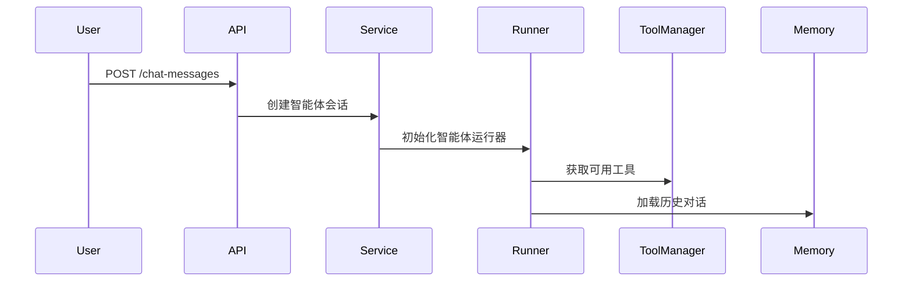
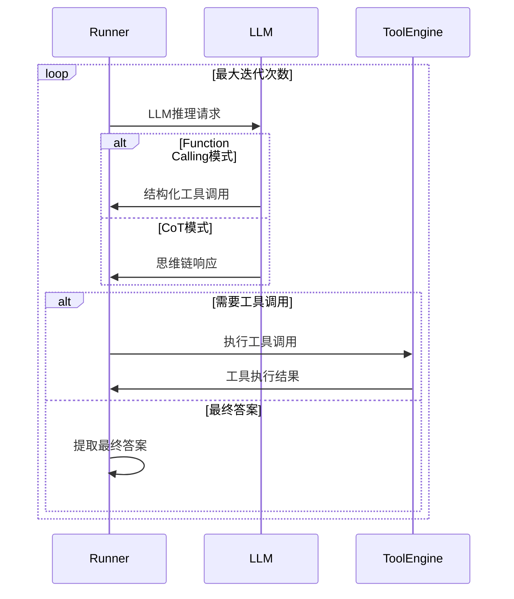
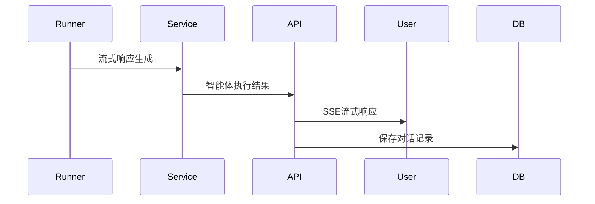

# Dify 智能体能力技术文档

## 目录
- [概述](#概述)
- [整体架构](#整体架构)
- [核心组件详解](#核心组件详解)
- [智能体执行流程](#智能体执行流程)
- [技术实现细节](#技术实现细节)
- [配置与部署](#配置与部署)
- [开发指南](#开发指南)
- [故障排除](#故障排除)

## 概述

Dify的智能体能力是一个强大的AI应用开发平台核心功能，支持基于大语言模型(LLM)的智能推理和工具调用。该系统采用模块化设计，支持多种智能体策略，包括Function Calling和Chain of Thought (CoT/ReAct)两种主要模式。

### 核心特性

- **多策略支持**: Function Calling精确调用，CoT/ReAct可解释推理
- **丰富的工具生态**: 内置工具、API工具、插件工具、工作流工具等
- **流式处理**: 实时响应和交互体验
- **内存管理**: 智能的对话历史和上下文管理
- **可观测性**: 完整的执行链路追踪和调试能力

## 整体架构

Dify智能体系统采用分层架构设计，从上到下包含以下层次：

### 架构层次

```
┌─────────────────────────────────────────┐
│           用户接口层                      │
│    REST API | WebSocket | Service       │
├─────────────────────────────────────────┤
│           智能体核心层                    │
│ BaseRunner | FCRunner | CoTRunner       │
├─────────────────────────────────────────┤
│           工具管理层                      │
│ ToolManager | ToolEngine | Tools        │
├─────────────────────────────────────────┤
│           模型集成层                      │
│ ModelManager | LLMRuntime | Providers   │
├─────────────────────────────────────────┤
│           内存管理层                      │
│ TokenMemory | History | Store           │
├─────────────────────────────────────────┤
│           数据持久层                      │
│    PostgreSQL | Redis | Cache           │
└─────────────────────────────────────────┘
```

## 核心组件详解

### 1. 智能体核心层 (Agent Core Layer)

#### BaseAgentRunner
**位置**: `api/core/agent/base_agent_runner.py`

基础智能体运行器，提供所有智能体类型的通用功能：

- 初始化智能体配置和上下文
- 管理对话历史和内存
- 处理工具发现和初始化
- 提供模型调用基础接口

**关键方法**:
```python
def __init__(self, tenant_id, application_generate_entity, conversation, ...)
def _convert_tool_to_prompt_message_tool(self, tool)
def organize_agent_history(self, prompt_messages)
```

#### FunctionCallAgentRunner
**位置**: `api/core/agent/fc_agent_runner.py`

实现Function Calling模式的智能体：

- 支持结构化工具调用
- 并行工具执行能力
- 精确的参数传递和验证
- 适用于明确定义的任务场景

**执行特点**:
- LLM生成结构化的工具调用指令
- 支持同时调用多个工具
- 结果聚合和错误处理
- 流式输出工具执行状态

#### CotAgentRunner
**位置**: `api/core/agent/cot_agent_runner.py`

实现Chain of Thought (ReAct)模式的智能体：

- 基于思维链的推理过程
- 单步工具执行和观察
- 可解释的决策过程
- 适用于复杂推理任务

**执行特点**:
- 遵循"Thought-Action-Observation"循环
- 使用ReAct提示模板
- 每次只执行一个工具
- 提供详细的推理过程

### 2. 工具管理层 (Tool Management Layer)

#### ToolManager
**位置**: `api/core/tools/tool_manager.py`

工具管理器负责工具的发现、注册和管理：

```python
class ToolManager:
    @classmethod
    def get_agent_tool_runtime(cls, tenant_id, app_id, agent_tool, invoke_from)
    
    @classmethod
    def get_builtin_tool(cls, provider_type, provider_id, tool_name)
```

**支持的工具类型**:

1. **内置工具 (Builtin Tools)**
   - 系统预定义的工具集合
   - 包括搜索、计算、文本处理等
   - 无需额外配置即可使用

2. **API工具 (API Tools)**
   - 外部REST API封装
   - 支持认证和参数配置
   - 可自定义API调用规范

3. **插件工具 (Plugin Tools)**
   - 第三方插件扩展
   - 支持热插拔和动态加载
   - 提供标准化插件接口

4. **工作流工具 (Workflow Tools)**
   - 将工作流封装为工具
   - 支持复杂业务逻辑
   - 可组合和复用

5. **数据集检索工具 (Dataset Retriever)**
   - RAG知识库检索
   - 向量相似度搜索
   - 上下文相关内容获取

#### ToolEngine
**位置**: `api/core/tools/tool_engine.py`

工具执行引擎，处理工具的实际调用：

```python
class ToolEngine:
    @staticmethod
    def agent_invoke(tool, tool_parameters, user_id, tenant_id, message, ...)
```

**核心功能**:
- 参数验证与类型转换
- 安全执行环境
- 错误处理与重试机制
- 执行结果流式传输
- 调用链路追踪

### 3. 模型集成层 (Model Integration Layer)

#### ModelManager
**位置**: `api/core/model_manager.py`

模型管理器提供统一的模型访问接口：

- 多模型提供商支持 (OpenAI, Anthropic, 本地模型等)
- 模型路由和负载均衡
- 凭据管理和认证
- 模型能力检测和适配

#### PromptTemplates
**位置**: `api/core/agent/prompt/template.py`

提示模板系统，支持不同的智能体模式：

```python
# ReAct模式模板示例
ENGLISH_REACT_COMPLETION_PROMPT_TEMPLATES = """
Respond to the human as helpfully and accurately as possible.

{{instruction}}

You have access to the following tools:
{{tools}}

Use a json blob to specify a tool by providing an action key (tool name) and an action_input key (tool input).
...
"""
```

### 4. 内存管理层 (Memory Management Layer)

#### TokenBufferMemory
**位置**: `api/core/memory/token_buffer_memory.py`

智能的内存管理策略：

- **Token限制**: 根据模型上下文长度限制
- **滑动窗口**: 保持最新的对话内容
- **重要信息保留**: 系统消息和关键上下文
- **压缩算法**: 历史对话的智能压缩

#### 数据持久化

**PostgreSQL表结构**:
- `conversations`: 对话会话记录
- `messages`: 用户和助手消息
- `message_agent_thoughts`: 智能体思考过程
- `message_files`: 消息附件文件

**Redis缓存**:
- 会话缓存: 活跃对话的临时存储
- 工具缓存: 工具配置和结果缓存

## 智能体执行流程

### 完整执行时序

以下是智能体从接收用户查询到返回最终答案的完整流程：

#### 1. 初始化阶段



**关键步骤**:
1. 解析用户请求和配置参数
2. 选择合适的智能体策略 (FC/CoT)
3. 初始化工具集合和权限验证
4. 加载对话历史和上下文信息

#### 2. 推理与工具调用循环



**迭代控制**:
- 最大迭代次数限制 (默认99次)
- 工具调用状态检测
- 最终答案识别
- 错误处理和重试机制

#### 3. 响应生成与流式输出



**流式特性**:
- 实时思考过程展示
- 工具调用状态更新
- 渐进式答案生成
- 完整执行历史记录

### Function Calling vs Chain of Thought

| 特性 | Function Calling | Chain of Thought |
|------|------------------|------------------|
| **推理方式** | 结构化调用 | 思维链推理 |
| **工具执行** | 并行执行 | 单步执行 |
| **可解释性** | 中等 | 高 |
| **执行效率** | 高 | 中等 |
| **适用场景** | 明确任务 | 复杂推理 |
| **错误处理** | 精确 | 自适应 |

## 技术实现细节

### 工具调用机制

#### Function Calling实现
```python
# 工具schema构建
message_tool = PromptMessageTool(
    name=tool.tool_name,
    description=tool_entity.entity.description.llm,
    parameters={
        "type": "object",
        "properties": tool_properties,
        "required": required_params,
    },
)

# LLM调用
chunks = model_instance.invoke_llm(
    prompt_messages=prompt_messages,
    tools=prompt_messages_tools,
    stream=self.stream_tool_call,
    user=self.user_id,
)
```

#### CoT实现
```python
# ReAct模板应用
prompt = REACT_PROMPT_TEMPLATES["english"]["completion"]["prompt"].format(
    instruction=self._instruction,
    tools=tools_str,
    tool_names=tool_names_str,
    query=self._query,
    agent_scratchpad=agent_scratchpad,
)

# 输出解析
parser = CotAgentOutputParser()
action = parser.parse(llm_response)
```

### 内存管理策略

#### Token计算和限制
```python
def recalc_llm_max_tokens(self, model_config, prompt_messages):
    # 计算当前prompt的token数量
    prompt_tokens = self._calculate_tokens(prompt_messages)
    
    # 调整max_tokens以适应模型限制
    max_context_tokens = model_config.model_schema.max_tokens
    available_tokens = max_context_tokens - prompt_tokens
    
    model_config.parameters['max_tokens'] = min(
        model_config.parameters.get('max_tokens', 1000),
        available_tokens
    )
```

#### 历史对话压缩
```python
def organize_agent_history(self, prompt_messages):
    # 保留系统消息
    system_messages = [msg for msg in prompt_messages if isinstance(msg, SystemPromptMessage)]
    
    # 压缩历史对话
    compressed_history = self._compress_conversation_history(prompt_messages)
    
    # 重新组织消息顺序
    return system_messages + compressed_history
```

### 错误处理机制

#### 工具执行错误
```python
try:
    result = tool.invoke(parameters)
except ToolInvokeError as e:
    # 记录错误并继续执行
    self._log_tool_error(tool.name, str(e))
    result = f"Tool execution failed: {str(e)}"
except Exception as e:
    # 未预期错误处理
    self._handle_unexpected_error(e)
    raise AgentExecutionError(f"Unexpected error in tool {tool.name}")
```

#### 模型调用错误
```python
def _handle_llm_error(self, error):
    if isinstance(error, RateLimitError):
        # 实现指数退避重试
        time.sleep(self._calculate_backoff_delay())
        return self._retry_llm_call()
    elif isinstance(error, ModelNotAvailableError):
        # 切换到备用模型
        return self._switch_to_fallback_model()
    else:
        raise AgentInvocationError(f"LLM call failed: {str(error)}")
```

## 配置与部署

### 环境变量配置

```bash
# 模型配置
LLM_PROVIDER=openai
OPENAI_API_KEY=your_api_key
OPENAI_API_BASE=https://api.openai.com/v1

# 数据库配置
DB_USERNAME=postgres
DB_PASSWORD=your_password
DB_HOST=localhost
DB_PORT=5432
DB_DATABASE=dify

# Redis配置
REDIS_HOST=localhost
REDIS_PORT=6379
REDIS_DB=0

# 智能体特定配置
AGENT_MAX_ITERATION=10
AGENT_TOOL_TIMEOUT=30
AGENT_MEMORY_TOKEN_LIMIT=4000
```

### Docker部署配置

```yaml
# docker-compose.yaml
version: '3.8'
services:
  api:
    build: ./api
    environment:
      - AGENT_MAX_ITERATION=10
      - AGENT_TOOL_TIMEOUT=30
    depends_on:
      - db
      - redis
  
  db:
    image: pgvector/pgvector:pg16
    environment:
      POSTGRES_DB: dify
      POSTGRES_USER: postgres
      POSTGRES_PASSWORD: dify123456
  
  redis:
    image: redis:6-alpine
```

### 智能体配置示例

```python
# 智能体配置
agent_config = {
    "strategy": "function_calling",  # 或 "react"
    "max_iteration": 10,
    "tools": [
        {
            "provider_type": "builtin",
            "provider_id": "google",
            "tool_name": "google_search",
            "enabled": True
        },
        {
            "provider_type": "api",
            "provider_id": "weather_api",
            "tool_name": "get_weather",
            "enabled": True,
            "credentials": {
                "api_key": "your_weather_api_key"
            }
        }
    ],
    "memory": {
        "token_limit": 4000,
        "window_size": 10
    }
}
```

## 开发指南

### 创建自定义工具

#### 1. 实现工具类
```python
from core.tools.__base.tool import Tool

class CustomTool(Tool):
    def get_runtime_parameters(self) -> list[ToolParameter]:
        return [
            ToolParameter(
                name="input_text",
                label="Input Text",
                type=ToolParameter.ToolParameterType.STRING,
                required=True,
                form=ToolParameter.ToolParameterForm.LLM
            )
        ]
    
    def _invoke(self, user_id: str, tool_parameters: dict[str, Any]) -> ToolInvokeMessage:
        input_text = tool_parameters.get('input_text', '')
        
        # 执行工具逻辑
        result = self._process_text(input_text)
        
        return self.create_text_message(result)
    
    def _process_text(self, text: str) -> str:
        # 自定义处理逻辑
        return f"Processed: {text}"
```

#### 2. 注册工具提供商
```python
from core.tools.__base.tool_provider import ToolProviderController

class CustomToolProvider(ToolProviderController):
    def get_provider_id(self) -> str:
        return "custom_provider"
    
    def get_tools(self) -> list[Tool]:
        return [CustomTool()]
```

### 扩展智能体策略

#### 1. 继承基础运行器
```python
from core.agent.base_agent_runner import BaseAgentRunner

class CustomAgentRunner(BaseAgentRunner):
    def run(self, message: Message, query: str, **kwargs) -> Generator:
        # 实现自定义智能体逻辑
        app_config = self.app_config
        
        # 初始化工具
        tool_instances, prompt_tools = self._init_prompt_tools()
        
        # 自定义推理循环
        for iteration in range(app_config.agent.max_iteration):
            # 构建提示
            prompt_messages = self._build_custom_prompt(query, iteration)
            
            # 调用模型
            result = self.model_instance.invoke_llm(
                prompt_messages=prompt_messages,
                tools=prompt_tools,
                stream=True
            )
            
            # 处理结果
            yield from self._process_llm_result(result)
            
            if self._should_stop(result):
                break
```

#### 2. 注册智能体策略
```python
# 在agent_factory.py中注册
AGENT_STRATEGIES = {
    "function_calling": FunctionCallAgentRunner,
    "react": CotAgentRunner,
    "custom": CustomAgentRunner,  # 新增自定义策略
}
```

### 调试和监控

#### 启用详细日志
```python
import logging

# 设置智能体相关日志级别
logging.getLogger('core.agent').setLevel(logging.DEBUG)
logging.getLogger('core.tools').setLevel(logging.DEBUG)
logging.getLogger('core.model_runtime').setLevel(logging.DEBUG)
```

#### 性能监控
```python
from core.ops.ops_trace_manager import TraceQueueManager

# 在智能体执行中添加追踪
trace_manager = TraceQueueManager(app_id, user_id)
with trace_manager.start_trace("agent_execution"):
    # 智能体执行逻辑
    result = agent.run(message, query)
    
    # 记录关键指标
    trace_manager.add_trace_info("tool_calls", len(tool_calls))
    trace_manager.add_trace_info("iterations", iteration_count)
```

## 故障排除

### 常见问题和解决方案

#### 1. 工具调用失败
**问题**: 工具执行返回错误或超时

**排查步骤**:
1. 检查工具配置和凭据
2. 验证网络连接和API可用性
3. 查看工具执行日志
4. 检查参数格式和类型

**解决方案**:
```python
# 增加工具重试机制
@retry(stop=stop_after_attempt(3), wait=wait_exponential(multiplier=1, min=4, max=10))
def invoke_tool_with_retry(tool, parameters):
    return tool.invoke(parameters)
```

#### 2. 内存溢出
**问题**: 对话历史过长导致token超限

**排查方法**:
```python
def diagnose_memory_usage(self):
    current_tokens = self._calculate_current_tokens()
    max_tokens = self.model_config.max_tokens
    
    logger.info(f"Current tokens: {current_tokens}")
    logger.info(f"Max tokens: {max_tokens}")
    logger.info(f"Memory usage: {current_tokens/max_tokens*100:.1f}%")
```

**解决方案**:
- 调整memory token限制
- 实现更积极的历史压缩
- 使用支持更长上下文的模型

#### 3. 智能体无限循环
**问题**: 智能体在工具调用中陷入循环

**预防措施**:
```python
def detect_infinite_loop(self, tool_calls_history):
    # 检测重复的工具调用模式
    if len(tool_calls_history) >= 3:
        recent_calls = tool_calls_history[-3:]
        if len(set(recent_calls)) == 1:
            raise AgentLoopDetectedError("Infinite loop detected")
```

#### 4. 模型响应格式错误
**问题**: LLM返回的格式不符合预期

**处理方法**:
```python
def robust_response_parsing(self, response):
    try:
        return self.primary_parser.parse(response)
    except ParseError:
        # 尝试修复常见格式问题
        cleaned_response = self._clean_response_format(response)
        return self.fallback_parser.parse(cleaned_response)
```

### 性能优化建议

#### 1. 工具并行化
```python
import asyncio

async def parallel_tool_execution(self, tool_calls):
    tasks = [
        self._execute_tool_async(tool_call)
        for tool_call in tool_calls
    ]
    results = await asyncio.gather(*tasks, return_exceptions=True)
    return self._process_parallel_results(results)
```

#### 2. 缓存优化
```python
from functools import lru_cache

@lru_cache(maxsize=128)
def get_tool_schema(self, tool_name, provider_id):
    return self._build_tool_schema(tool_name, provider_id)
```

#### 3. 流式处理优化
```python
def optimized_streaming(self, llm_chunks):
    buffer = ""
    for chunk in llm_chunks:
        buffer += chunk.delta.message.content
        
        # 只在完整单词或句子时发送
        if buffer.endswith(('.', '!', '?', '\n')):
            yield self._create_stream_event(buffer)
            buffer = ""
```

## 总结

Dify的智能体能力系统是一个功能强大、设计精良的AI应用开发平台核心组件。通过模块化设计、多策略支持和丰富的工具生态，为开发者提供了灵活而强大的智能体开发能力。

### 关键优势

1. **架构清晰**: 分层设计，职责明确，易于理解和扩展
2. **策略多样**: 支持Function Calling和CoT两种主流智能体模式
3. **工具丰富**: 内置、API、插件等多种工具类型，可扩展性强
4. **性能优良**: 流式处理、并行执行、智能缓存等优化措施
5. **可观测**: 完整的日志、追踪和调试能力

### 发展方向

- 支持更多智能体策略和推理模式
- 增强多模态能力和文件处理
- 优化长对话和复杂任务处理
- 扩展企业级安全和合规功能
- 提升开发者体验和工具生态

通过本文档，开发者可以深入了解Dify智能体系统的技术实现，并基于此进行定制开发和功能扩展。
