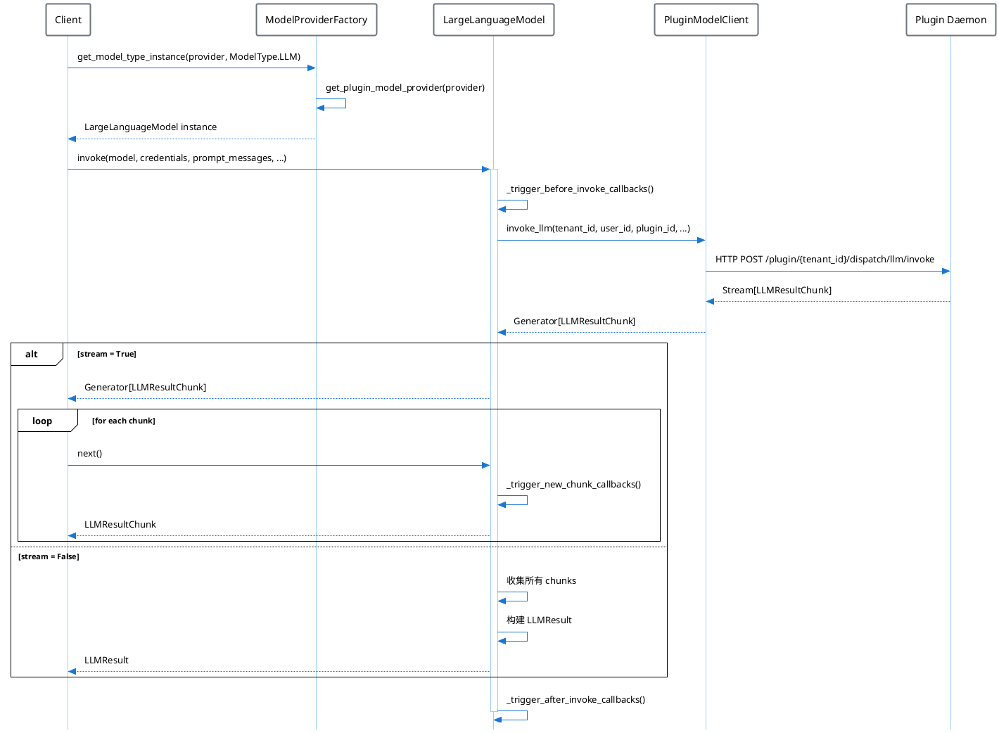

# Dify 模型运行时层（Model Runtime）架构分析

## 1. 概述

Dify 的 Model Runtime 是一个统一的模型抽象层，提供了各模型厂商的调用、鉴权接口，并为 Dify 提供了统一的模型供应商信息和凭据表单规则。

### 1.1 核心设计理念

- **解耦设计**：将模型与上下游系统解耦，便于开发者横向扩展
- **前后端统一**：只需在后端定义供应商和模型，即可在前端页面直接展示
- **插件化架构**：通过 Plugin Daemon 实现模型提供商的动态加载和管理

### 1.2 支持的模型类型

| 模型类型 | 枚举值 | 功能描述 |
|---------|-------|---------|
| LLM | `llm` | 大语言模型，文本补全、对话、预计算 tokens |
| Text Embedding | `text-embedding` | 文本向量化 |
| Rerank | `rerank` | 分段重排序 |
| Speech2Text | `speech2text` | 语音转文本 |
| TTS | `tts` | 文本转语音 |
| Moderation | `moderation` | 内容审核 |

## 2. 目录结构

```
api/core/model_runtime/
├── __init__.py
├── README.md                          # 英文说明
├── README_CN.md                       # 中文说明
├── callbacks/                         # 回调机制
│   ├── __init__.py
│   ├── base_callback.py              # 回调基类
│   └── logging_callback.py           # 日志回调实现
├── docs/                             # 文档
│   ├── en_US/
│   └── zh_Hans/
├── entities/                         # 实体定义
│   ├── __init__.py
│   ├── common_entities.py            # 通用实体（如 I18nObject）
│   ├── defaults.py                   # 默认参数规则模板
│   ├── llm_entities.py               # LLM 相关实体
│   ├── message_entities.py           # 消息实体
│   ├── model_entities.py             # 模型实体
│   ├── provider_entities.py          # 供应商实体
│   ├── rerank_entities.py            # Rerank 实体
│   └── text_embedding_entities.py    # 文本嵌入实体
├── errors/                           # 错误定义
│   ├── __init__.py
│   ├── invoke.py                     # 调用错误
│   └── validate.py                   # 验证错误
├── model_providers/                  # 模型提供商
│   ├── __init__.py
│   ├── _position.yaml                # 供应商排序配置
│   ├── model_provider_factory.py     # 模型提供商工厂
│   └── __base/                       # 基类定义
│       ├── __init__.py
│       ├── ai_model.py               # AI 模型基类
│       ├── large_language_model.py   # LLM 基类
│       ├── moderation_model.py       # 审核模型基类
│       ├── rerank_model.py           # Rerank 模型基类
│       ├── speech2text_model.py      # 语音转文本基类
│       ├── text_embedding_model.py   # 文本嵌入基类
│       ├── tts_model.py              # TTS 基类
│       └── tokenizers/               # 分词器
│           └── gpt2_tokenizer.py
├── schema_validators/                # Schema 验证器
│   ├── __init__.py
│   ├── common_validator.py
│   ├── model_credential_schema_validator.py
│   └── provider_credential_schema_validator.py
└── utils/                            # 工具函数
    ├── __init__.py
    └── encoders.py
```

## 3. 核心架构

### 3.1 三层架构设计

```
┌─────────────────────────────────────────────────────────────────┐
│                     工厂层 (Factory Layer)                        │
│  ModelProviderFactory                                            │
│  - 获取所有供应商/模型列表                                          │
│  - 供应商/模型凭据鉴权                                              │
│  - 获取模型类型实例                                                 │
└─────────────────────────────────────────────────────────────────┘
                              │
                              ▼
┌─────────────────────────────────────────────────────────────────┐
│                     供应商层 (Provider Layer)                     │
│  PluginModelClient (通过 Plugin Daemon 与插件通信)                 │
│  - 获取模型提供商配置                                               │
│  - 凭据验证                                                        │
│  - 模型 Schema 获取                                                │
└─────────────────────────────────────────────────────────────────┘
                              │
                              ▼
┌─────────────────────────────────────────────────────────────────┐
│                      模型层 (Model Layer)                         │
│  AIModel (基类)                                                   │
│  ├── LargeLanguageModel    - LLM 调用                             │
│  ├── TextEmbeddingModel    - 文本嵌入                              │
│  ├── RerankModel           - 重排序                                │
│  ├── Speech2TextModel      - 语音转文本                             │
│  ├── TTSModel              - 文本转语音                             │
│  └── ModerationModel       - 内容审核                              │
└─────────────────────────────────────────────────────────────────┘
```

### 3.2 类继承关系

```
pydantic.BaseModel
    └── AIModel (ai_model.py)
        ├── LargeLanguageModel (large_language_model.py)
        ├── TextEmbeddingModel (text_embedding_model.py)
        ├── RerankModel (rerank_model.py)
        ├── Speech2TextModel (speech2text_model.py)
        ├── TTSModel (tts_model.py)
        └── ModerationModel (moderation_model.py)
```

## 4. 核心类详解

### 4.1 AIModel 基类

`AIModel` 是所有模型类型的基类，定义了通用的属性和方法：

```python
class AIModel(BaseModel):
    """所有模型的基类"""
    
    # 核心属性
    tenant_id: str           # 租户 ID
    model_type: ModelType    # 模型类型
    plugin_id: str          # 插件 ID
    provider_name: str      # 提供商名称
    plugin_model_provider: PluginModelProviderEntity  # 插件模型提供商实体
    started_at: float       # 调用开始时间

    # 核心方法
    def get_price(self, model: str, credentials: dict, 
                  price_type: PriceType, tokens: int) -> PriceInfo:
        """获取模型调用费用"""
        
    def get_model_schema(self, model: str, 
                         credentials: dict | None = None) -> AIModelEntity | None:
        """获取模型 Schema"""
        
    def _transform_invoke_error(self, error: Exception) -> Exception:
        """将模型调用错误转换为统一错误"""
        
    @property
    def _invoke_error_mapping(self) -> dict[type[Exception], list[type[Exception]]]:
        """错误映射表"""
```

### 4.2 LargeLanguageModel 类

`LargeLanguageModel` 是大语言模型的实现类：

```python
class LargeLanguageModel(AIModel):
    """大语言模型类"""
    
    model_type: ModelType = ModelType.LLM

    def invoke(
        self,
        model: str,                              # 模型名称
        credentials: dict,                       # 凭据信息
        prompt_messages: list[PromptMessage],    # 提示消息列表
        model_parameters: dict | None = None,    # 模型参数
        tools: list[PromptMessageTool] | None = None,  # 工具列表
        stop: list[str] | None = None,           # 停止词
        stream: bool = True,                     # 是否流式返回
        user: str | None = None,                 # 用户 ID
        callbacks: list[Callback] | None = None, # 回调函数
    ) -> Union[LLMResult, Generator[LLMResultChunk, None, None]]:
        """调用大语言模型"""
        
    def get_num_tokens(
        self,
        model: str,
        credentials: dict,
        prompt_messages: list[PromptMessage],
        tools: list[PromptMessageTool] | None = None,
    ) -> int:
        """计算 token 数量"""
        
    def calc_response_usage(
        self, model: str, credentials: dict, 
        prompt_tokens: int, completion_tokens: int
    ) -> LLMUsage:
        """计算响应使用量"""
```

### 4.3 TextEmbeddingModel 类

```python
class TextEmbeddingModel(AIModel):
    """文本嵌入模型类"""
    
    model_type: ModelType = ModelType.TEXT_EMBEDDING

    def invoke(
        self,
        model: str,
        credentials: dict,
        texts: list[str],
        user: str | None = None,
        input_type: EmbeddingInputType = EmbeddingInputType.DOCUMENT,
    ) -> TextEmbeddingResult:
        """调用文本嵌入模型"""
        
    def get_num_tokens(self, model: str, credentials: dict, 
                       texts: list[str]) -> list[int]:
        """计算 token 数量"""
```

### 4.4 RerankModel 类

```python
class RerankModel(AIModel):
    """重排序模型类"""
    
    model_type: ModelType = ModelType.RERANK

    def invoke(
        self,
        model: str,
        credentials: dict,
        query: str,              # 查询文本
        docs: list[str],         # 待排序文档列表
        score_threshold: float | None = None,  # 分数阈值
        top_n: int | None = None,  # 返回前 N 个
        user: str | None = None,
    ) -> RerankResult:
        """调用重排序模型"""
```

### 4.5 ModelProviderFactory 工厂类

```python
class ModelProviderFactory:
    """模型提供商工厂"""
    
    def __init__(self, tenant_id: str):
        self.tenant_id = tenant_id
        self.plugin_model_manager = PluginModelClient()
    
    def get_providers(self) -> Sequence[ProviderEntity]:
        """获取所有提供商"""
        
    def get_provider_schema(self, provider: str) -> ProviderEntity:
        """获取提供商 Schema"""
        
    def provider_credentials_validate(self, *, provider: str, credentials: dict):
        """验证提供商凭据"""
        
    def model_credentials_validate(self, *, provider: str, model_type: ModelType, 
                                   model: str, credentials: dict):
        """验证模型凭据"""
        
    def get_model_type_instance(self, provider: str, model_type: ModelType) -> AIModel:
        """获取模型类型实例"""
```

## 5. 实体定义

### 5.1 模型类型枚举

```python
class ModelType(StrEnum):
    LLM = auto()
    TEXT_EMBEDDING = "text-embedding"
    RERANK = auto()
    SPEECH2TEXT = auto()
    MODERATION = auto()
    TTS = auto()
```

### 5.2 消息实体

```python
# 消息角色
class PromptMessageRole(StrEnum):
    SYSTEM = auto()
    USER = auto()
    ASSISTANT = auto()
    TOOL = auto()

# 消息内容类型
class PromptMessageContentType(StrEnum):
    TEXT = auto()
    IMAGE = auto()
    AUDIO = auto()
    VIDEO = auto()
    DOCUMENT = auto()

# 消息基类
class PromptMessage(ABC, BaseModel):
    role: PromptMessageRole
    content: str | list[PromptMessageContentUnionTypes] | None = None
    name: str | None = None

# 具体消息类型
class UserPromptMessage(PromptMessage): ...
class AssistantPromptMessage(PromptMessage): ...
class SystemPromptMessage(PromptMessage): ...
class ToolPromptMessage(PromptMessage): ...
```

### 5.3 LLM 结果实体

```python
class LLMResult(BaseModel):
    id: str | None = None
    model: str                              # 使用的模型
    prompt_messages: Sequence[PromptMessage]  # 输入消息
    message: AssistantPromptMessage         # 响应消息
    usage: LLMUsage                         # 使用量信息
    system_fingerprint: str | None = None

class LLMResultChunk(BaseModel):
    """流式响应块"""
    model: str
    prompt_messages: Sequence[PromptMessage]
    system_fingerprint: str | None = None
    delta: LLMResultChunkDelta

class LLMUsage(ModelUsage):
    """使用量统计"""
    prompt_tokens: int
    prompt_unit_price: Decimal
    prompt_price: Decimal
    completion_tokens: int
    completion_unit_price: Decimal
    completion_price: Decimal
    total_tokens: int
    total_price: Decimal
    currency: str
    latency: float
```

## 6. 错误处理

### 6.1 统一错误类型

```python
class InvokeError(ValueError):
    """调用错误基类"""
    description: str | None = None

class InvokeConnectionError(InvokeError):
    """连接错误"""
    description = "Connection Error"

class InvokeServerUnavailableError(InvokeError):
    """服务不可用"""
    description = "Server Unavailable Error"

class InvokeRateLimitError(InvokeError):
    """速率限制"""
    description = "Rate Limit Error"

class InvokeAuthorizationError(InvokeError):
    """授权错误"""
    description = "Incorrect model credentials provided"

class InvokeBadRequestError(InvokeError):
    """请求错误"""
    description = "Bad Request Error"
```

### 6.2 错误映射机制

每个模型类可以定义 `_invoke_error_mapping` 属性，将底层 SDK 的错误映射到统一错误类型：

```python
@property
def _invoke_error_mapping(self) -> dict[type[Exception], list[type[Exception]]]:
    return {
        InvokeConnectionError: [ConnectionError, TimeoutError],
        InvokeRateLimitError: [RateLimitError],
        InvokeAuthorizationError: [AuthenticationError],
        # ...
    }
```

## 7. 回调机制

### 7.1 Callback 基类

```python
class Callback(ABC):
    """回调基类，仅用于 LLM"""
    
    raise_error: bool = False

    @abstractmethod
    def on_before_invoke(self, llm_instance: AIModel, model: str, 
                         credentials: dict, prompt_messages: list[PromptMessage],
                         model_parameters: dict, tools: list[PromptMessageTool] | None,
                         stop: Sequence[str] | None, stream: bool, 
                         user: str | None):
        """调用前回调"""

    @abstractmethod
    def on_new_chunk(self, llm_instance: AIModel, chunk: LLMResultChunk, ...):
        """新块回调（流式）"""

    @abstractmethod
    def on_after_invoke(self, llm_instance: AIModel, result: LLMResult, ...):
        """调用后回调"""

    @abstractmethod
    def on_invoke_error(self, llm_instance: AIModel, ex: Exception, ...):
        """错误回调"""
```

## 8. 插件系统集成

Model Runtime 通过 `PluginModelClient` 与 Plugin Daemon 进行通信：

```python
class PluginModelClient(BasePluginClient):
    """插件模型客户端"""
    
    def fetch_model_providers(self, tenant_id: str) -> Sequence[PluginModelProviderEntity]:
        """获取模型提供商列表"""
        
    def validate_provider_credentials(self, tenant_id: str, user_id: str,
                                       plugin_id: str, provider: str,
                                       credentials: dict) -> bool:
        """验证提供商凭据"""
        
    def invoke_llm(self, tenant_id: str, user_id: str, plugin_id: str,
                   provider: str, model: str, credentials: dict,
                   prompt_messages: list[PromptMessage], ...) -> Generator[LLMResultChunk]:
        """调用 LLM"""
        
    def invoke_text_embedding(self, ...) -> TextEmbeddingResult:
        """调用文本嵌入"""
        
    def invoke_rerank(self, ...) -> RerankResult:
        """调用重排序"""
```

## 9. 时序图

### 9.1 LLM 调用流程



## 10. 使用示例

### 10.1 基本 LLM 调用

```python
from core.model_runtime.model_providers.model_provider_factory import ModelProviderFactory
from core.model_runtime.entities.model_entities import ModelType
from core.model_runtime.entities.message_entities import (
    SystemPromptMessage,
    UserPromptMessage,
)

# 创建工厂实例
factory = ModelProviderFactory(tenant_id="your-tenant-id")

# 获取 LLM 实例
llm_instance = factory.get_model_type_instance(
    provider="openai/openai",
    model_type=ModelType.LLM
)

# 准备消息
messages = [
    SystemPromptMessage(content="You are a helpful assistant."),
    UserPromptMessage(content="What is the capital of France?"),
]

# 调用模型
result = llm_instance.invoke(
    model="gpt-4",
    credentials={"api_key": "your-api-key"},
    prompt_messages=messages,
    model_parameters={"temperature": 0.7, "max_tokens": 100},
    stream=False,
)

print(f"Response: {result.message.content}")
print(f"Tokens used: {result.usage.total_tokens}")
```

### 10.2 流式调用

```python
# 流式调用
stream_result = llm_instance.invoke(
    model="gpt-4",
    credentials={"api_key": "your-api-key"},
    prompt_messages=messages,
    model_parameters={"temperature": 0.7},
    stream=True,
)

# 处理流式响应
for chunk in stream_result:
    if chunk.delta.message.content:
        print(chunk.delta.message.content, end="", flush=True)
```

### 10.3 文本嵌入

```python
# 获取嵌入模型实例
embedding_instance = factory.get_model_type_instance(
    provider="openai/openai",
    model_type=ModelType.TEXT_EMBEDDING
)

# 调用嵌入
result = embedding_instance.invoke(
    model="text-embedding-3-small",
    credentials={"api_key": "your-api-key"},
    texts=["Hello, world!", "How are you?"],
)

print(f"Embeddings: {len(result.embeddings)} vectors")
print(f"Dimension: {len(result.embeddings[0])}")
```

### 10.4 Rerank 调用

```python
# 获取 Rerank 模型实例
rerank_instance = factory.get_model_type_instance(
    provider="cohere/cohere",
    model_type=ModelType.RERANK
)

# 调用重排序
result = rerank_instance.invoke(
    model="rerank-english-v2.0",
    credentials={"api_key": "your-api-key"},
    query="What is machine learning?",
    docs=[
        "Machine learning is a subset of AI.",
        "Python is a programming language.",
        "Deep learning uses neural networks.",
    ],
    top_n=2,
)

for doc in result.docs:
    print(f"Index: {doc.index}, Score: {doc.score:.4f}")
```

## 11. 参考链接

- [增加新的供应商配置](./docs/zh_Hans/provider_scale_out.md)
- [为已存在的供应商新增模型](./docs/zh_Hans/predefined_model_scale_out.md)
- [自定义模型扩展](./docs/zh_Hans/customizable_model_scale_out.md)
- [Schema 定义](./docs/zh_Hans/schema.md)
- [接口方法详解](./docs/zh_Hans/interfaces.md)
