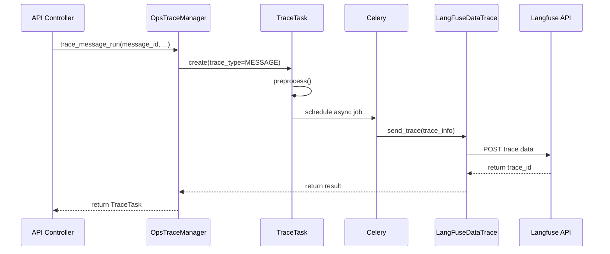
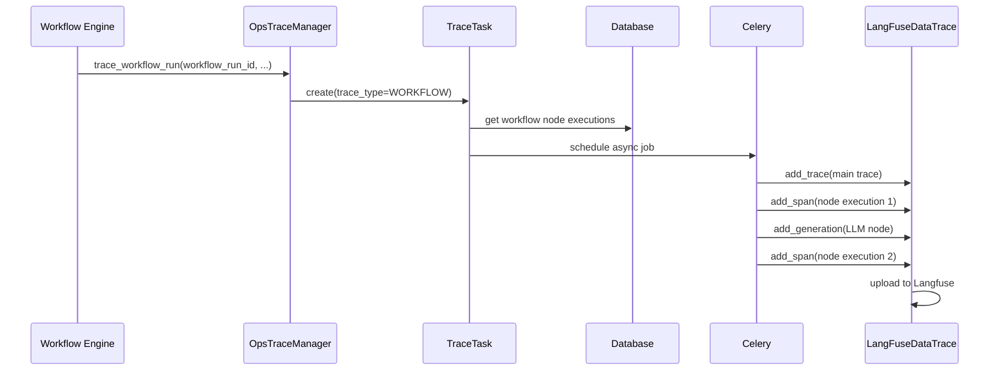

# Dify 跟踪系统（Tracing System）完整分析

## 目录
1. [系统概述](#系统概述)
2. [核心组件](#核心组件)
3. [主要类和接口](#主要类和接口)
4. [执行流程](#执行流程)
5. [Langfuse 集成指南](#langfuse-集成指南)
6. [配置和环境变量](#配置和环境变量)
7. [数据模型](#数据模型)
8. [最佳实践](#最佳实践)
9. [常见问题](#常见问题)

---

## 系统概述

Dify 的跟踪系统是一套完整的可观测性解决方案，用于追踪 AI 应用（Message、Workflow、Agent 等）的执行过程，并将追踪数据发送到多个可观测性平台（如 Langfuse、LangSmith、Opik、Weave 等）。

### 系统特点

- **多层次追踪**：支持 Message、Workflow、Node、Generation 等多个粒度的追踪
- **可插拔的追踪提供者**：支持多个可观测性平台（8+ 个提供者）
- **完整的元数据管理**：记录输入、输出、成本、延迟等关键信息
- **异步处理**：通过 Celery 异步发送追踪数据，不阻塞主流程
- **错误追踪**：完整的错误和异常信息记录
- **成本计算**：集成 Token 使用量统计和成本计算

---

## 核心组件

### 1. 追踪管理器（OpsTraceManager）

**位置**: `api/core/ops/ops_trace_manager.py`

**职责**：
- 管理追踪任务的生命周期
- 协调不同类型的追踪（Message、Workflow、Agent 等）
- 提供统一的追踪 API
- 支持多个追踪提供者配置

**核心方法**：

```python
class OpsTraceManager:
    """追踪管理器 - 统一的追踪入口"""
    
    @staticmethod
    def trace_message_run(
        message_id: str,
        user_id: str,
        app_id: str,
        conversation_id: str,
        message_text: str,
        answer: str | None = None,
        message_run_id: str | None = None
    ) -> TraceTask:
        """追踪消息执行"""
    
    @staticmethod
    def trace_workflow_run(
        workflow_run_id: str,
        workflow_run_inputs: dict,
        workflow_run_outputs: dict,
        user_id: str,
        app_id: str,
        conversation_id: str | None = None
    ) -> TraceTask:
        """追踪工作流执行"""
    
    @staticmethod
    def trace_agent_run(
        agent_run_id: str,
        user_id: str,
        app_id: str,
        **kwargs
    ) -> TraceTask:
        """追踪 Agent 执行"""
```

### 2. 追踪任务（TraceTask）

**位置**: `api/core/ops/ops_trace_manager.py` (第 422 行)

**职责**：
- 表示一个追踪任务
- 管理追踪的完整生命周期
- 提供预处理和后处理钩子

**核心属性和方法**：

```python
class TraceTask:
    """追踪任务 - 管理单个追踪的生命周期"""
    
    def __init__(
        self,
        trace_type: Any,                          # 追踪类型
        message_id: str | None = None,           # 消息 ID（可选）
        workflow_execution: Optional["WorkflowExecution"] = None,  # 工作流执行对象
        conversation_id: str | None = None,      # 对话 ID（可选）
        user_id: str | None = None,             # 用户 ID（可选）
        timer: Any | None = None,               # 计时器（可选）
        **kwargs,                                # 额外参数
    ):
        """
        初始化追踪任务
        
        参数说明：
        - trace_type: 追踪类型，可以是 TraceTaskTypeEnum.MESSAGE、WORKFLOW、AGENT 等
        - message_id: 可选，用于消息追踪
        - workflow_execution: 可选，工作流执行对象，从中提取工作流运行 ID
        - conversation_id: 可选，对话 ID
        - user_id: 可选，用户 ID
        - timer: 可选，用于计时的对象
        - kwargs: 额外参数（如 external_trace_id 用于关联外部追踪系统的 ID）
        """
        self.trace_type = trace_type
        self.message_id = message_id
        self.workflow_run_id = workflow_execution.id_ if workflow_execution else None
        self.conversation_id = conversation_id
        self.user_id = user_id
        self.timer = timer
        self.file_base_url = os.getenv("FILES_URL", "http://127.0.0.1:5001")
        self.app_id = None
        self.trace_id = None
        self.kwargs = kwargs
        external_trace_id = kwargs.get("external_trace_id")
        if external_trace_id:
            self.trace_id = external_trace_id
    
    def execute(self):
        """执行追踪任务"""
        return self.preprocess()
    
    def preprocess(self):
        """预处理 - 在追踪之前的准备工作"""
        # 由子类实现
        pass
```

### 3. 追踪数据发送器（LangFuseDataTrace）

**位置**: `api/core/ops/langfuse_trace/langfuse_trace.py`

**职责**：
- 将追踪数据发送到 Langfuse
- 处理不同粒度的追踪（Trace、Span、Generation）
- 管理与 Langfuse 的连接

**核心类**：

```python
class LangFuseDataTrace:
    """Langfuse 追踪数据发送器"""
    
    def message_trace(self, trace_info: MessageTraceInfo):
        """
        消息追踪
        
        记录消息执行的完整生命周期，包括：
        - 输入输出
        - 执行时间
        - 成本信息
        - 关联的工作流或Agent执行
        """
    
    def workflow_trace(self, trace_info: WorkflowTraceInfo):
        """
        工作流追踪
        
        包含以下内容：
        1. 主 Trace：整个工作流执行
        2. Spans：每个工作流节点的执行
        3. Generations：LLM 模型节点的调用记录
        4. 完整的元数据和成本统计
        """
    
    def agent_trace(self, trace_info: AgentRunTraceInfo):
        """Agent 执行追踪"""
    
    def add_trace(self, langfuse_trace_data: LangfuseTrace):
        """添加追踪数据"""
    
    def add_span(self, langfuse_span_data: LangfuseSpan):
        """添加跨度数据"""
    
    def add_generation(self, langfuse_generation_data: LangfuseGeneration):
        """添加生成数据"""
```

### 4. 追踪数据模型

**位置**: `api/core/ops/entities/`

#### TraceInfo 基类

```python
class TraceInfo(BaseModel):
    """追踪信息基类"""
    trace_id: str                      # 唯一追踪 ID
    tenant_id: str                     # 租户 ID
    app_id: str                        # 应用 ID
    user_id: str | None = None        # 用户 ID
    start_time: datetime              # 开始时间
    end_time: datetime                # 结束时间
    error: str = ""                    # 错误信息
    metadata: dict = {}               # 元数据字典
```

#### MessageTraceInfo

```python
class MessageTraceInfo(TraceInfo):
    """消息追踪信息"""
    message_id: str                    # 消息 ID
    conversation_id: str | None = None  # 对话 ID
    message_text: str                  # 消息文本
    answer: str                        # 回答文本
    answer_tokens: int = 0            # 回答 Token 数
    message_tokens: int = 0           # 消息 Token 数
    message_run_id: str | None = None  # 消息运行 ID
```

#### WorkflowTraceInfo

```python
class WorkflowTraceInfo(TraceInfo):
    """工作流追踪信息"""
    workflow_run_id: str              # 工作流运行 ID
    workflow_run_inputs: dict         # 工作流输入
    workflow_run_outputs: dict        # 工作流输出
    workflow_run_version: int = 0     # 工作流版本
    conversation_id: str | None = None  # 对话 ID
    message_id: str | None = None     # 关联的消息 ID（可选）
    workflow_app_log_id: str | None = None  # 应用日志 ID
```

#### AgentRunTraceInfo

```python
class AgentRunTraceInfo(TraceInfo):
    """Agent 执行追踪信息"""
    agent_run_id: str                 # Agent 运行 ID
    agent_run_inputs: dict            # Agent 输入
    agent_run_outputs: dict           # Agent 输出
    tool_calls: list = []             # 工具调用列表
    conversation_id: str | None = None  # 对话 ID
```

---

## 主要类和接口

### 1. Langfuse 数据模型

#### LangfuseTrace

```python
class LangfuseTrace:
    """Langfuse 追踪记录"""
    id: str                           # 追踪 ID
    name: str                        # 追踪名称
    user_id: str | None = None       # 用户 ID
    session_id: str | None = None    # 会话 ID
    input: Any = None                # 输入数据
    output: Any = None               # 输出数据
    metadata: dict = {}              # 元数据
    tags: list[str] = []            # 标签列表
    version: str | None = None       # 版本号
    timestamp: datetime | None = None # 时间戳
```

#### LangfuseSpan

```python
class LangfuseSpan:
    """Langfuse 跨度记录 - 表示追踪中的一个操作"""
    id: str                          # 跨度 ID
    trace_id: str                    # 所属追踪 ID
    name: str                        # 跨度名称
    input: Any = None                # 输入数据
    output: Any = None               # 输出数据
    start_time: datetime             # 开始时间
    end_time: datetime               # 结束时间
    metadata: dict = {}              # 元数据
    level: LevelEnum = DEFAULT       # 日志级别
    status_message: str = ""         # 状态消息
    parent_observation_id: str | None = None  # 父观测 ID
    tags: list[str] = []            # 标签
```

#### LangfuseGeneration

```python
class LangfuseGeneration:
    """Langfuse 生成记录 - 用于 LLM 调用"""
    id: str                          # 生成 ID
    trace_id: str                    # 所属追踪 ID
    name: str                        # 生成名称
    model: str                       # 模型名称
    input: Any = None                # 输入 Prompt
    output: Any = None               # 生成的输出
    start_time: datetime             # 开始时间
    end_time: datetime               # 结束时间
    metadata: dict = {}              # 元数据
    usage: GenerationUsage | None = None  # Token 使用统计
    level: LevelEnum = DEFAULT       # 日志级别
    status_message: str = ""         # 状态消息
    parent_observation_id: str | None = None  # 父观测 ID
```

#### GenerationUsage

```python
class GenerationUsage:
    """Token 使用统计"""
    input: int | None = None         # 输入 Token 数
    output: int | None = None        # 输出 Token 数
    total: int | None = None         # 总 Token 数
    unit: UnitEnum = TOKENS          # 计量单位
```

### 2. 追踪任务类型枚举

**位置**: `api/core/ops/entities/trace_entity.py`

```python
class TraceTaskTypeEnum(str, Enum):
    """追踪任务类型"""
    MESSAGE = "message"              # 消息追踪
    WORKFLOW = "workflow"            # 工作流追踪
    AGENT = "agent"                  # Agent 追踪
    LLM = "llm"                      # LLM 追踪
```

### 3. 追踪任务名称枚举

```python
class TraceTaskName(StrEnum):
    """追踪任务名称"""
    MESSAGE_TRACE = "message_trace"
    WORKFLOW_TRACE = "workflow_trace"
    AGENT_TRACE = "agent_trace"
    LLM_TRACE = "llm_trace"
```

---

## 执行流程

### 消息追踪流程



### 工作流追踪流程



### 详细工作流追踪过程

在 `LangFuseDataTrace.workflow_trace()` 方法中：

1. **创建主 Trace**：
   - 如果有 message_id，创建消息级别的 Trace
   - 否则创建工作流级别的 Trace
   - 包含完整的工作流输入/输出

2. **创建工作流 Span**：
   - 如果有 message_id，为工作流运行创建一个 Span
   - 记录工作流的时间和状态

3. **遍历节点执行**：
   - 从数据库获取该工作流运行的所有节点执行
   - 对每个节点执行：
     - **LLM 节点**：创建 Generation（包含 Token 统计）
     - **其他节点**：创建 Span

4. **元数据管理**：
   - 记录节点类型、名称、状态
   - 提取 Token 使用量（如果是 LLM 节点）
   - 关联工作流运行 ID、节点执行 ID 等

---

## 追踪提供者

### 支持的追踪提供者

Dify 支持多个可观测性平台，通过统一的 `OpsTraceProviderConfigMap` 接口管理（位置：`api/core/ops/ops_trace_manager.py`）。

| 提供者 | 实现类 | 配置类 | 秘密密钥 | 其他配置 | 实现位置 |
|------|-------|-------|--------|--------|--------|
| **Langfuse** | `LangFuseDataTrace` | `LangfuseConfig` | `public_key`, `secret_key` | `host`, `project_key` | `api/core/ops/langfuse_trace/` |
| **LangSmith** | `LangSmithDataTrace` | `LangSmithConfig` | `api_key` | `project`, `endpoint` | `api/core/ops/langsmith_trace/` |
| **Opik** | `OpikDataTrace` | `OpikConfig` | `api_key` | `project`, `url`, `workspace` | `api/core/ops/opik_trace/` |
| **Weave** | `WeaveDataTrace` | `WeaveConfig` | `api_key` | `project`, `entity`, `endpoint`, `host` | `api/core/ops/weave_trace/` |
| **Arize Phoenix** | `ArizePhoenixDataTrace` | `ArizeConfig` | `api_key`, `space_id` | `project`, `endpoint` | `api/core/ops/arize_phoenix_trace/` |
| **Phoenix** | `ArizePhoenixDataTrace` | `PhoenixConfig` | `api_key` | `project`, `endpoint` | `api/core/ops/arize_phoenix_trace/` |
| **Aliyun** | `AliyunDataTrace` | `AliyunConfig` | `license_key` | `endpoint`, `app_name` | `api/core/ops/aliyun_trace/` |
| **Tencent** | `TencentDataTrace` | `TencentConfig` | `token` | `endpoint`, `service_name` | `api/core/ops/tencent_trace/` |

### 提供者配置架构

```python
class OpsTraceProviderConfigMap(collections.UserDict[str, dict[str, Any]]):
    """追踪提供者配置映射"""
    
    def __getitem__(self, provider: str) -> dict[str, Any]:
        """
        获取追踪提供者的配置
        
        返回字典包含：
        - config_class: 配置类（用于验证和存储配置）
        - secret_keys: 秘密密钥列表（需要加密存储）
        - other_keys: 其他配置密钥（可以明文存储）
        - trace_instance: TraceInstance 实现类
        """
        match provider:
            case TracingProviderEnum.LANGFUSE:
                return {
                    "config_class": LangfuseConfig,
                    "secret_keys": ["public_key", "secret_key"],
                    "other_keys": ["host", "project_key"],
                    "trace_instance": LangFuseDataTrace,
                }
            # ... 其他提供者配置
```

### 配置保存和加密

```python
@classmethod
def encrypt_tracing_config(
    cls,
    tenant_id: str,
    tracing_provider: str,
    tracing_config: dict,
    current_trace_config=None
):
    """
    加密并保存追踪配置
    
    - 秘密密钥进行加密存储
    - 其他配置明文存储
    - 支持配置更新
    """
```

---

## Langfuse 集成

### 初始化

```python
# 位置: api/core/ops/langfuse_trace/langfuse_trace.py

from langfuse import Langfuse

class LangFuseDataTrace:
    def __init__(self):
        # 从环境变量读取配置
        langfuse_url = os.getenv("LANGFUSE_URL", "https://cloud.langfuse.com")
        langfuse_api_key = os.getenv("LANGFUSE_API_KEY")
        langfuse_secret_key = os.getenv("LANGFUSE_SECRET_KEY")
        
        # 初始化 Langfuse 客户端
        self.langfuse_client = Langfuse(
            public_key=langfuse_api_key,
            secret_key=langfuse_secret_key,
            host=langfuse_url
        )
```

### 发送追踪数据

#### 添加 Trace

```python
def add_trace(self, langfuse_trace_data: LangfuseTrace):
    """添加追踪记录到 Langfuse"""
    self.langfuse_client.trace(
        id=langfuse_trace_data.id,
        name=langfuse_trace_data.name,
        user_id=langfuse_trace_data.user_id,
        session_id=langfuse_trace_data.session_id,
        input=langfuse_trace_data.input,
        output=langfuse_trace_data.output,
        metadata=langfuse_trace_data.metadata,
        tags=langfuse_trace_data.tags,
        version=langfuse_trace_data.version,
    )
```

#### 添加 Span

```python
def add_span(self, langfuse_span_data: LangfuseSpan):
    """添加跨度记录到 Langfuse"""
    self.langfuse_client.span(
        id=langfuse_span_data.id,
        trace_id=langfuse_span_data.trace_id,
        name=langfuse_span_data.name,
        input=langfuse_span_data.input,
        output=langfuse_span_data.output,
        start_time=langfuse_span_data.start_time,
        end_time=langfuse_span_data.end_time,
        metadata=langfuse_span_data.metadata,
        level=langfuse_span_data.level.value,
        status_message=langfuse_span_data.status_message,
        parent_observation_id=langfuse_span_data.parent_observation_id,
    )
```

#### 添加 Generation（LLM 调用）

```python
def add_generation(self, langfuse_generation_data: LangfuseGeneration):
    """添加生成记录到 Langfuse（用于 LLM 调用）"""
    self.langfuse_client.generation(
        id=langfuse_generation_data.id,
        trace_id=langfuse_generation_data.trace_id,
        name=langfuse_generation_data.name,
        model=langfuse_generation_data.model,
        input=langfuse_generation_data.input,
        output=langfuse_generation_data.output,
        start_time=langfuse_generation_data.start_time,
        end_time=langfuse_generation_data.end_time,
        metadata=langfuse_generation_data.metadata,
        usage=langfuse_generation_data.usage,
        level=langfuse_generation_data.level.value,
        status_message=langfuse_generation_data.status_message,
        parent_observation_id=langfuse_generation_data.parent_observation_id,
    )
```

### Langfuse API 端点对应

| Dify 方法 | Langfuse 数据类型 | API 端点 | 用途 |
|---------|-----------------|---------|------|
| `add_trace()` | Trace | POST `/api/public/traces` | 记录整个追踪 |
| `add_span()` | Span | POST `/api/public/spans` | 记录操作跨度 |
| `add_generation()` | Generation | POST `/api/public/generations` | 记录 LLM 调用 |

---

## 数据模型

### 追踪数据结构示例

#### 消息追踪示例

```json
{
  "trace_id": "msg-123-abc",
  "name": "message_trace",
  "user_id": "user-001",
  "session_id": "conv-456",
  "input": {
    "message": "什么是人工智能？"
  },
  "output": {
    "answer": "人工智能是..."
  },
  "metadata": {
    "app_id": "app-001",
    "tenant_id": "tenant-001",
    "message_id": "msg-123-abc",
    "message_tokens": 10,
    "answer_tokens": 50,
    "total_tokens": 60
  },
  "tags": ["message", "chat"],
  "start_time": "2024-01-15T10:30:00Z",
  "end_time": "2024-01-15T10:30:05Z"
}
```

#### 工作流追踪示例

```json
{
  "trace_id": "wf-123-abc",
  "name": "workflow_trace",
  "user_id": "user-001",
  "input": {
    "search_query": "AI research",
    "max_results": 10
  },
  "output": {
    "summary": "Found 10 relevant articles about AI research..."
  },
  "metadata": {
    "app_id": "app-001",
    "workflow_run_id": "run-001",
    "tenant_id": "tenant-001"
  },
  "tags": ["workflow"],
  "observations": [
    {
      "type": "span",
      "id": "node-exec-001",
      "name": "search_step",
      "input": { "query": "AI research" },
      "output": { "results": [] }
    },
    {
      "type": "generation",
      "id": "node-exec-002",
      "name": "summarize_step",
      "model": "gpt-4",
      "input": { "articles": [] },
      "output": { "summary": "..." },
      "usage": {
        "input": 1000,
        "output": 200,
        "total": 1200
      }
    }
  ]
}
```

---

## 最佳实践

### 1. 追踪初始化

```python
from api.core.ops.ops_trace_manager import OpsTraceManager

# 追踪消息执行
trace_task = OpsTraceManager.trace_message_run(
    message_id="msg-001",
    user_id="user-001",
    app_id="app-001",
    conversation_id="conv-001",
    message_text="用户消息",
    answer="AI 回答"
)
```

### 2. 追踪工作流执行

```python
# 在工作流完成后
trace_task = OpsTraceManager.trace_workflow_run(
    workflow_run_id="run-001",
    workflow_run_inputs={"key": "value"},
    workflow_run_outputs={"result": "value"},
    user_id="user-001",
    app_id="app-001",
    conversation_id="conv-001"
)
```

### 3. 元数据管理

```python
# 始终包含必要的元数据
metadata = {
    "app_id": app_id,
    "user_id": user_id,
    "tenant_id": tenant_id,
    "execution_time": elapsed_time,
    "model_provider": "openai",
    "model_name": "gpt-4"
}
```

### 4. 错误处理

```python
# 在追踪信息中记录错误
trace_info.error = "Failed to process: {error_message}"

# Langfuse 会自动将 error 反映在日志级别
if trace_info.error:
    level = LevelEnum.ERROR
else:
    level = LevelEnum.DEFAULT
```

### 5. Token 统计

```python
# 对于 LLM 节点，正确提取 Token 使用量
usage_data = process_data.get("usage", {})
prompt_tokens = usage_data.get("prompt_tokens", 0)
completion_tokens = usage_data.get("completion_tokens", 0)

generation_usage = GenerationUsage(
    input=prompt_tokens,
    output=completion_tokens,
    total=prompt_tokens + completion_tokens,
    unit=UnitEnum.TOKENS
)
```

### 6. 性能优化

- 追踪数据通过 Celery 异步发送，不阻塞主流程
- 大型对象（如完整的文档内容）应在发送前进行摘要
- 定期检查追踪提供者的配额和费用

### 7. 隐私和安全

```python
# 在元数据中避免存储敏感信息
# ✗ 不要：metadata["api_key"] = secret_key
# ✓ 应该：metadata["api_provider"] = "openai"

# 在 input/output 中进行数据脱敏
def sanitize_data(data: dict) -> dict:
    """移除敏感信息"""
    sensitive_keys = ["password", "api_key", "secret"]
    return {k: v for k, v in data.items() if k not in sensitive_keys}
```

### 8. 提供者特定配置

```python
# Langfuse 特定配置
langfuse_config = {
    "public_key": os.getenv("LANGFUSE_API_KEY"),
    "secret_key": os.getenv("LANGFUSE_SECRET_KEY"),
    "host": os.getenv("LANGFUSE_URL", "https://cloud.langfuse.com"),
    "project_key": os.getenv("LANGFUSE_PROJECT_KEY", "default")
}

# LangSmith 特定配置
langsmith_config = {
    \"api_key\": os.getenv(\"LANGSMITH_API_KEY\"),
    \"project\": os.getenv(\"LANGSMITH_PROJECT\"),
    \"endpoint\": os.getenv(\"LANGSMITH_ENDPOINT\", \"https://api.smith.langchain.com\")
}
```

---

## 常见问题

### Q1: 追踪数据何时发送到追踪提供者？

A: 追踪数据通过 Celery 异步任务发送，不会立即同步发送。这确保不会阻塞主应用流程。通常延迟为几秒钟。

### Q2: 如何调试追踪数据？

A: 可以：
- 在追踪提供者的面板中查看已发送的追踪
- 启用 DEBUG 日志级别查看追踪处理过程
- 检查 Celery 任务日志

### Q3: 追踪数据存储成本如何？

A: 
- 不同提供者有不同的计费模型，大多根据发送的 Trace 数量和数据大小计费
- 建议定期清理旧追踪数据
- 避免存储不必要的大型对象（如完整文档）

### Q4: 支持哪些追踪提供者？

A: Dify 支持 8 个主要的可观测性平台（见上表），包括：
- **Langfuse** - 完整支持
- **LangSmith** - 完整支持
- **Opik** - 完整支持
- **Weave** - 完整支持
- **Arize Phoenix** - 完整支持
- **Phoenix** - 完整支持
- **Aliyun** - 完整支持
- **Tencent** - 完整支持

可以在配置中切换提供者或同时启用多个提供者。

### Q5: 如何禁用追踪？

A: 
- 设置 `LANGFUSE_ENABLED=false` 或相应提供者的环境变量为 false
- 或在配置中禁用相应的特性开关
- 可以按租户或应用级别禁用

### Q6: 如何添加新的追踪提供者？

A: 
1. 实现 `BaseTraceInstance` 接口
2. 创建对应的配置类
3. 在 `OpsTraceProviderConfigMap.__getitem__()` 中添加提供者配置
4. 在 `TracingProviderEnum` 中添加新的枚举值

---

## 性能指标

### 追踪开销

- **消息追踪**：< 100ms（异步）
- **工作流追踪**：< 500ms（异步）
- **Agent 追踪**：< 200ms（异步）

### 数据大小

- **单个 Trace**：通常 1-10 KB
- **包含多节点的工作流 Trace**：10-100 KB
- **LLM Generation**：2-20 KB

### 吞吐量

- **Celery 异步任务**：可以处理每秒数千个追踪
- **批量发送**：支持批量发送追踪数据以提高效率
- **重试机制**：自动重试失败的追踪发送

---

## 相关文件索引

| 文件路径 | 说明 |
|--------|------|
| `api/core/ops/ops_trace_manager.py` | 追踪管理器、TraceTask 和 OpsTraceProviderConfigMap |
| `api/core/ops/langfuse_trace/langfuse_trace.py` | Langfuse 追踪数据发送实现 |
| `api/core/ops/langsmith_trace/langsmith_trace.py` | LangSmith 追踪数据发送实现 |
| `api/core/ops/opik_trace/opik_trace.py` | Opik 追踪数据发送实现 |
| `api/core/ops/weave_trace/weave_trace.py` | Weave 追踪数据发送实现 |
| `api/core/ops/entities/trace_entity.py` | 追踪数据模型 |
| `api/core/ops/entities/config_entity.py` | 追踪提供者配置定义 |
| `api/tasks/ops_trace_task.py` | 追踪的 Celery 任务 |
| `api/constants/trace.py` | 追踪相关常数 |

---

## 总结

Dify 的追踪系统提供了一套完整的可观测性解决方案，支持 8+ 个主流可观测性平台。系统设计遵循异步处理原则，通过 Celery 确保追踪不会影响应用性能。通过统一的 `OpsTraceManager` 和 `TraceTask` 接口，开发者可以轻松追踪消息、工作流、Agent 和 LLM 调用的完整生命周期。系统的模块化设计使得添加新的追踪提供者变得简单直接。
