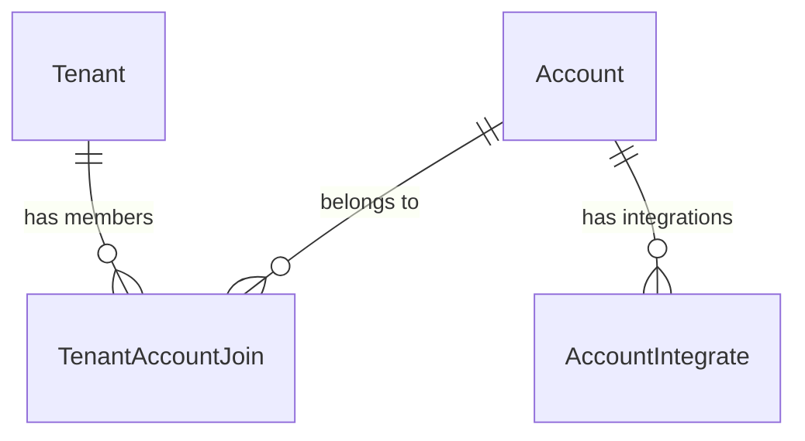
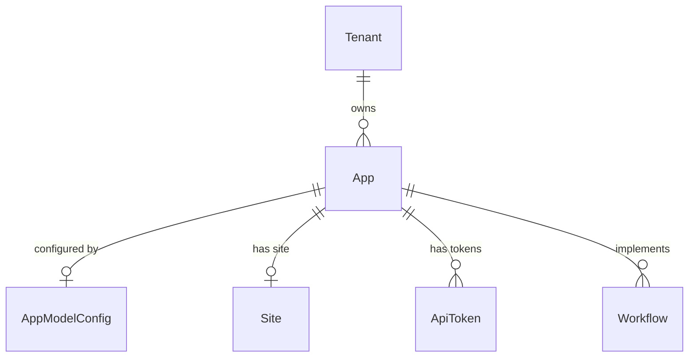
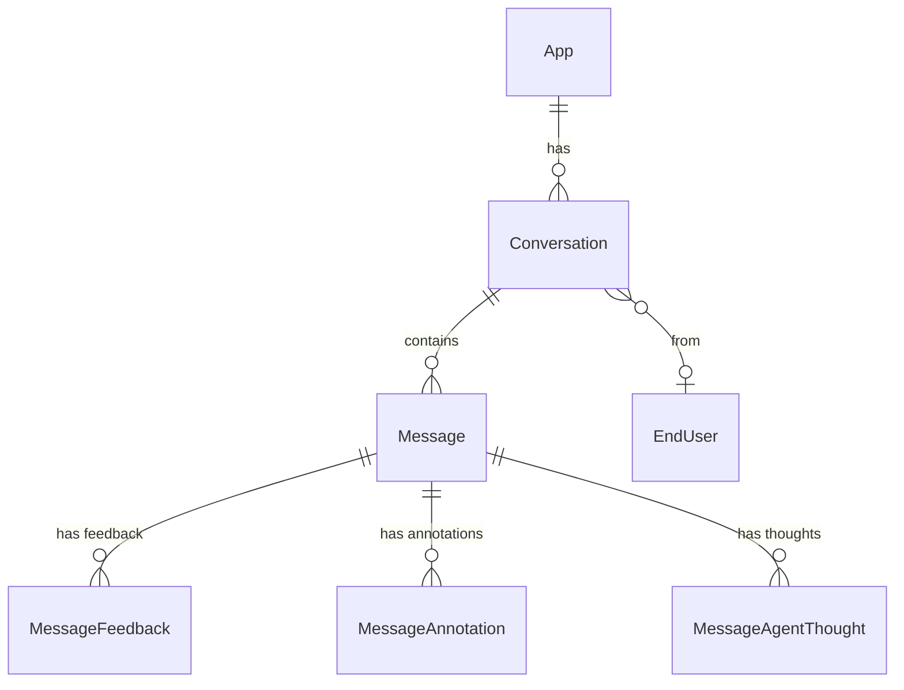
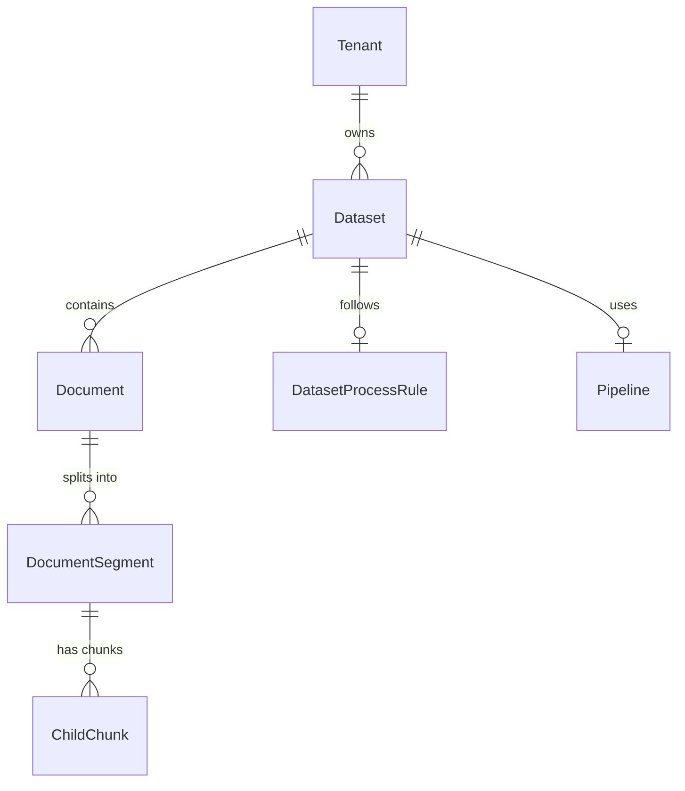
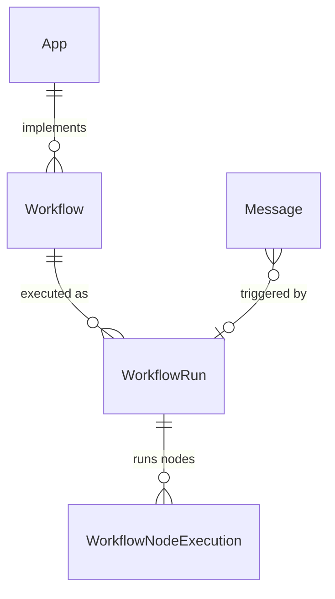
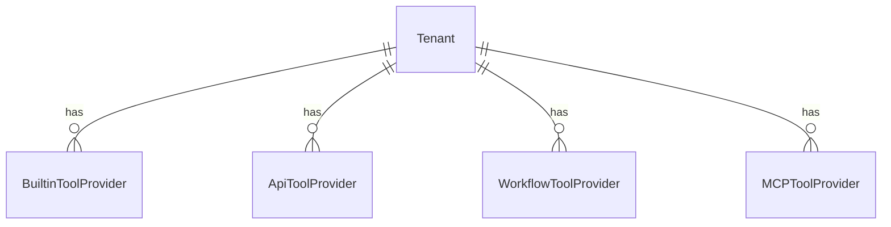

# Dify 数据架构文档

## 概述

Dify 使用 **PostgreSQL** 作为主数据库，通过 **SQLAlchemy ORM** 进行数据访问，采用 **Alembic** 管理数据库迁移。整体架构采用多租户设计，以 `Tenant` 为顶层实体组织数据。

## 架构图

- 详细版本: [dify_data_architecture.puml](./dify_data_architecture.puml)
- 概览版本: [dify_data_architecture_overview.puml](./dify_data_architecture_overview.puml)

---

## 领域模型

### 1. 账户与租户域 (Account & Tenant)

多租户架构的基础，管理用户账户和工作空间。



| 实体 | 说明 | 核心字段 |
|-----|------|---------|
| **Account** | 用户账户 | `id`, `name`, `email`, `status`, `password` |
| **Tenant** | 租户/工作空间 | `id`, `name`, `plan`, `status`, `encrypt_public_key` |
| **TenantAccountJoin** | 租户-账户关联 | `tenant_id`, `account_id`, `role`, `current` |
| **AccountIntegrate** | 第三方账户集成 | `account_id`, `provider`, `open_id` |

#### 账户角色 (TenantAccountRole)

| 角色 | 说明 | 权限 |
|-----|------|------|
| `owner` | 所有者 | 完全控制权限 |
| `admin` | 管理员 | 管理权限 |
| `editor` | 编辑者 | 编辑权限 |
| `normal` | 普通用户 | 基础权限 |
| `dataset_operator` | 数据集操作员 | 数据集管理权限 |

---

### 2. 应用域 (Application)

应用是 Dify 的核心业务实体，支持多种模式。



| 实体 | 说明 | 核心字段 |
|-----|------|---------|
| **App** | 应用 | `id`, `tenant_id`, `name`, `mode`, `description`, `workflow_id` |
| **AppModelConfig** | 应用模型配置 | `app_id`, `model_id`, `provider`, `agent_mode`, `pre_prompt` |
| **Site** | 应用站点配置 | `app_id`, `title`, `description`, `customize_domain` |
| **ApiToken** | API访问令牌 | `app_id`, `token`, `type` |
| **InstalledApp** | 已安装应用 | `tenant_id`, `app_id`, `is_pinned` |

#### 应用模式 (AppMode)

| 模式 | 说明 |
|-----|------|
| `completion` | 文本补全模式 |
| `chat` | 基础对话模式 |
| `advanced-chat` | 高级对话模式（工作流驱动） |
| `agent-chat` | 智能体对话模式 |
| `workflow` | 工作流模式 |
| `channel` | 渠道模式 |
| `rag-pipeline` | RAG管道模式 |

---

### 3. 对话域 (Conversation)

记录用户与应用的交互历史。



| 实体 | 说明 | 核心字段 |
|-----|------|---------|
| **Conversation** | 对话 | `id`, `app_id`, `name`, `mode`, `status`, `inputs`, `summary` |
| **Message** | 消息 | `id`, `conversation_id`, `query`, `answer`, `message_tokens`, `answer_tokens` |
| **MessageFeedback** | 消息反馈 | `message_id`, `rating`, `content`, `from_source` |
| **MessageAnnotation** | 消息标注 | `message_id`, `content`, `question`, `account_id` |
| **MessageAgentThought** | Agent思考过程 | `message_id`, `thought`, `tool`, `tool_input`, `observation` |
| **EndUser** | 终端用户 | `id`, `app_id`, `session_id`, `external_user_id` |

---

### 4. 知识库域 (Dataset/Knowledge)

知识库是 RAG 能力的核心，采用分层结构组织数据。



| 实体 | 说明 | 核心字段 |
|-----|------|---------|
| **Dataset** | 数据集/知识库 | `id`, `name`, `indexing_technique`, `embedding_model`, `retrieval_model` |
| **Document** | 文档 | `id`, `dataset_id`, `name`, `indexing_status`, `word_count`, `tokens` |
| **DocumentSegment** | 文档分段 | `id`, `document_id`, `content`, `position`, `tokens`, `index_node_id` |
| **ChildChunk** | 子块 | `id`, `segment_id`, `content`, `position` |
| **DatasetProcessRule** | 处理规则 | `dataset_id`, `mode`, `rules` |
| **Embedding** | 嵌入向量 | `id`, `hash`, `embedding`, `model_name` |
| **DatasetKeywordTable** | 关键词表 | `dataset_id`, `keyword_table` |
| **DatasetCollectionBinding** | 集合绑定 | `id`, `provider_name`, `model_name`, `collection_name` |
| **Pipeline** | RAG管道 | `id`, `name`, `pipeline_graph`, `is_published` |
| **DatasetMetadata** | 元数据 | `dataset_id`, `name`, `type` |
| **AppDatasetJoin** | 应用-数据集关联 | `app_id`, `dataset_id` |

#### 索引技术 (Indexing Technique)

| 技术 | 说明 |
|-----|------|
| `high_quality` | 高质量向量索引（使用嵌入模型） |
| `economy` | 经济型索引（使用关键词） |

#### 检索方法 (Retrieval Method)

| 方法 | 说明 |
|-----|------|
| `semantic_search` | 语义搜索（向量相似度） |
| `keyword_search` | 关键词搜索 |
| `hybrid_search` | 混合搜索 |
| `full_text_search` | 全文搜索 |

#### 文档索引状态

```
waiting → parsing → cleaning → splitting → indexing → completed
                                                    ↘ error
```

---

### 5. 工作流域 (Workflow)

工作流是 Dify 编排复杂业务逻辑的核心能力。



| 实体 | 说明 | 核心字段 |
|-----|------|---------|
| **Workflow** | 工作流定义 | `id`, `app_id`, `type`, `version`, `graph`, `features` |
| **WorkflowRun** | 工作流运行记录 | `id`, `workflow_id`, `status`, `inputs`, `outputs`, `total_tokens` |
| **WorkflowNodeExecutionModel** | 节点执行记录 | `workflow_run_id`, `node_id`, `node_type`, `status`, `inputs`, `outputs` |
| **WorkflowAppLog** | 工作流日志 | `workflow_id`, `workflow_run_id`, `created_from` |
| **ConversationVariable** | 对话变量 | `conversation_id`, `app_id`, `data` |

#### 工作流类型 (WorkflowType)

| 类型 | 说明 |
|-----|------|
| `workflow` | 标准工作流（对应 Workflow App） |
| `chat` | 对话工作流（对应 Advanced Chat） |
| `rag-pipeline` | RAG管道工作流 |

#### 工作流执行状态 (WorkflowExecutionStatus)

| 状态 | 说明 |
|-----|------|
| `running` | 运行中 |
| `succeeded` | 成功 |
| `failed` | 失败 |
| `stopped` | 已停止 |
| `partial_succeeded` | 部分成功 |

#### 节点类型 (NodeType)

| 类型 | 说明 |
|-----|------|
| `start` | 开始节点 |
| `end` | 结束节点 |
| `llm` | LLM节点 |
| `knowledge-retrieval` | 知识检索节点 |
| `code` | 代码执行节点 |
| `template-transform` | 模板转换节点 |
| `question-classifier` | 问题分类节点 |
| `http-request` | HTTP请求节点 |
| `tool` | 工具节点 |
| `variable-aggregator` | 变量聚合节点 |
| `variable-assigner` | 变量赋值节点 |
| `if-else` | 条件分支节点 |
| `iteration` | 迭代节点 |
| `loop` | 循环节点 |
| `parameter-extractor` | 参数提取节点 |
| `agent` | Agent节点 |
| `document-extractor` | 文档提取节点 |
| `list-operator` | 列表操作节点 |

---

### 6. 工具域 (Tools)

工具扩展 Dify 的能力边界。



| 实体 | 说明 | 核心字段 |
|-----|------|---------|
| **BuiltinToolProvider** | 内置工具提供商 | `tenant_id`, `provider`, `encrypted_credentials` |
| **ApiToolProvider** | API工具提供商 | `tenant_id`, `name`, `schema`, `tools_str` |
| **WorkflowToolProvider** | 工作流工具提供商 | `tenant_id`, `app_id`, `name`, `parameter_configuration` |
| **MCPToolProvider** | MCP工具提供商 | `tenant_id`, `name`, `server` |
| **ToolFile** | 工具文件 | `id`, `file_key`, `mimetype`, `name` |

---

### 7. 文件域 (Files)

管理用户上传的文件资源。

| 实体 | 说明 | 核心字段 |
|-----|------|---------|
| **UploadFile** | 上传文件 | `id`, `tenant_id`, `key`, `name`, `size`, `extension`, `mime_type`, `hash` |

---

### 8. 标签域 (Tags)

通用标签系统，用于组织应用和知识库。

| 实体 | 说明 | 核心字段 |
|-----|------|---------|
| **Tag** | 标签 | `id`, `tenant_id`, `type`, `name` |
| **TagBinding** | 标签绑定 | `tag_id`, `target_id` |

---

## 核心数据流

### 1. 知识库处理流程

```
文件上传 → Document创建 → 解析(parsing) → 清洗(cleaning) 
    → 分割(splitting) → DocumentSegment → 向量化 → Embedding → 向量数据库
```

### 2. 对话处理流程

```
用户输入 → Conversation → Message → 
    [知识检索] → Dataset → DocumentSegment
    [工作流执行] → Workflow → WorkflowRun → WorkflowNodeExecution
    [Agent推理] → MessageAgentThought
→ 生成回答 → Message.answer
```

### 3. 应用执行流程

```
API请求/WebUI → App → 
    ├── completion模式 → 直接LLM调用
    ├── chat模式 → Conversation + Message
    ├── workflow模式 → Workflow执行
    ├── agent-chat模式 → Agent推理循环
    └── advanced-chat模式 → 工作流驱动对话
```

---

## 索引设计

### 主要索引

```sql
-- 租户相关
CREATE INDEX idx_dataset_tenant_id ON datasets(tenant_id);
CREATE INDEX idx_app_tenant_id ON apps(tenant_id);
CREATE INDEX idx_document_tenant_idx ON documents(tenant_id);

-- 数据集相关
CREATE INDEX idx_document_dataset_id ON documents(dataset_id);
CREATE INDEX idx_segment_document_id ON document_segments(document_id);
CREATE INDEX idx_segment_dataset_id ON document_segments(dataset_id);

-- 应用相关
CREATE INDEX idx_conversation_app_id ON conversations(app_id);
CREATE INDEX idx_message_conversation_id ON messages(conversation_id);
CREATE INDEX idx_workflow_version_idx ON workflows(tenant_id, app_id, version);

-- 特殊索引
CREATE INDEX idx_embedding_hash ON embeddings(hash);
CREATE INDEX retrieval_model_idx ON datasets USING gin(retrieval_model);
CREATE INDEX document_metadata_idx ON documents USING gin(doc_metadata);
```

---

## 数据库配置

### 连接池配置

```python
SQLALCHEMY_ENGINE_OPTIONS = {
    'pool_size': 10,           # 连接池大小
    'pool_recycle': 3600,      # 连接回收时间(秒)
    'pool_pre_ping': True,     # 连接预检查
    'max_overflow': 20,        # 最大溢出连接
}
```

### 迁移管理

```bash
# 生成迁移
uv run --project api flask db migrate -m "migration description"

# 执行迁移
uv run --project api flask db upgrade

# 回滚迁移
uv run --project api flask db downgrade
```

---

## 设计原则

1. **多租户隔离**: 所有业务数据通过 `tenant_id` 进行租户隔离
2. **软删除**: 关键实体支持软删除（如 `is_deleted`, `archived`）
3. **审计追踪**: 记录 `created_by`, `created_at`, `updated_by`, `updated_at`
4. **JSON灵活性**: 复杂配置使用 JSONB 存储（如 `retrieval_model`, `graph`）
5. **状态机管理**: 关键流程采用状态机模式（如文档索引状态）
6. **分层结构**: 知识库采用 Dataset → Document → Segment → Chunk 分层设计
