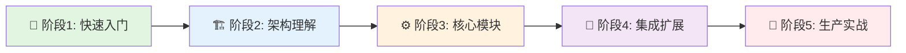
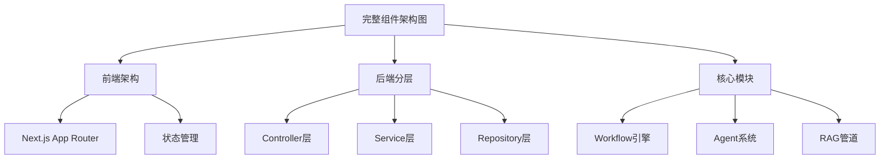
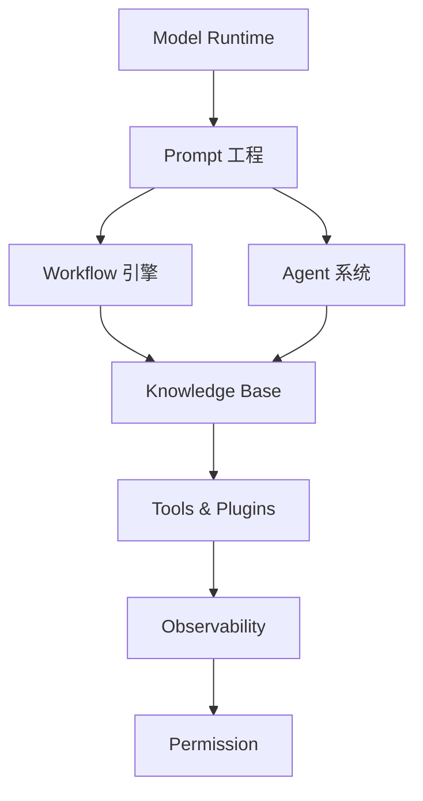

# 🗺️ Dify 学习地图

> **从入门到精通 Dify 架构的完整学习路径**  
> 适合架构师、开发者、AI 工程师系统性学习 Dify


---

## 📚 如何使用这份学习地图

本学习地图基于 **认知难度递进** 和 **实战应用场景** 设计，分为 5 个阶段：



**预计学习时间**：
- **速成路径**（核心能力）：3-5 天
- **深度路径**（架构设计）：2-3 周
- **专家路径**（源码级）：1-2 个月

---

## 🎯 阶段1：快速入门（1-2天）

**学习目标**：了解 Dify 是什么、能做什么、如何快速上手

### 📖 必读文档

| 序号 | 文档 | 核心收获 | 阅读时间 |
|------|------|---------|---------|
| 1.1 | [01-overview/README.md](./01-overview/README.md) | 项目目标、核心能力、技术栈 | 20 分钟 |
| 1.2 | [官方 README](../README.md) | 快速部署与体验 | 15 分钟 |
| 1.3 | [AGENTS.md](../AGENTS.md) | 开发工作流与规范 | 10 分钟 |

### 🎬 实践任务

- [ ] **任务 1.1**：使用 Docker Compose 部署 Dify 本地环境
- [ ] **任务 1.2**：创建第一个简单的工作流（LLM 问答）
- [ ] **任务 1.3**：体验知识库功能（上传文档并问答）
- [ ] **任务 1.4**：尝试创建一个简单的 Agent

### ✅ 通关标准

- [ ] 能够独立部署 Dify 并访问前端界面
- [ ] 理解 Dify 的 4 大核心能力（Workflow、Agent、RAG、Model Runtime）
- [ ] 知道 Dify 的技术栈（前端 Next.js、后端 Flask）

---

## 🏗️ 阶段2：架构理解（3-5天）

**学习目标**：掌握 Dify 的系统架构、分层设计、组件关系

### 📐 架构图学习路径



### 📖 必读文档

| 序号 | 文档 | 核心收获 | 阅读时间 |
|------|------|---------|---------|
| 2.1 | [02-architecture/README.md](./02-architecture/README.md) | 完整系统架构与组件关系 | 30 分钟 |
| 2.2 | [02-architecture/dify_componet_architecture.puml](./02-architecture/dify_componet_architecture.puml) | 架构图源码（可编辑） | 20 分钟 |
| 2.3 | [03-layers/api/README.md](./03-layers/api/README.md) | API 分层设计 | 25 分钟 |
| 2.4 | [04-core-modules/README.md](./04-core-modules/README.md) | 核心模块总览 | 20 分钟 |

### 🖼️ 关键架构图

**必看架构图**（按优先级）：
1. ⭐ [Dify完整组件架构图.png](./02-architecture/png/Dify完整组件架构图.png)
2. [Dify智能体技术组件架构图.jpg](./02-architecture/png/Dify智能体技术组件架构图.jpg)
3. [Dify工作流管理核心场景时序图.png](./02-architecture/png/Dify工作流管理核心场景时序图.png)

### 🎬 实践任务

- [ ] **任务 2.1**：绘制自己对 Dify 架构的理解（用 PlantUML 或手绘）
- [ ] **任务 2.2**：阅读 `api/controllers/console/app/workflow.py`，理解 API 层如何调用 Service 层
- [ ] **任务 2.3**：理解 DDD 分层：Controller → Service → Core → Repository
- [ ] **任务 2.4**：找到 3 个核心模块的入口代码（Workflow、Agent、RAG）

### ✅ 通关标准

- [ ] 能够画出 Dify 的三层架构（Frontend、Backend、Infrastructure）
- [ ] 理解 DDD 分层设计的好处（解耦、可测试、易扩展）
- [ ] 知道 8 大核心模块的职责与关系

---

## ⚙️ 阶段3：核心模块深度（7-10天）

**学习目标**：深入理解 Dify 的 8 大核心模块的设计与实现

### 🗂️ 模块学习顺序（推荐）

按照 **依赖关系** 和 **复杂度** 设计学习路径：



### 📖 分模块学习路径

#### 🔹 3.1 Model Runtime（模型运行时）⭐ 基础模块

**为什么先学**：所有模块都依赖它来调用 LLM

| 文档 | 核心收获 | 难度 |
|------|---------|------|
| [model_runtime/README.md](./04-core-modules/model_runtime/) | 模型抽象层设计 | ⭐⭐ |
| 源码：`api/core/model_runtime/` | 工厂模式、适配器模式 | ⭐⭐⭐ |

**实践任务**：
- [ ] 理解如何统一调用不同的 LLM（OpenAI、Claude、本地模型）
- [ ] 阅读 `model_runtime/model_providers/openai/llm/llm.py`
- [ ] 尝试增加一个自定义模型提供商

---

#### 🔹 3.2 Prompt 工程 ⭐ 基础模块

**为什么第二学**：Workflow 和 Agent 都依赖 Prompt 管理

| 文档 | 核心收获 | 难度 |
|------|---------|------|
| [prompt/README.md](./04-core-modules/prompt/) | Prompt 模板系统 | ⭐⭐ |
| 源码：`api/core/prompt/` | 变量注入、上下文管理 | ⭐⭐ |

**实践任务**：
- [ ] 理解 Prompt 模板的变量替换机制
- [ ] 分析多轮对话的上下文拼接策略
- [ ] 阅读 [07-others/上下文工程概念澄清.md](./07-others/上下文工程概念澄清.md)

---

#### 🔹 3.3 Workflow 工作流引擎 ⭐⭐⭐ 核心模块

**为什么重要**：Dify 最强大的能力，理解它就理解了 Dify 的设计思想

| 文档 | 核心收获 | 阅读时间 |
|------|---------|---------|
| [workflow/workflow_management_technical_doc.md](./04-core-modules/workflow/workflow_management_technical_doc.md) | 事件驱动架构 | 40 分钟 |
| [workflow/workflow_types_documentation.md](./04-core-modules/workflow/workflow_types_documentation.md) | 工作流类型 | 20 分钟 |
| [workflow/workflow_nodes_documentation.md](./04-core-modules/workflow/workflow_nodes_documentation.md) | 节点开发指南 | 30 分钟 |
| [workflow/workflow_component_development_guide.md](./04-core-modules/workflow/workflow_component_development_guide.md) | 自定义节点开发 | 50 分钟 |

**关键时序图**：
- [Dify工作流管理核心场景时序图.png](./02-architecture/png/Dify工作流管理核心场景时序图.png)

**实践任务**：
- [ ] 理解 Workflow 的事件驱动架构
- [ ] 阅读 `api/core/workflow/nodes/llm/llm_node.py`（LLM 节点实现）
- [ ] 创建一个自定义节点（例如：调用第三方 API）
- [ ] 理解工作流的状态管理（运行中、暂停、完成、失败）

---

#### 🔹 3.4 Agent 智能体系统 ⭐⭐⭐ 核心模块

**为什么重要**：理解 AI Agent 的工程化实现

| 文档 | 核心收获 | 阅读时间 |
|------|---------|---------|
| [agent/agent_capability_technical_documentation.md](./04-core-modules/agent/agent_capability_technical_documentation.md) | Agent 策略模式 | 45 分钟 |
| [agent/README.md](./04-core-modules/agent/README.md) | Agent 架构总览 | 15 分钟 |

**关键时序图**：
- [Dify智能体核心场景时序.png](./02-architecture/png/Dify智能体核心场景时序.png)

**实践任务**：
- [ ] 理解 Function Calling、ReAct、Plan & Execute 三种策略
- [ ] 阅读 `api/core/agent/agent_runner.py`
- [ ] 创建一个自定义 Agent 策略
- [ ] 理解工具调用的完整流程

---

#### 🔹 3.5 Knowledge Base（RAG 系统）⭐⭐⭐ 核心模块

**为什么重要**：RAG 是 AI 应用的核心能力

| 文档 | 核心收获 | 阅读时间 |
|------|---------|---------|
| [knowledgeBase/README.md](./04-core-modules/knowledgeBase/) | RAG 完整链路 | 30 分钟 |
| [07-others/Dify知识问答场景-上下文工程应用详解.md](./07-others/Dify知识问答场景-上下文工程应用详解.md) | 上下文工程实战 | 35 分钟 |

**关键时序图**（文档处理流程）：
- [Dify-PDF文档处理时序.png](./02-architecture/png/Dify-PDF文档处理时序.png)
- [Dify-Word文档处理时序.png](./02-architecture/png/Dify-Word文档处理时序.png)
- [Dify-Excel文档处理时序.png](./02-architecture/png/Dify-Excel文档处理时序.png)

**实践任务**：
- [ ] 理解 RAG 管道：Extractor → Splitter → Embedding → Retrieval → Rerank
- [ ] 阅读 `api/core/rag/retrieval/`
- [ ] 测试不同的文本分片策略（固定长度 vs 语义分片）
- [ ] 对比不同的检索策略（语义检索 vs 混合检索）

---

#### 🔹 3.6 Tools & Plugins（工具插件系统）⭐⭐

| 文档 | 核心收获 | 难度 |
|------|---------|------|
| [tools&plugins/README.md](./04-core-modules/tools&plugins/) | 工具调用机制 | ⭐⭐ |

**实践任务**：
- [ ] 创建一个自定义工具（例如：天气查询 API）
- [ ] 理解工具注册与自动发现机制
- [ ] 阅读 `api/core/tools/`

---

#### 🔹 3.7 Observability（可观测性）⭐⭐

| 文档 | 核心收获 | 难度 |
|------|---------|------|
| [observability/README.md](./04-core-modules/observability/) | 日志、追踪、监控 | ⭐⭐ |

**实践任务**：
- [ ] 理解分布式追踪的实现（OpenTelemetry）
- [ ] 配置 Sentry 错误监控
- [ ] 阅读 `api/core/ops/`

---

#### 🔹 3.8 Permission（权限管理）⭐

| 文档 | 核心收获 | 难度 |
|------|---------|------|
| [permission/README.md](./04-core-modules/permission/) | RBAC 模型 | ⭐ |

**实践任务**：
- [ ] 理解 Dify 的多租户隔离机制
- [ ] 阅读 `api/services/account_service.py`

---

### ✅ 阶段3 通关标准

- [ ] 能够独立开发一个自定义工作流节点
- [ ] 能够创建一个自定义 Agent 策略
- [ ] 理解 RAG 的完整流程并能优化检索效果
- [ ] 能够为 Dify 增加一个新的工具

---

## 🔌 阶段4：集成扩展（3-5天）

**学习目标**：掌握 Dify 与第三方服务的集成方案

### 📖 第三方集成学习路径

Dify 支持 **10+ 类第三方服务集成**，按照使用频率推荐学习顺序：

| 序号 | 文档 | 集成类型 | 核心收获 |
|------|------|---------|---------|
| 4.1 | [06-third-party/01-大语言模型集成.md](./06-third-party/01-大语言模型集成.md) | LLM | 40+ 模型提供商 |
| 4.2 | [06-third-party/02-向量数据库集成.md](./06-third-party/02-向量数据库集成.md) | 向量数据库 | 28+ 向量库 |
| 4.3 | [06-third-party/03-对象存储集成.md](./06-third-party/03-对象存储集成.md) | 对象存储 | S3、阿里云 OSS |
| 4.4 | [06-third-party/05-文档处理集成.md](./06-third-party/05-文档处理集成.md) | 文档解析 | PDF、Word、Excel |
| 4.5 | [06-third-party/04-消息平台集成.md](./06-third-party/04-消息平台集成.md) | 消息平台 | Slack、钉钉、企微 |

### 🎬 实践任务

- [ ] **任务 4.1**：切换 Dify 使用的向量数据库（Weaviate → Qdrant）
- [ ] **任务 4.2**：增加一个新的 LLM 提供商（例如：国产大模型）
- [ ] **任务 4.3**：配置对象存储（本地 → S3）
- [ ] **任务 4.4**：集成钉钉机器人

### ✅ 通关标准

- [ ] 能够为 Dify 增加新的第三方服务集成
- [ ] 理解适配器模式在集成中的应用
- [ ] 知道如何选择合适的向量数据库

---

## 🚀 阶段5：生产实战（持续）

**学习目标**：掌握 Dify 的生产部署、性能优化、问题排查

### 📖 实战文档

| 序号 | 文档 | 核心收获 | 难度 |
|------|------|---------|------|
| 5.1 | [docker/README.md](../docker/README.md) | Docker 部署 | ⭐⭐ |
| 5.2 | `analysis/_deployment_guide.md` | 部署最佳实践 | ⭐⭐⭐ |
| 5.3 | [05-data-architecture/](./05-data-architecture/) | 数据库设计 | ⭐⭐⭐ |

### 🎬 实践任务

- [ ] **任务 5.1**：部署 Dify 到云服务器（阿里云/AWS）
- [ ] **任务 5.2**：配置 HTTPS 与域名
- [ ] **任务 5.3**：配置 Nginx 反向代理与负载均衡
- [ ] **任务 5.4**：性能压测（压测工具：Locust、JMeter）
- [ ] **任务 5.5**：监控 Dify 的性能指标（CPU、内存、响应时间）
- [ ] **任务 5.6**：数据库优化（索引、查询优化）

### ✅ 通关标准

- [ ] 能够独立部署 Dify 到生产环境
- [ ] 知道如何排查性能问题
- [ ] 理解 Dify 的扩展性设计（水平扩展）

---

## 🎯 学习路径推荐（按角色）

### 👨‍💼 架构师路径

**目标**：理解 Dify 的架构设计与技术选型

```
阶段1 → 阶段2 → 阶段3（核心模块总览）→ 阶段4 → 阶段5（重点：扩展性与性能）
```

**关键文档**：
- 02-architecture（架构设计）
- 04-core-modules（模块设计）
- 05-data-architecture（数据库设计）

---

### 👨‍💻 开发者路径

**目标**：基于 Dify 进行二次开发或贡献代码

```
阶段1 → 阶段2 → 阶段3（深度学习 Workflow & Agent）→ 阶段4（集成开发）
```

**关键文档**：
- 04-core-modules/workflow（工作流开发）
- 04-core-modules/agent（Agent 开发）
- 04-core-modules/tools&plugins（工具开发）
- AGENTS.md（开发规范）

---

### 🤖 AI 工程师路径

**目标**：理解 AI 应用的工程化最佳实践

```
阶段1 → 阶段3.3（Workflow）→ 阶段3.4（Agent）→ 阶段3.5（RAG）→ 阶段4.1（LLM 集成）
```

**关键文档**：
- 04-core-modules/workflow（AI 工作流）
- 04-core-modules/agent（Agent 策略）
- 04-core-modules/knowledgeBase（RAG 实现）
- 06-third-party/01-大语言模型集成.md

---

### 🎓 学生/初学者路径

**目标**：快速上手并理解 Dify 的核心能力

```
阶段1 → 阶段2（重点：架构图）→ 阶段3（选择 1-2 个感兴趣的模块）
```

**关键文档**：
- 01-overview（项目概述）
- 02-architecture（架构图）
- 04-core-modules/workflow（工作流）

---

## 📊 学习进度追踪

### 📈 完成度自测表

| 阶段 | 预计时间 | 完成度 | 通关日期 |
|------|---------|--------|---------|
| 🎯 阶段1：快速入门 | 1-2天 | ☐ | - |
| 🏗️ 阶段2：架构理解 | 3-5天 | ☐ | - |
| ⚙️ 阶段3：核心模块 | 7-10天 | ☐ | - |
| 🔌 阶段4：集成扩展 | 3-5天 | ☐ | - |
| 🚀 阶段5：生产实战 | 持续 | ☐ | - |

### 🎖️ 技能徽章系统

完成特定学习目标后，可以解锁对应徽章：

- 🏆 **Dify 入门者**：完成阶段1
- 🏆 **架构理解者**：完成阶段2
- 🏆 **工作流大师**：深度掌握 Workflow 模块
- 🏆 **Agent 专家**：深度掌握 Agent 模块
- 🏆 **RAG 工程师**：深度掌握 Knowledge Base 模块
- 🏆 **集成专家**：完成阶段4
- 🏆 **生产实战者**：完成阶段5
- 🏆 **Dify 贡献者**：向 Dify 贡献代码并被合并

---

## 🛠️ 学习工具推荐

### 📖 文档阅读

- **PlantUML 预览**：VS Code 插件 `PlantUML`
- **Markdown 预览**：VS Code 插件 `Markdown Preview Enhanced`
- **架构图绘制**：draw.io、Excalidraw

### 🔍 代码阅读

- **IDE**：VS Code + Python 插件
- **代码导航**：Sourcegraph、GitHub CodeSpaces
- **AI 辅助**：GitHub Copilot、Cursor

### 🧪 实验环境

- **本地部署**：Docker Desktop
- **云服务器**：阿里云、AWS、Azure
- **数据库工具**：pgAdmin（PostgreSQL）、RedisInsight（Redis）

---

## 📚 补充资源

### 🌐 官方资源

- **官方文档**：https://docs.dify.ai/
- **GitHub 仓库**：https://github.com/langgenius/dify
- **社区讨论**：GitHub Discussions

### 📝 推荐阅读

- **DDD 领域驱动设计**：《领域驱动设计》（Eric Evans）
- **Clean Architecture**：《架构整洁之道》（Robert C. Martin）
- **AI 应用开发**：《构建 LLM 应用》（O'Reilly）

### 🎥 视频教程

- Dify 官方 YouTube 频道
- B 站 Dify 教程合集

---

## 🤝 学习建议

### ✅ 推荐做法

- **边学边做**：理论结合实践，每学完一个模块立即动手实验
- **画图理解**：用 PlantUML 或手绘架构图，加深理解
- **源码阅读**：不要只看文档，结合源码学习
- **做笔记**：用 Markdown 记录学习心得
- **提问题**：不懂的地方去 GitHub Discussions 提问

### ❌ 避免陷阱

- **不要跳跃学习**：按照学习路径循序渐进
- **不要只看不做**：实践是最好的老师
- **不要死磕细节**：先理解整体，再深入细节
- **不要孤军奋战**：加入社区，与其他学习者交流

---

## 📞 获取帮助

### 🆘 遇到问题怎么办？

1. **查文档**：先在 `analysis/` 目录搜索相关文档
2. **看源码**：结合源码理解实现细节
3. **问社区**：去 GitHub Discussions 提问
4. **联系作者**：关注公众号 `柒叔代码阁`，获取深度内容与一对一答疑

---

## 🎓 结语

Dify 是一个设计优雅、功能强大的开源 AI 应用开发平台。通过系统学习本学习地图，你将：

- ✅ 掌握 Dify 的完整架构设计
- ✅ 理解 AI 应用的工程化最佳实践
- ✅ 具备基于 Dify 进行二次开发的能力
- ✅ 了解如何部署 Dify 到生产环境

**祝你学习愉快！🚀**

---

**最后更新**：2025-12-26  
**维护者**：AI 架构解析（公众号）  
**贡献**：欢迎通过 Pull Request 改进本学习地图
