# FastGPT 系统架构描述

## 架构概览
FastGPT 是一个基于 Next.js 的 AI Agent 构建平台，采用单仓多包（Monorepo）架构，通过 pnpm workspaces 管理多个包。系统整体采用分层设计，支持复杂的工作流编排、知识库检索、模型调用和多种外部服务集成。

## 核心架构层次

### 1. 前端展示层（Frontend Layer）
- **技术栈**：Next.js 14 + React 18 + Chakra UI + React Flow
- **主要职责**：
  - 用户界面呈现与交互（Flow 可视化编排、对话界面、知识库管理）
  - 状态管理（React Query、Zustand）
  - 多语言支持（i18next、next-i18next）
- **关键模块**：
  - `projects/app`：主应用入口，包含页面路由、组件与业务逻辑
  - `packages/web`：共享 UI 组件库（common、components、context、core、hooks、i18n、store、styles、support）

### 2. API 路由层（API Routes Layer）
- **技术栈**：Next.js API Routes
- **主要职责**：
  - 接收前端请求，进行参数验证与权限校验
  - 调用服务层完成业务逻辑
  - 统一错误处理与响应格式化
- **关键路由模块**（位于 `projects/app/src/pages/api`）：
  - `/api/core/app`：应用管理（创建、编辑、版本管理、工作流编排）
  - `/api/core/chat`：对话管理（聊天记录、反馈、引用、输入引导）
  - `/api/core/dataset`：知识库管理（数据集、文档、训练）
  - `/api/core/ai`：AI 能力（模型管理、Agent、优化提示词）
  - `/api/core/workflow`：工作流调试与代码优化
  - `/api/core/plugin`：插件管理（admin/team 插件、工具标签）
  - `/api/support/user`：用户与团队管理（账号、权限、计划）
  - `/api/support/wallet`：钱包与消费管理
  - `/api/support/openapi`：OpenAPI Key 管理
  - `/api/support/outLink`：外链分享（钉钉、飞书、企微、公众号）
  - `/api/support/mcp`：MCP（Model Context Protocol）服务端/客户端管理
  - `/api/v1|v2/chat/completions`：兼容 OpenAI 格式的对话接口

### 3. 业务服务层（Service Layer）
- **技术栈**：TypeScript + Mongoose (MongoDB ODM) + Zod (校验)
- **主要职责**：
  - 实现核心业务逻辑（应用、知识库、对话、工作流、插件）
  - 数据模型定义与 CRUD 操作
  - 调用第三方服务（向量数据库、AI 模型、文件处理）
- **关键模块**（位于 `packages/service`）：
  - `core/app`：应用核心逻辑（应用、版本、工具、HTTP/MCP 工具）
  - `core/chat`：对话逻辑（历史记录、引用、反馈、输入引导）
  - `core/dataset`：知识库逻辑（数据集、文档集合、数据块、训练队列）
  - `core/ai`：AI 能力封装（模型配置、函数调用、embedding、rerank）
  - `core/workflow`：工作流运行时引擎（节点调度、变量处理、工具调用）
  - `core/plugin`：插件系统（插件包解析、安装、工具管理）
  - `common/mongo`：MongoDB 连接管理与中间件
  - `common/redis`：Redis 连接（队列、缓存）
  - `common/vectorDB`：向量数据库抽象层（支持 PGVector、Milvus、OceanBase）
  - `common/bullmq`：任务队列管理
  - `common/file`：文件处理（上传、解析、转换）
  - `worker`：Worker 线程任务（文本分块、HTML 转 Markdown、token 计数）
  - `thirdProvider`：第三方服务集成（fastgptPlugin、doc2x）

### 4. 共享层（Shared Layer）
- **技术栈**：TypeScript + Zod
- **主要职责**：
  - 定义跨端共享的类型、常量、工具函数
  - 提供 SDK 与 OpenAPI 定义
- **关键模块**（位于 `packages/global`）：
  - `common`：通用工具（字符串、时间、文件、错误处理）
  - `core/app`、`core/chat`、`core/dataset`、`core/workflow`、`core/plugin`：各模块的类型定义、常量、Schema
  - `openapi`：OpenAPI 规范定义
  - `sdk`：SDK 封装（如 @fastgpt-sdk/plugin）
  - `support`：支持模块类型（用户、权限、钱包、日志）

### 5. 数据持久化层（Data Persistence Layer）
- **MongoDB**：
  - 存储应用、知识库、对话记录、用户、团队、插件等结构化数据
  - 通过 Mongoose 进行 ORM 操作
  - 支持主从分离（读从、写主）
- **PostgreSQL (PGVector) / Milvus / OceanBase**：
  - 向量数据库，存储 embedding 向量用于知识库检索
  - 通过 `packages/service/common/vectorDB` 抽象层统一接口
- **Redis**：
  - 任务队列（BullMQ）
  - 缓存（系统配置、临时数据）
  - 会话管理
- **MinIO / S3**：
  - 对象存储，存储文件、图片、语音等非结构化数据
  - 通过 `packages/service/common/s3` 管理

### 6. 外部服务集成层（External Services）
- **AI 模型服务**：OpenAI、文心一言、Azure、通过 One API 等聚合服务调用
- **插件服务**：FastGPT Plugin 运行时（支持自定义插件）
- **文档处理**：doc2x（文档解析）、PDF 处理插件（pdf-marker、pdf-mineru、pdf-mistral）
- **语音识别/合成**：STT (SenseVoice)、TTS (CosyVoice)
- **搜索引擎**：Searxng（网页爬虫插件）
- **外部集成**：钉钉、飞书、企微、公众号 Webhook
- **MCP (Model Context Protocol)**：支持 MCP 客户端/服务端，实现工具调用与上下文共享

### 7. 工作流引擎（Workflow Engine）
- **核心模块**：`packages/service/core/workflow/dispatch`
- **功能特性**：
  - 节点类型：AI 对话、知识库检索、工具调用、HTTP 请求、代码执行、条件判断、变量赋值、交互节点等
  - 执行流程：节点调度、变量传递、边缘过滤、错误处理、执行日志
  - 调试能力：单步调试、变量查看、日志追踪
  - 工具集成：HTTP Tools、MCP Tools、Custom Tools、Plugin Tools
- **沙盒执行**：`projects/sandbox`（Python 3.11 环境，用于执行用户代码，通过白名单控制系统调用）

### 8. 任务队列与后台处理（Task Queue & Background Processing）
- **BullMQ**：
  - 知识库训练任务（文档分块、embedding 生成）
  - 异步文件处理（上传、转换）
  - 定时任务（数据同步、清理）
- **Worker 线程**：
  - 文本分块（text2Chunks）
  - HTML 转 Markdown（htmlStr2Md）
  - Token 计数（countGptMessagesTokens）
  - 文件读取（readFile）

### 9. 监控与日志（Monitoring & Logging）
- **OpenTelemetry**：
  - 日志导出（OTLP HTTP）
  - Winston/Pino 集成
  - Traces 与 Logs 收集
- **应用日志**：
  - 操作审计（AuditEventEnum）
  - 对话日志（Chat Logs）
  - 工作流执行日志
  - 计费与使用统计

## 数据流说明

### 对话流程
1. 用户在前端发起对话 → `/api/v1|v2/chat/completions`
2. API 路由验证权限与应用配置 → 调用 `core/chat` 服务
3. 工作流引擎解析应用编排 → 依次执行节点（知识库检索、AI 对话、工具调用）
4. 调用向量数据库检索相关知识 → 组装 prompt
5. 调用 AI 模型服务 → 流式返回结果
6. 保存对话记录、引用、消费统计 → 返回前端
7. 前端实时渲染流式响应

### 知识库训练流程
1. 用户上传文档 → `/api/core/dataset/collection/create/*`
2. 文件上传至 MinIO/S3 → 创建文档集合记录
3. 后台任务队列启动训练 → Worker 解析文档内容
4. 文本分块（text2Chunks）→ 生成 embedding
5. 向量存储至向量数据库 → 数据块存储至 MongoDB
6. 训练完成通知 → 前端更新状态

### 工作流编排流程
1. 用户在前端拖拽节点构建 Flow → 保存至应用版本
2. 运行时，工作流引擎加载节点与边 → 按拓扑顺序执行
3. 节点间通过变量传递数据 → 支持条件分支与循环
4. 支持调试模式（单步执行、变量查看）
5. 执行结果记录至日志 → 计费统计

## PlantUML 组件架构图

```plantuml
@startuml FastGPT System Architecture

!theme plain
skinparam componentStyle rectangle
skinparam backgroundColor white
skinparam Package { 
  BackgroundColor LightGray
  FontColor Blue
}
skinparam component {
  BackgroundColor LightBlue
  BorderColor Black
  ArrowColor Black
  FontColor DarkBlue
}
skinparam note {
  backgroundColor LightYellow
}

' 前端展示层
package "前端展示层 (Frontend Layer)" {
  [Next.js App\n(projects/app)] as App
  [Web UI 组件库\n(packages/web)] as WebUI
  [React Flow 编排器] as FlowEditor
  App -down-> WebUI
  App -down-> FlowEditor
}

' API 路由层
package "API 路由层 (API Routes)" {
  [App 管理 API] as AppAPI
  [Chat 对话 API] as ChatAPI
  [Dataset 知识库 API] as DatasetAPI
  [AI 模型 API] as AIAPI
  [Workflow 工作流 API] as WorkflowAPI
  [Plugin 插件 API] as PluginAPI
  [User 用户 API] as UserAPI
  [MCP 工具 API] as MCPAPI
  [OpenAPI 兼容接口] as OpenAPI
}

' 业务服务层
package "业务服务层 (Service Layer)" {
  [App Service\n应用核心逻辑] as AppService
  [Chat Service\n对话逻辑] as ChatService
  [Dataset Service\n知识库逻辑] as DatasetService
  [AI Service\nAI 能力封装] as AIService
  [Workflow Engine\n工作流引擎] as WorkflowEngine
  [Plugin Service\n插件系统] as PluginService
  [Worker 任务处理] as WorkerService
}

' 共享层
package "共享层 (Shared Layer)" {
  [Global Types & Utils\n(packages/global)] as GlobalLib
  [OpenAPI Schema] as OpenAPISchema
  [SDK] as SDK
}

' 数据持久化层
package "数据持久化层 (Data Persistence)" {
  database "MongoDB" as MongoDB {
    [应用数据]
    [对话记录]
    [用户/团队]
  }
  database "向量数据库" as VectorDB {
    [PGVector]
    [Milvus]
    [OceanBase]
  }
  database "Redis" as Redis {
    [任务队列 (BullMQ)]
    [缓存]
  }
  database "MinIO/S3" as S3 {
    [文件存储]
  }
}

' 外部服务层
cloud "外部服务 (External Services)" {
  [AI 模型服务\nOpenAI/Azure/OneAPI] as AIModel
  [FastGPT Plugin 运行时] as PluginRuntime
  [文档处理服务\ndoc2x/PDF解析] as DocProcessor
  [语音服务\nSTT/TTS] as VoiceService
  [外部集成\n钉钉/飞书/企微] as ExternalIntegration
  [MCP 服务端/客户端] as MCPService
}

' 其他组件
component [Sandbox 代码执行\n(Python 3.11)] as Sandbox
component [OpenTelemetry\n监控日志] as OTel

' 前端 -> API
App -down-> AppAPI
App -down-> ChatAPI
App -down-> DatasetAPI
App -down-> WorkflowAPI
App -down-> PluginAPI
App -down-> OpenAPI

' API -> Service
AppAPI -down-> AppService
ChatAPI -down-> ChatService
DatasetAPI -down-> DatasetService
AIAPI -down-> AIService
WorkflowAPI -down-> WorkflowEngine
PluginAPI -down-> PluginService
UserAPI -down-> AppService
MCPAPI -down-> WorkflowEngine

' Service -> 共享层
AppService -down-> GlobalLib
ChatService -down-> GlobalLib
DatasetService -down-> GlobalLib
WorkflowEngine -down-> GlobalLib
PluginService -down-> GlobalLib
AIService -down-> GlobalLib

' Service -> 数据层
AppService -down-> MongoDB
ChatService -down-> MongoDB
DatasetService -down-> MongoDB
DatasetService -down-> VectorDB
WorkflowEngine -down-> Redis
WorkerService -down-> Redis

' Service -> 外部服务
AIService -right-> AIModel
ChatService -right-> AIModel
WorkflowEngine -right-> PluginRuntime
WorkflowEngine -right-> MCPService
DatasetService -right-> DocProcessor
ChatService -right-> VoiceService
AppService -right-> ExternalIntegration

' 文件存储
DatasetService -down-> S3
AppService -down-> S3

' Worker 与任务队列
WorkerService -up-> DatasetService
WorkerService -up-> ChatService

' Sandbox
WorkflowEngine -right-> Sandbox

' 监控
AppService -down-> OTel
ChatService -down-> OTel
WorkflowEngine -down-> OTel

' OpenAPI Schema
OpenAPI -down-> OpenAPISchema
SDK -up-> OpenAPISchema

@enduml
```

## 关键技术点说明

### 工作流引擎设计
- **节点调度器**：基于有向无环图（DAG），按拓扑排序执行节点
- **变量系统**：支持全局变量、节点输出变量、引用变量、系统变量
- **工具调用**：统一工具接口，支持 HTTP、MCP、Plugin、Custom 工具
- **流式响应**：支持 SSE（Server-Sent Events）流式返回 AI 生成内容
- **错误处理**：节点级错误捕获，支持重试与回退
- **调试模式**：单步执行、断点、变量查看、日志追踪

### 知识库架构
- **分层结构**：Dataset（知识库） → Collection（文档集合） → Data（数据块）
- **向量检索**：支持混合检索（向量 + 全文）、重排序（Rerank）
- **训练队列**：BullMQ 管理训练任务，Worker 并发处理
- **多种导入方式**：本地文件、URL、API、文本、图片、CSV/XLSX 批量导入
- **API 知识库**：支持通过 API 动态查询外部数据源

### 插件系统
- **插件包格式**：Zip 压缩包，包含 manifest.json + 代码
- **插件运行时**：FastGPT Plugin Runtime（独立服务，支持多语言）
- **工具注册**：插件注册工具到系统，工作流可直接调用
- **权限控制**：Team 级别安装，Admin 审核发布

### MCP (Model Context Protocol) 集成
- **双向 MCP**：既可作为 MCP 客户端调用外部工具，也可作为 MCP 服务端暴露 FastGPT 能力
- **工具发现**：动态获取 MCP 服务端的工具列表
- **上下文共享**：通过 MCP 协议共享应用上下文与对话历史

### 多租户与权限
- **Team 隔离**：用户归属于 Team，数据按 Team 隔离
- **RBAC**：基于角色的权限控制（Owner、Admin、Member）
- **资源限制**：按 Team 计划限制知识库大小、对话次数、并发数
- **计费统计**：精确统计每次 AI 调用的 token 消耗与费用

### 部署架构
- **容器化**：Docker / Kubernetes
- **数据库**：MongoDB 主从、PostgreSQL（PGVector）、Redis Cluster
- **对象存储**：MinIO 或 S3 兼容服务
- **负载均衡**：Next.js 支持多实例水平扩展
- **监控**：OpenTelemetry + Grafana/Prometheus

## 扩展性设计

1. **向量数据库可插拔**：通过 `common/vectorDB` 抽象层，支持 PGVector、Milvus、OceanBase，可轻松扩展新的向量数据库
2. **模型接入灵活**：支持 OpenAI 格式的任意模型服务，通过 One API 等聚合服务统一管理
3. **插件生态**：开放插件系统，第三方可开发插件扩展能力（模型、工具、数据源）
4. **工作流节点可扩展**：新增节点类型只需实现标准接口即可集成
5. **多语言支持**：i18n 体系完善，支持中英日等多语言
6. **Monorepo 架构**：包管理清晰，代码复用性强，支持多端（Web、移动、桌面）扩展

## 安全性设计

1. **代码沙盒**：用户代码在隔离的 Python 环境执行，系统调用白名单限制
2. **API Key 管理**：支持 OpenAPI Key，精细化权限控制
3. **数据加密**：敏感数据加密存储（`common/secret`）
4. **CORS 与 CSRF**：Next.js 内置防护，支持 nextjs-cors 配置
5. **SQL 注入防护**：Mongoose/pg 参数化查询
6. **速率限制**：API 频率限制，防止滥用
7. **日志审计**：所有操作记录 Audit Log，支持追溯

