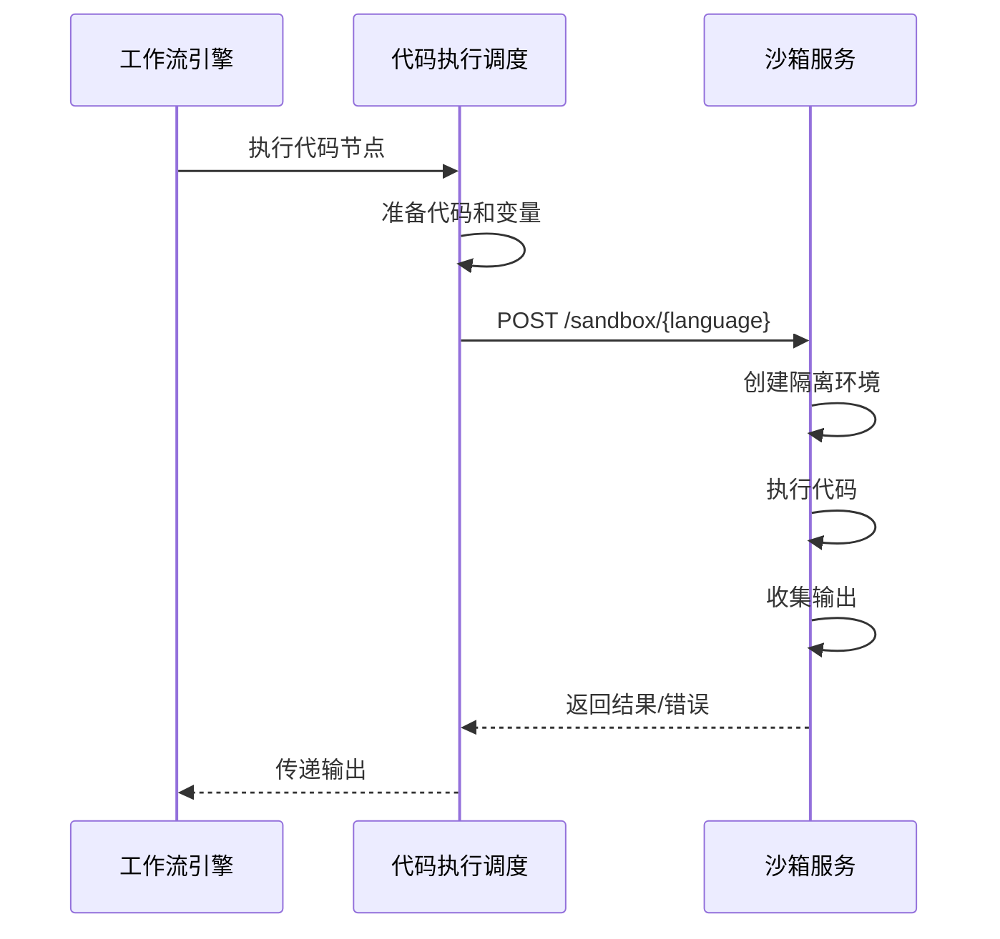

# 代码执行（Sandbox）集成

FastGPT 支持代码沙箱服务，允许在工作流中安全执行 Python 和 JavaScript 代码。

## 一、代码沙箱概述

| 特性 | 说明 |
|------|------|
| **支持语言** | Python、JavaScript |
| **执行环境** | 隔离的容器环境 |
| **安全性** | 资源限制、超时控制 |
| **用途** | 数据处理、API 调用、自定义逻辑 |

## 二、环境配置

### 2.1 环境变量

```bash
# 代码沙箱服务地址
SANDBOX_URL=http://sandbox:3000
```

### 2.2 沙箱服务部署

FastGPT 推荐使用独立的沙箱服务：
- 容器化部署
- 资源限制（CPU、内存、网络）
- 执行超时控制

## 三、核心实现

### 3.1 代码执行节点（`packages/service/core/workflow/dispatch/tools/codeSandbox.ts`）

```typescript
import { SandboxCodeTypeEnum } from '@fastgpt/global/core/workflow/template/system/sandbox/constants';

// 获取沙箱 URL
const getSandboxUrl = (codeType: SandboxCodeTypeEnum): string => {
  if (codeType == SandboxCodeTypeEnum.py) {
    return `${process.env.SANDBOX_URL}/sandbox/python`;
  } else {
    return `${process.env.SANDBOX_URL}/sandbox/js`;
  }
};

// 执行代码
export const runCodeInSandbox = async ({
  code,
  codeType,
  variables
}: {
  code: string;
  codeType: SandboxCodeTypeEnum;
  variables: Record<string, any>;
}): Promise<{
  output: any;
  error?: string;
}> => {
  try {
    const url = getSandboxUrl(codeType);
    
    const response = await axios.post(
      url,
      {
        code: code,
        variables: variables,
        timeout: 30000  // 30秒超时
      },
      {
        timeout: 35000,  // HTTP 超时
        headers: {
          'Content-Type': 'application/json'
        }
      }
    );
    
    return {
      output: response.data.output,
      error: response.data.error
    };
  } catch (error) {
    return {
      output: null,
      error: getErrText(error)
    };
  }
};
```

### 3.2 代码类型定义

```typescript
// packages/global/core/workflow/template/system/sandbox/constants.ts
export enum SandboxCodeTypeEnum {
  py = 'py',   // Python
  js = 'js'    // JavaScript
}
```

## 四、工作流集成

### 4.1 代码节点配置

```typescript
{
  "nodeType": "codeSandbox",
  "inputs": {
    "codeType": "py",  // 或 "js"
    "code": "def main(input):\n    return input.upper()",
    "variables": {
      "input": "hello world"
    }
  },
  "outputs": {
    "output": "{{output}}",
    "error": "{{error}}"
  }
}
```

### 4.2 执行流程



## 五、Python 沙箱

### 5.1 支持的库

常见的 Python 库：
- `requests` - HTTP 请求
- `json` - JSON 处理
- `datetime` - 日期时间
- `math` - 数学计算
- `re` - 正则表达式
- `pandas` - 数据分析（可选）
- `numpy` - 科学计算（可选）

### 5.2 代码示例

```python
def main(variables):
    # 访问传入的变量
    input_text = variables.get('input', '')
    
    # 数据处理
    result = input_text.upper()
    
    # HTTP 请求
    import requests
    response = requests.get('https://api.example.com/data')
    data = response.json()
    
    # 返回结果
    return {
        'output': result,
        'apiData': data
    }
```

### 5.3 安全限制

- **执行时间**：最长 30 秒
- **内存限制**：512MB
- **网络访问**：可配置允许列表
- **文件系统**：只读或禁用

## 六、JavaScript 沙箱

### 6.1 支持的 API

- `fetch` - HTTP 请求
- `JSON` - JSON 处理
- `Date` - 日期时间
- `Math` - 数学计算
- `RegExp` - 正则表达式
- `Promise` - 异步处理

### 6.2 代码示例

```javascript
async function main(variables) {
  // 访问传入的变量
  const inputText = variables.input || '';
  
  // 数据处理
  const result = inputText.toUpperCase();
  
  // HTTP 请求
  const response = await fetch('https://api.example.com/data');
  const data = await response.json();
  
  // 返回结果
  return {
    output: result,
    apiData: data
  };
}
```

### 6.3 安全限制

- **执行时间**：最长 30 秒
- **内存限制**：512MB
- **沙箱环境**：使用 VM2 或类似技术
- **API 限制**：禁止访问文件系统、进程等

## 七、使用场景

### 7.1 数据转换

```python
# 格式转换
def main(variables):
    data = variables['data']
    # CSV 转 JSON
    import csv
    import io
    
    csv_data = io.StringIO(data)
    reader = csv.DictReader(csv_data)
    result = [row for row in reader]
    
    return {'output': result}
```

### 7.2 API 调用

```javascript
// 调用第三方 API
async function main(variables) {
  const apiKey = variables.apiKey;
  const query = variables.query;
  
  const response = await fetch(`https://api.example.com/search?q=${query}`, {
    headers: {
      'Authorization': `Bearer ${apiKey}`
    }
  });
  
  const data = await response.json();
  return { results: data.items };
}
```

### 7.3 复杂计算

```python
# 统计分析
def main(variables):
    numbers = variables['numbers']
    
    import statistics
    
    return {
        'mean': statistics.mean(numbers),
        'median': statistics.median(numbers),
        'stdev': statistics.stdev(numbers)
    }
```

### 7.4 文本处理

```javascript
// 正则提取
function main(variables) {
  const text = variables.text;
  const pattern = variables.pattern;
  
  const regex = new RegExp(pattern, 'g');
  const matches = [...text.matchAll(regex)];
  
  return {
    matches: matches.map(m => m[0])
  };
}
```

## 八、错误处理

### 8.1 常见错误

| 错误类型 | 说明 | 解决方法 |
|---------|------|---------|
| `TimeoutError` | 执行超时 | 优化代码逻辑，减少计算量 |
| `MemoryError` | 内存不足 | 减少数据量，优化内存使用 |
| `NetworkError` | 网络请求失败 | 检查 API 地址和网络配置 |
| `SyntaxError` | 语法错误 | 修正代码语法 |
| `RuntimeError` | 运行时错误 | 检查代码逻辑和变量 |

### 8.2 错误捕获

```python
def main(variables):
    try:
        # 可能出错的代码
        result = risky_operation()
        return {'output': result}
    except Exception as e:
        return {
            'error': str(e),
            'output': None
        }
```

## 九、性能优化

### 9.1 缓存结果

对于相同输入，缓存计算结果：

```python
# 使用 Redis 缓存
import hashlib
import json

def main(variables):
    # 生成缓存键
    cache_key = hashlib.md5(json.dumps(variables, sort_keys=True).encode()).hexdigest()
    
    # 检查缓存
    cached = check_cache(cache_key)
    if cached:
        return cached
    
    # 执行计算
    result = expensive_calculation(variables)
    
    # 保存缓存
    save_cache(cache_key, result, ttl=3600)
    
    return result
```

### 9.2 异步执行

对于耗时任务，使用异步队列：

```typescript
// 提交任务到队列
const jobId = await submitSandboxJob({
  code: code,
  variables: variables
});

// 后续轮询结果
const result = await pollJobResult(jobId);
```

## 十、安全最佳实践

1. **资源限制**
   - 设置 CPU 和内存限制
   - 限制执行时间
   - 限制网络带宽

2. **网络隔离**
   - 配置允许访问的域名白名单
   - 禁止访问内网地址
   - 使用代理控制出站流量

3. **代码审查**
   - 禁止危险操作（如 eval）
   - 检查恶意代码模式
   - 限制可用的库和 API

4. **监控告警**
   - 监控资源使用情况
   - 记录执行日志
   - 异常行为告警

## 十一、沙箱服务部署

### 11.1 Docker 部署

```yaml
# docker-compose.yml
services:
  sandbox:
    image: fastgpt/sandbox:latest
    ports:
      - "3000:3000"
    environment:
      - TIMEOUT=30000
      - MEMORY_LIMIT=512m
      - NETWORK_WHITELIST=api.openai.com,*.example.com
    deploy:
      resources:
        limits:
          cpus: '1'
          memory: 1G
```

### 11.2 Kubernetes 部署

```yaml
apiVersion: apps/v1
kind: Deployment
metadata:
  name: sandbox
spec:
  replicas: 3
  template:
    spec:
      containers:
      - name: sandbox
        image: fastgpt/sandbox:latest
        resources:
          limits:
            cpu: "1"
            memory: "1Gi"
          requests:
            cpu: "500m"
            memory: "512Mi"
```

## 十二、相关文件清单

### 核心实现
- `packages/service/core/workflow/dispatch/tools/codeSandbox.ts` - 代码执行
- `packages/global/core/workflow/template/system/sandbox/constants.ts` - 常量定义

### 工作流节点
- `packages/global/core/workflow/node/type.d.ts` - 节点类型定义
- `packages/service/core/workflow/dispatch/index.ts` - 工作流调度
