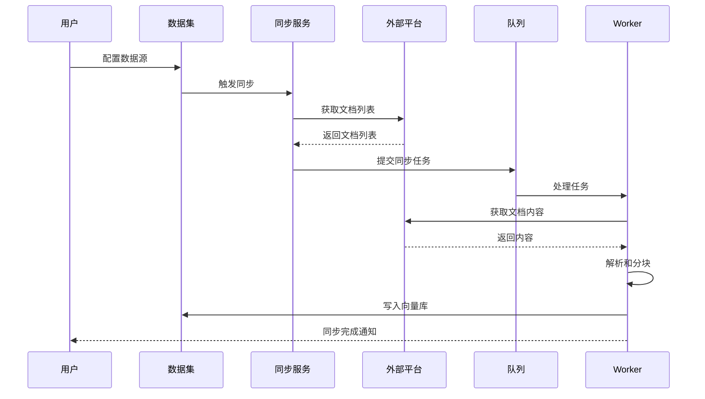

# 知识库外部数据源集成

FastGPT 支持从多个第三方平台同步数据到知识库。

## 一、支持的知识库平台

| 平台 | 状态 | 同步方式 |
|------|------|---------|
| **飞书云文档** | ✅ | API 同步 |
| **语雀** | ✅ | API 同步 |
| **自定义 API** | ✅ | HTTP API |
| **网页爬取** | ✅ | Web Crawler |

## 二、飞书云文档集成

详见 [04-消息平台集成.md](./04-消息平台集成.md#二飞书集成)

### 2.1 核心功能

- 自动同步飞书文档
- 支持文件夹结构
- 增量更新
- 权限继承

### 2.2 数据集类型

```typescript
export enum DatasetTypeEnum {
  feishu = 'feishu'
}
```

## 三、语雀集成

详见 [05-文档处理集成.md](./05-文档处理集成.md#四语雀集成)

### 3.1 核心功能

- 同步语雀知识库
- 支持文档树结构
- Markdown 格式
- 定时同步

### 3.2 数据集类型

```typescript
export enum DatasetTypeEnum {
  yuque = 'yuque'
}
```

## 四、自定义 API 数据集

### 4.1 API 数据集接口

```typescript
// packages/service/core/dataset/apiDataset/custom/api.ts
export const useApiDatasetRequest = ({ apiServer }: { apiServer: ApiServer }) => {
  const instance = axios.create({
    baseURL: apiServer.baseUrl,
    headers: {
      'Authorization': apiServer.authorization
    }
  });
  
  return {
    // 获取文档列表
    async getDocuments() {
      return await instance.get('/documents');
    },
    
    // 获取文档内容
    async getDocument(id: string) {
      return await instance.get(`/documents/${id}`);
    },
    
    // 搜索文档
    async searchDocuments(query: string) {
      return await instance.post('/search', { query });
    }
  };
};
```

### 4.2 API 数据集配置

```typescript
// Dataset Schema
{
  apiServer: {
    baseUrl: string;      // API 基础 URL
    authorization: string; // 认证信息
    // 其他自定义配置
  }
}
```

### 4.3 数据集类型

```typescript
export enum DatasetTypeEnum {
  apiDataset = 'apiDataset'
}
```

## 五、网页爬取

### 5.1 插件支持

```
plugins/
└── webcrawler/         # 网页爬取插件
    ├── Dockerfile
    ├── requirements.txt
    └── app.py
```

### 5.2 爬取配置

```typescript
{
  "url": "https://docs.example.com",
  "maxDepth": 3,              // 最大爬取深度
  "selector": ".content",      // CSS 选择器
  "excludePatterns": [         // 排除规则
    "/api/",
    "/admin/"
  ]
}
```

### 5.3 数据集类型

```typescript
export enum DatasetTypeEnum {
  websiteSync = 'websiteSync'
}
```

### 5.4 队列任务

```typescript
// packages/service/common/bullmq/index.ts
export enum QueueNames {
  websiteSync = 'websiteSync'  // 网站同步队列
}
```

## 六、外部文件数据集

### 6.1 数据集类型

```typescript
export enum DatasetTypeEnum {
  folder = 'folder',           // 文件夹数据集
  externalFile = 'externalFile' // 外部文件数据集
}
```

### 6.2 支持的文件类型

- **文档**：PDF、Word、Excel、PPT
- **文本**：TXT、Markdown、JSON、CSV
- **网页**：HTML
- **其他**：通过插件扩展

## 七、数据同步架构

### 7.1 同步流程



### 7.2 增量同步

```typescript
// 检查文档更新
export const checkDocumentUpdate = async ({
  datasetId,
  externalId,
  lastModified
}: {
  datasetId: string;
  externalId: string;
  lastModified: Date;
}): Promise<boolean> => {
  const doc = await MongoDatasetData.findOne({
    datasetId,
    'external.id': externalId
  });
  
  if (!doc) return true;  // 新文档
  
  return new Date(doc.external.lastModified) < lastModified;
};
```

## 八、API 数据集统一接口

### 8.1 接口选择（`packages/service/core/dataset/apiDataset/index.ts`）

```typescript
export const getApiDatasetRequest = async (
  apiDatasetServer?: ApiDatasetServerType
) => {
  const { apiServer, yuqueServer, feishuServer } = apiDatasetServer || {};
  
  // 飞书
  if (feishuServer) {
    return useFeishuDatasetRequest({ feishuServer });
  }
  
  // 语雀
  if (yuqueServer) {
    return useYuqueDatasetRequest({ yuqueServer });
  }
  
  // 自定义 API
  if (apiServer) {
    return useApiDatasetRequest({ apiServer });
  }
  
  return Promise.reject('Can not find api dataset server');
};
```

### 8.2 统一数据结构

```typescript
export type ApiDatasetDocument = {
  id: string;
  title: string;
  content: string;
  metadata?: {
    author?: string;
    createdAt?: Date;
    updatedAt?: Date;
    tags?: string[];
  };
};
```

## 九、配置示例

### 9.1 飞书数据集

```json
{
  "type": "feishu",
  "feishuServer": {
    "appId": "cli_xxx",
    "appSecret": "xxx",
    "folderToken": "folder_token_xxx"
  }
}
```

### 9.2 语雀数据集

```json
{
  "type": "yuque",
  "yuqueServer": {
    "token": "yuque_token_xxx",
    "repoId": "repo_id"
  }
}
```

### 9.3 自定义 API 数据集

```json
{
  "type": "apiDataset",
  "apiServer": {
    "baseUrl": "https://api.example.com",
    "authorization": "Bearer api_key_xxx"
  }
}
```

### 9.4 网页爬取数据集

```json
{
  "type": "websiteSync",
  "config": {
    "url": "https://docs.example.com",
    "maxDepth": 3,
    "selector": ".content"
  }
}
```

## 十、审计与日志

### 10.1 数据集类型审计（`packages/service/support/user/audit/util.ts`）

```typescript
export const getDatasetTypeText = (type: DatasetTypeEnum): string => {
  if (type === DatasetTypeEnum.folder) 
    return i18nT('account_team:dataset.folder');
  if (type === DatasetTypeEnum.externalFile) 
    return i18nT('account_team:dataset.external_file');
  if (type === DatasetTypeEnum.apiDataset) 
    return i18nT('account_team:dataset.api_file');
  if (type === DatasetTypeEnum.feishu) 
    return i18nT('account_team:dataset.feishu_dataset');
  if (type === DatasetTypeEnum.yuque) 
    return i18nT('account_team:dataset.yuque_dataset');
  
  return i18nT('common:UnKnow');
};
```

## 十一、最佳实践

1. **同步策略**
   - 首次全量同步
   - 后续增量同步
   - 定时自动同步

2. **性能优化**
   - 批量处理文档
   - 异步队列处理
   - 限流避免频繁请求

3. **错误处理**
   - 记录同步失败的文档
   - 支持手动重试
   - 告警通知

4. **权限管理**
   - 继承源平台权限
   - 支持访问控制
   - 敏感信息过滤

5. **数据清理**
   - 定期清理已删除文档
   - 更新过期内容
   - 去重处理

## 十二、相关文件清单

### API 数据集
- `packages/service/core/dataset/apiDataset/index.ts` - 统一接口
- `packages/service/core/dataset/apiDataset/custom/api.ts` - 自定义 API
- `packages/service/core/dataset/apiDataset/yuqueDataset/api.ts` - 语雀集成
- `packages/service/core/dataset/apiDataset/feishuDataset/api.ts` - 飞书集成

### Schema
- `packages/service/core/dataset/schema.ts` - 数据集 Schema

### 队列
- `packages/service/common/bullmq/index.ts` - 同步队列

### 审计
- `packages/service/support/user/audit/util.ts` - 审计工具
