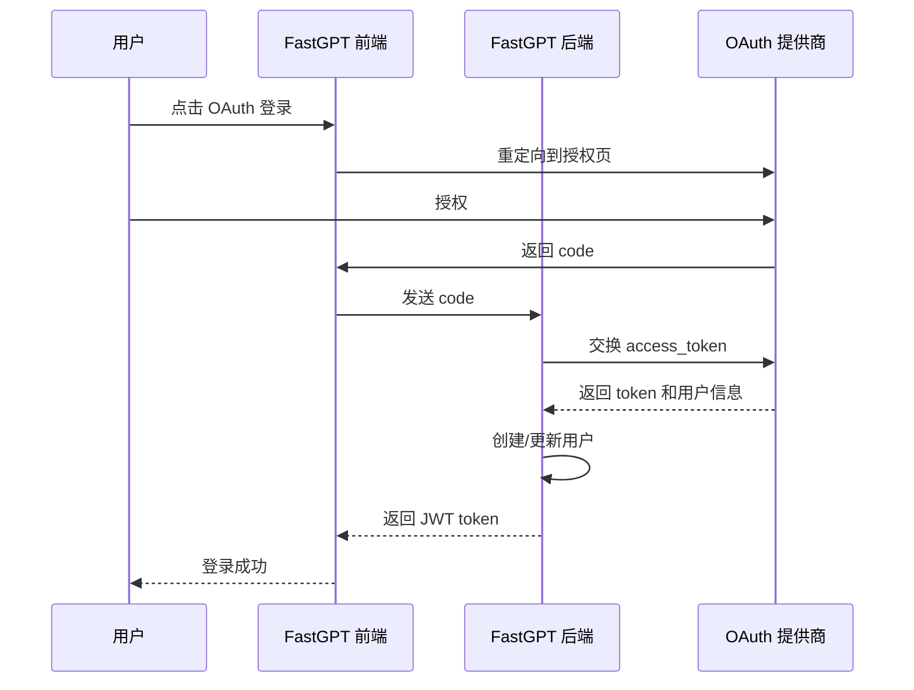
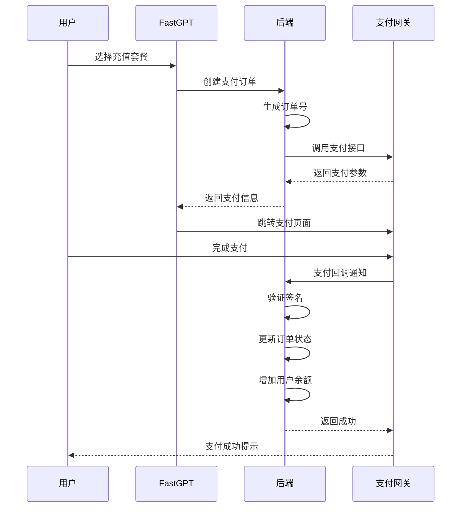

# 认证与支付集成

FastGPT 支持多种第三方认证和支付服务。

## 一、OAuth 认证集成

### 1.1 支持的 OAuth 提供商

| 提供商 | 状态 | 配置字段 |
|--------|------|---------|
| **GitHub** | ✅ | `oauth.github` |
| **Google** | ✅ | `oauth.google` |
| **微信** | ✅ | `oauth.wechat` |
| **Microsoft** | ✅ | `oauth.microsoft` |

### 1.2 配置结构（`packages/global/common/system/types/index.d.ts`）

```typescript
export type FastGPTFeConfigsType = {
  oauth?: {
    github?: string;         // GitHub Client ID
    google?: string;         // Google Client ID
    wechat?: string;         // 微信 App ID
    microsoft?: {
      clientId?: string;     // Microsoft Client ID
      tenantId?: string;     // Microsoft Tenant ID
      customButton?: string; // 自定义按钮文本
    };
  };
};
```

### 1.3 配置示例

```json
{
  "feConfigs": {
    "oauth": {
      "github": "github_client_id",
      "google": "google_client_id",
      "wechat": "wechat_app_id",
      "microsoft": {
        "clientId": "microsoft_client_id",
        "tenantId": "microsoft_tenant_id",
        "customButton": "使用企业账号登录"
      }
    }
  }
}
```

### 1.4 OAuth 流程



### 1.5 GitHub OAuth 示例

```typescript
// 前端：跳转到 GitHub 授权页
const handleGithubLogin = () => {
  const clientId = feConfigs.oauth.github;
  const redirectUri = `${window.location.origin}/api/oauth/github/callback`;
  const state = generateRandomState();
  
  window.location.href = 
    `https://github.com/login/oauth/authorize?client_id=${clientId}&redirect_uri=${redirectUri}&state=${state}`;
};

// 后端：处理回调
export const githubOAuthCallback = async (code: string) => {
  // 交换 access token
  const tokenResponse = await axios.post(
    'https://github.com/login/oauth/access_token',
    {
      client_id: process.env.GITHUB_CLIENT_ID,
      client_secret: process.env.GITHUB_CLIENT_SECRET,
      code: code
    }
  );
  
  const accessToken = tokenResponse.data.access_token;
  
  // 获取用户信息
  const userResponse = await axios.get('https://api.github.com/user', {
    headers: { 'Authorization': `Bearer ${accessToken}` }
  });
  
  const githubUser = userResponse.data;
  
  // 创建或更新用户
  let user = await MongoUser.findOne({ 'oauth.githubId': githubUser.id });
  
  if (!user) {
    user = await MongoUser.create({
      username: githubUser.login,
      email: githubUser.email,
      avatar: githubUser.avatar_url,
      oauth: {
        githubId: githubUser.id
      }
    });
  }
  
  // 生成 JWT
  const token = generateJWT({ userId: user._id });
  
  return { token, user };
};
```

## 二、SSO 单点登录

### 2.1 SSO 配置

```typescript
export type FastGPTFeConfigsType = {
  sso?: {
    icon?: string;       // 登录按钮图标
    title?: string;      // 登录按钮文本
    url?: string;        // SSO 服务地址
    autoLogin?: boolean; // 自动跳转登录
  };
};
```

### 2.2 配置示例

```json
{
  "feConfigs": {
    "sso": {
      "icon": "https://example.com/sso-icon.png",
      "title": "企业统一登录",
      "url": "https://sso.example.com/login",
      "autoLogin": true
    }
  }
}
```

### 2.3 SSO 集成方式

- **SAML 2.0**: 企业级标准协议
- **OIDC**: 基于 OAuth 2.0
- **CAS**: 中央认证服务
- **自定义**: 对接企业内部系统

## 三、用户注册方式

### 3.1 注册方法配置

```typescript
export type FastGPTFeConfigsType = {
  register_method?: ['email' | 'phone' | 'sync'];  // 注册方式
  login_method?: ['email' | 'phone'];             // 登录方式
  find_password_method?: ['email' | 'phone'];     // 找回密码方式
  bind_notification_method?: ['email' | 'phone']; // 绑定通知方式
};
```

### 3.2 配置示例

```json
{
  "feConfigs": {
    "register_method": ["email", "phone"],
    "login_method": ["email", "phone"],
    "find_password_method": ["email"],
    "bind_notification_method": ["email", "phone"]
  }
}
```

### 3.3 注册方式说明

| 方式 | 说明 |
|------|------|
| `email` | 邮箱注册，需要邮件服务 |
| `phone` | 手机号注册，需要短信服务 |
| `sync` | 同步注册，从外部系统同步用户 |

## 四、支付集成

### 4.1 支付配置

```typescript
export type FastGPTFeConfigsType = {
  show_pay?: boolean;  // 是否显示支付功能
  payConfig?: {
    wx?: boolean;      // 微信支付
    alipay?: boolean;  // 支付宝
    bank?: boolean;    // 银行转账
  };
};
```

### 4.2 配置示例

```json
{
  "feConfigs": {
    "show_pay": true,
    "payConfig": {
      "wx": true,
      "alipay": true,
      "bank": false
    }
  }
}
```

### 4.3 支付流程



### 4.4 微信支付集成

```typescript
// 创建微信支付订单
export const createWxPayOrder = async ({
  userId,
  amount,
  description
}: {
  userId: string;
  amount: number;
  description: string;
}) => {
  const orderId = generateOrderId();
  
  // 创建订单记录
  await MongoOrder.create({
    orderId,
    userId,
    amount,
    status: 'pending',
    paymentMethod: 'wechat'
  });
  
  // 调用微信支付 API
  const wxPayParams = await axios.post(
    'https://api.mch.weixin.qq.com/v3/pay/transactions/native',
    {
      appid: process.env.WX_APP_ID,
      mchid: process.env.WX_MCH_ID,
      description: description,
      out_trade_no: orderId,
      notify_url: `${process.env.API_URL}/api/payment/wechat/callback`,
      amount: {
        total: amount,
        currency: 'CNY'
      }
    },
    {
      headers: {
        'Authorization': generateWxPaySignature()
      }
    }
  );
  
  return {
    orderId,
    qrCodeUrl: wxPayParams.data.code_url  // 支付二维码
  };
};

// 处理微信支付回调
export const handleWxPayCallback = async (data: any) => {
  // 验证签名
  const isValid = verifyWxPaySignature(data);
  if (!isValid) {
    throw new Error('Invalid signature');
  }
  
  const orderId = data.out_trade_no;
  const transactionId = data.transaction_id;
  
  // 更新订单状态
  const order = await MongoOrder.findOneAndUpdate(
    { orderId, status: 'pending' },
    {
      status: 'paid',
      transactionId,
      paidAt: new Date()
    }
  );
  
  if (order) {
    // 增加用户余额
    await MongoUser.findByIdAndUpdate(
      order.userId,
      { $inc: { balance: order.amount } }
    );
    
    // 记录使用日志
    await MongoUsage.create({
      userId: order.userId,
      type: 'recharge',
      amount: order.amount,
      orderId: orderId
    });
  }
  
  return { success: true };
};
```

## 五、计费系统

### 5.1 订阅计划

```typescript
export type SubPlanType = {
  id: string;
  name: string;
  price: number;
  duration: number;       // 天数
  features: {
    maxApps?: number;     // 最大应用数
    maxDatasets?: number; // 最大数据集数
    maxTokens?: number;   // 月度 Token 配额
  };
};
```

### 5.2 使用统计

```typescript
// 记录 API 调用
export const recordApiUsage = async ({
  teamId,
  appId,
  tokens,
  cost
}: {
  teamId: string;
  appId: string;
  tokens: number;
  cost: number;
}) => {
  await MongoUsage.create({
    teamId,
    appId,
    type: 'api_call',
    tokens,
    cost,
    createdAt: new Date()
  });
  
  // 扣减余额
  await MongoTeam.findByIdAndUpdate(
    teamId,
    { $inc: { balance: -cost } }
  );
};
```

## 六、优惠券系统

### 6.1 优惠券配置

```typescript
export type FastGPTFeConfigsType = {
  show_coupon?: boolean;          // 显示优惠券
  show_discount_coupon?: boolean; // 显示折扣券
};
```

### 6.2 优惠券类型

- **金额券**: 直接抵扣金额
- **折扣券**: 按比例折扣
- **赠送券**: 赠送 Token 额度

## 七、Google reCAPTCHA

### 7.1 配置

```typescript
export type FastGPTFeConfigsType = {
  googleClientVerKey?: string;  // Google reCAPTCHA Site Key
};
```

### 7.2 用途

- 防止机器人注册
- 保护登录接口
- 防止暴力破解

## 八、最佳实践

### 8.1 认证安全

1. **密码安全**
   - 使用 bcrypt 加密
   - 密码强度验证
   - 定期提醒修改密码

2. **Token 管理**
   - JWT 有效期设置
   - Refresh Token 机制
   - Token 黑名单

3. **多因素认证**
   - 邮箱验证
   - 手机验证
   - TOTP 二次验证

### 8.2 支付安全

1. **订单安全**
   - 订单号唯一性
   - 防止重复支付
   - 超时订单取消

2. **回调验证**
   - 签名验证
   - IP 白名单
   - 幂等性处理

3. **金额安全**
   - 金额校验
   - 精度处理
   - 审计日志

### 8.3 隐私保护

1. **数据脱敏**
   - 手机号脱敏
   - 邮箱脱敏
   - 支付信息加密

2. **访问控制**
   - 权限管理
   - 数据隔离
   - 审计日志

## 九、相关文件清单

### 认证
- `packages/global/common/system/types/index.d.ts` - 认证配置定义
- `packages/service/support/user/auth/` - 认证服务实现

### 支付
- `packages/service/support/wallet/` - 钱包和支付
- `packages/service/support/wallet/sub/` - 订阅管理
- `packages/service/support/wallet/usage/` - 使用统计

### OAuth
- `packages/service/support/user/oauth/` - OAuth 集成

### Schema
- `packages/service/support/user/schema.ts` - 用户 Schema
- `packages/service/support/user/team/teamSchema.ts` - 团队 Schema
