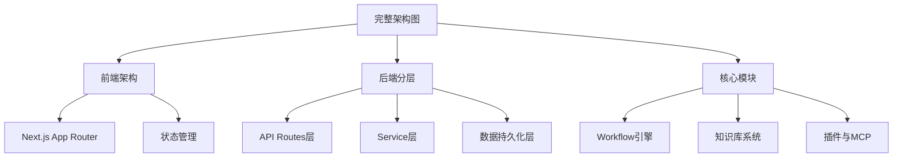
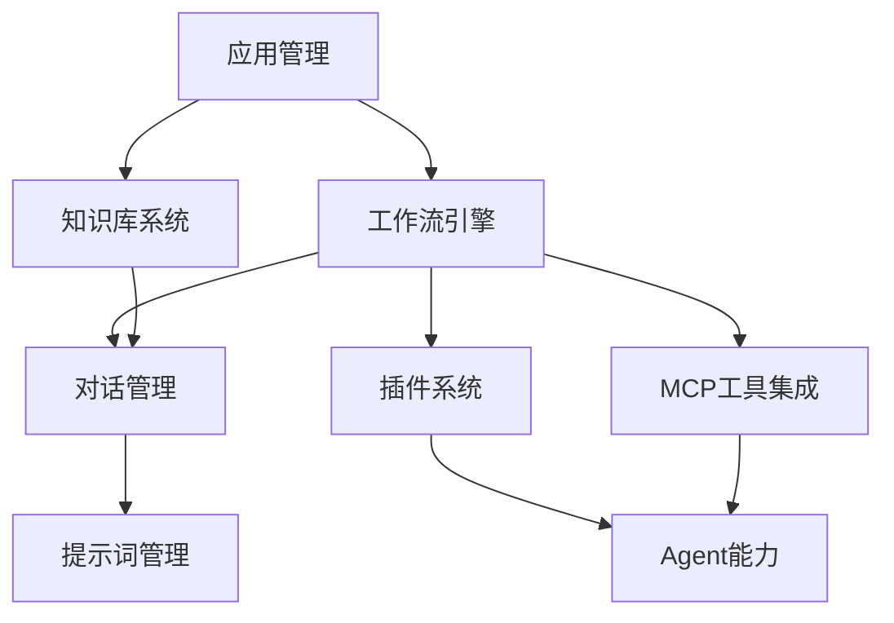
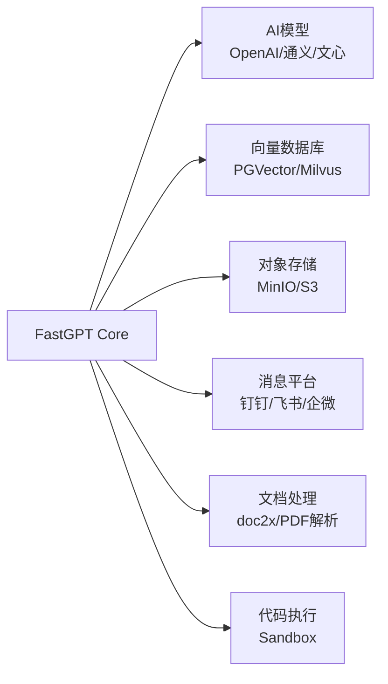

# 🗺️ FastGPT 学习地图

> **从入门到精通：FastGPT 架构的完整学习路径**  
> 适合架构师、开发者、AI 工程师系统性学习 FastGPT


---

## 📖 如何使用这份学习地图

本学习地图基于 **认知难度递进** 和 **实战应用场景** 设计，分为 5 个阶段：


**预计学习时间**：
- **速成路径**（核心能力）：3-5 天
- **深度路径**（架构设计）：2-3 周
- **专家路径**（源码级）：1-2 个月

---

## 🌱 阶段1：快速入门（1-2天）

**学习目标**：了解 FastGPT 是什么、能做什么、如何快速上手

### 📚 必读文档

| 序号 | 文档 | 核心收获 | 阅读时间 |
|------|------|---------|---------|
| 1.1 | [01-overview/project-overview.md](./01-overview/project-overview.md) | 项目定位、技术栈、代码结构 | 25 分钟 |
| 1.2 | [官方 README](../README.md) | 快速部署与体验 | 15 分钟 |
| 1.3 | [dev.md](../dev.md) | 开发环境配置 | 15 分钟 |

### 🎯 实践任务

- [ ] **任务 1.1**：使用 Docker Compose 部署 FastGPT 本地环境
- [ ] **任务 1.2**：创建第一个应用并配置知识库
- [ ] **任务 1.3**：使用可视化编排创建简单工作流（LLM 问答）
- [ ] **任务 1.4**：尝试创建一个简单的 Agent 应用
- [ ] **任务 1.5**：配置一个 HTTP 插件或 MCP 工具

### ✅ 通关标准

- [ ] 能够独立部署 FastGPT 并访问前端界面
- [ ] 理解 FastGPT 的 5 大核心能力（工作流编排、知识库、Agent、插件系统、MCP 工具）
- [ ] 知道 FastGPT 的技术栈（前端 Next.js、数据库 MongoDB + 向量库、pnpm workspaces）

---

## 🏗️ 阶段2：架构理解（3-5天）

**学习目标**：掌握 FastGPT 的系统架构、分层设计、组件关系

### 🖥️ 架构图学习路径



### 📚 必读文档

| 序号 | 文档 | 核心收获 | 阅读时间 |
|------|------|---------|---------|
| 2.1 | [02-architecture/system-architecture.md](./02-architecture/system-architecture.md) | 完整系统架构与组件关系 | 40 分钟 |
| 2.2 | [02-architecture/system-componet-architecture.puml](./02-architecture/system-componet-architecture.puml) | 架构图源码（可编辑） | 20 分钟 |
| 2.3 | [03-layers/01-frontend-layer.md](./03-layers/01-frontend-layer.md) | 前端架构设计 | 25 分钟 |
| 2.4 | [03-layers/02-api-routes-layer.md](./03-layers/02-api-routes-layer.md) | API Routes 设计 | 20 分钟 |
| 2.5 | [03-layers/03-service-layer.md](./03-layers/03-service-layer.md) | Service 层设计 | 30 分钟 |
| 2.6 | [04-core-modules/README.md](./04-core-modules/README.md) | 核心模块总览 | 20 分钟 |

### 🎨 关键架构图

**必看架构图**（按优先级）：
1. ⭐ [system-componet-architecture.puml](./02-architecture/system-componet-architecture.puml) - FastGPT 完整架构图
2. [data-architecture.puml](./05-data-architecture/data-architecture.puml) - 数据架构设计
3. [data-flow.puml](./05-data-architecture/data-flow.puml) - 数据流转图

### 🎯 实践任务

- [ ] **任务 2.1**：绘制自己对 FastGPT 架构的理解（用 PlantUML 或手绘）
- [ ] **任务 2.2**：阅读 `projects/app/src/pages/api/core/app/create.ts`，理解 API Routes 如何调用 Service 层
- [ ] **任务 2.3**：理解分层设计：API Routes → Service → MongoDB/VectorDB
- [ ] **任务 2.4**：找到 3 个核心模块的入口代码（Workflow、知识库、插件）
- [ ] **任务 2.5**：了解 pnpm workspaces 如何管理多包项目（packages/global、packages/service、packages/web）

### ✅ 通关标准

- [ ] 能够画出 FastGPT 的三层架构（Frontend、API Routes、Service + Data）
- [ ] 理解 Monorepo 架构的好处（解耦、可测试、易扩展）
- [ ] 知道 7 大核心模块的职责与关系（App、Chat、Dataset、Workflow、Plugin、AI、Support）

---

## ⚙️ 阶段3：核心模块深度（7-10天）

**学习目标**：深入理解 FastGPT 的核心模块的设计与实现

### 📊 模块学习顺序（推荐）

按照 **依赖关系** 和 **复杂度** 设计学习路径：



### 📚 分模块学习路径

#### 🔧 3.1 应用管理（App Management）⭐ 基础模块

**为什么先学**：所有模块都依赖应用的配置与管理

| 文档 | 核心收获 | 难度 |
|------|---------|------|
| [app-management/README.md](./04-core-modules/app-management/) | 应用创建、版本管理、配置 | ⭐ |
| 源码：`packages/service/core/app/` | 应用模型与版本控制 | ⭐⭐ |

**实践任务**：
- [ ] 理解应用的生命周期（创建→编辑→发布→版本管理）
- [ ] 阅读 `packages/service/core/app/version/controller.ts`
- [ ] 尝试通过 API 创建并发布一个应用版本

---

#### 🔧 3.2 工作流引擎（Workflow Engine）⭐⭐⭐ 核心模块

**为什么重要**：FastGPT 最强大的能力，理解它就理解了 FastGPT 的设计思想

| 文档 | 核心收获 | 阅读时间 |
|------|---------|---------|
| [workflow/README.md](./04-core-modules/workflow/) | 工作流系统架构与执行流程 | 45 分钟 |
| [03-layers/07-workflow-engine.md](./03-layers/07-workflow-engine.md) | 工作流引擎详细设计 | 35 分钟 |
| 源码：`packages/service/core/workflow/dispatch/` | 节点调度与执行引擎 | 60 分钟 |

**关键代码**：
- `packages/service/core/workflow/dispatch/index.ts` - 工作流调度入口
- `packages/service/core/workflow/dispatch/tools/` - 工具节点实现
- `packages/service/core/workflow/template/system/` - 系统节点模板

**实践任务**：
- [ ] 理解工作流的节点调度机制
- [ ] 阅读 `packages/service/core/workflow/dispatch/chat/oneapi.ts`（LLM 节点实现）
- [ ] 创建一个自定义节点（例如：调用第三方 API）
- [ ] 理解工作流的状态管理（运行中、暂停、完成、失败）
- [ ] 分析变量传递机制（全局变量、节点输出、边缘过滤）

---

#### 🔧 3.3 知识库系统（Knowledge Base）⭐⭐⭐ 核心模块

**为什么重要**：理解 RAG 的工程化实现

| 文档 | 核心收获 | 阅读时间 |
|------|---------|---------|
| [knowledge-base/README.md](./04-core-modules/knowledge-base/) | 知识库架构与检索策略 | 40 分钟 |
| [05-data-architecture/vector-search-flow.puml](./05-data-architecture/vector-search-flow.puml) | 向量检索流程图 | 20 分钟 |
| 源码：`packages/service/core/dataset/` | 数据集、文档、数据块管理 | 50 分钟 |

**关键代码**：
- `packages/service/core/dataset/search/controller.ts` - 向量搜索入口
- `packages/service/common/vectorDB/` - 向量数据库抽象层
- `packages/service/core/dataset/training/` - 文档训练与分块

**实践任务**：
- [ ] 理解向量化流程（文档上传→分块→embedding→存储）
- [ ] 阅读向量搜索实现（similarity search + rerank）
- [ ] 尝试切换不同的向量数据库（PGVector ↔ Milvus）
- [ ] 理解训练队列（BullMQ）的使用
- [ ] 分析不同的分块策略（按段落、按 token、按语义）

---

#### 🔧 3.4 对话管理（Chat Management）⭐⭐ 核心模块

**为什么重要**：串联工作流、知识库、用户交互的桥梁

| 文档 | 核心收获 | 阅读时间 |
|------|---------|---------|
| [chat-management/README.md](./04-core-modules/chat-management/) | 对话记录、引用、反馈 | 30 分钟 |
| 源码：`packages/service/core/chat/` | 对话历史、输入引导 | 40 分钟 |

**实践任务**：
- [ ] 理解对话的完整生命周期（输入→工作流执行→知识库检索→LLM 调用→结果返回）
- [ ] 阅读 `packages/service/core/chat/chatHistory.ts`
- [ ] 理解引用机制（引用来源：知识库、工具、外部搜索）
- [ ] 分析对话反馈系统（点赞/点踩、用户标注）

---

#### 🔧 3.5 插件系统（Plugin System）⭐⭐ 核心模块

**为什么重要**：扩展 FastGPT 能力的关键

| 文档 | 核心收获 | 阅读时间 |
|------|---------|---------|
| [plugin-system/README.md](./04-core-modules/plugin-system/) | 插件架构与开发规范 | 35 分钟 |
| [plugins/README.md](../plugins/README.md) | 插件示例与开发指南 | 25 分钟 |
| 源码：`packages/service/core/plugin/` | 插件解析与调用 | 45 分钟 |

**实践任务**：
- [ ] 理解插件的结构（元数据、工具定义、执行逻辑）
- [ ] 阅读一个插件示例（如 `plugins/webcrawler`）
- [ ] 创建一个自定义插件（例如：天气查询插件）
- [ ] 理解插件的安全机制（沙箱、权限控制）

---

#### 🔧 3.6 MCP 工具与插件集成（MCP Tools）⭐⭐ 新特性

**为什么重要**：了解最新的 Model Context Protocol 集成

| 文档 | 核心收获 | 阅读时间 |
|------|---------|---------|
| [mcp-tools-plugins/README.md](./04-core-modules/mcp-tools-plugins/) | MCP 协议与工具集成 | 30 分钟 |
| 源码：`projects/mcp_server/` | MCP 服务端实现 | 40 分钟 |

**实践任务**：
- [ ] 理解 MCP 协议的核心概念（Tools、Resources、Prompts）
- [ ] 配置并测试一个 MCP 工具（如文件系统工具）
- [ ] 理解 MCP 与插件系统的区别
- [ ] 尝试创建一个自定义 MCP 服务端

---

#### 🔧 3.7 Agent 能力（Agent Capability）⭐⭐⭐ 高级模块

**为什么重要**：理解 AI Agent 的工程化实现

| 文档 | 核心收获 | 阅读时间 |
|------|---------|---------|
| [agent/README.md](./04-core-modules/agent/) | Agent 策略与执行流程 | 40 分钟 |
| 源码：`packages/service/core/workflow/dispatch/agent/` | Agent 节点调度 | 50 分钟 |

**实践任务**：
- [ ] 理解 Agent 的运行模式（ReAct、Function Calling）
- [ ] 阅读 Agent 节点的实现（工具选择、执行、反馈循环）
- [ ] 创建一个多工具协作的 Agent 应用
- [ ] 理解 Agent 的错误处理与重试机制

---

#### 🔧 3.8 提示词管理（Prompt Management）⭐ 辅助模块

**为什么学**：优化 LLM 输出质量

| 文档 | 核心收获 | 阅读时间 |
|------|---------|---------|
| [prompt-management/README.md](./04-core-modules/prompt-management/) | 提示词模板与优化 | 25 分钟 |
| 源码：`packages/service/core/ai/prompt/` | 提示词生成与管理 | 30 分钟 |

**实践任务**：
- [ ] 理解提示词模板系统（变量注入、上下文拼接）
- [ ] 分析多轮对话的上下文管理策略
- [ ] 尝试优化一个提示词模板以提升输出质量

---

### ✅ 通关标准（阶段3）

- [ ] 能够独立阅读并理解任意一个核心模块的源码
- [ ] 理解工作流引擎的节点调度机制
- [ ] 掌握知识库的向量检索流程
- [ ] 能够开发一个自定义插件或 MCP 工具
- [ ] 理解 Agent 的执行策略

---

## 🔌 阶段4：集成扩展（3-5天）

**学习目标**：掌握 FastGPT 与外部服务的集成方式

### 📚 必读文档

| 序号 | 文档 | 核心收获 | 阅读时间 |
|------|------|---------|---------|
| 4.1 | [06-ThirdParty/01-大语言模型集成.md](./06-ThirdParty/01-大语言模型集成.md) | 多模型接入 | 30 分钟 |
| 4.2 | [06-ThirdParty/02-向量数据库集成.md](./06-ThirdParty/02-向量数据库集成.md) | 向量库选型与配置 | 25 分钟 |
| 4.3 | [06-ThirdParty/03-对象存储集成.md](./06-ThirdParty/03-对象存储集成.md) | MinIO/S3 配置 | 20 分钟 |
| 4.4 | [06-ThirdParty/04-消息平台集成.md](./06-ThirdParty/04-消息平台集成.md) | 钉钉、飞书、企微集成 | 30 分钟 |
| 4.5 | [06-ThirdParty/09-知识库集成.md](./06-ThirdParty/09-知识库集成.md) | 外部知识库接入 | 25 分钟 |

### 🔧 集成方式学习路径



### 🎯 实践任务

- [ ] **任务 4.1**：配置多个 LLM 模型（OpenAI + 本地模型）
- [ ] **任务 4.2**：切换向量数据库（从 PGVector 切换到 Milvus）
- [ ] **任务 4.3**：配置对象存储（MinIO 或 云服务商）
- [ ] **任务 4.4**：集成钉钉或飞书机器人
- [ ] **任务 4.5**：使用 doc2x 处理复杂文档（PDF、Word）
- [ ] **任务 4.6**：配置代码执行沙箱（Sandbox）

### ✅ 通关标准

- [ ] 能够配置多种 AI 模型并理解适配器模式
- [ ] 理解向量数据库的选型标准（性能、成本、功能）
- [ ] 能够独立集成一个外部服务（如消息平台）
- [ ] 理解 FastGPT 的可扩展性设计

---

## 🚀 阶段5：生产实战（持续）

**学习目标**：掌握生产环境部署、性能优化、故障排查

### 📚 必读文档

| 序号 | 文档 | 核心收获 | 难度 |
|------|------|---------|------|
| 5.1 | [deploy/README.md](../deploy/README.md) | 部署方式（Docker/Helm） | ⭐⭐ |
| 5.2 | `dev.md` 生产配置部分 | 环境变量与配置优化 | ⭐⭐ |
| 5.3 | [05-data-architecture/](./05-data-architecture/) | 数据库设计与优化 | ⭐⭐⭐ |

### 🎯 实践任务

- [ ] **任务 5.1**：部署 FastGPT 到云服务器（阿里云/AWS）
- [ ] **任务 5.2**：配置 HTTPS 与域名
- [ ] **任务 5.3**：配置 Nginx 反向代理与负载均衡
- [ ] **任务 5.4**：性能压测（压测工具：k6、JMeter）
- [ ] **任务 5.5**：监控 FastGPT 的性能指标（CPU、内存、响应时间）
- [ ] **任务 5.6**：数据库优化（MongoDB 索引、向量库调优）
- [ ] **任务 5.7**：配置日志收集与分析（基于 pino/winston）
- [ ] **任务 5.8**：配置任务队列监控（BullMQ Dashboard）

### ✅ 通关标准

- [ ] 能够独立部署 FastGPT 到生产环境
- [ ] 知道如何排查性能问题
- [ ] 理解 FastGPT 的扩展性设计（水平扩展）
- [ ] 掌握数据库优化技巧

---

## 🎓 学习路径推荐（按角色）

### 👨‍💼 架构师路径

**目标**：理解 FastGPT 的架构设计与技术选型

```
阶段1 → 阶段2 → 阶段3（核心模块总览）→ 阶段4 → 阶段5（重点：扩展性与性能）
```

**关键文档**：
- 02-architecture（架构设计）
- 04-core-modules（模块设计）
- 05-data-architecture（数据库设计）

---

### 👨‍💻 开发者路径

**目标**：基于 FastGPT 进行二次开发或贡献代码

```
阶段1 → 阶段2 → 阶段3（深度学习 Workflow & Plugin）→ 阶段4（集成开发）
```

**关键文档**：
- 04-core-modules/workflow（工作流开发）
- 04-core-modules/plugin-system（插件开发）
- 04-core-modules/mcp-tools-plugins（MCP 工具开发）
- dev.md（开发规范）

---

### 🤖 AI 工程师路径

**目标**：理解 AI 应用的工程化最佳实践

```
阶段1 → 阶段3.2（Workflow）→ 阶段3.3（Knowledge Base）→ 阶段3.7（Agent）→ 阶段4.1（LLM 集成）
```

**关键文档**：
- 04-core-modules/workflow（AI 工作流）
- 04-core-modules/knowledge-base（RAG 实现）
- 04-core-modules/agent（Agent 策略）
- 06-third-party/01-大语言模型集成.md

---

### 🎓 学生/初学者路径

**目标**：快速上手并理解 FastGPT 的核心能力

```
阶段1 → 阶段2（重点：架构图）→ 阶段3（选择 1-2 个感兴趣的模块）
```

**关键文档**：
- 01-overview（项目概述）
- 02-architecture（架构图）
- 04-core-modules/workflow（工作流）

---

## 📊 学习进度追踪

### 📈 完成度自测表

| 阶段 | 预计时间 | 完成度 | 通关日期 |
|------|---------|--------|---------|
| 🌱 阶段1：快速入门 | 1-2天 | ☐ | - |
| 🏗️ 阶段2：架构理解 | 3-5天 | ☐ | - |
| ⚙️ 阶段3：核心模块 | 7-10天 | ☐ | - |
| 🔌 阶段4：集成扩展 | 3-5天 | ☐ | - |
| 🚀 阶段5：生产实战 | 持续 | ☐ | - |

### 🏅 技能徽章系统

完成特定学习目标后，可以解锁对应徽章：

- 🏆 **FastGPT 入门者**：完成阶段1
- 🏆 **架构理解者**：完成阶段2
- 🏆 **工作流大师**：深度掌握 Workflow 模块
- 🏆 **知识库专家**：深度掌握 Knowledge Base 模块
- 🏆 **插件开发者**：开发并集成一个自定义插件
- 🏆 **MCP 工程师**：掌握 MCP 工具集成
- 🏆 **Agent 专家**：深度掌握 Agent 模块
- 🏆 **集成专家**：完成阶段4
- 🏆 **生产实战者**：完成阶段5
- 🏆 **FastGPT 贡献者**：向 FastGPT 贡献代码并被合并

---

## 🛠️ 学习工具推荐

### 📖 文档阅读

- **PlantUML 预览**：VS Code 插件 `PlantUML`
- **Markdown 预览**：VS Code 插件 `Markdown Preview Enhanced`
- **架构图绘制**：draw.io、Excalidraw

### 🔍 代码阅读

- **IDE**：VS Code + TypeScript 插件
- **代码导航**：VS Code 内置 Go to Definition
- **AI 辅助**：GitHub Copilot、Cursor

### 🧪 实验环境

- **本地部署**：Docker Desktop
- **云服务器**：阿里云、AWS、Azure
- **数据库工具**：MongoDB Compass（MongoDB）、pgAdmin（PostgreSQL）、RedisInsight（Redis）

---

## 📎 补充资源

### 🌐 官方资源

- **官方文档**：https://doc.fastgpt.in/
- **GitHub 仓库**：https://github.com/labring/FastGPT
- **社区讨论**：GitHub Discussions

### 📖 推荐阅读

- **Monorepo 架构**：《现代前端工程化》
- **工作流引擎**：Temporal、n8n 等开源项目
- **AI 应用开发**：《构建 LLM 应用》（O'Reilly）
- **RAG 实践**：LangChain 文档

### 🎥 视频教程

- FastGPT 官方 B站频道
- FastGPT 使用教程合集

---

## 💡 学习建议

### ✅ 推荐做法

- **边学边做**：理论结合实践，每学完一个模块立即动手实验
- **画图理解**：用 PlantUML 或手绘架构图，加深理解
- **源码阅读**：不要只看文档，结合源码学习
- **做笔记**：用 Markdown 记录学习心得
- **提问题**：不懂的地方去 GitHub Discussions 提问

### ⚠️ 避免陷阱

- **不要跳跃学习**：按照学习路径循序渐进
- **不要只看不做**：实践是最好的老师
- **不要死磕细节**：先理解整体，再深入细节
- **不要孤军奋战**：加入社区，与其他学习者交流

---

## 📞 获取帮助

### 🆘 遇到问题怎么办？

1. **查文档**：先在 `anylisis/` 目录搜索相关文档
2. **看源码**：结合源码理解实现细节
3. **问社区**：去 GitHub Discussions 提问
4. **查 Issue**：在 GitHub Issues 搜索相关问题

---

## 🎉 结语

FastGPT 是一个设计优雅、功能强大的开源 AI 应用开发平台。通过系统学习本学习地图，你将：

- ✅ 掌握 FastGPT 的完整架构设计
- ✅ 理解 AI 应用的工程化最佳实践
- ✅ 具备基于 FastGPT 进行二次开发的能力
- ✅ 了解如何部署 FastGPT 到生产环境

**祝你学习愉快！🎓**

---

**最后更新**：2025-12-29  
**维护者**：FastGPT 项目分析 
**贡献**：欢迎通过 Pull Request 改进本学习地图
