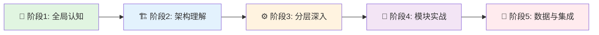
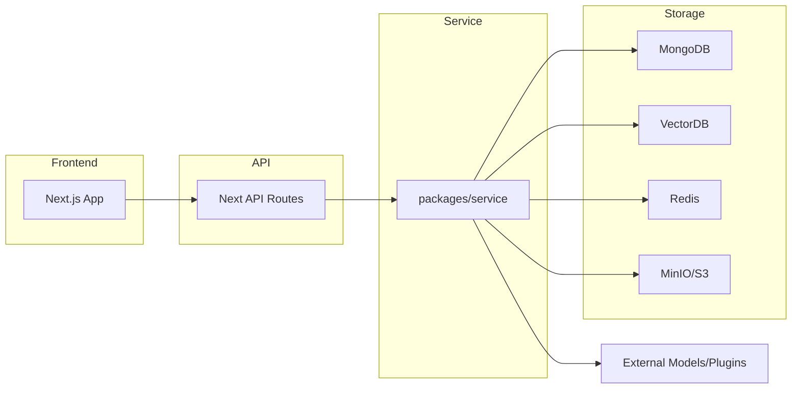
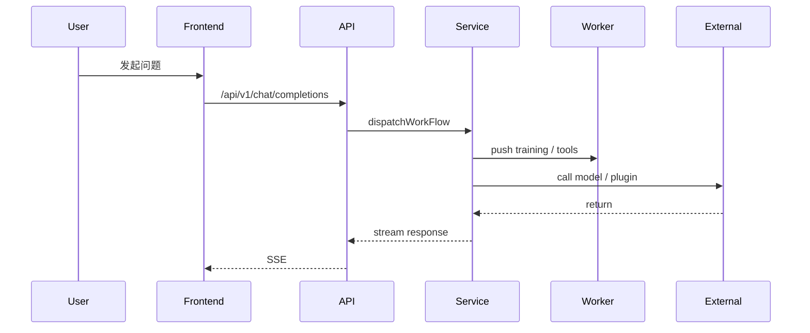

# FastGPT 学习地图 🗺️

> **目标受众**：AI 平台工程师 / LLM 工程师
> **学习方式**：分阶段、实践优先
> **基于资料**：仓库内 `fastgpt-anylisis` 文档

---

## 📚 如何使用本学习地图

### 学习分级（优先级）
- 🟢 入门（Overview）：快速建立整体认知（1-3 天）
- 🟡 进阶（Architecture & Layers）：理解系统设计（1-2 周）
- 🔴 专家（Core Implementation）：掌握工作流、向量、插件与部署（2-4 周）

### 阅读顺序建议

---

## 🎯 第一阶段：全局认知（1-3 天）

> 目标：建立对 FastGPT 项目的整体认知，理解定位、核心价值与技术栈

### 1.1 项目概览 🟢 ⭐⭐⭐⭐⭐
**文档**：[fastgpt-anylisis/01-overview/project-overview.md](fastgpt-anylisis/01-overview/project-overview.md)

**核心问题**：
- FastGPT 是什么？解决哪些业务/技术痛点？
- 系统的主要能力边界（Agent 平台、工作流引擎、知识库检索）？
- Monorepo 的组织与包划分如何？

**学习输出（Check-list）**：
- [ ] 用一句话描述 FastGPT 的核心价值
- [ ] 列出主要技术栈（前端、后端、向量 DB、队列、存储）
- [ ] 画出高层架构草图

**预计时间**：2-4 小时

---

## 🏗️ 第二阶段：架构理解（3-5 天）

> 目标：从系统架构视角理解设计思想与运行时分工

### 2.1 系统架构 🟡 ⭐⭐⭐⭐⭐
**文档**：[fastgpt-anylisis/02-architecture/system-architecture.md](fastgpt-anylisis/02-architecture/system-architecture.md)

**要点**：
- 前端（Next.js）与 API Routes 边界
- `packages/service` 的角色与模块划分（core/app/chat/dataset/workflow/plugin）
- 数据持久化策略（MongoDB + PGVector/Milvus + Redis + MinIO）

**学习输出**：
- [ ] 理解各层职责并能口述数据流
- [ ] 识别关键集成点（模型、向量库、插件 runtime）

**架构速览**

**预计时间**：1-2 天

---

## 🧩 第三阶段：分层深入（1-2 周）

> 目标：逐层掌握实现细节并完成小练习

### 3.1 前端展示层（2-4 天） 🟢 ⭐⭐⭐⭐
**文档**：[fastgpt-anylisis/03-layers/01-frontend-layer.md](fastgpt-anylisis/03-layers/01-frontend-layer.md)

**任务与练习**：
- 理解页面与组件目录：`projects/app/src/pages`、`packages/web/components`
- 实践：新增或修改一个 React Flow 节点，保存并通过 API 调用回传

**验收**：
- [ ] 在本地运行 `projects/app` 并打开 Flow 编辑器
- [ ] 自定义节点在画布可拖拽并保存

### 3.2 API 路由层（1-2 天） 🟡 ⭐⭐⭐
**文档**：[fastgpt-anylisis/03-layers/02-api-routes-layer.md](fastgpt-anylisis/03-layers/02-api-routes-layer.md)

**任务与练习**：
- 阅读 `projects/app/src/pages/api` 的核心路由
- 实践：实现一个带中间件（NextEntry）的简单路由并测试鉴权

**验收**：
- [ ] 能实现并测试一个 API 路由（含中间件）

### 3.3 Service 层（3-5 天） 🔵 ⭐⭐⭐⭐
**文档**：[fastgpt-anylisis/03-layers/03-service-layer.md](fastgpt-anylisis/03-layers/03-service-layer.md)

**重点**：
- 数据模型（MongoApp、MongoChat、MongoDataset）、Worker 任务、向量 DB 抽象

**练习**：
- 在本地或 mock 环境中触发一次文档导入 -> text2Chunks -> push to training queue

**验收**：
- [ ] 观察到 Job 进入 BullMQ 队列并被 Worker 读取

### 3.4 数据持久化层（2-3 天） 📦
**文档**：[fastgpt-anylisis/03-layers/05-data-persistence-layer.md](fastgpt-anylisis/03-layers/05-data-persistence-layer.md)

**任务**：
- 理解 Mongo 索引设计与表结构
- 理解 PGVector / Milvus 的表或 collection 设计

**验收**：
- [ ] 能解释主要集合/表的索引与用途

---

## 🔁 第四阶段：工作流引擎深度（2 周）

> 目标：掌握 `core/workflow/dispatch` 的执行模型、变量系统与扩展点

**文档**：[fastgpt-anylisis/03-layers/07-workflow-engine.md](fastgpt-anylisis/03-layers/07-workflow-engine.md)

**核心任务**：
- 理解节点类型（AI Chat、Dataset Search、HTTP Request、Code Sandbox、Plugin、MCP）
- 练习：添加或修改一个工具节点（例如增强 HTTP 请求），并通过 `POST /api/core/workflow/debug` 调试

**节点执行顺序**

**验收**：
- [ ] 能在调试模式下查看节点输入/输出与变量替换结果

---

## 🔌 第五阶段：插件系统 & MCP（1 周）

> 目标：理解插件打包格式、运行时与 MCP 协议

**文档**：
- [fastgpt-anylisis/03-layers/06-external-services-layer.md](fastgpt-anylisis/03-layers/06-external-services-layer.md)
- service 层 plugin 文档（见 `03-service-layer.md`）

**练习**：
- 制作最小 `plugin.zip`（manifest.json + index.js），走 parse -> confirm -> run 流程
- 模拟 MCP 客户端 `getTools` / `runTool`

**验收**：
- [ ] 插件解析通过并能在工作流中调用

---

## 🚀 第六阶段：模型接入、部署与监控（1-2 周）

**内容**：模型适配器（OpenAI/Azure/One API）、容器化、OpenTelemetry、日志与审计

**文档**：
- [fastgpt-anylisis/02-architecture/system-architecture.md](fastgpt-anylisis/02-architecture/system-architecture.md)
- [fastgpt-anylisis/03-layers/06-external-services-layer.md](fastgpt-anylisis/03-layers/06-external-services-layer.md)

**练习**：
- 构建 `projects/app` Docker 镜像并运行
- 配置 OTEL 导出或至少能在日志中看到 trace id

**验收**：
- [ ] 能本地启动容器化服务并观察基本 tracing/log

---

## 🏁 第七阶段：综合实战（1-2 周）

> 目标：完成端到端案例并做评估报告

**建议项目**：
- 文档问答应用：上传文档 -> 训练 -> 检索 -> Chat UI 展示
- 插件扩展：实现一个抓取外部 API 的插件并在工作流中调用

**输出**：
- 项目 README、架构图、性能/成本评估、改进建议

---

## ✅ 学习清单（导学检查点）
- [ ] 能画出系统架构并解释每层职责
- [ ] 能实现并测试一个 API 路由（含中间件）
- [ ] 能触发文档训练并观察 Worker 执行
- [ ] 能调试工作流并查看节点输入/输出
- [ ] 能制作并调用一个 Plugin
- [ ] 能容器化运行并观察基本监控/日志

---

## 参考文档（仓库内）
- Overview: [fastgpt-anylisis/01-overview/project-overview.md](fastgpt-anylisis/01-overview/project-overview.md)
- Architecture: [fastgpt-anylisis/02-architecture/system-architecture.md](fastgpt-anylisis/02-architecture/system-architecture.md)
- Layers: [fastgpt-anylisis/03-layers/](fastgpt-anylisis/03-layers/)

---

## 后续操作选项
- 我可以为你执行 git 提交（`git add`/`git commit -m "add fastgpt learning map"`）并推送到远端，需要我现在提交吗？

---

> 文件已更新：`fastgpt-anylisis/fastgpt-learning-map.md`

