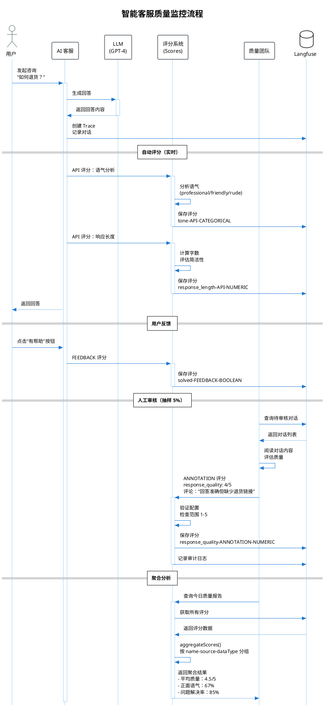
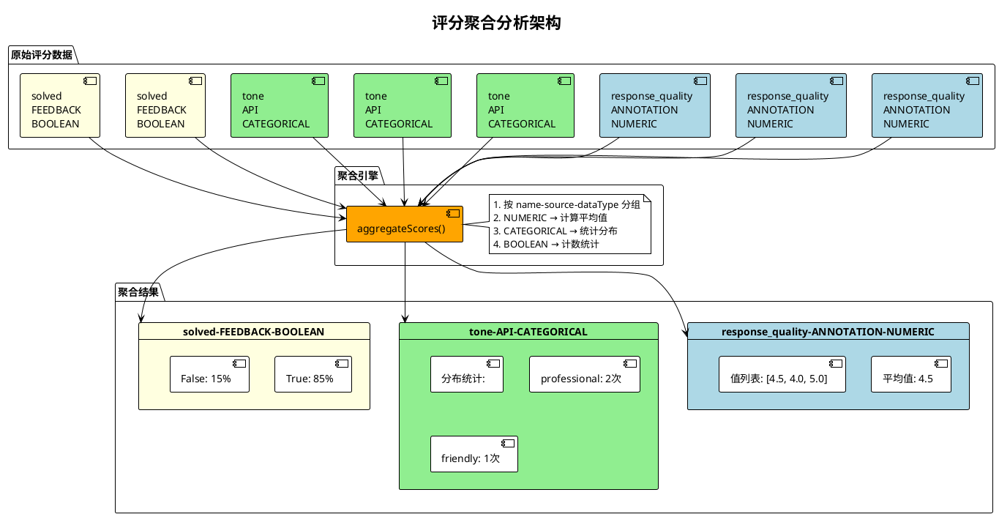
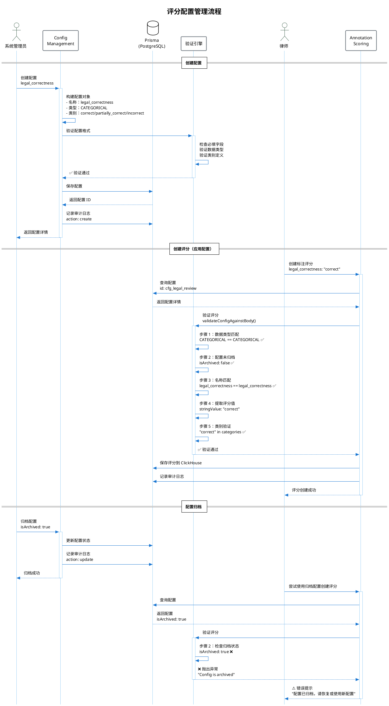
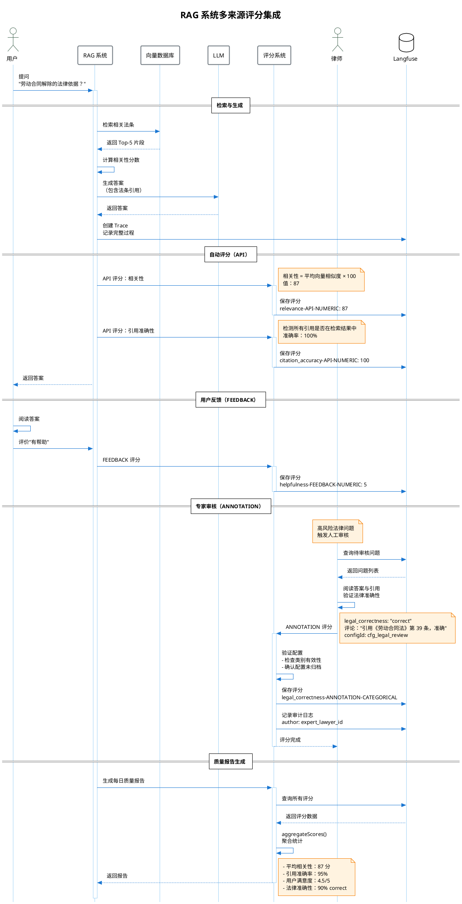
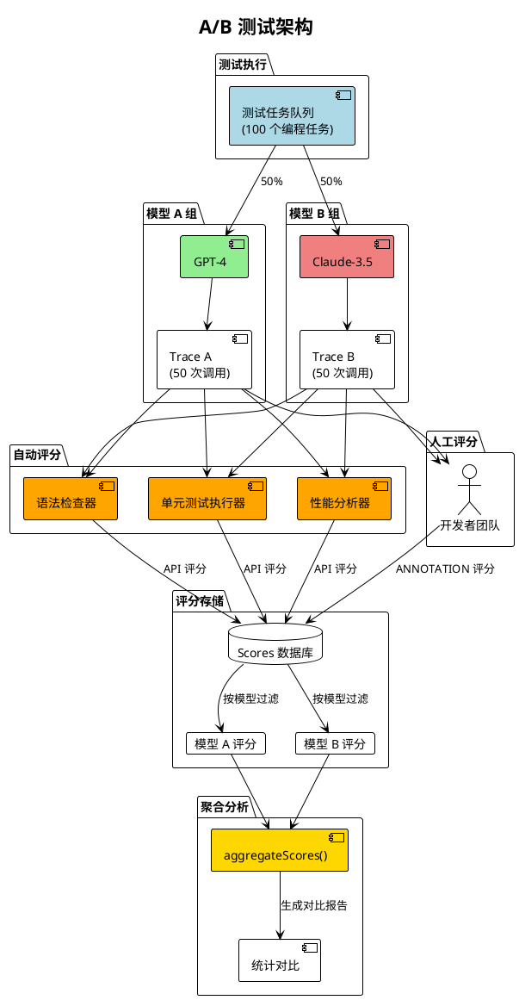
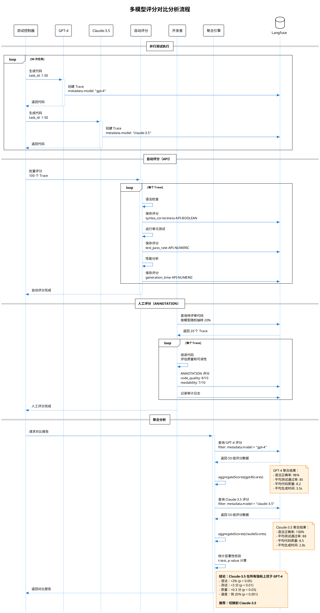
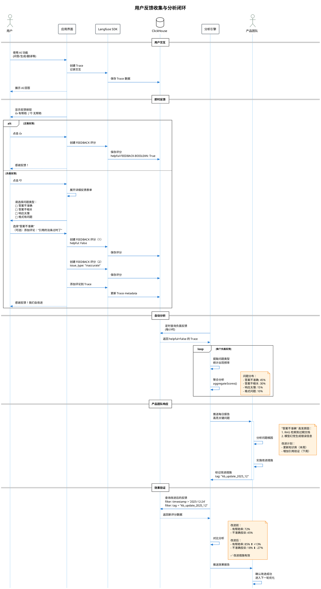
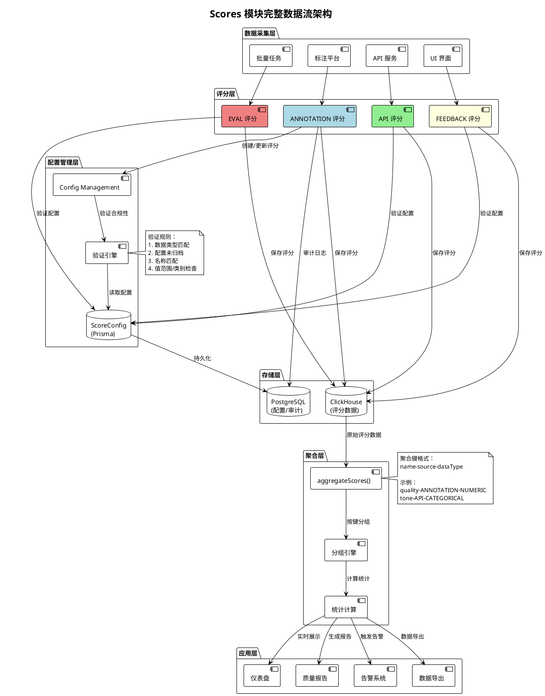

# Scores 模块应用场景说明

## 概述

Scores 模块是 Langfuse 中用于**评估和监控 LLM 应用质量**的核心系统，提供多维度、多来源的评分能力，支持从实时自动评估到离线人工审核的完整质量管理流程。

### 核心能力

| 能力 | 说明 |
|-----|------|
| **多来源评分** | ANNOTATION（人工）、API（自动）、EVAL（批量）、FEEDBACK（用户） |
| **多类型支持** | NUMERIC（数值）、CATEGORICAL（分类）、BOOLEAN（布尔） |
| **配置管理** | 统一评分标准，支持范围约束、类别验证 |
| **聚合分析** | 自动分组统计，生成质量报告 |
| **审计追踪** | 完整记录评分历史，支持溯源 |

---

## 应用场景一：智能客服质量监控

### 场景描述

某电商公司的 AI 客服系统每天处理 10,000+ 用户咨询，需要建立多维度质量监控体系：
- **实时监控**：自动检测语气、情感、响应长度
- **用户反馈**：收集"有帮助"/"无帮助"反馈
- **人工审核**：质量团队抽样评审（5% 覆盖率）

### 评分体系设计

| 评分维度 | 数据类型 | 来源 | 频率 |
|---------|---------|------|------|
| response_quality | NUMERIC (1-5) | ANNOTATION | 抽样 5% |
| tone | CATEGORICAL | API | 100% |
| solved | BOOLEAN | FEEDBACK | 用户触发 |
| response_length | NUMERIC (1-5) | API | 100% |

### 工作流程

### 聚合分析视图

### 业务价值

- **质量可视化**：实时仪表盘展示服务质量趋势
- **问题定位**：快速识别低质量对话，针对性改进
- **绩效考核**：量化客服团队和 AI 系统表现
- **用户洞察**：分析用户满意度与问题类型关联

---

## 应用场景二：RAG 系统准确性评估

### 场景描述

法律咨询 RAG 系统需要验证答案的准确性和可靠性：
- **自动检测**：引用准确性、相关性评分
- **专家审核**：律师团队审核关键法律问题
- **用户验证**：收集用户对答案有用性的反馈

### 评分体系设计

| 评分维度 | 数据类型 | 来源 | 验证标准 |
|---------|---------|------|---------|
| citation_accuracy | NUMERIC (0-100) | API | 自动检测引用是否存在 |
| legal_correctness | CATEGORICAL | ANNOTATION | 律师专家评审 |
| helpfulness | NUMERIC (1-5) | FEEDBACK | 用户主观评价 |
| relevance | NUMERIC (0-100) | API | 向量相似度检测 |

### 配置管理流程

### 多来源评分集成

### 业务价值

- **准确性保障**：专家审核确保法律答案可靠性
- **持续优化**：通过评分数据识别改进点
- **风险控制**：高风险问题强制人工审核
- **信任建立**：展示引用来源和准确率

---

## 应用场景三：多模型 A/B 测试

### 场景描述

技术团队需要比较 GPT-4 和 Claude-3.5 在代码生成任务中的表现：
- **自动化测试**：语法检查、单元测试通过率
- **开发者评审**：代码质量、可读性评分
- **性能对比**：生成速度、token 消耗

### 测试架构

### 评分对比流程

### 业务价值

- **数据驱动决策**：量化对比模型性能
- **成本优化**：选择性价比最优模型
- **持续改进**：定期测试新模型版本
- **风险降低**：验证模型切换影响

---

## 应用场景四：用户反馈闭环

### 场景描述

产品团队希望建立用户反馈驱动的改进闭环：
- **即时反馈**：👍/👎 按钮收集满意度
- **详细评价**：用户可选择性提供详细反馈
- **问题分类**：自动识别不满意原因
- **改进跟踪**：监控改进措施效果

### 反馈收集流程

### 业务价值

- **快速响应**：及时发现用户痛点
- **问题优先级**：数据驱动资源分配
- **效果量化**：验证改进措施效果
- **用户参与**：增强用户归属感

---

## 评分来源对比

```plantuml
@startuml
!theme plain

title 四种评分来源对比

rectangle "**ANNOTATION** 人工标注" as ANN #LightBlue {
  card "特点" as ANN_F
  card "成本" as ANN_C
  card "准确性" as ANN_A
  card "场景" as ANN_S
}

rectangle "**API** 自动评分" as API #LightGreen {
  card "特点" as API_F
  card "成本" as API_C
  card "准确性" as API_A
  card "场景" as API_S
}

rectangle "**EVAL** 批量评估" as EVAL #LightCoral {
  card "特点" as EVAL_F
  card "成本" as EVAL_C
  card "准确性" as EVAL_A
  card "场景" as EVAL_S
}

rectangle "**FEEDBACK** 用户反馈" as FEED #LightYellow {
  card "特点" as FEED_F
  card "成本" as FEED_C
  card "准确性" as FEED_A
  card "场景" as FEED_S
}

note right of ANN_F
  事后人工评审
  需要专业知识
  可提供详细评论
end note

note right of ANN_C
  高 (人力成本)
end note

note right of ANN_A
  ⭐⭐⭐⭐⭐ (最准确)
end note

note right of ANN_S
  Ground Truth 构建
  训练数据标注
  法律/医疗等专业领域
end note

note right of API_F
  实时自动执行
  可编程规则
  100% 覆盖
end note

note right of API_C
  低 (计算成本)
end note

note right of API_A
  ⭐⭐⭐ (规则准确)
end note

note right of API_S
  语法检查
  格式验证
  性能监控
end note

note right of EVAL_F
  离线批量处理
  使用 LLM-as-Judge
  可重复执行
end note

note right of EVAL_C
  中 (API 调用成本)
end note

note right of EVAL_A
  ⭐⭐⭐⭐ (模型准确)
end note

note right of EVAL_S
  模型对比测试
  回归测试
  历史数据分析
end note

note right of FEED_F
  用户主动触发
  真实使用反馈
  可能有偏差
end note

note right of FEED_C
  无 (用户自愿)
end note

note right of FEED_A
  ⭐⭐⭐ (主观评价)
end note

note right of FEED_S
  满意度调查
  A/B 测试
  产品迭代
end note

@enduml
```

---

## 数据流架构

---

## 关键设计原则

### 1. 多来源融合

通过区分 ANNOTATION、API、EVAL、FEEDBACK 四种来源，支持从自动化到人工审核的完整评估链条。

### 2. 配置驱动

通过 ScoreConfig 统一评分标准，确保：
- 数据类型一致性
- 值范围合法性
- 类别定义规范化

### 3. 灵活聚合

aggregateScores 函数按 `name-source-dataType` 自动分组：
- NUMERIC：计算平均值、最小值、最大值
- CATEGORICAL：统计分布、频次
- BOOLEAN：计数统计（转为 CATEGORICAL 处理）

### 4. 审计追踪

所有评分操作记录审计日志：
- 创建者信息（authorUserId）
- 操作时间（timestamp）
- 配置关联（configId）
- 评论内容（comment）

### 5. 渐进式实施

从简单到复杂的实施路径：
1. **阶段 1**：API 自动评分（语法检查、性能监控）
2. **阶段 2**：用户反馈收集（👍/👎 按钮）
3. **阶段 3**：人工标注平台（专家审核）
4. **阶段 4**：批量评估任务（LLM-as-Judge）

---

## 实施建议

### 快速启动（第 1 周）

1. **创建基础配置**：定义 2-3 个核心评分指标
2. **集成 API 评分**：添加自动化评分逻辑
3. **启用用户反馈**：添加 👍/👎 按钮

### 扩展阶段（第 2-4 周）

1. **建立标注平台**：训练标注团队
2. **配置聚合报告**：搭建可视化仪表盘
3. **优化评分规则**：根据反馈调整配置

### 成熟运营（持续）

1. **定期质量审核**：月度/季度质量回顾
2. **A/B 测试迭代**：持续优化模型和 Prompt
3. **自动化告警**：设置质量阈值告警

---

## 总结

Scores 模块通过**多来源、多类型、配置驱动**的设计，为 LLM 应用提供了完整的质量评估体系。从实时自动监控到离线专家审核，从用户反馈到批量测试，覆盖了质量管理的全生命周期，帮助团队建立数据驱动的持续改进闭环。

