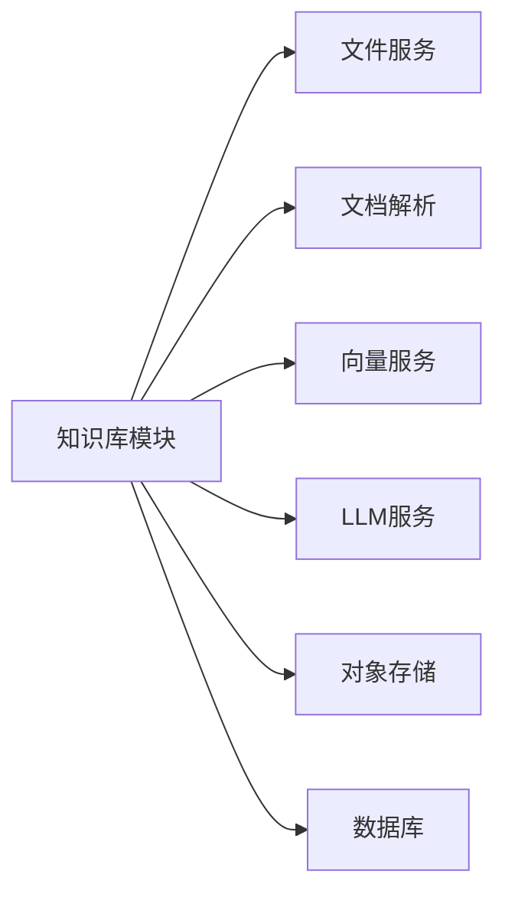

# 知识库管理模块 (Knowledge Base Module)

## 模块概述

知识库管理模块是 RAGFlow 的核心模块之一，负责文档的存储、组织、索引和检索。它提供完整的知识库生命周期管理，包括创建、配置、文档导入、向量化、检索等功能，是实现 RAG（检索增强生成）的基础。

### 核心价值
- 📚 **多格式支持**: 支持 PDF, Word, Excel, PPT, Markdown, TXT 等 20+ 种文档格式
- 🔍 **智能检索**: 向量检索 + 全文检索 + 知识图谱检索的混合检索
- ⚡ **高性能**: 异步处理 + 分布式任务队列 + 向量索引优化
- 🎯 **精准控制**: 灵活的解析配置、分块策略、嵌入模型选择

---

## 主要功能

### 1. 知识库管理 (CRUD)
- ✅ 创建知识库
- ✅ 查询知识库列表
- ✅ 更新知识库配置
- ✅ 删除知识库
- ✅ 知识库统计信息

### 2. 文档导入
- ✅ 单文件上传
- ✅ 批量文件上传
- ✅ 外部数据源导入（S3, Database, API）
- ✅ 网页爬取导入

### 3. 文档解析
- ✅ 多格式解析（PDF, DOCX, PPTX, XLSX等）
- ✅ OCR 文字识别
- ✅ 表格提取
- ✅ 图片提取和理解

### 4. 文档处理
- ✅ 智能分块（语义分块、固定大小分块、递归分块）
- ✅ 向量嵌入生成
- ✅ 关键词提取
- ✅ 元数据enrichment

### 5. 高级功能
- ✅ **知识图谱构建**: 实体识别、关系抽取、图谱检索
- ✅ **RAPTOR 分层检索**: 多层次摘要和检索
- ✅ **思维导图生成**: 自动生成文档结构图
- ✅ **问题生成**: 基于文档自动生成问答对

---

## 目录结构

```
api/apps/
├── kb_app.py                    # 知识库 API Blueprint (600+ 行)
├── document_app.py              # 文档管理 API (800+ 行)
├── chunk_app.py                 # 分块管理 API (400+ 行)
└── file_app.py                  # 文件上传 API (300+ 行)

api/db/services/
├── knowledgebase_service.py     # 知识库服务层 (300+ 行)
├── document_service.py          # 文档服务层 (400+ 行)
└── file_service.py              # 文件服务层 (200+ 行)

api/db/db_models.py
├── Knowledgebase                # 知识库 ORM 模型
├── Document                     # 文档 ORM 模型
└── Task                         # 任务 ORM 模型

rag/svr/
├── chunk_service.py             # 分块处理服务
└── task_broker.py               # 任务调度器

deepdoc/parser/
├── pdf_parser.py                # PDF 解析器
├── docx_parser.py               # Word 解析器
├── excel_parser.py              # Excel 解析器
└── ...                          # 其他格式解析器

graphrag/
├── general/build.py             # 知识图谱构建
└── search.py                    # 图谱检索
```

---

## 核心流程

### 时序图列表
1. [创建知识库流程](./01-create-kb-sequence.puml)
2. [文档上传流程](./02-upload-document-sequence.puml)
3. [文档解析流程](./03-parse-document-sequence.puml)
4. [向量检索流程](./04-vector-search-sequence.puml)
5. [更新知识库流程](./05-update-kb-sequence.puml)
6. [删除知识库流程](./06-delete-kb-sequence.puml)
7. [QA 数据流程](./qa-data-flow.puml)

### 详细说明文档
- [知识库管理详细说明](./knowledge-base-management.md)

---

## 数据模型

### Knowledgebase 模型
```python
class Knowledgebase(Base):
    __tablename__ = 'knowledgebase'
    
    id = Column(String(32), primary_key=True)           # UUID
    tenant_id = Column(String(32), nullable=False)      # 租户ID
    name = Column(String(128), nullable=False)          # 知识库名称
    description = Column(Text)                          # 描述
    language = Column(String(32), default='English')    # 语言
    embd_id = Column(String(32))                        # 嵌入模型ID
    parser_id = Column(String(32))                      # 解析器ID
    parser_config = Column(JSON)                        # 解析配置
    chunk_num = Column(Integer, default=0)              # 分块总数
    doc_num = Column(Integer, default=0)                # 文档总数
    token_num = Column(Integer, default=0)              # Token总数
    avatar = Column(String(512))                        # 图标URL
    create_time = Column(DateTime)                      # 创建时间
    update_time = Column(DateTime)                      # 更新时间
```

### Document 模型
```python
class Document(Base):
    __tablename__ = 'document'
    
    id = Column(String(32), primary_key=True)           # UUID
    kb_id = Column(String(32), nullable=False)          # 知识库ID
    name = Column(String(256), nullable=False)          # 文件名
    type = Column(String(32))                           # 文件类型
    size = Column(Integer)                              # 文件大小（字节）
    location = Column(String(512))                      # MinIO路径
    parser_id = Column(String(32))                      # 使用的解析器
    parser_config = Column(JSON)                        # 解析配置
    progress = Column(Float, default=0)                 # 解析进度 0-1
    progress_msg = Column(String(256))                  # 进度消息
    chunk_num = Column(Integer, default=0)              # 分块数量
    token_num = Column(Integer, default=0)              # Token数量
    status = Column(String(32), default='NEW')          # 状态: NEW/PARSING/DONE/FAIL
    create_time = Column(DateTime)                      # 创建时间
    update_time = Column(DateTime)                      # 更新时间
```

### Chunk 数据结构（存储在 ES/Infinity）
```python
{
    "id": "chunk_uuid",
    "kb_id": "kb_uuid",
    "doc_id": "doc_uuid",
    "content": "分块文本内容",
    "content_with_weight": "带权重的内容",
    "embedding": [0.1, 0.2, ...],          # 向量嵌入（1536/3072维）
    "important_keywords": ["关键词1", ...], # 重要关键词
    "img_id": "image_uuid",                # 关联图片ID
    "page_num": 5,                         # 页码
    "position": {"x": 100, "y": 200},      # 页面位置
    "create_time": "2024-01-01T00:00:00Z"
}
```

---

## API 接口

### 知识库管理接口

#### 1. 创建知识库
```http
POST /api/v1/kb/create
Content-Type: application/json
Authorization: Bearer {token}

{
  "name": "技术文档库",
  "description": "公司内部技术文档",
  "language": "Chinese",
  "embd_id": "text-embedding-3-large",
  "parser_id": "naive",
  "parser_config": {
    "chunk_token_num": 128,
    "layout_recognize": true,
    "raptor": false
  }
}

Response: 200 OK
{
  "code": 0,
  "data": {
    "id": "kb_uuid",
    "name": "技术文档库",
    ...
  }
}
```

#### 2. 获取知识库列表
```http
GET /api/v1/kb/list?page=1&page_size=10
Authorization: Bearer {token}

Response: 200 OK
{
  "code": 0,
  "data": {
    "kbs": [{...}, {...}],
    "total": 25
  }
}
```

#### 3. 更新知识库
```http
PUT /api/v1/kb/update/{kb_id}
Content-Type: application/json
Authorization: Bearer {token}

{
  "name": "新名称",
  "description": "新描述",
  "parser_config": {...}
}
```

#### 4. 删除知识库
```http
DELETE /api/v1/kb/delete/{kb_id}
Authorization: Bearer {token}

Response: 200 OK
{
  "code": 0,
  "data": {"success": true}
}
```

### 文档管理接口

#### 5. 上传文档
```http
POST /api/v1/document/upload
Content-Type: multipart/form-data
Authorization: Bearer {token}

Form Data:
- file: (binary)
- kb_id: "kb_uuid"
- parser_id: "naive"
```

#### 6. 获取文档列表
```http
GET /api/v1/document/list?kb_id={kb_id}&page=1&page_size=10
```

#### 7. 解析文档
```http
POST /api/v1/document/parse/{doc_id}
```

#### 8. 删除文档
```http
DELETE /api/v1/document/delete/{doc_id}
```

### 检索接口

#### 9. 向量检索
```http
POST /api/v1/kb/search
Content-Type: application/json

{
  "kb_ids": ["kb_uuid1", "kb_uuid2"],
  "question": "如何使用 RAGFlow?",
  "top_k": 10,
  "similarity_threshold": 0.2
}

Response:
{
  "code": 0,
  "data": {
    "chunks": [{
      "content": "...",
      "doc_name": "文档.pdf",
      "similarity": 0.85,
      "img_id": "..."
    }],
    "total": 10
  }
}
```

---

## 技术栈

### 后端技术
- **Web 框架**: Quart (异步 Flask)
- **ORM**: Peewee
- **数据库**: MySQL / PostgreSQL / OceanBase
- **搜索引擎**: Elasticsearch / OpenSearch / Infinity
- **缓存**: Redis
- **对象存储**: MinIO (S3 兼容)
- **任务队列**: Redis + Celery

### 文档处理
- **PDF**: pdfplumber, camelot (表格提取)
- **Word**: python-docx
- **Excel**: openpyxl
- **OCR**: PaddleOCR, Tesseract
- **NLP**: spaCy, jieba

### 向量化
- **嵌入模型**: OpenAI Embeddings, BGE, GTE
- **向量数据库**: Elasticsearch KNN, Infinity
- **重排模型**: BGE Reranker, Cohere Rerank

---

## 依赖关系

### 依赖模块


### 被依赖模块
- **对话模块**: 使用知识库进行检索
- **Agent 模块**: 使用知识库作为工具
- **评估模块**: 基于知识库进行 RAG 评估

---

## 关键配置

### parser_config 配置项
```json
{
  "chunk_token_num": 128,           // 分块大小（Token数）
  "delimiter": "\n!?。；！？",       // 分隔符
  "layout_recognize": true,         // 是否识别版面
  "raptor": false,                  // 是否启用 RAPTOR
  "raptor_depth": 2,                // RAPTOR 层级深度
  "knowledge_graph": false,         // 是否构建知识图谱
  "task_page_size": 12              // 任务处理页面大小
}
```

### embd_id 支持的嵌入模型
- `text-embedding-3-large` (OpenAI, 3072维)
- `text-embedding-3-small` (OpenAI, 1536维)
- `bge-large-zh-v1.5` (BAAI, 1024维)
- `gte-large-zh` (Alibaba, 1024维)

---

## 性能指标

### 处理速度
- PDF 解析: ~1-2 页/秒
- 文档分块: ~500-1000 块/秒
- 向量嵌入: ~100-500 条/秒（批处理）
- 向量检索: <100ms (P95)

### 容量
- 单知识库文档数: 无限制
- 单知识库分块数: 建议 <1000万
- 单文档大小: 建议 <100MB
- 并发上传: 10-50 个文件

---

## 监控与日志

### 关键指标
- 知识库数量
- 文档数量
- 分块数量
- 解析成功率
- 检索QPS
- 检索延迟

### 日志路径
- API 日志: `logs/ragflow-api.log`
- 任务日志: `logs/task-worker.log`
- 错误日志: `logs/error.log`

---

## 常见问题

### Q1: 文档解析失败怎么办？
- 检查文档格式是否支持
- 查看错误日志
- 调整 parser_config 配置
- 尝试不同的解析器

### Q2: 检索结果不准确？
- 调整 similarity_threshold
- 使用重排模型
- 优化分块大小
- 检查嵌入模型是否合适

### Q3: 如何提高检索速度？
- 使用 Infinity 替代 Elasticsearch
- 启用缓存
- 减少 top_k 数量
- 使用更小的嵌入模型

---

## 相关文档

- [系统架构](../../02-architecture/system-architecture.md)
- [数据访问层](../../03-layers/05-data-access-layer.md)
- [对话系统模块](../02-chat-dialog/README.md)
- [RAG 检索引擎](../05-rag-retrieval/README.md)

---

**模块负责人**: RAGFlow 团队  
**最后更新**: 2025-12-26  
**文档版本**: 1.1
