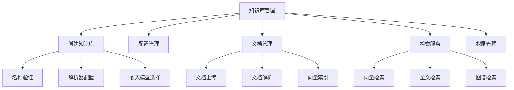
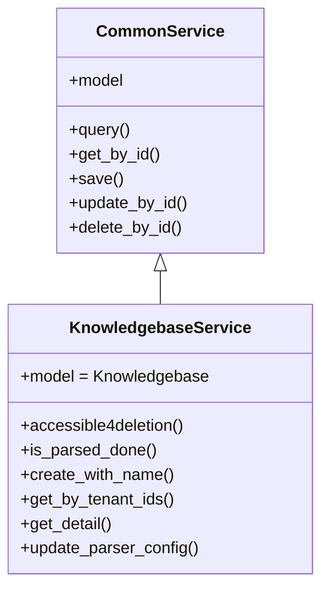
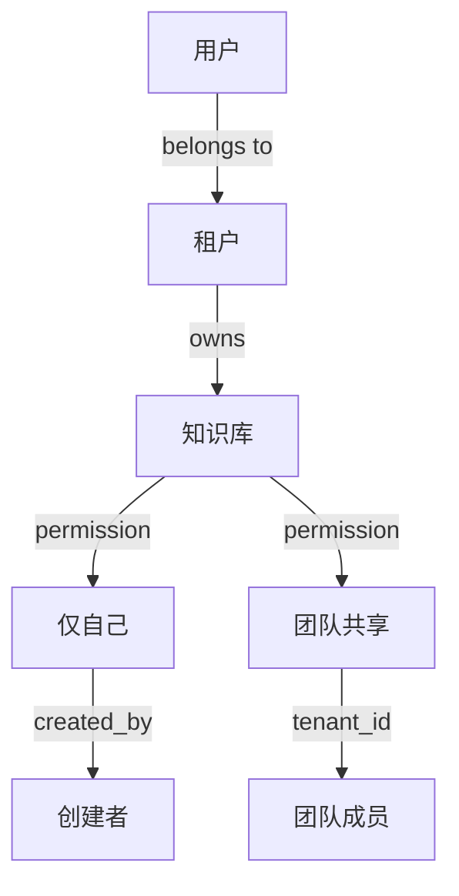

# 知识库管理详细说明 (Knowledge Base Management)

## 文档说明

本文档详细描述 RAGFlow 知识库管理模块的业务流程、技术实现、API 接口和配置说明。

---

## 目录

- [1. 功能概述](#1-功能概述)
- [2. 核心业务流程](#2-核心业务流程)
- [3. 数据模型详解](#3-数据模型详解)
- [4. API 接口实现](#4-api-接口实现)
- [5. 服务层架构](#5-服务层架构)
- [6. 解析配置详解](#6-解析配置详解)
- [7. 权限控制机制](#7-权限控制机制)
- [8. 错误处理](#8-错误处理)
- [9. 性能优化](#9-性能优化)
- [10. 最佳实践](#10-最佳实践)

---

## 1. 功能概述

### 1.1 模块定位

知识库管理模块是 RAGFlow 的核心基础模块，负责：
- 📦 **知识库生命周期管理**: 创建、配置、更新、删除
- 📄 **文档管理**: 上传、解析、索引、检索
- 🔧 **解析配置**: 灵活的文档解析策略配置
- 🔐 **权限控制**: 基于租户和团队的权限管理
- 📊 **统计分析**: 文档数量、分块数量、Token 统计

### 1.2 主要功能模块



### 1.3 技术特性

| 特性 | 说明 |
|------|------|
| **异步处理** | 基于 Quart 框架的异步 API |
| **分布式任务** | Redis + Celery 任务队列 |
| **多租户支持** | 基于 tenant_id 的数据隔离 |
| **灵活配置** | JSON 格式的解析器配置 |
| **向量检索** | ES/OpenSearch/Infinity 支持 |
| **对象存储** | MinIO S3 兼容存储 |

---

## 2. 核心业务流程

### 2.1 知识库创建流程

#### 流程图


#### 详细步骤

**步骤 1: 请求验证**
```python
# 文件: api/apps/kb_app.py
@manager.route('/create', methods=['post'])
@login_required
@validate_request("name")
async def create():
    req = await get_request_json()
    # 提取必需参数: name
    # 可选参数: description, language, parser_id, embd_id, parser_config
```

**步骤 2: 名称验证与去重**
```python
# 文件: api/db/services/knowledgebase_service.py
def create_with_name(cls, *, name: str, tenant_id: str, ...):
    # 1. 验证名称类型
    if not isinstance(name, str):
        return False, get_data_error_result(message="Dataset name must be string.")
    
    # 2. 验证名称非空
    dataset_name = name.strip()
    if dataset_name == "":
        return False, get_data_error_result(message="Dataset name can't be empty.")
    
    # 3. 验证名称长度 (1024 字节限制)
    if len(dataset_name.encode("utf-8")) > DATASET_NAME_LIMIT:
        return False, get_data_error_result(...)
    
    # 4. 自动去重 (在名称后添加数字)
    dataset_name = duplicate_name(
        cls.query,
        name=dataset_name,
        tenant_id=tenant_id,
        status=StatusEnum.VALID.value,
    )
    # 例如: "我的文档" -> "我的文档(1)" -> "我的文档(2)"
```

**步骤 3: 解析器配置构建**
```python
# 生成 parser_config
payload["parser_config"] = get_parser_config(parser_id, kwargs.get("parser_config"))

# get_parser_config 返回的默认配置:
{
    "chunk_token_num": 128,          # 分块大小
    "delimiter": "\n!?。；！？",      # 分隔符
    "layout_recognize": true,        # 版面识别
    "table_context_size": 0,         # 表格上下文
    "image_context_size": 0,         # 图片上下文
    "raptor": false,                 # RAPTOR 分层检索
    "knowledge_graph": false,        # 知识图谱
    "pages": [[1, 1000000]],         # 处理页码范围
    "task_page_size": 12,            # 任务页面大小
    "llm_id": "..."                  # LLM 模型 ID
}
```

**步骤 4: 数据库持久化**
```python
# 保存到数据库
if not KnowledgebaseService.save(**res):
    return get_data_error_result()

return get_json_result(data={"kb_id": res["id"]})
```

#### 关键代码位置

| 组件 | 文件路径 | 行号 | 说明 |
|------|---------|------|------|
| API 端点 | [api/apps/kb_app.py](api/apps/kb_app.py#L47-L67) | 47-67 | create() 函数 |
| 服务层 | [api/db/services/knowledgebase_service.py](api/db/services/knowledgebase_service.py#L373-L430) | 373-430 | create_with_name() |
| 数据模型 | [api/db/db_models.py](api/db/db_models.py#L734-L768) | 734-768 | Knowledgebase 类 |

---

### 2.2 知识库更新流程

#### 流程图


#### 可更新字段

| 字段 | 类型 | 说明 | 限制 |
|------|------|------|------|
| `name` | String | 知识库名称 | 必填，≤1024 字节 |
| `description` | Text | 描述信息 | 可选 |
| `parser_id` | String | 解析器 ID | naive/paper/book/... |
| `parser_config` | JSON | 解析配置 | 详见解析配置章节 |
| `language` | String | 语言 | Chinese/English |
| `embd_id` | String | 嵌入模型 | text-embedding-3-large |
| `similarity_threshold` | Float | 相似度阈值 | 0.0-1.0 |
| `vector_similarity_weight` | Float | 向量权重 | 0.0-1.0 |
| `permission` | String | 权限 | me/team |
| `pagerank` | Integer | PageRank 值 | ≥0 |
| `avatar` | Text | 图标 Base64 | 可选 |

#### 特殊处理: PageRank 更新

PageRank 是知识库在检索中的权重，更新时需要同步到 Elasticsearch:

```python
# 如果 PageRank 发生变化
if kb.pagerank != req.get("pagerank", 0):
    if req.get("pagerank", 0) > 0:
        # 更新所有分块的 PageRank 字段
        await asyncio.to_thread(
            settings.docStoreConn.update,
            {"kb_id": kb.id},
            {PAGERANK_FLD: req["pagerank"]},
            search.index_name(kb.tenant_id),
            kb.id,
        )
    else:
        # 删除 PageRank 字段 (ES 要求非零)
        await asyncio.to_thread(
            settings.docStoreConn.update,
            {"exists": PAGERANK_FLD},
            {"remove": PAGERANK_FLD},
            search.index_name(kb.tenant_id),
            kb.id,
        )
```

---

### 2.3 知识库查询流程

#### 列表查询

```python
# 文件: api/apps/kb_app.py
@manager.route('/list', methods=['POST'])
@login_required
async def list_kbs():
    # 查询参数
    keywords = args.get("keywords", "")      # 关键词搜索
    page_number = int(args.get("page", 0))   # 页码
    items_per_page = int(args.get("page_size", 0))
    parser_id = args.get("parser_id")        # 按解析器筛选
    orderby = args.get("orderby", "create_time")  # 排序字段
    desc = args.get("desc", "true")          # 降序/升序
    
    # 获取用户所属租户
    tenants = TenantService.get_joined_tenants_by_user_id(current_user.id)
    tenants = [m["tenant_id"] for m in tenants]
    
    # 查询知识库
    kbs, total = KnowledgebaseService.get_by_tenant_ids(
        tenants, current_user.id, page_number,
        items_per_page, orderby, desc, keywords, parser_id
    )
    
    return get_json_result(data={"kbs": kbs, "total": total})
```

#### 查询条件构建

```python
# 文件: api/db/services/knowledgebase_service.py
def get_by_tenant_ids(cls, tenant_ids, user_id, page, size, orderby, desc, keywords, parser_id):
    # 构建基础查询
    kbs = cls.model.select()
    
    # 1. 租户过滤
    kbs = kbs.where(cls.model.tenant_id.in_(tenant_ids))
    
    # 2. 状态过滤 (仅有效数据)
    kbs = kbs.where(cls.model.status == StatusEnum.VALID.value)
    
    # 3. 权限过滤
    # 'me': 仅创建者可见
    # 'team': 团队成员可见
    kbs = kbs.where(
        (cls.model.permission == PermissionEnum.TEAM.value) |
        (cls.model.created_by == user_id)
    )
    
    # 4. 关键词搜索 (模糊匹配名称或描述)
    if keywords:
        kbs = kbs.where(
            (cls.model.name.contains(keywords)) |
            (cls.model.description.contains(keywords))
        )
    
    # 5. 解析器筛选
    if parser_id:
        kbs = kbs.where(cls.model.parser_id == parser_id)
    
    # 6. 排序
    if desc:
        kbs = kbs.order_by(cls.model.__getattribute__(cls.model, orderby).desc())
    else:
        kbs = kbs.order_by(cls.model.__getattribute__(cls.model, orderby).asc())
    
    # 7. 分页
    if page > 0 and size > 0:
        kbs = kbs.paginate(page, size)
    
    return kbs, total_count
```

#### 详情查询

```python
# 文件: api/apps/kb_app.py
@manager.route('/detail', methods=['GET'])
@login_required
@validate_request("kb_id")
async def detail():
    kb_id = request.args.get("kb_id")
    
    # 权限检查
    if not KnowledgebaseService.accessible4deletion(kb_id, current_user.id):
        return get_json_result(data=False, message='No authorization.')
    
    # 获取详情
    kb = KnowledgebaseService.get_detail(kb_id)
    
    return get_json_result(data=kb)
```

---

### 2.4 知识库删除流程

#### 流程图


#### 删除步骤详解
```python
for kb in kbs:
    # 1. 删除 ES 中的分块数据
    settings.docStoreConn.delete(
        {"kb_id": kb.id}, 
        search.index_name(kb.tenant_id), 
        kb.id
    )
    
    # 2. 删除 ES 索引
    settings.docStoreConn.deleteIdx(
        search.index_name(kb.tenant_id), 
        kb.id
    )
    
    # 3. 删除 MinIO 存储桶
    if hasattr(settings.STORAGE_IMPL, 'remove_bucket'):
        settings.STORAGE_IMPL.remove_bucket(kb.id)
```

#### 删除保护机制

- ✅ **权限检查**: 仅创建者可删除
- ✅ **级联删除**: 自动删除文档、分块、任务
- ✅ **异步执行**: 使用 `asyncio.to_thread()` 避免阻塞
- ✅ **事务保护**: 数据库操作在事务中执行
- ⚠️ **不可恢复**: 删除操作无法撤销

---

### 2.5 文档上传流程

#### 文档上传流程图


#### 文档解析流程图
    


### 3.1 Knowledgebase 模型

#### 字段说明

```python
class Knowledgebase(DataBaseModel):
    """知识库数据模型"""
    
    # === 基本信息 ===
    id = CharField(max_length=32, primary_key=True)
    # UUID 格式，例如: "kb_a1b2c3d4e5f6"
    
    tenant_id = CharField(max_length=32, null=False, index=True)
    # 租户 ID，用于多租户隔离
    
    created_by = CharField(max_length=32, null=False, index=True)
    # 创建者 ID (通常等于 tenant_id)
    
    name = CharField(max_length=128, null=False, index=True)
    # 知识库名称，最大 1024 字节 (UTF-8)
    
    description = TextField(null=True)
    # 描述信息，富文本
    
    avatar = TextField(null=True)
    # 图标，Base64 编码
    
    # === 配置信息 ===
    language = CharField(max_length=32, default="Chinese", index=True)
    # 语言: Chinese | English | Japanese | ...
    
    embd_id = CharField(max_length=128, null=False, index=True)
    # 嵌入模型 ID
    # 例如: "text-embedding-3-large", "bge-large-zh-v1.5"
    
    parser_id = CharField(max_length=32, default="naive", index=True)
    # 解析器 ID: naive | paper | book | resume | qa | ...
    
    parser_config = JSONField(default={...})
    # 解析配置 (详见下文)
    
    pipeline_id = CharField(max_length=32, null=True, index=True)
    # 流水线 ID (未来功能)
    
    # === 权限配置 ===
    permission = CharField(max_length=16, default="me", index=True)
    # 权限: me (仅自己) | team (团队共享)
    
    # === 统计信息 ===
    doc_num = IntegerField(default=0, index=True)
    # 文档数量
    
    chunk_num = IntegerField(default=0, index=True)
    # 分块数量
    
    token_num = IntegerField(default=0, index=True)
    # Token 总数
    
    # === 检索配置 ===
    similarity_threshold = FloatField(default=0.2, index=True)
    # 相似度阈值 (0.0 - 1.0)
    # 低于此值的结果将被过滤
    
    vector_similarity_weight = FloatField(default=0.3, index=True)
    # 向量相似度权重 (0.0 - 1.0)
    # 混合检索时的权重分配
    
    pagerank = IntegerField(default=0, index=False)
    # PageRank 值，用于结果排序
    
    # === 高级功能任务 ===
    graphrag_task_id = CharField(max_length=32, null=True, index=True)
    graphrag_task_finish_at = DateTimeField(null=True)
    # 知识图谱构建任务
    
    raptor_task_id = CharField(max_length=32, null=True, index=True)
    raptor_task_finish_at = DateTimeField(null=True)
    # RAPTOR 分层检索任务
    
    mindmap_task_id = CharField(max_length=32, null=True, index=True)
    mindmap_task_finish_at = DateTimeField(null=True)
    # 思维导图生成任务
    
    # === 状态字段 ===
    status = CharField(max_length=1, default="1", index=True)
    # 0: 已删除 (软删除)
    # 1: 有效
    
    # === 时间戳 ===
    create_time = DateTimeField(auto_now_add=True)
    update_time = DateTimeField(auto_now=True)
```

#### 索引策略

```sql
-- 复合索引
CREATE INDEX idx_tenant_status ON knowledgebase(tenant_id, status);
CREATE INDEX idx_tenant_created ON knowledgebase(tenant_id, created_by);
CREATE INDEX idx_tenant_permission ON knowledgebase(tenant_id, permission);

-- 排序索引
CREATE INDEX idx_create_time_desc ON knowledgebase(create_time DESC);
CREATE INDEX idx_doc_num_desc ON knowledgebase(doc_num DESC);
```

---

### 3.2 Document 模型

#### 字段说明

```python
class Document(DataBaseModel):
    """文档数据模型"""
    
    # === 基本信息 ===
    id = CharField(max_length=32, primary_key=True)
    # 文档 ID
    
    kb_id = CharField(max_length=256, null=False, index=True)
    # 所属知识库 ID
    
    name = CharField(max_length=255, null=True, index=True)
    # 文件名 (不含路径)
    
    type = CharField(max_length=32, null=False, index=True)
    # 文件类型: pdf | docx | xlsx | ...
    
    suffix = CharField(max_length=32, null=False, index=True)
    # 真实文件扩展名
    
    size = IntegerField(default=0, index=True)
    # 文件大小 (字节)
    
    location = CharField(max_length=255, null=True, index=True)
    # MinIO 存储路径
    
    thumbnail = TextField(null=True)
    # 缩略图 Base64
    
    # === 解析配置 ===
    parser_id = CharField(max_length=32, null=False, index=True)
    # 解析器 ID (继承自 KB 或单独配置)
    
    parser_config = JSONField(default={...})
    # 解析配置 (继承自 KB 或单独配置)
    
    pipeline_id = CharField(max_length=32, null=True, index=True)
    # 流水线 ID
    
    # === 解析状态 ===
    run = CharField(max_length=1, default="0", index=True)
    # 0: NEW     - 未开始
    # 1: RUNNING - 解析中
    # 2: DONE    - 完成
    # 3: CANCEL  - 取消
    # 4: FAIL    - 失败
    
    progress = FloatField(default=0, index=True)
    # 解析进度 (0.0 - 1.0)
    
    progress_msg = TextField(default="")
    # 进度消息
    
    process_begin_at = DateTimeField(null=True, index=True)
    # 解析开始时间
    
    process_duration = FloatField(default=0)
    # 解析耗时 (秒)
    
    # === 统计信息 ===
    chunk_num = IntegerField(default=0, index=True)
    # 分块数量
    
    token_num = IntegerField(default=0, index=True)
    # Token 数量
    
    # === 元数据 ===
    source_type = CharField(max_length=128, default="local", index=True)
    # 来源类型: local | s3 | web | database | api
    
    meta_fields = JSONField(default={})
    # 自定义元数据字段
    
    created_by = CharField(max_length=32, null=False, index=True)
    # 创建者 ID
    
    # === 状态字段 ===
    status = CharField(max_length=1, default="1", index=True)
    # 0: 已删除
    # 1: 有效
    
    # === 时间戳 ===
    create_time = DateTimeField(auto_now_add=True)
    update_time = DateTimeField(auto_now=True)
```

---

### 3.3 Chunk 数据结构 (Elasticsearch)

#### 索引 Mapping

```json
{
  "mappings": {
    "properties": {
      "id": {"type": "keyword"},
      "kb_id": {"type": "keyword"},
      "doc_id": {"type": "keyword"},
      "content": {
        "type": "text",
        "analyzer": "ik_max_word",
        "search_analyzer": "ik_smart"
      },
      "content_with_weight": {
        "type": "text",
        "analyzer": "ik_max_word"
      },
      "embedding": {
        "type": "dense_vector",
        "dims": 1536,
        "index": true,
        "similarity": "cosine"
      },
      "important_keywords": {
        "type": "keyword"
      },
      "img_id": {"type": "keyword"},
      "page_num": {"type": "integer"},
      "position": {"type": "object"},
      "create_time": {"type": "date"}
    }
  }
}
```

#### 字段说明

| 字段 | 类型 | 说明 |
|------|------|------|
| `id` | Keyword | 分块 ID (UUID) |
| `kb_id` | Keyword | 知识库 ID |
| `doc_id` | Keyword | 文档 ID |
| `content` | Text | 分块文本内容 (分词索引) |
| `content_with_weight` | Text | 带关键词权重的内容 |
| `embedding` | Dense Vector | 向量嵌入 (1536/3072维) |
| `important_keywords` | Keyword[] | 重要关键词列表 |
| `img_id` | Keyword | 关联图片 ID |
| `page_num` | Integer | 页码 |
| `position` | Object | 页面位置 {x, y, w, h} |
| `create_time` | Date | 创建时间 |

---

## 4. API 接口实现

### 4.1 RESTful API 设计

#### API 路由表

| 方法 | 路径 | 功能 | 权限 |
|------|------|------|------|
| POST | `/api/v1/kb/create` | 创建知识库 | 登录用户 |
| POST | `/api/v1/kb/update` | 更新知识库 | 创建者 |
| POST | `/api/v1/kb/list` | 查询知识库列表 | 登录用户 |
| GET | `/api/v1/kb/detail` | 获取知识库详情 | 有权限用户 |
| POST | `/api/v1/kb/rm` | 删除知识库 | 创建者 |
| POST | `/api/v1/document/upload` | 上传文档 | 有权限用户 |
| POST | `/api/v1/document/run` | 解析文档 | 有权限用户 |
| POST | `/api/v1/document/list` | 文档列表 | 有权限用户 |
| POST | `/api/v1/document/rm` | 删除文档 | 有权限用户 |
| POST | `/api/v1/kb/search` | 检索 | 有权限用户 |

#### 统一响应格式

```json
{
  "code": 0,           // 状态码: 0=成功, 其他=错误
  "data": {...},       // 响应数据
  "message": "OK"      // 消息
}
```

#### 错误码定义

```python
class RetCode:
    SUCCESS = 0                    # 成功
    ARGUMENT_ERROR = 101           # 参数错误
    DATA_ERROR = 102               # 数据错误
    OPERATING_ERROR = 103          # 操作错误
    AUTHENTICATION_ERROR = 104     # 认证错误
    AUTHORIZATION_ERROR = 105      # 授权错误
    SERVER_ERROR = 500             # 服务器错误
    DATABASE_ERROR = 501           # 数据库错误
```

---

### 4.2 请求验证装饰器

```python
def validate_request(*required_fields):
    """验证请求参数"""
    def decorator(func):
        @wraps(func)
        async def wrapper(*args, **kwargs):
            req = await get_request_json()
            
            # 检查必需字段
            for field in required_fields:
                if field not in req:
                    return get_json_result(
                        data=False,
                        message=f'Missing required field: {field}',
                        code=RetCode.ARGUMENT_ERROR
                    )
            
            return await func(*args, **kwargs)
        return wrapper
    return decorator

# 使用示例
@manager.route('/create', methods=['post'])
@login_required
@validate_request("name")
async def create():
    ...
```

---

### 4.3 权限控制装饰器

```python
def check_kb_team_permission(kb, user_id):
    """检查知识库权限"""
    # 创建者始终有权限
    if kb.created_by == user_id:
        return True
    
    # 团队权限检查
    if kb.permission == PermissionEnum.TEAM.value:
        # 检查用户是否在同一租户
        return kb.tenant_id == user_id
    
    return False
```

---

## 5. 服务层架构

### 5.1 KnowledgebaseService 服务层

#### 服务类继承关系



#### 核心方法说明

**1. accessible4deletion(kb_id, user_id)**
```python
@classmethod
@DB.connection_context()
def accessible4deletion(cls, kb_id, user_id):
    """检查用户是否有权限删除知识库
    
    Args:
        kb_id: 知识库 ID
        user_id: 用户 ID
    
    Returns:
        bool: True=有权限, False=无权限
    """
    # 仅创建者可删除
    kbs = cls.query(created_by=user_id, id=kb_id)
    return len(kbs) > 0
```

**2. is_parsed_done(kb_id)**
```python
@classmethod
def is_parsed_done(cls, kb_id):
    """检查知识库下所有文档是否解析完成
    
    Returns:
        tuple: (bool, progress_msg)
        - True: 全部完成
        - False: 仍在进行中
    """
    # 查询解析中的文档
    docs = DocumentService.query(
        kb_id=kb_id,
        run=TaskStatus.RUNNING.value
    )
    
    if docs:
        return False, f"Still {len(docs)} documents parsing..."
    
    # 检查失败的文档
    failed_docs = DocumentService.query(
        kb_id=kb_id,
        run=TaskStatus.FAIL.value
    )
    
    if failed_docs:
        return False, f"{len(failed_docs)} documents failed"
    
    return True, "All documents parsed"
```

**3. get_by_tenant_ids()**
```python
@classmethod
def get_by_tenant_ids(cls, tenant_ids, user_id, page, size, 
                       orderby, desc, keywords, parser_id):
    """按租户查询知识库列表
    
    支持:
    - 多租户过滤
    - 权限过滤 (me/team)
    - 关键词搜索
    - 解析器筛选
    - 分页排序
    
    Returns:
        tuple: (kbs_list, total_count)
    """
    # 实现见前文 2.3 节
```

**4. create_with_name()**
```python
@classmethod
@DB.connection_context()
def create_with_name(cls, *, name, tenant_id, parser_id=None, **kwargs):
    """创建知识库
    
    包含完整的验证逻辑:
    1. 名称验证 (类型、长度、非空)
    2. 名称去重
    3. 租户验证
    4. 解析配置构建
    
    Returns:
        tuple: (success: bool, data_or_error)
    """
    # 实现见前文 2.1 节
```

**5. update_parser_config(kb_id, config)**
```python
@classmethod
def update_parser_config(cls, kb_id, config):
    """更新知识库的解析配置
    
    注意:
    - 仅更新提供的配置项
    - 保留未提供的配置项
    - 验证配置格式
    """
    e, kb = cls.get_by_id(kb_id)
    if not e:
        return False
    
    # 合并配置
    new_config = {**kb.parser_config, **config}
    
    return cls.update_by_id(kb_id, {"parser_config": new_config})
```

---

### 5.2 DocumentService 服务层

#### 核心方法

**1. upload_document(kb, file_objs, user_id)**
```python
def upload_document(kb, file_objs, user_id):
    """上传文档到知识库
    
    处理流程:
    1. 生成文件 ID
    2. 上传到 MinIO
    3. 创建 File 记录
    4. 创建 Document 记录
    5. 创建 File2Document 关联
    
    Returns:
        tuple: (errors, files)
    """
    errors = []
    files = []
    
    for file_obj in file_objs:
        try:
            # 1. 生成 ID
            file_id = get_uuid()
            doc_id = get_uuid()
            
            # 2. 上传到 MinIO
            location = f"{kb.id}/{file_id}/{file_obj.filename}"
            STORAGE.put(location, file_obj.read())
            
            # 3. 创建 File 记录
            file_record = File.create(
                id=file_id,
                name=file_obj.filename,
                size=file_obj.content_length,
                location=location,
                type=get_file_type(file_obj.filename),
                source_type=FileSource.KNOWLEDGEBASE
            )
            
            # 4. 创建 Document 记录
            doc_record = Document.create(
                id=doc_id,
                kb_id=kb.id,
                name=file_obj.filename,
                location=location,
                size=file_obj.content_length,
                type=get_file_type(file_obj.filename),
                parser_id=kb.parser_id,
                parser_config=kb.parser_config,
                created_by=user_id
            )
            
            # 5. 创建关联
            File2Document.create(
                file_id=file_id,
                document_id=doc_id
            )
            
            files.append((doc_record.to_dict(), None))
            
        except Exception as e:
            errors.append(str(e))
    
    return errors, files
```

**2. run(tenant_id, doc_dict, kb_table_num_map)**
```python
@classmethod
def run(cls, tenant_id, doc_dict, kb_table_num_map):
    """启动文档解析任务
    
    Args:
        tenant_id: 租户 ID
        doc_dict: 文档数据字典
        kb_table_num_map: 知识库表数量映射 (用于统计)
    """
    # 1. 获取嵌入模型
    e, kb = KnowledgebaseService.get_by_id(doc_dict["kb_id"])
    embd_mdl = LLMBundle(kb.tenant_id, LLMType.EMBEDDING, kb.embd_id)
    
    # 2. 创建解析任务
    task = Task.create(
        id=get_uuid(),
        doc_id=doc_dict["id"],
        from_page=0,
        to_page=-1,  # 全部页面
        progress=0,
        progress_msg=""
    )
    
    # 3. 提交到任务队列
    task_broker.queue_tasks([{
        "doc_id": doc_dict["id"],
        "tenant_id": tenant_id,
        "parser_config": doc_dict["parser_config"],
        "embd_mdl": embd_mdl
    }])
```

**3. remove_document(doc, tenant_id)**
```python
@classmethod
def remove_document(cls, doc, tenant_id):
    """删除文档及其关联数据
    
    删除内容:
    1. 文档记录
    2. 分块数据 (ES)
    3. 任务记录
    4. 文件记录
    5. MinIO 对象
    """
    try:
        # 1. 删除 ES 中的分块
        settings.docStoreConn.delete(
            {"doc_id": doc.id},
            search.index_name(tenant_id),
            doc.kb_id
        )
        
        # 2. 删除任务
        TaskService.filter_delete([Task.doc_id == doc.id])
        
        # 3. 删除文档记录
        cls.delete_by_id(doc.id)
        
        # 4. 删除文件
        f2d = File2DocumentService.get_by_document_id(doc.id)
        if f2d:
            FileService.delete_by_id(f2d[0].file_id)
            settings.STORAGE_IMPL.rm(doc.location)
        
        return True
    except Exception as e:
        logging.error(f"Remove document error: {e}")
        return False
```

---

## 6. 解析配置详解 (parser_config)

### 6.1 配置项说明

#### 完整配置结构

```json
{
  "chunk_token_num": 128,
  "delimiter": "\n!?。；！？",
  "layout_recognize": true,
  "table_context_size": 0,
  "image_context_size": 0,
  "raptor": false,
  "raptor_depth": 2,
  "knowledge_graph": false,
  "pages": [[1, 1000000]],
  "task_page_size": 12,
  "llm_id": "gpt-4o-mini",
  "filename_embd_weight": 0.1,
  "auto_keywords": true,
  "auto_questions": false
}
```

#### 配置项详解

| 配置项 | 类型 | 默认值 | 说明 |
|--------|------|--------|------|
| **chunk_token_num** | Integer | 128 | 分块大小（Token 数）<br/>- 太小: 上下文不足<br/>- 太大: 精确度下降<br/>- 建议: 128-512 |
| **delimiter** | String | `"\n!?。；！？"` | 分块分隔符<br/>- 中文: 。！？<br/>- 英文: .!?<br/>- 换行: \n |
| **layout_recognize** | Boolean | true | 版面识别<br/>- true: 识别标题、段落、表格<br/>- false: 纯文本提取 |
| **table_context_size** | Integer | 0 | 表格上下文行数<br/>- 0: 仅表格内容<br/>- >0: 包含前后 N 行 |
| **image_context_size** | Integer | 0 | 图片上下文行数<br/>- 0: 仅图片描述<br/>- >0: 包含前后 N 行 |
| **raptor** | Boolean | false | 启用 RAPTOR 分层检索<br/>- 自动生成多层次摘要<br/>- 提升长文档检索效果 |
| **raptor_depth** | Integer | 2 | RAPTOR 层级深度<br/>- 1: 仅一层摘要<br/>- 2-3: 多层次摘要 |
| **knowledge_graph** | Boolean | false | 构建知识图谱<br/>- 实体识别<br/>- 关系抽取 |
| **pages** | Array | `[[1, 1000000]]` | 处理页码范围<br/>- `[[1,10]]`: 仅前 10 页<br/>- `[[1,5],[10,15]]`: 多段 |
| **task_page_size** | Integer | 12 | 任务处理页面大小<br/>- 单个任务处理的页数 |
| **llm_id** | String | auto | LLM 模型 ID<br/>- 用于摘要、问题生成等 |
| **filename_embd_weight** | Float | 0.1 | 文件名嵌入权重<br/>- 0: 不使用文件名<br/>- 0.1-0.3: 适度权重 |
| **auto_keywords** | Boolean | true | 自动提取关键词<br/>- 提升检索相关性 |
| **auto_questions** | Boolean | false | 自动生成问答对<br/>- 用于问答评估 |

---

### 6.2 不同解析器的配置

#### 1. Naive Parser (通用解析器)

```json
{
  "parser_id": "naive",
  "parser_config": {
    "chunk_token_num": 128,
    "layout_recognize": true
  }
}
```

**适用场景**: 
- ✅ 通用文档
- ✅ 简单 PDF
- ✅ Word、TXT 文件

---

#### 2. Paper Parser (论文解析器)

```json
{
  "parser_id": "paper",
  "parser_config": {
    "chunk_token_num": 256,
    "layout_recognize": true,
    "table_context_size": 3,
    "image_context_size": 2,
    "auto_keywords": true
  }
}
```

**特性**:
- 识别论文结构 (摘要、引言、结论)
- 表格和图表上下文关联
- 参考文献解析
- 公式识别

**适用场景**:
- ✅ 学术论文
- ✅ 研究报告
- ✅ 技术文档

---

#### 3. Book Parser (书籍解析器)

```json
{
  "parser_id": "book",
  "parser_config": {
    "chunk_token_num": 256,
    "layout_recognize": true,
    "raptor": true,
    "raptor_depth": 3
  }
}
```

**特性**:
- 章节层级识别
- 多层次摘要 (RAPTOR)
- 目录生成
- 长文档优化

**适用场景**:
- ✅ 长篇书籍
- ✅ 教材
- ✅ 手册

---

#### 4. Resume Parser (简历解析器)

```json
{
  "parser_id": "resume",
  "parser_config": {
    "chunk_token_num": 512,
    "layout_recognize": true,
    "knowledge_graph": true
  }
}
```

**特性**:
- 结构化字段提取 (姓名、教育、经验)
- 实体识别 (公司、学校、技能)
- 知识图谱构建

**适用场景**:
- ✅ 个人简历
- ✅ 招聘系统
- ✅ 人才库

---

### 6.3 配置最佳实践

#### 场景 1: 通用知识库

```json
{
  "chunk_token_num": 128,
  "layout_recognize": true,
  "auto_keywords": true
}
```

**特点**: 平衡性能和质量

---

#### 场景 2: 长文档检索

```json
{
  "chunk_token_num": 256,
  "raptor": true,
  "raptor_depth": 2,
  "llm_id": "gpt-4o-mini"
}
```

**特点**: 多层次摘要，提升检索准确度

---

#### 场景 3: 结构化文档

```json
{
  "chunk_token_num": 256,
  "layout_recognize": true,
  "table_context_size": 3,
  "knowledge_graph": true
}
```

**特点**: 保留结构信息，支持图谱检索

---

## 7. 权限控制机制

### 7.1 权限模型



### 7.2 权限级别

| 权限 | 值 | 可访问用户 | 说明 |
|------|----|-----------|----|
| **me** | "me" | 创建者 | 私有知识库，仅创建者可见 |
| **team** | "team" | 同租户成员 | 团队共享，租户内成员可见 |

### 7.3 权限检查实现

**1. 读取权限检查**
```python
def accessible(kb_id, user_id):
    """检查用户是否可访问知识库"""
    kb = KnowledgebaseService.get_by_id(kb_id)
    
    # 创建者始终可访问
    if kb.created_by == user_id:
        return True
    
    # team 权限: 同租户成员可访问
    if kb.permission == "team":
        user = UserService.get_by_id(user_id)
        return user.tenant_id == kb.tenant_id
    
    return False
```

**2. 删除权限检查**
```python
def accessible4deletion(kb_id, user_id):
    """检查用户是否可删除知识库"""
    # 仅创建者可删除
    kb = KnowledgebaseService.query(
        id=kb_id,
        created_by=user_id
    )
    return len(kb) > 0
```

---

## 8. 错误处理

### 8.1 常见错误类型

#### 1. 参数错误

```python
# 错误: 缺少必需参数
{
  "code": 101,
  "message": "Missing required field: name",
  "data": False
}

# 错误: 参数类型错误
{
  "code": 101,
  "message": "Dataset name must be string.",
  "data": False
}

# 错误: 参数长度超限
{
  "code": 101,
  "message": "Dataset name length is 1500 which is larger than 1024",
  "data": False
}
```

#### 2. 权限错误

```python
# 错误: 无权限
{
  "code": 104,
  "message": "No authorization.",
  "data": False
}

# 错误: 仅创建者可操作
{
  "code": 103,
  "message": "Only owner of dataset authorized for this operation.",
  "data": False
}
```

#### 3. 数据错误

```python
# 错误: 知识库不存在
{
  "code": 102,
  "message": "Can't find this dataset!",
  "data": False
}

# 错误: 名称重复
{
  "code": 102,
  "message": "Duplicated dataset name.",
  "data": False
}
```

#### 4. 服务器错误

```python
# 错误: 数据库错误
{
  "code": 500,
  "message": "Database error (Knowledgebase removal)!",
  "data": False
}

# 错误: 文件上传失败
{
  "code": 500,
  "message": "Failed to upload file to MinIO",
  "data": False
}
```

---

### 8.2 错误处理最佳实践

#### 1. 统一错误处理

```python
@app.errorhandler(Exception)
async def handle_exception(e):
    """全局异常处理"""
    logging.error(f"Unhandled exception: {e}", exc_info=True)
    
    return get_json_result(
        code=RetCode.SERVER_ERROR,
        message=str(e),
        data=False
    )
```

#### 2. 自定义异常

```python
class KBException(Exception):
    """知识库异常基类"""
    pass

class KBNotFoundError(KBException):
    """知识库不存在"""
    pass

class KBPermissionDeniedError(KBException):
    """知识库权限拒绝"""
    pass

# 使用
try:
    kb = KnowledgebaseService.get_by_id(kb_id)
    if not kb:
        raise KBNotFoundError(f"KB {kb_id} not found")
except KBNotFoundError as e:
    return get_json_result(
        code=RetCode.DATA_ERROR,
        message=str(e),
        data=False
    )
```

#### 3. 事务回滚

```python
@DB.connection_context()
def create_kb_with_documents(kb_data, doc_files):
    """事务创建知识库和文档"""
    try:
        with DB.atomic():
            # 创建知识库
            kb = Knowledgebase.create(**kb_data)
            
            # 上传文档
            for file in doc_files:
                doc = Document.create(kb_id=kb.id, ...)
            
            return True, kb
    except Exception as e:
        # 自动回滚
        logging.error(f"Transaction failed: {e}")
        return False, str(e)
```

---

## 9. 性能优化

### 9.1 数据库优化

#### 1. 索引优化

```sql
-- 查询优化: 按租户+状态查询
CREATE INDEX idx_tenant_status ON knowledgebase(tenant_id, status);

-- 查询优化: 按租户+权限查询
CREATE INDEX idx_tenant_permission ON knowledgebase(tenant_id, permission);

-- 排序优化: 按创建时间降序
CREATE INDEX idx_create_time_desc ON knowledgebase(create_time DESC);

-- 统计优化: 按文档数量排序
CREATE INDEX idx_doc_num_desc ON knowledgebase(doc_num DESC);
```

#### 2. 查询优化

```python
# 批量查询优化
def get_kbs_with_stats(kb_ids):
    """批量获取知识库及统计信息"""
    # 使用 IN 查询代替循环
    kbs = Knowledgebase.select().where(
        Knowledgebase.id.in_(kb_ids)
    )
    
    # 预加载关联数据
    kbs = kbs.prefetch(Document, File)
    
    return list(kbs)

# N+1 问题优化
def list_kbs_with_doc_count():
    """列表查询时避免 N+1"""
    # 使用 JOIN 或子查询
    kbs = Knowledgebase.select(
        Knowledgebase,
        fn.COUNT(Document.id).alias('doc_count')
    ).join(
        Document, JOIN.LEFT_OUTER
    ).group_by(Knowledgebase.id)
    
    return list(kbs)
```

---

### 9.2 缓存策略

#### 1. Redis 缓存

```python
import redis
from functools import wraps

redis_client = redis.Redis(host='localhost', port=6379, db=0)

def cache_kb(expire=3600):
    """知识库缓存装饰器"""
    def decorator(func):
        @wraps(func)
        def wrapper(kb_id, *args, **kwargs):
            # 尝试从缓存获取
            cache_key = f"kb:{kb_id}"
            cached = redis_client.get(cache_key)
            
            if cached:
                return json.loads(cached)
            
            # 缓存未命中，查询数据库
            result = func(kb_id, *args, **kwargs)
            
            # 写入缓存
            redis_client.setex(
                cache_key,
                expire,
                json.dumps(result)
            )
            
            return result
        return wrapper
    return decorator

@cache_kb(expire=1800)
def get_kb_detail(kb_id):
    """获取知识库详情（带缓存）"""
    return KnowledgebaseService.get_detail(kb_id)
```

#### 2. 缓存失效

```python
def update_kb(kb_id, data):
    """更新知识库并清除缓存"""
    # 更新数据库
    KnowledgebaseService.update_by_id(kb_id, data)
    
    # 清除缓存
    redis_client.delete(f"kb:{kb_id}")
    redis_client.delete(f"kb:list:{user_id}")
```

---

### 9.3 异步处理

#### 1. 异步 API

```python
# 使用 Quart 异步框架
@manager.route('/list', methods=['POST'])
@login_required
async def list_kbs():
    """异步查询知识库列表"""
    # 异步数据库查询
    kbs = await asyncio.to_thread(
        KnowledgebaseService.get_by_tenant_ids,
        tenants, user_id, page, size, orderby, desc, keywords
    )
    
    return get_json_result(data=kbs)
```

#### 2. 任务队列

```python
# 使用 Celery 处理耗时任务
@celery.task
def parse_document_task(doc_id):
    """文档解析任务（异步）"""
    doc = DocumentService.get_by_id(doc_id)
    
    # 解析文档
    parser = get_parser(doc.parser_id)
    chunks = parser.parse(doc.location)
    
    # 向量化
    embeddings = embed_model.encode(chunks)
    
    # 写入 ES
    docStoreConn.bulk_insert(chunks, embeddings)
    
    # 更新状态
    DocumentService.update_by_id(doc_id, {
        "run": TaskStatus.DONE.value,
        "progress": 1.0
    })
```

---

## 10. 最佳实践

### 10.1 知识库设计

#### 1. 命名规范

```python
# ✅ 好的命名
"产品技术文档 2024"
"客户服务手册 v2.0"
"销售资料库 - 华东区"

# ❌ 不好的命名
"aaa"
"测试"
"新建知识库(123)"
```

#### 2. 分类策略

```python
# 按业务领域分类
knowledge_bases = {
    "技术文档": ["API文档", "开发指南", "架构设计"],
    "产品资料": ["产品手册", "用户指南", "FAQ"],
    "内部培训": ["新员工培训", "技能提升", "管理培训"]
}

# 按时间分类
knowledge_bases_by_time = {
    "2024年": ["Q1资料", "Q2资料", "Q3资料", "Q4资料"],
    "2023年": ["归档资料"]
}
```

#### 3. 权限管理

```python
# 私有知识库 (me)
personal_kb = {
    "name": "我的个人笔记",
    "permission": "me",
    "description": "仅自己可见"
}

# 团队知识库 (team)
team_kb = {
    "name": "团队共享文档",
    "permission": "team",
    "description": "团队成员可见"
}
```

---

### 10.2 文档管理

#### 1. 文档组织

```python
# 使用文件夹结构
kb_structure = {
    "技术文档": {
        "后端": ["API.pdf", "数据库.pdf"],
        "前端": ["React.pdf", "Vue.pdf"],
        "运维": ["Docker.pdf", "K8s.pdf"]
    }
}
```

#### 2. 解析器选择

```python
# 根据文档类型选择解析器
def choose_parser(filename):
    """智能选择解析器"""
    if "论文" in filename or "paper" in filename.lower():
        return "paper"
    elif "简历" in filename or "resume" in filename.lower():
        return "resume"
    elif "书籍" in filename or "book" in filename.lower():
        return "book"
    else:
        return "naive"
```

#### 3. 批量处理

```python
# 批量上传文档
def batch_upload(kb_id, files):
    """批量上传并解析"""
    doc_ids = []
    
    # 1. 批量上传
    for file in files:
        doc = upload_document(kb_id, file)
        doc_ids.append(doc.id)
    
    # 2. 批量触发解析
    run_documents(doc_ids, run=TaskStatus.RUNNING.value)
    
    return doc_ids
```

---

### 10.3 检索优化

#### 1. 相似度阈值调整

```python
# 根据场景调整阈值
scenarios = {
    "精确匹配": {"similarity_threshold": 0.8},  # 高阈值
    "模糊搜索": {"similarity_threshold": 0.2},  # 低阈值
    "推荐系统": {"similarity_threshold": 0.5}   # 中阈值
}
```

#### 2. 混合检索权重

```python
# 调整向量检索和全文检索的权重
retrieval_config = {
    "vector_similarity_weight": 0.7,  # 向量检索权重
    "full_text_weight": 0.3            # 全文检索权重
}

# 技术文档: 偏向语义相似度
tech_config = {
    "vector_similarity_weight": 0.8,
    "full_text_weight": 0.2
}

# 法律文档: 偏向关键词匹配
legal_config = {
    "vector_similarity_weight": 0.3,
    "full_text_weight": 0.7
}
```

---

### 10.4 监控与维护

#### 1. 定期检查

```python
# 检查解析失败的文档
def check_failed_documents():
    """检查并重试失败文档"""
    failed_docs = Document.select().where(
        Document.run == TaskStatus.FAIL.value
    )
    
    for doc in failed_docs:
        logging.warning(f"Failed document: {doc.id} - {doc.progress_msg}")
        
        # 重试解析
        retry_parse(doc.id)
```

#### 2. 统计分析

```python
# 知识库统计
def kb_statistics(kb_id):
    """生成知识库统计报告"""
    kb = KnowledgebaseService.get_by_id(kb_id)
    
    stats = {
        "文档总数": kb.doc_num,
        "分块总数": kb.chunk_num,
        "Token总数": kb.token_num,
        "平均分块数": kb.chunk_num / kb.doc_num if kb.doc_num > 0 else 0,
        "解析成功率": calculate_success_rate(kb_id),
        "存储占用": calculate_storage_size(kb_id)
    }
    
    return stats
```

#### 3. 清理优化

```python
# 定期清理
def cleanup_kb(kb_id):
    """清理知识库"""
    # 1. 删除失败的文档
    failed_docs = Document.select().where(
        Document.kb_id == kb_id,
        Document.run == TaskStatus.FAIL.value,
        Document.create_time < datetime.now() - timedelta(days=7)
    )
    for doc in failed_docs:
        DocumentService.remove_document(doc)
    
    # 2. 清理孤立的分块
    cleanup_orphan_chunks(kb_id)
    
    # 3. 优化索引
    optimize_es_index(kb_id)
```

---

### 相关文档

- [知识库模块 README](./README.md)
- [创建知识库时序图](./01-create-kb-sequence.puml)
- [文档上传时序图](./02-upload-document-sequence.puml)
- [文档解析时序图](./03-parse-document-sequence.puml)
- [向量检索时序图](./04-vector-search-sequence.puml)
- [知识库更新时序图](./05-update-kb-sequence.puml)
- [知识库删除时序图](./06-delete-kb-sequence.puml)

