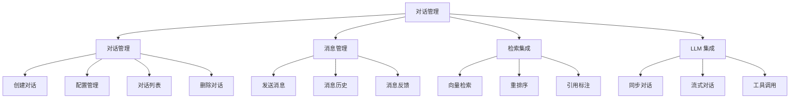
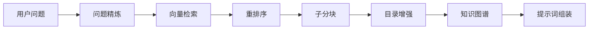
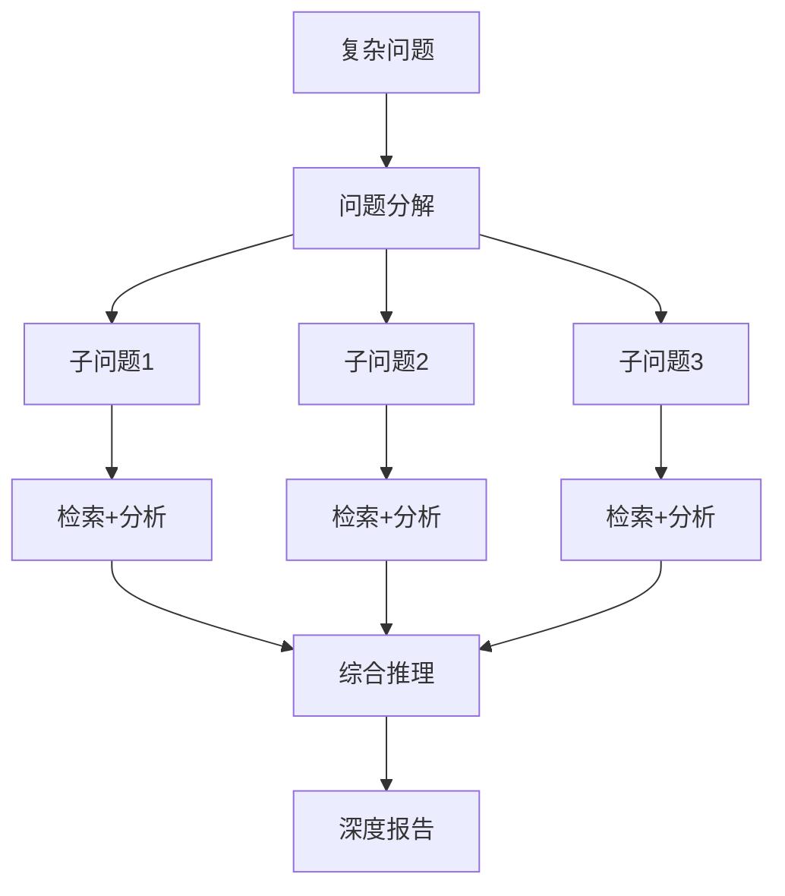

# 对话管理详细说明 (Chat/Dialog Management)

## 文档说明

本文档详细描述 RAGFlow 对话管理模块的业务流程、技术实现、API 接口和配置说明。

---

## 目录

- [1. 功能概述](#1-功能概述)
- [2. 核心业务流程](#2-核心业务流程)
- [3. 数据模型详解](#3-数据模型详解)
- [4. API 接口实现](#4-api-接口实现)
- [5. 对话配置详解](#5-对话配置详解)
- [6. 检索集成机制](#6-检索集成机制)
- [7. 流式输出实现](#7-流式输出实现)
- [8. 错误处理](#8-错误处理)

---

## 1. 功能概述

### 1.1 模块定位

对话管理模块是 RAGFlow 的核心交互模块，负责：
- 💬 **对话生命周期管理**: 创建、配置、更新、删除对话
- 📝 **消息管理**: 发送、接收、存储、检索对话消息
- 🔍 **RAG 检索**: 集成知识库检索，生成增强答案
- 🌊 **流式输出**: SSE 流式响应，提升用户体验
- 🎯 **引用溯源**: 标注答案来源，支持引用验证
- 🔧 **工具调用**: Function Calling 集成外部工具

### 1.2 主要功能模块



### 1.3 技术特性

| 特性 | 说明 |
|------|------|
| **异步架构** | 基于 Quart 的异步 API |
| **流式输出** | SSE (Server-Sent Events) |
| **多模型支持** | 支持多种 LLM、嵌入、重排模型 |
| **RAG 集成** | 向量检索 + 全文检索 + 图谱检索 |
| **引用溯源** | 自动插入引用标注 |
| **上下文管理** | 多轮对话上下文跟踪 |
| **工具调用** | Function Calling 支持 |
| **性能监控** | Langfuse 集成 |

---

## 2. 核心业务流程

### 2.1 对话创建流程

#### 流程图


#### 详细步骤

**步骤 1: 请求接收与验证**

- **API 端点**: [api/apps/dialog_app.py](../../api/apps/dialog_app.py#L29-L122)
- **函数**: `set_dialog()`
- **HTTP 方法**: POST `/api/v1/dialog/set`

**验证项**:
```python
# 1. 名称验证
- 类型检查: 必须是字符串
- 非空检查: 不能为空字符串
- 长度检查: 不超过 255 字节

# 2. 知识库验证
- 检查知识库是否存在
- 验证嵌入模型一致性（所有知识库必须使用相同的嵌入模型）

# 3. 提示词验证
- 必需参数检查
- 系统提示词中的变量占位符验证
```

**步骤 2: 名称去重处理**

- **工具函数**: `common.utils.duplicate_name()`
- **逻辑**: 如果名称已存在，自动添加数字后缀
  - 例如: "技术支持" → "技术支持(1)" → "技术支持(2)"

**步骤 3: 数据持久化**

- **服务层**: [api/db/services/dialog_service.py](../../api/db/services/dialog_service.py)
- **类**: `DialogService`
- **方法**: `save()`

**创建的数据结构**:
```json
{
  "id": "dialog_uuid",
  "tenant_id": "user_id",
  "name": "技术支持对话",
  "kb_ids": ["kb_uuid1", "kb_uuid2"],
  "llm_id": "gpt-4o-mini",
  "llm_setting": {
    "temperature": 0.1,
    "top_p": 0.3,
    "max_tokens": 512
  },
  "prompt_config": {
    "system": "You are a helpful assistant...",
    "prologue": "Hi! How can I help you?",
    "parameters": []
  },
  "similarity_threshold": 0.2,
  "vector_similarity_weight": 0.3,
  "top_n": 6,
  "top_k": 1024
}
```

#### 关键代码位置

| 组件 | 文件路径 | 函数/类 | 说明 |
|------|---------|---------|------|
| API 端点 | api/apps/dialog_app.py | `set_dialog()` | 创建/更新对话 |
| 服务层 | api/db/services/dialog_service.py | `DialogService` | 对话业务逻辑 |
| 数据模型 | api/db/db_models.py | `Dialog` | 对话数据模型 |

---

### 2.2 同步对话流程

#### 流程图


#### 详细步骤

**步骤 1: 消息发送**

- **API 端点**: [api/apps/conversation_app.py](../../api/apps/conversation_app.py#L167-L250)
- **函数**: `completion()`
- **HTTP 方法**: POST `/api/v1/conversation/completion`

**请求参数**:
```json
{
  "conversation_id": "conv_uuid",
  "messages": [
    {"role": "user", "content": "什么是 RAG？"}
  ],
  "stream": false
}
```

**步骤 2: 对话处理**

- **核心函数**: [api/db/services/dialog_service.py](../../api/db/services/dialog_service.py#L280-L563)
- **函数**: `async_chat(dialog, messages, stream, **kwargs)`

**处理流程**:
```python
# 1. 模型加载
- 加载 LLM、嵌入模型、重排模型
- 检查 Langfuse 监控配置

# 2. 问题精炼
- 多轮对话问题合并 (refine_multiturn)
- 跨语言翻译 (cross_languages)
- 关键词提取 (keyword extraction)

# 3. 知识检索
- 向量检索 (vector search)
- 重排序 (rerank)
- 目录增强 (toc_enhance)
- 子分块检索 (children chunks)
- 知识图谱检索 (knowledge graph)

# 4. 提示词构建
- 组装系统提示词
- 插入检索结果
- 添加引用提示

# 5. LLM 生成
- 调用 LLM 生成答案
- 插入引用标注
- 返回结果
```

**步骤 3: 答案处理**

- **函数**: `decorate_answer(answer)`
- **处理内容**:
  - 引用标注提取: `[ID:1]`, `[ID:2]`
  - 引用修复: `repair_bad_citation_formats()`
  - 引用插入: `retriever.insert_citations()`
  - 性能统计: 时间、Token 数量

#### 关键代码位置

| 组件 | 文件路径 | 函数/类 | 说明 |
|------|---------|---------|------|
| API 端点 | api/apps/conversation_app.py | `completion()` | 对话完成接口 |
| 对话引擎 | api/db/services/dialog_service.py | `async_chat()` | RAG 对话核心逻辑 |
| 检索服务 | rag/app/retrieval.py | `retriever.retrieval()` | 知识检索 |
| LLM 调用 | rag/llm/chat_model.py | `async_chat()` | LLM 异步调用 |

---

### 2.3 流式对话流程

#### 流程图


#### 详细步骤

**步骤 1: 开启流式响应**

- **API 端点**: 同 `completion()`
- **参数**: `"stream": true`
- **响应类型**: `text/event-stream`

**SSE 响应格式**:
```
data: {"code": 0, "message": "", "data": {"answer": "RAG", "reference": {}}}

data: {"code": 0, "message": "", "data": {"answer": "RAG 是检索", "reference": {}}}

data: {"code": 0, "message": "", "data": {"answer": "RAG 是检索增强生成", "reference": {...}}}

data: {"code": 0, "message": "", "data": true}
```

**步骤 2: 流式生成**

- **函数**: [api/db/services/dialog_service.py](../../api/db/services/dialog_service.py)
- **异步迭代器**: `async for ans in chat_mdl.async_chat_streamly(...)`

**流式输出策略**:
```python
# 1. 增量输出
- 仅输出新增内容 (delta)
- 累积完整答案 (full answer)

# 2. Token 缓冲
- 每 16 个 Token 输出一次
- 避免过于频繁的网络传输

# 3. 音频合成
- 对 delta 内容进行 TTS 转换
- 返回音频二进制数据
```

**步骤 3: 引用处理**

- **函数**: `decorate_answer()`
- **时机**: 流式输出完成后
- **处理**: 插入引用标注、聚合文档引用

#### 关键代码位置

| 组件 | 文件路径 | 函数/类 | 说明 |
|------|---------|---------|------|
| 流式生成 | api/db/services/dialog_service.py | `async_chat()` | 流式对话逻辑 |
| LLM 流式 | rag/llm/chat_model.py | `async_chat_streamly()` | LLM 流式调用 |
| SSE 封装 | api/apps/conversation_app.py | `stream()` | SSE 响应包装 |

---

### 2.4 消息反馈流程

#### 流程图

新增时序图：[04-message-feedback-sequence.puml](./04-message-feedback-sequence.puml)

**功能说明**:
- **点赞/点踩**: 用户对答案的评价
- **反馈记录**: 存储用户反馈数据
- **质量改进**: 用于模型优化

**API 端点**:
- **点赞**: POST `/api/v1/conversation/thumbup`
- **函数**: [api/apps/conversation_app.py](../../api/apps/conversation_app.py) `thumbup()`

**请求参数**:
```json
{
  "conversation_id": "conv_uuid",
  "message_id": "msg_uuid",
  "feedback": "thumbup"  // 或 "thumbdown"
}
```

---

### 2.5 相关问题推荐流程

**功能说明**:
- **智能推荐**: 基于当前对话推荐相关问题
- **引导用户**: 帮助用户深入探索话题

**API 端点**:
- **函数**: [api/apps/conversation_app.py](../../api/apps/conversation_app.py) `related_questions()`
- **HTTP 方法**: POST `/api/v1/conversation/related_questions`

**推荐逻辑**:
```python
# 1. 提取上下文
- 获取最近的对话历史
- 提取关键主题

# 2. 生成问题
- 使用 LLM 生成相关问题
- 基于知识库内容推荐

# 3. 返回结果
- 3-5 个相关问题
- 按相关性排序
```

---

## 3. 数据模型详解

### 3.1 Dialog 模型

**文件位置**: [api/db/db_models.py](../../api/db/db_models.py#L842-L875)

#### 字段说明

| 字段 | 类型 | 默认值 | 说明 |
|------|------|--------|------|
| **id** | VARCHAR(32) | UUID | 对话唯一标识 |
| **tenant_id** | VARCHAR(32) | - | 租户 ID（用户 ID） |
| **name** | VARCHAR(255) | - | 对话名称 |
| **description** | TEXT | NULL | 对话描述 |
| **icon** | TEXT | NULL | 图标 Base64 |
| **language** | VARCHAR(32) | Chinese | 语言（Chinese/English） |
| **llm_id** | VARCHAR(128) | - | LLM 模型 ID |
| **llm_setting** | JSON | {...} | LLM 配置 |
| **prompt_type** | VARCHAR(16) | simple | 提示词类型（simple/advanced） |
| **prompt_config** | JSON | {...} | 提示词配置 |
| **meta_data_filter** | JSON | {} | 元数据过滤器 |
| **similarity_threshold** | FLOAT | 0.2 | 相似度阈值 |
| **vector_similarity_weight** | FLOAT | 0.3 | 向量相似度权重 |
| **top_n** | INT | 6 | 最终返回分块数 |
| **top_k** | INT | 1024 | 初始检索分块数 |
| **do_refer** | CHAR(1) | "1" | 是否插入引用 |
| **rerank_id** | VARCHAR(128) | - | 重排模型 ID |
| **kb_ids** | JSON | [] | 关联知识库 ID 列表 |
| **status** | CHAR(1) | "1" | 状态（0:已删除, 1:有效） |

#### LLM Setting 配置

```json
{
  "temperature": 0.1,        // 温度：0.0-2.0，控制随机性
  "top_p": 0.3,              // 核采样：0.0-1.0
  "frequency_penalty": 0.7,  // 频率惩罚：-2.0-2.0
  "presence_penalty": 0.4,   // 存在惩罚：-2.0-2.0
  "max_tokens": 512          // 最大 Token 数
}
```

#### Prompt Config 配置

```json
{
  "system": "You are a helpful assistant...",
  "prologue": "Hi! I'm your assistant. What can I do for you?",
  "parameters": [
    {
      "key": "knowledge",
      "optional": false
    }
  ],
  "empty_response": "Sorry! No relevant content was found!",
  "quote": true,                    // 是否引用
  "tavily_api_key": "",             // Tavily 搜索 API Key
  "refine_multiturn": false,        // 多轮问题精炼
  "cross_languages": "",            // 跨语言翻译
  "keyword": false,                 // 关键词提取
  "reasoning": false,               // 深度推理
  "toc_enhance": false,             // 目录增强
  "use_kg": false                   // 使用知识图谱
}
```

---

### 3.2 Conversation 模型

**文件位置**: [api/db/db_models.py](../../api/db/db_models.py#L877-L886)

#### 字段说明

| 字段 | 类型 | 说明 |
|------|------|------|
| **id** | VARCHAR(32) | 对话轮次 UUID |
| **dialog_id** | VARCHAR(32) | 所属对话 ID |
| **name** | VARCHAR(255) | 轮次名称 |
| **message** | JSON | 消息列表 |
| **reference** | JSON | 引用列表 |
| **user_id** | VARCHAR(255) | 用户 ID |

#### Message 结构

```json
{
  "message": [
    {
      "role": "user",
      "content": "什么是 RAG？",
      "id": "msg_user_uuid"
    },
    {
      "role": "assistant",
      "content": "RAG 是检索增强生成...",
      "id": "msg_assistant_uuid"
    }
  ]
}
```

#### Reference 结构

```json
{
  "reference": [
    {
      "chunks": [
        {
          "id": "chunk_uuid",
          "content": "分块内容...",
          "doc_id": "doc_uuid",
          "kb_id": "kb_uuid",
          "similarity": 0.85
        }
      ],
      "doc_aggs": [
        {
          "doc_id": "doc_uuid",
          "doc_name": "文档名称.pdf",
          "count": 3
        }
      ]
    }
  ]
}
```

---

## 4. API 接口实现

### 4.1 RESTful API 设计

#### 对话管理 API

| 方法 | 路径 | 功能 | 权限 |
|------|------|------|------|
| POST | `/api/v1/dialog/set` | 创建/更新对话 | 登录用户 |
| GET | `/api/v1/dialog/get` | 获取对话详情 | 有权限用户 |
| POST | `/api/v1/dialog/list` | 查询对话列表 | 登录用户 |
| POST | `/api/v1/dialog/rm` | 删除对话 | 创建者 |

**文件位置**: [api/apps/dialog_app.py](../../api/apps/dialog_app.py)

#### 消息管理 API

| 方法 | 路径 | 功能 | 权限 |
|------|------|------|------|
| POST | `/api/v1/conversation/set` | 创建对话轮次 | 有权限用户 |
| GET | `/api/v1/conversation/get` | 获取对话轮次 | 有权限用户 |
| POST | `/api/v1/conversation/completion` | 发送消息（同步/流式） | 有权限用户 |
| POST | `/api/v1/conversation/list` | 获取消息列表 | 有权限用户 |
| POST | `/api/v1/conversation/rm` | 删除对话轮次 | 有权限用户 |
| POST | `/api/v1/conversation/thumbup` | 消息反馈 | 有权限用户 |
| POST | `/api/v1/conversation/related_questions` | 推荐相关问题 | 有权限用户 |

**文件位置**: [api/apps/conversation_app.py](../../api/apps/conversation_app.py)

### 4.2 统一响应格式

```json
{
  "code": 0,           // 状态码: 0=成功, 其他=错误
  "data": {...},       // 响应数据
  "message": "OK"      // 消息
}
```

### 4.3 错误码定义

```python
class RetCode:
    SUCCESS = 0                    # 成功
    ARGUMENT_ERROR = 101           # 参数错误
    DATA_ERROR = 102               # 数据错误
    OPERATING_ERROR = 103          # 操作错误
    AUTHENTICATION_ERROR = 104     # 认证错误
    AUTHORIZATION_ERROR = 105      # 授权错误
    SERVER_ERROR = 500             # 服务器错误
```

---

## 5. 对话配置详解

### 5.1 LLM 配置参数

#### Temperature (温度)

- **范围**: 0.0 - 2.0
- **默认**: 0.1
- **说明**: 控制输出的随机性
  - `0.0`: 确定性最高，输出稳定
  - `0.1-0.5`: 适合技术问答、客服
  - `0.7-1.0`: 适合创意写作
  - `>1.0`: 极度随机

#### Top P (核采样)

- **范围**: 0.0 - 1.0
- **默认**: 0.3
- **说明**: 控制采样范围
  - `0.1-0.3`: 保守，输出稳定
  - `0.5-0.7`: 平衡
  - `0.9-1.0`: 多样化

#### Frequency Penalty (频率惩罚)

- **范围**: -2.0 - 2.0
- **默认**: 0.7
- **说明**: 惩罚重复内容
  - `0.0`: 不惩罚
  - `0.7`: 中等惩罚，减少重复
  - `2.0`: 强烈惩罚，避免重复

#### Presence Penalty (存在惩罚)

- **范围**: -2.0 - 2.0
- **默认**: 0.4
- **说明**: 鼓励新主题
  - `0.0`: 不惩罚
  - `0.4`: 适度鼓励新话题
  - `2.0`: 强烈鼓励多样性

#### Max Tokens (最大 Token 数)

- **范围**: 1 - 模型上限
- **默认**: 512
- **说明**: 限制输出长度
  - `128-256`: 简短回答
  - `512-1024`: 中等长度
  - `2048+`: 长篇内容

### 5.2 检索配置参数

#### Similarity Threshold (相似度阈值)

- **范围**: 0.0 - 1.0
- **默认**: 0.2
- **说明**: 过滤低相关性结果
  - `0.1-0.3`: 宽松，召回率高
  - `0.4-0.6`: 平衡
  - `0.7+`: 严格，精确度高

#### Vector Similarity Weight (向量权重)

- **范围**: 0.0 - 1.0
- **默认**: 0.3
- **说明**: 向量检索的权重
  - `0.0-0.3`: 偏向全文检索
  - `0.5`: 平衡
  - `0.7-1.0`: 偏向语义检索

#### Top K (初始检索数)

- **范围**: 1 - 10000
- **默认**: 1024
- **说明**: 向量检索返回的候选数
  - `100-500`: 快速响应
  - `1024`: 平衡
  - `5000+`: 高召回率

#### Top N (最终返回数)

- **范围**: 1 - 100
- **默认**: 6
- **说明**: 重排后返回的分块数
  - `3-6`: 简洁答案
  - `8-12`: 详细答案
  - `20+`: 全面分析

### 5.3 提示词配置

#### 系统提示词 (System Prompt)

**变量占位符**:
- `{knowledge}`: 检索到的知识内容
- 自定义参数: `{param_name}`

**示例**:
```
You are a helpful technical support assistant.

Use the following knowledge to answer user questions:
{knowledge}

Requirements:
- Answer accurately based on the knowledge base
- If unsure, say "I don't know"
- Provide code examples when applicable
```

#### 开场白 (Prologue)

**示例**:
```
Hi! I'm your technical support assistant. 
I can help you with:
- API documentation
- Troubleshooting issues
- Best practices

What can I do for you today?
```

#### 空响应 (Empty Response)

**说明**: 当没有检索到相关内容时的回复

**示例**:
```
Sorry! I couldn't find relevant information in the knowledge base.
Please try rephrasing your question or contact support.
```

---

## 6. 检索集成机制

### 6.1 检索流程



### 6.2 检索模块

#### 向量检索 (Vector Retrieval)

- **文件**: `rag/app/retrieval.py`
- **函数**: `retriever.retrieval()`
- **输入**: 
  - 问题文本
  - 嵌入模型
  - 知识库 ID
  - 检索参数 (top_k, threshold, weight)
- **输出**: 
  - 分块列表 (chunks)
  - 文档聚合 (doc_aggs)

**检索策略**:
```python
# 1. 向量检索
- 使用嵌入模型将问题编码为向量
- 在 ES/Infinity 中进行相似度搜索
- 返回 top_k 个候选

# 2. 全文检索
- 使用 BM25 算法进行关键词匹配
- 与向量检索结果混合

# 3. 混合检索
- 向量得分 × vector_similarity_weight
- 全文得分 × (1 - vector_similarity_weight)
- 按混合得分排序
```

#### 重排序 (Rerank)

- **模型**: BGE-reranker, Cohere, Jina
- **函数**: `rerank_mdl.similarity()`
- **作用**: 重新计算问题与分块的相关性

**重排逻辑**:
```python
# 1. 输入: top_k 个候选分块
# 2. 使用重排模型计算相似度
# 3. 按新得分排序
# 4. 返回 top_n 个最相关分块
```

#### 子分块检索 (Children Chunks)

- **函数**: `retriever.retrieval_by_children()`
- **作用**: 扩展分块上下文

**逻辑**:
```python
# 对于每个检索到的分块:
# 1. 查找其父分块
# 2. 查找其子分块
# 3. 查找相邻分块
# 4. 组合形成更完整的上下文
```

#### 目录增强 (TOC Enhance)

- **函数**: `retriever.retrieval_by_toc()`
- **作用**: 基于文档目录结构增强检索

**逻辑**:
```python
# 1. 提取文档目录结构
# 2. 匹配问题与目录项
# 3. 检索目录项对应的内容
# 4. 补充到检索结果
```

#### 知识图谱检索 (Knowledge Graph)

- **开关**: `prompt_config.use_kg`
- **函数**: `kg_retriever.retrieval()`
- **作用**: 从知识图谱中检索实体和关系

### 6.3 引用标注

#### 自动插入引用

- **函数**: [api/db/services/dialog_service.py](../../api/db/services/dialog_service.py)
- **方法**: `retriever.insert_citations()`

**插入逻辑**:
```python
# 1. 分句处理
- 将答案分解为句子

# 2. 相似度计算
- 计算每个句子与检索分块的相似度
- 混合 Token 相似度和向量相似度

# 3. 插入标注
- 在句末插入 [ID:i]
- i 为分块索引

# 示例:
# "RAG 是检索增强生成[ID:0]。它结合了检索和生成两种技术[ID:1]。"
```

#### 引用格式修复

- **函数**: `repair_bad_citation_formats()`
- **作用**: 修复错误的引用格式

**修复规则**:
```python
# 错误格式:
- [1], [2]
- [[1]]
- (1)

# 正确格式:
- [ID:1]
- [ID:2]
```

---

## 7. 流式输出实现

### 7.1 SSE 协议

**响应头**:
```http
Content-Type: text/event-stream; charset=utf-8
Cache-Control: no-cache
Connection: keep-alive
X-Accel-Buffering: no
```

**数据格式**:
```
data: {"code": 0, "message": "", "data": {...}}

data: {"code": 0, "message": "", "data": {...}}

```

### 7.2 流式生成

**核心函数**: [api/db/services/dialog_service.py](../../api/db/services/dialog_service.py)

**异步生成器**:
```python
async def stream():
    async for ans in async_chat(dialog, messages, True, **req):
        # 结构化答案
        ans = structure_answer(conv, ans, message_id, conv.id)
        
        # 发送 SSE 事件
        yield "data:" + json.dumps({
            "code": 0,
            "message": "",
            "data": ans
        }, ensure_ascii=False) + "\n\n"
    
    # 结束标记
    yield "data:" + json.dumps({
        "code": 0,
        "message": "",
        "data": True
    }, ensure_ascii=False) + "\n\n"
```

### 7.3 Token 缓冲策略

**优化策略**:
```python
# 1. 避免频繁发送
- 累积至少 16 个 Token
- 减少网络开销

# 2. 增量输出
last_ans = ""
for new_ans in llm_stream:
    delta = new_ans[len(last_ans):]
    if len(tokenize(delta)) >= 16:
        yield delta
        last_ans = new_ans

# 3. 最后输出
if last_ans != new_ans:
    yield new_ans[len(last_ans):]
```

### 7.4 音频集成 (TTS)

**函数**: [api/db/services/dialog_service.py](../../api/db/services/dialog_service.py)
- `tts(tts_mdl, text)`: 文本转语音
- `clean_tts_text(text)`: 清理文本（移除 Markdown 等）

**流式音频**:
```python
async for delta in llm_stream:
    # 对 delta 进行 TTS
    audio_binary = tts(tts_mdl, delta)
    
    yield {
        "answer": delta,
        "audio_binary": audio_binary
    }
```

---

## 8. 错误处理

### 8.1 常见错误类型

#### 1. 参数错误

```json
// 缺少必需参数
{
  "code": 101,
  "message": "Missing required field: conversation_id",
  "data": false
}

// 参数类型错误
{
  "code": 101,
  "message": "Dialog name must be string",
  "data": false
}

// 参数长度超限
{
  "code": 101,
  "message": "Dialog name length exceeds 255 bytes",
  "data": false
}
```

#### 2. 权限错误

```json
// 无权限访问
{
  "code": 105,
  "message": "No authorization",
  "data": false
}

// 对话不存在
{
  "code": 102,
  "message": "Dialog not found",
  "data": false
}
```

#### 3. 模型错误

```json
// LLM 不可用
{
  "code": 500,
  "message": "Cannot use specified model gpt-4o",
  "data": false
}

// API Key 无效
{
  "code": 500,
  "message": "Invalid API key",
  "data": false
}
```

#### 4. 检索错误

```json
// 知识库为空
{
  "code": 0,
  "message": "",
  "data": {
    "answer": "Sorry! No relevant content was found!",
    "reference": {"chunks": [], "doc_aggs": []}
  }
}

// 嵌入模型不一致
{
  "code": 102,
  "message": "Datasets use different embedding models",
  "data": false
}
```

### 8.2 异常处理

**全局异常捕获**:
```python
# 在 API 层捕获
try:
    result = await process_request()
    return get_json_result(data=result)
except Exception as e:
    logging.exception(e)
    return server_error_response(e)
```

**流式错误处理**:
```python
async def stream():
    try:
        async for ans in async_chat(...):
            yield success_event(ans)
    except Exception as e:
        # 发送错误事件
        yield error_event(str(e))
    finally:
        # 发送结束事件
        yield end_event()
```

---

## 9. 高级功能

### 9.1 深度推理 (Deep Reasoning)

**功能说明**: 对复杂问题进行多步推理，生成深度分析报告

**配置开关**: `prompt_config.reasoning = true`

**核心组件**: `agentic_reasoning/deep_research.py`

**工作流程**:


**实现机制**:
```python
# 1. 创建推理器
reasoner = DeepResearcher(
    chat_mdl,
    prompt_config,
    retrieval_func
)

# 2. 开始推理
async for think in reasoner.thinking(kbinfos, question):
    if isinstance(think, str):
        # 推理过程
        thought = think
    else:
        # 流式输出
        yield think
```

**适用场景**:
- 研究报告生成
- 市场分析
- 技术调研
- 学术论文辅助

---

### 9.2 工具调用 (Function Calling)

**功能说明**: 集成外部工具，扩展 LLM 能力

**支持的工具类型**:
- **搜索工具**: Tavily Web Search
- **数据库查询**: SQL 生成和执行
- **API 调用**: 自定义 API 集成
- **计算工具**: 数学计算、代码执行

#### Tavily 网络搜索

**配置**: `prompt_config.tavily_api_key`

**实现位置**: [api/db/services/dialog_service.py](../../api/db/services/dialog_service.py)

**工作流程**:
```python
# 1. 检查配置
if prompt_config.get("tavily_api_key"):
    # 2. 创建 Tavily 客户端
    tav = Tavily(prompt_config["tavily_api_key"])
    
    # 3. 执行搜索
    tav_res = tav.retrieve_chunks(question)
    
    # 4. 合并到知识库检索结果
    kbinfos["chunks"].extend(tav_res["chunks"])
    kbinfos["doc_aggs"].extend(tav_res["doc_aggs"])
```

**使用场景**:
- 实时信息查询（新闻、天气）
- 知识库外的补充信息
- 事实核查

#### SQL 工具

**功能**: 自动生成 SQL 查询结构化数据

**函数**: [api/db/services/dialog_service.py](../../api/db/services/dialog_service.py) `use_sql()`

**工作流程**:
```python
# 1. 检查字段映射
field_map = KnowledgebaseService.get_field_map(dialog.kb_ids)

if field_map:
    # 2. 生成 SQL
    ans = await use_sql(
        question,
        field_map,
        tenant_id,
        chat_mdl,
        quote=True,
        kb_ids=dialog.kb_ids
    )
    
    # 3. 执行查询并返回结果
    if ans:
        yield ans
        return
```

**适用场景**:
- 结构化数据查询
- 报表生成
- 数据分析

#### 自定义工具绑定

**API 参数**: `tools`, `toolcall_session`

**实现**:
```python
# 绑定工具
if toolcall_session and tools:
    chat_mdl.bind_tools(toolcall_session, tools)

# LLM 可以调用这些工具
```

---

### 9.3 多模态支持

#### 图片理解

**模型类型**: `image2text`

**检测逻辑**:
```python
if TenantLLMService.llm_id2llm_type(dialog.llm_id) == "image2text":
    llm_model_config = TenantLLMService.get_model_config(
        dialog.tenant_id, 
        LLMType.IMAGE2TEXT, 
        dialog.llm_id
    )
```

**支持的场景**:
- 图片内容分析
- OCR 文字提取
- 图表理解

#### 语音合成 (TTS)

**函数**: [api/db/services/dialog_service.py](../../api/db/services/dialog_service.py) `tts()`

**API 端点**: POST `/api/v1/conversation/tts`

**实现**:
```python
# 流式输出时合成音频
async for delta in llm_stream:
    audio_binary = tts(tts_mdl, delta)
    yield {
        "answer": delta,
        "audio_binary": audio_binary
    }
```

**音频格式**: MP3/WAV

---

### 9.4 思维导图生成

**功能**: 自动生成对话内容的思维导图

**API 端点**: POST `/api/v1/conversation/mindmap`

**函数**: [api/db/services/dialog_service.py](../../api/db/services/dialog_service.py) `gen_mindmap()`

**生成格式**: Markdown 或 Mermaid

**使用场景**:
- 知识结构可视化
- 对话内容总结
- 学习笔记整理

---

## 10. 服务层架构

### 10.1 DialogService 服务

**文件位置**: [api/db/services/dialog_service.py](../../api/db/services/dialog_service.py)

**类**: `DialogService`

**继承关系**:
```python
CommonService (基类)
    ↓
DialogService (对话服务)
```

#### 核心方法

| 方法 | 功能 | 说明 |
|------|------|------|
| `save()` | 保存对话 | 创建新对话 |
| `get_by_id()` | 获取对话 | 按 ID 查询 |
| `query()` | 查询对话 | 多条件查询 |
| `update_by_id()` | 更新对话 | 更新配置 |
| `delete_by_id()` | 删除对话 | 软删除 |
| `get_models()` | 获取模型 | 加载 LLM/嵌入/重排模型 |
| `async_chat()` | 异步对话 | RAG 对话核心 |
| `async_chat_solo()` | 纯 LLM 对话 | 不使用知识库 |
| `async_ask()` | 智能问答 | API SDK 使用 |

---

### 10.2 ConversationService 服务

**文件位置**: [api/db/services/conversation_service.py](../../api/db/services/conversation_service.py)

**类**: `ConversationService`

#### 核心方法

| 方法 | 功能 | 说明 |
|------|------|------|
| `save()` | 保存轮次 | 创建对话轮次 |
| `get_by_id()` | 获取轮次 | 按 ID 查询 |
| `query()` | 查询轮次 | 多条件查询 |
| `update_by_id()` | 更新轮次 | 更新消息 |
| `structure_answer()` | 结构化答案 | 格式化输出 |
| `async_completion()` | 异步完成 | 对话完成接口 |

---

### 10.3 检索服务

**文件位置**: `rag/app/retrieval.py`

**类**: `Retriever`

#### 核心方法

| 方法 | 功能 | 说明 |
|------|------|------|
| `retrieval()` | 主检索接口 | 向量+全文混合检索 |
| `retrieval_by_children()` | 子分块检索 | 扩展上下文 |
| `retrieval_by_toc()` | 目录检索 | 基于目录结构 |
| `insert_citations()` | 插入引用 | 自动标注来源 |

---

## 11. 性能优化

### 11.1 异步处理

**核心优势**:
- 非阻塞 I/O
- 高并发处理
- 资源利用率高

**实现示例**:
```python
# 异步函数
async def async_chat(dialog, messages, stream=True, **kwargs):
    # 异步迭代
    async for ans in chat_mdl.async_chat_streamly(...):
        yield ans
```

**关键组件**:
- **Quart**: 异步 Web 框架
- **asyncio**: Python 异步库
- **aiohttp**: 异步 HTTP 客户端

---

### 11.2 缓存策略

#### 嵌入向量缓存

**策略**: 缓存常见问题的向量

**实现**:
```python
# Redis 缓存
cache_key = f"embd:{question_hash}"
vector = redis.get(cache_key)

if not vector:
    vector = embd_mdl.encode(question)
    redis.set(cache_key, vector, ex=3600)
```

#### 检索结果缓存

**策略**: 缓存高频问题的检索结果

**缓存时间**: 
- 热点问题: 1小时
- 一般问题: 10分钟

---

### 11.3 流式优化

#### Token 缓冲

**目的**: 减少网络传输次数

**实现**:
```python
last_ans = ""
for new_ans in llm_stream:
    delta = new_ans[len(last_ans):]
    
    # 累积至少 16 个 Token
    if num_tokens_from_string(delta) >= 16:
        yield delta
        last_ans = new_ans

# 输出剩余内容
if last_ans != new_ans:
    yield new_ans[len(last_ans):]
```

#### 压缩传输

**响应头**:
```http
Content-Encoding: gzip
```

**压缩率**: 通常可减少 60-80% 的传输量

---

### 11.4 数据库优化

#### 索引设计

```sql
-- 对话查询索引
CREATE INDEX idx_dialog_tenant_status 
ON dialog(tenant_id, status);

-- 消息查询索引
CREATE INDEX idx_conversation_dialog_user 
ON conversation(dialog_id, user_id);

-- 时间排序索引
CREATE INDEX idx_conversation_create_time 
ON conversation(create_time DESC);
```

#### 查询优化

**避免 N+1 查询**:
```python
# ❌ 不好的做法
for dialog in dialogs:
    kb_names = get_kb_names(dialog.kb_ids)

# ✅ 好的做法
kb_id_to_name = get_all_kb_names(all_kb_ids)
for dialog in dialogs:
    dialog.kb_names = [kb_id_to_name[id] for id in dialog.kb_ids]
```

---

### 11.5 监控和追踪

#### Langfuse 集成

**配置**: [api/db/services/tenant_langfuse_service.py](../../api/db/services/tenant_langfuse_service.py)

**追踪内容**:
- LLM 调用
- Token 使用量
- 响应时间
- 错误率

**实现**:
```python
# 创建追踪
langfuse_tracer = Langfuse(
    public_key=keys.public_key,
    secret_key=keys.secret_key,
    host=keys.host
)

# 开始生成追踪
langfuse_generation = langfuse_tracer.start_generation(
    trace_context=trace_context,
    name="chat",
    model=llm_model_config["llm_name"],
    input={"prompt": prompt, "messages": msg}
)

# 结束追踪
langfuse_generation.update(output=output)
langfuse_generation.end()
```

**性能指标**:
```python
# 时间统计
- 总耗时: 1500ms
- 检查 LLM: 10ms
- 绑定模型: 50ms
- 问题精炼: 200ms
- 检索: 800ms
- 生成答案: 440ms

# Token 统计
- 生成 Token: 256
- Token 速度: 582 token/s
```

---

## 12. 最佳实践

### 12.1 对话设计

#### 1. 命名规范

```python
# ✅ 好的命名
"客户技术支持对话"
"产品功能咨询助手"
"内部文档问答系统"

# ❌ 不好的命名
"测试对话"
"新建对话1"
"aaa"
```

#### 2. 提示词设计

**系统提示词模板**:
```
你是一个专业的{领域}助手。

你的职责:
1. {职责1}
2. {职责2}
3. {职责3}

使用以下知识库内容回答问题:
{knowledge}

回答要求:
- 准确: 基于知识库内容
- 简洁: 避免冗长
- 友好: 使用礼貌用语
- 引用: 标注信息来源
```

**开场白设计**:
```
您好！我是{系统名称}助手。

我可以帮您:
✓ {功能1}
✓ {功能2}
✓ {功能3}

请问有什么可以帮您的？
```

#### 3. 知识库选择

**单知识库**: 适合专业领域
```json
{
  "kb_ids": ["technical_docs_kb"]
}
```

**多知识库**: 适合综合问答
```json
{
  "kb_ids": [
    "product_docs_kb",
    "faq_kb",
    "api_reference_kb"
  ]
}
```

**注意**: 所有知识库必须使用相同的嵌入模型

---

### 12.2 参数调优

#### 场景 1: 客服问答

```json
{
  "llm_setting": {
    "temperature": 0.1,
    "top_p": 0.3,
    "max_tokens": 512
  },
  "similarity_threshold": 0.3,
  "vector_similarity_weight": 0.5,
  "top_n": 6
}
```

**特点**: 稳定、准确、基于知识库

---

#### 场景 2: 创意写作

```json
{
  "llm_setting": {
    "temperature": 0.9,
    "top_p": 0.8,
    "max_tokens": 2048
  },
  "similarity_threshold": 0.2,
  "vector_similarity_weight": 0.3,
  "top_n": 3
}
```

**特点**: 多样化、创造性、灵活

---

#### 场景 3: 技术文档

```json
{
  "llm_setting": {
    "temperature": 0.2,
    "top_p": 0.4,
    "max_tokens": 1024
  },
  "similarity_threshold": 0.4,
  "vector_similarity_weight": 0.7,
  "top_n": 8,
  "prompt_config": {
    "toc_enhance": true,
    "quote": true
  }
}
```

**特点**: 精确、详细、有引用

---

### 12.3 错误处理

#### 1. 优雅降级

```python
try:
    # 尝试 RAG 对话
    async for ans in async_chat(dialog, messages):
        yield ans
except Exception as e:
    # 降级为纯 LLM 对话
    logging.error(f"RAG failed: {e}")
    async for ans in async_chat_solo(dialog, messages):
        yield ans
```

#### 2. 空结果处理

```python
# 设置空响应提示
{
  "prompt_config": {
    "empty_response": "抱歉，我在知识库中没有找到相关信息。\n\n您可以:\n1. 换个方式提问\n2. 联系人工客服\n3. 查看帮助文档"
  }
}
```

#### 3. 超时处理

```python
# 设置超时时间
timeout = 30  # 秒

try:
    async with asyncio.timeout(timeout):
        result = await async_chat(...)
except asyncio.TimeoutError:
    return {
        "answer": "请求处理超时，请稍后重试",
        "reference": {}
    }
```

---

### 12.4 安全实践

#### 1. 输入验证

```python
# 长度限制
MAX_MESSAGE_LENGTH = 10000

if len(message) > MAX_MESSAGE_LENGTH:
    raise ValueError("Message too long")

# 内容过滤
if contains_harmful_content(message):
    raise ValueError("Harmful content detected")
```

#### 2. 权限控制

```python
# 检查对话访问权限
if not check_dialog_access(dialog_id, user_id):
    raise PermissionError("No access to this dialog")

# 检查知识库权限
for kb_id in dialog.kb_ids:
    if not check_kb_access(kb_id, user_id):
        raise PermissionError(f"No access to KB {kb_id}")
```

#### 3. API Key 保护

```python
# 不在日志中暴露 API Key
logging.info(f"Using model: {model_name}")  # ✅
logging.info(f"API Key: {api_key}")         # ❌
```

---

### 12.5 用户体验优化

#### 1. 流式输出

**推荐**: 对于 >100 Token 的回答使用流式

```python
{
  "stream": true  # 启用流式
}
```

#### 2. 加载提示

**前端实现**:
```javascript
// 显示加载动画
showLoading("正在思考...");

// 开始接收流式数据
eventSource.onmessage = (event) => {
  const data = JSON.parse(event.data);
  updateAnswer(data.answer);
};
```

#### 3. 引用展示

**前端实现**:
```javascript
// 高亮引用标注
answer = answer.replace(
  /\[ID:(\d+)\]/g,
  '<sup class="citation" data-id="$1">[$1]</sup>'
);

// 点击引用显示来源
$('.citation').click(function() {
  const chunkId = $(this).data('id');
  showChunkDetail(chunkId);
});
```

---

## 13. 故障排查

### 13.1 常见问题

#### 问题 1: 对话无响应

**症状**: 请求发送后长时间无响应

**排查步骤**:
```python
# 1. 检查 LLM 配置
check_llm_api_key(dialog.llm_id)

# 2. 检查知识库状态
check_kb_status(dialog.kb_ids)

# 3. 检查日志
tail -f logs/ragflow_server.log
```

**可能原因**:
- LLM API Key 无效
- 知识库为空
- 网络超时

---

#### 问题 2: 检索结果不相关

**症状**: 返回的分块与问题无关

**排查步骤**:
```python
# 1. 检查相似度阈值
if similarity_threshold > 0.5:
    # 阈值过高，降低到 0.2-0.4

# 2. 检查嵌入模型
check_embedding_model_version()

# 3. 测试检索
test_retrieval(question, kb_ids)
```

**解决方案**:
- 降低相似度阈值
- 增加检索数量 (top_k)
- 使用重排序模型

---

#### 问题 3: 答案无引用

**症状**: 答案中没有 `[ID:n]` 标注

**排查步骤**:
```python
# 1. 检查引用配置
if not prompt_config.get("quote", True):
    # 引用被禁用

# 2. 检查 do_refer 字段
if dialog.do_refer != "1":
    # 引用被关闭

# 3. 检查嵌入模型
if not embd_mdl:
    # 无法插入引用
```

**解决方案**:
```json
{
  "do_refer": "1",
  "prompt_config": {
    "quote": true
  }
}
```

---

### 13.2 性能问题

#### 问题: 响应速度慢

**排查指标**:
```python
# 查看性能统计
{
  "prompt": "...\n\n## Time elapsed:\n  - Total: 3500ms\n  - Retrieval: 2800ms\n  - Generate: 700ms"
}
```

**优化方案**:

**1. 检索优化**
```python
# 减少检索数量
"top_k": 500,  # 从 1024 降低
"top_n": 4,    # 从 8 降低
```

**2. 使用缓存**
```python
# 启用结果缓存
cache_retrieval_results = True
```

**3. 并行处理**
```python
# 并行调用多个知识库
results = await asyncio.gather(*[
    retrieve_from_kb(kb_id) for kb_id in kb_ids
])
```

---

## 14. API SDK 使用

### 14.1 Python SDK

**安装**:
```bash
pip install ragflow-sdk
```

**示例代码**:
```python
from ragflow import RAGFlow

# 初始化客户端
client = RAGFlow(
    api_key="your_api_key",
    base_url="http://localhost:9380"
)

# 创建对话
dialog = client.create_dialog(
    name="技术支持",
    kb_ids=["kb_uuid"],
    llm_id="gpt-4o-mini"
)

# 发送消息
response = dialog.chat(
    question="什么是 RAG？",
    stream=True
)

# 流式接收
for chunk in response:
    print(chunk.answer, end="", flush=True)
```

---

### 14.2 HTTP API

**示例**: cURL 请求

```bash
# 创建对话
curl -X POST http://localhost:9380/api/v1/dialog/set \
  -H "Authorization: Bearer $TOKEN" \
  -H "Content-Type: application/json" \
  -d '{
    "name": "技术支持",
    "kb_ids": ["kb_uuid"],
    "llm_id": "gpt-4o-mini"
  }'

# 发送消息
curl -X POST http://localhost:9380/api/v1/conversation/completion \
  -H "Authorization: Bearer $TOKEN" \
  -H "Content-Type: application/json" \
  -d '{
    "conversation_id": "conv_uuid",
    "messages": [
      {"role": "user", "content": "什么是 RAG？"}
    ],
    "stream": false
  }'
```

---

## 相关文档

- [对话模块 README](./README.md)
- [创建对话时序图](./01-create-dialog-sequence.puml)
- [同步对话时序图](./02-sync-chat-sequence.puml)
- [流式对话时序图](./03-stream-chat-sequence.puml)
- [消息反馈时序图](./04-message-feedback-sequence.puml)
- [检索集成时序图](./05-retrieval-integration-sequence.puml)
