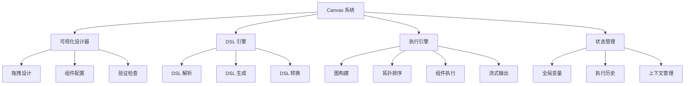

# Canvas 设计 (Canvas Design)

## 目录

- [1. 功能概述](#1-功能概述)
- [2. 核心业务流程](#2-核心业务流程)
- [3. 数据模型详解](#3-数据模型详解)
- [4. API 接口实现](#4-api-接口实现)
- [5. 服务层架构](#5-服务层架构)
- [6. 配置参数详解](#6-配置参数详解)
- [7. 错误处理](#7-错误处理)
- [8. 性能优化](#8-性能优化)
- [9. 最佳实践](#9-最佳实践)

---

## 1. 功能概述

### 1.1 模块定位

Canvas 是 Agent 系统的可视化设计和执行引擎，提供拖拽式工作流设计界面和 DSL (Domain Specific Language) 执行能力。用户通过 Canvas 设计 Agent 流程，系统将设计转换为可执行的 DSL，并按照依赖关系编排执行组件。

Canvas 采用有向无环图（DAG）结构，通过拓扑排序确定执行顺序，支持并发执行、条件分支、循环迭代等复杂控制流，提供流式输出和实时状态反馈。

### 1.2 主要功能模块



### 1.3 技术特性

| 特性 | 说明 |
|------|------|
| 可视化设计 | 拖拽式组件编排，直观的流程设计 |
| DSL 定义 | JSON 格式的 DSL，支持版本控制 |
| DAG 执行 | 有向无环图拓扑排序，自动依赖解析 |
| 并发支持 | 无依赖组件并发执行，提升性能 |
| 流式输出 | SSE 实时推送执行结果 |
| 状态管理 | 全局变量和组件输出管理 |
| 错误恢复 | 支持断点续传和错误重试 |

---

## 2. 核心业务流程

### 2.1 Canvas 创建流程

#### 详细步骤

**步骤 1: 创建 Canvas**
- **API 端点**: [api/apps/canvas_app.py](../../api/apps/canvas_app.py#L100-L150)
- **函数**: `create_canvas()`
- **说明**: 创建新的 Canvas 实例，初始化 DSL 结构

**步骤 2: 初始化 DSL**
- **文件**: [agent/canvas.py](../../agent/canvas.py#L50-L100)
- **函数**: `Canvas.__init__()`
- **说明**: 初始化 DSL 结构，包含 components、history、path、globals

**步骤 3: 持久化存储**
- **文件**: [api/db/services/canvas_service.py](../../api/db/services/canvas_service.py#L50-L100)
- **函数**: `CanvasService.save()`
- **说明**: 保存 Canvas 到数据库

#### 关键代码位置
| 组件 | 文件路径 | 函数/类 | 说明 |
|------|---------|---------|------|
| Canvas API | [api/apps/canvas_app.py](../../api/apps/canvas_app.py#L100) | `create_canvas()` | Canvas 创建接口 |
| Canvas 类 | [agent/canvas.py](../../agent/canvas.py#L50) | `Canvas.__init__()` | Canvas 初始化 |
| Canvas Service | [api/db/services/canvas_service.py](../../api/db/services/canvas_service.py#L50) | `CanvasService` | Canvas 服务层 |

### 2.2 Canvas 设计流程

#### 详细步骤

**步骤 1: 添加组件**
- **说明**: 用户从组件库拖拽组件到画布

**步骤 2: 配置参数**
- **说明**: 配置组件的输入参数和属性

**步骤 3: 连接组件**
- **说明**: 建立组件间的数据流连接

**步骤 4: 验证流程**
- **API 端点**: [api/apps/canvas_app.py](../../api/apps/canvas_app.py#L200-L250)
- **函数**: `validate_canvas()`
- **说明**: 验证 Canvas 结构的合法性

**步骤 5: 保存设计**
- **API 端点**: [api/apps/canvas_app.py](../../api/apps/canvas_app.py#L150-L200)
- **函数**: `update_canvas()`
- **说明**: 保存 Canvas 设计到数据库

### 2.3 Canvas 执行流程

#### 流程图


#### 详细步骤

**步骤 1: 加载 Canvas**
- **文件**: [agent/canvas.py](../../agent/canvas.py#L100-L150)
- **函数**: `Canvas.load_from_dsl()`
- **说明**: 从数据库加载 Canvas DSL

**步骤 2: 解析 DSL**
- **文件**: [agent/canvas.py](../../agent/canvas.py#L150-L200)
- **函数**: `Canvas.parse_dsl()`
- **说明**: 解析 DSL，创建组件实例

**步骤 3: 构建执行图**
- **文件**: [agent/canvas.py](../../agent/canvas.py#L250-L300)
- **类**: `Graph`
- **说明**: 构建 DAG 执行图

**步骤 4: 拓扑排序**
- **文件**: [agent/canvas.py](../../agent/canvas.py#L300-L350)
- **函数**: `Graph.topological_sort()`
- **说明**: 对组件进行拓扑排序，确定执行顺序

**步骤 5: 执行组件**
- **文件**: [agent/canvas.py](../../agent/canvas.py#L400-L500)
- **函数**: `Canvas.run()`
- **说明**: 按顺序执行组件

**步骤 6: 流式输出**
- **文件**: [agent/canvas.py](../../agent/canvas.py#L500-L550)
- **函数**: `Canvas.stream_output()`
- **说明**: 实时推送执行结果

**步骤 7: 状态更新**
- **文件**: [agent/canvas.py](../../agent/canvas.py#L550-L600)
- **函数**: `Canvas.update_state()`
- **说明**: 更新执行历史和状态

#### 关键代码位置
| 组件 | 文件路径 | 函数/类 | 说明 |
|------|---------|---------|------|
| Canvas 加载 | [agent/canvas.py](../../agent/canvas.py#L100) | `load_from_dsl()` | 加载 Canvas |
| DSL 解析 | [agent/canvas.py](../../agent/canvas.py#L150) | `parse_dsl()` | 解析 DSL |
| 图构建 | [agent/canvas.py](../../agent/canvas.py#L250) | `Graph` | DAG 图类 |
| 拓扑排序 | [agent/canvas.py](../../agent/canvas.py#L300) | `topological_sort()` | 拓扑排序 |
| Canvas 运行 | [agent/canvas.py](../../agent/canvas.py#L400) | `run()` | 执行入口 |

### 2.4 流式输出流程

#### 详细步骤

**步骤 1: 开启流式模式**
- **说明**: 客户端请求时指定 `stream=true`

**步骤 2: SSE 连接**
- **说明**: 建立 Server-Sent Events 连接

**步骤 3: 实时推送**
- **说明**: 组件执行时实时推送事件

**步骤 4: 完成通知**
- **说明**: 所有组件执行完成后推送 `[DONE]`

---

## 3. 数据模型详解

### 3.1 Canvas (画布模型)

**文件位置**: [api/db/models/canvas.py](../../api/db/models/canvas.py#L20-L100)

#### 数据库字段
| 字段 | 类型 | 说明 |
|------|------|------|
| id | STRING(32) | Canvas UUID |
| name | STRING(128) | Canvas 名称 |
| description | TEXT | Canvas 描述 |
| tenant_id | STRING(32) | 租户 ID |
| dsl | JSON | DSL 定义 |
| status | ENUM | 状态 (draft, published, archived) |
| create_time | DATETIME | 创建时间 |
| update_time | DATETIME | 更新时间 |
| create_by | STRING(32) | 创建人 |

### 3.2 DSL 结构

**完整示例**:
```json
{
  "components": {
    "begin": {
      "obj": {
        "component_name": "Begin",
        "params": {}
      },
      "downstream": ["llm_0"],
      "upstream": []
    },
    "llm_0": {
      "obj": {
        "component_name": "LLM",
        "params": {
          "llm_id": "llm_uuid",
          "prompt": "{{sys.query}}"
        }
      },
      "downstream": ["switch_0"],
      "upstream": ["begin"]
    },
    "switch_0": {
      "obj": {
        "component_name": "Switch",
        "params": {
          "condition": "{{llm_0.intent}}",
          "cases": {
            "search": "search_branch",
            "chat": "chat_branch"
          }
        }
      },
      "downstream": [],
      "upstream": ["llm_0"]
    }
  },
  "history": [
    {
      "component_id": "begin",
      "status": "completed",
      "timestamp": "2024-01-01T00:00:00Z"
    }
  ],
  "path": ["begin", "llm_0", "switch_0"],
  "globals": {
    "sys.query": "",
    "sys.user_id": "",
    "sys.conversation_turns": 0,
    "sys.files": [],
    "sys.session_id": ""
  }
}
```

#### DSL 字段说明

**components** - 组件字典
- `key`: 组件 ID
- `obj`: 组件对象配置
- `downstream`: 下游组件 ID 列表
- `upstream`: 上游组件 ID 列表

**history** - 执行历史
- `component_id`: 组件 ID
- `status`: 执行状态
- `timestamp`: 执行时间
- `output`: 输出结果

**path** - 执行路径
- 按执行顺序记录已执行的组件 ID

**globals** - 全局变量
- `sys.query`: 用户输入
- `sys.user_id`: 用户 ID
- `sys.conversation_turns`: 对话轮次
- `sys.files`: 附件文件
- 自定义全局变量

### 3.3 Graph (执行图)

**文件位置**: [agent/canvas.py](../../agent/canvas.py#L20-L100)

#### 核心属性
| 属性 | 类型 | 说明 |
|------|------|------|
| nodes | Dict[str, Node] | 节点字典 |
| edges | List[Edge] | 边列表 |
| in_degree | Dict[str, int] | 入度统计 |

#### 核心方法
| 方法 | 功能 | 说明 |
|------|------|------|
| `add_node()` | 添加节点 | 添加组件节点 |
| `add_edge()` | 添加边 | 添加组件连接 |
| `topological_sort()` | 拓扑排序 | 计算执行顺序 |
| `get_parallel_groups()` | 获取并发组 | 识别可并发执行的组件 |

---

## 4. API 接口实现

### 4.1 RESTful API 设计

#### API 路由表
| 方法 | 路径 | 功能 | 权限 |
|------|------|------|------|
| POST | `/api/v1/canvas` | 创建 Canvas | 登录用户 |
| GET | `/api/v1/canvas/{id}` | 获取 Canvas | 登录用户 |
| PUT | `/api/v1/canvas/{id}` | 更新 Canvas | Canvas 所有者 |
| DELETE | `/api/v1/canvas/{id}` | 删除 Canvas | Canvas 所有者 |
| POST | `/api/v1/canvas/{id}/run` | 执行 Canvas | 登录用户 |
| POST | `/api/v1/canvas/{id}/validate` | 验证 Canvas | 登录用户 |
| GET | `/api/v1/canvas/{id}/history` | 获取执行历史 | Canvas 所有者 |

**文件位置**: [api/apps/canvas_app.py](../../api/apps/canvas_app.py)

### 4.2 创建 Canvas

**请求示例**:
```http
POST /api/v1/canvas
Authorization: Bearer {token}
Content-Type: application/json

{
  "name": "智能客服 Agent",
  "description": "基于 RAG 的智能客服系统",
  "dsl": {
    "components": {...},
    "globals": {...}
  }
}
```

**响应格式**:
```json
{
  "code": 0,
  "data": {
    "id": "canvas_uuid",
    "name": "智能客服 Agent",
    "status": "draft",
    "create_time": "2024-01-01T00:00:00Z"
  }
}
```

### 4.3 执行 Canvas

**请求示例**:
```http
POST /api/v1/canvas/{canvas_id}/run
Authorization: Bearer {token}
Content-Type: application/json

{
  "query": "用户问题",
  "stream": true,
  "globals": {
    "sys.user_id": "user_uuid"
  }
}
```

**响应格式（流式）**:
```
data: {"event": "start", "component_id": "begin"}

data: {"event": "running", "component_id": "llm_0", "content": "正在思考..."}

data: {"event": "completed", "component_id": "llm_0", "content": "答案内容"}

data: {"event": "running", "component_id": "switch_0"}

data: {"event": "completed", "component_id": "switch_0"}

data: [DONE]
```

### 4.4 验证 Canvas

**请求示例**:
```http
POST /api/v1/canvas/{canvas_id}/validate
Authorization: Bearer {token}
```

**响应格式**:
```json
{
  "code": 0,
  "data": {
    "valid": true,
    "errors": [],
    "warnings": [
      "组件 llm_0 未连接下游组件"
    ]
  }
}
```

---

## 5. 服务层架构

### 5.1 Canvas 服务

**文件位置**: [api/db/services/canvas_service.py](../../api/db/services/canvas_service.py)

#### 核心方法
| 方法 | 功能 | 说明 |
|------|------|------|
| `get_by_id()` | 按ID查询 | 获取 Canvas 详情 |
| `save()` | 保存 Canvas | 创建或更新 |
| `delete()` | 删除 Canvas | 软删除 |
| `list_by_tenant()` | 列表查询 | 获取租户下所有 Canvas |
| `duplicate()` | 复制 Canvas | 创建副本 |

### 5.2 DSL 验证服务

**文件位置**: [agent/canvas.py](../../agent/canvas.py#L600-L700)

#### 验证规则
- **结构验证**: 检查 DSL 结构完整性
- **组件验证**: 验证组件类型和参数
- **连接验证**: 检查组件连接的合法性
- **循环检测**: 检测是否存在循环依赖
- **参数验证**: 验证全局变量和组件参数

### 5.3 执行引擎

**文件位置**: [agent/canvas.py](../../agent/canvas.py#L150-L600)

#### 核心功能
- **图构建**: 根据 DSL 构建执行图
- **拓扑排序**: 计算组件执行顺序
- **并发调度**: 识别并发执行机会
- **状态管理**: 管理执行状态和中间结果
- **异常处理**: 捕获和处理执行异常

---

## 6. 配置参数详解

### 6.1 Canvas 全局配置

```json
{
  "max_execution_time": 300,
  "enable_parallel": true,
  "max_parallel_tasks": 5,
  "enable_cache": true,
  "cache_ttl": 3600,
  "enable_streaming": true
}
```

#### 配置项说明
| 配置项 | 类型 | 默认值 | 说明 |
|--------|------|--------|------|
| max_execution_time | number | 300 | 最大执行时间（秒） |
| enable_parallel | boolean | true | 是否启用并发执行 |
| max_parallel_tasks | number | 5 | 最大并发任务数 |
| enable_cache | boolean | true | 是否启用组件缓存 |
| cache_ttl | number | 3600 | 缓存过期时间（秒） |
| enable_streaming | boolean | true | 是否支持流式输出 |

### 6.2 全局变量 (globals)

#### 系统内置变量
| 变量 | 类型 | 说明 |
|------|------|------|
| sys.query | string | 用户输入 |
| sys.user_id | string | 用户 ID |
| sys.session_id | string | 会话 ID |
| sys.conversation_turns | number | 对话轮次 |
| sys.files | array | 上传文件列表 |
| sys.timestamp | string | 当前时间戳 |

#### 自定义变量
```json
{
  "custom.user_type": "vip",
  "custom.language": "zh-CN",
  "custom.context": {}
}
```

### 6.3 组件连接配置

```json
{
  "component_id": {
    "downstream": ["next_component_id"],
    "upstream": ["prev_component_id"],
    "condition": "{{llm_0.success}}",
    "timeout": 30
  }
}
```

---

## 7. 错误处理

### 7.1 常见错误类型

#### 1. DSL 解析错误
```json
{
  "code": 400,
  "message": "Invalid DSL structure: missing 'components' field",
  "data": false
}
```

#### 2. 循环依赖错误
```json
{
  "code": 400,
  "message": "Circular dependency detected: llm_0 -> switch_0 -> llm_0",
  "data": false
}
```

#### 3. 组件执行失败
```json
{
  "code": 500,
  "message": "Component execution failed",
  "data": {
    "component_id": "llm_0",
    "error": "LLM API request timeout"
  }
}
```

#### 4. 执行超时
```json
{
  "code": 408,
  "message": "Canvas execution timeout",
  "data": {
    "executed_components": ["begin", "llm_0"],
    "pending_components": ["switch_0", "end"]
  }
}
```

### 7.2 错误处理策略

| 错误类型 | 处理策略 |
|---------|---------|
| DSL 错误 | 创建/更新时验证，拒绝保存 |
| 组件失败 | 记录错误，终止执行或跳过 |
| 超时错误 | 强制终止，返回部分结果 |
| 网络错误 | 重试3次，失败后记录日志 |

### 7.3 断点续传

**策略**:
- 记录已执行的组件列表
- 保存中间结果到 history
- 支持从中断点继续执行

---

## 8. 性能优化

### 8.1 并发执行优化

**实现位置**: [agent/canvas.py](../../agent/canvas.py#L450-L550)

#### 并发策略
- 识别无依赖关系的组件
- 按层级组织并发组
- 使用 asyncio 并发执行
- 控制最大并发数

#### 并发示例
```python
async def execute_parallel_group(components):
    tasks = [comp.run() for comp in components]
    results = await asyncio.gather(*tasks, return_exceptions=True)
    return results
```

### 8.2 缓存优化

**策略**:
- 缓存组件执行结果
- 缓存 DSL 解析结果
- 使用 LRU 缓存淘汰策略

### 8.3 资源管理

**优化点**:
- 限制最大执行时间
- 监控内存使用
- 及时释放组件资源
- 控制最大并发数

### 8.4 流式输出优化

**策略**:
- 使用 SSE 减少连接开销
- 压缩输出内容
- 批量发送小消息
- 控制推送频率

---

## 9. 最佳实践

### 9.1 Canvas 设计规范

#### 命名规范
- Canvas 名称: 简洁明了，描述业务场景
- 组件 ID: 使用 `{component_name}_{index}` 格式
- 全局变量: 使用 `custom.` 前缀

#### 结构规范
- 每个 Canvas 应有明确的开始节点（Begin）
- 控制分支应有默认路径
- 避免过深的嵌套结构
- 合理使用全局变量

#### 性能规范
- 避免过多串行执行
- 识别并发执行机会
- 控制 Canvas 复杂度（组件数 < 50）
- 设置合理的超时时间

### 9.2 场景示例

#### 场景 1: 简单问答
**需求**: 用户提问，LLM 直接回答

**DSL**:
```json
{
  "components": {
    "begin": {
      "obj": {"component_name": "Begin"},
      "downstream": ["llm_0"]
    },
    "llm_0": {
      "obj": {
        "component_name": "LLM",
        "params": {
          "prompt": "{{sys.query}}"
        }
      },
      "upstream": ["begin"],
      "downstream": []
    }
  }
}
```

#### 场景 2: RAG 检索增强
**需求**: 先检索知识库，再生成答案

**DSL**:
```json
{
  "components": {
    "begin": {
      "downstream": ["retrieval_0"]
    },
    "retrieval_0": {
      "obj": {
        "component_name": "Retrieval",
        "params": {
          "query": "{{sys.query}}",
          "kb_ids": ["kb_uuid"]
        }
      },
      "downstream": ["llm_0"]
    },
    "llm_0": {
      "obj": {
        "component_name": "LLM",
        "params": {
          "prompt": "根据以下内容回答：\n{{retrieval_0.content}}\n\n问题：{{sys.query}}"
        }
      },
      "downstream": []
    }
  }
}
```

#### 场景 3: 条件路由
**需求**: 根据意图识别路由到不同处理流程

**DSL**:
```json
{
  "components": {
    "begin": {
      "downstream": ["intent_classifier"]
    },
    "intent_classifier": {
      "obj": {
        "component_name": "LLM",
        "params": {
          "prompt": "识别意图：{{sys.query}}\n返回: search/chat/task"
        }
      },
      "downstream": ["switch_0"]
    },
    "switch_0": {
      "obj": {
        "component_name": "Switch",
        "params": {
          "condition": "{{intent_classifier.intent}}",
          "cases": {
            "search": "search_flow",
            "chat": "chat_flow",
            "task": "task_flow"
          }
        }
      },
      "downstream": []
    }
  }
}
```

#### 场景 4: 批量处理
**需求**: 遍历文件列表，对每个文件执行处理

**DSL**:
```json
{
  "components": {
    "begin": {
      "downstream": ["loop_0"]
    },
    "loop_0": {
      "obj": {
        "component_name": "Loop",
        "params": {
          "items": "{{sys.files}}",
          "body": "process_file"
        }
      },
      "downstream": ["summary"]
    },
    "process_file": {
      "obj": {
        "component_name": "LLM",
        "params": {
          "prompt": "分析文件：{{loop.item}}"
        }
      },
      "downstream": []
    },
    "summary": {
      "obj": {
        "component_name": "LLM",
        "params": {
          "prompt": "总结所有结果：{{loop_0.results}}"
        }
      },
      "downstream": []
    }
  }
}
```

### 9.3 调试技巧

#### 启用详细日志
```python
import logging
logging.getLogger('agent.canvas').setLevel(logging.DEBUG)
```

#### 查看执行路径
```python
canvas = Canvas.load(canvas_id)
print(canvas.dsl["path"])
```

#### 查看执行历史
```python
history = canvas.dsl["history"]
for record in history:
    print(f"{record['component_id']}: {record['status']}")
```

#### 验证 DSL
```python
errors = canvas.validate()
if errors:
    print("验证失败:", errors)
```

### 9.4 迁移和版本控制

#### DSL 版本管理
- 使用 Git 管理 DSL 文件
- 添加版本号字段
- 支持版本回滚

#### Canvas 导入导出
```python
# 导出
dsl = canvas.export_dsl()
with open("canvas.json", "w") as f:
    json.dump(dsl, f, indent=2)

# 导入
with open("canvas.json", "r") as f:
    dsl = json.load(f)
canvas = Canvas.import_dsl(dsl)
```

---

## 相关文档

- [Agent 系统 README](./README.md)
- [Canvas 执行流程时序图](./01-canvas-execution-sequence.puml)
- [组件通信时序图](./03-component-communication-sequence.puml)
- [Agent 开发指南](./agent-development-guide.md)
- [组件管理文档](./component-management.md)
- [工具集成文档](./tool-integration.md)
