# 组件管理 (Component Management)

## 目录

- [1. 功能概述](#1-功能概述)
- [2. 核心业务流程](#2-核心业务流程)
- [3. 数据模型详解](#3-数据模型详解)
- [4. API 接口实现](#4-api-接口实现)
- [5. 服务层架构](#5-服务层架构)
- [6. 配置参数详解](#6-配置参数详解)
- [7. 错误处理](#7-错误处理)
- [8. 性能优化](#8-性能优化)
- [9. 最佳实践](#9-最佳实践)

---

## 1. 功能概述

### 1.1 模块定位

组件管理模块是 Agent 系统的核心执行单元，提供了可复用、可配置的执行节点。每个组件封装了特定的业务逻辑，通过统一的接口进行交互，支持灵活组合形成复杂的 Agent 工作流。

组件系统采用插件化架构，基于抽象基类定义统一接口，通过动态加载机制实现组件的注册和实例化。所有组件均继承自 `ComponentBase`，实现 `_run()` 方法完成核心业务逻辑。

### 1.2 组件分类

```mermaid
graph TB
    Components[组件系统]
    Components --> Control[控制流组件]
    Components --> Data[数据处理组件]
    Components --> AI[AI 组件]
    Components --> Integration[集成组件]
    
    Control --> Begin[Begin 开始节点]
    Control --> Switch[Switch 条件分支]
    Control --> Loop[Loop 循环]
    Control --> Iteration[Iteration 迭代]
    Control --> Categorize[Categorize 分类]
    
    Data --> VarAssigner[Variable Assigner 变量赋值]
    Data --> DataOps[Data Operations 数据操作]
    Data --> ListOps[List Operations 列表操作]
    Data --> Excel[Excel Processor]
    Data --> StringTrans[String Transform]
    
    AI --> LLM[LLM 大语言模型]
    AI --> AgentTools[Agent with Tools]
    AI --> Retrieval[Retrieval 检索]
    
    Integration --> Message[Message 消息]
    Integration --> DocsGen[Docs Generator]
    Integration --> Invoke[Invoke 调用]
```



### 1.3 技术特性

| 特性 | 说明 |
|------|------|
| 插件化架构 | 基于抽象基类，支持动态加载和注册 |
| 统一接口 | 所有组件实现统一的 `_run()` 方法 |
| 参数验证 | 自动验证必填参数和参数类型 |
| 异步支持 | 支持异步执行和并发处理 |
| 流式输出 | 支持实时输出执行结果 |
| 错误处理 | 统一的异常捕获和错误传播机制 |

---

## 2. 核心业务流程

### 2.1 组件初始化流程

#### 流程图


#### 详细步骤

**步骤 1: 加载组件配置**
- **文件**: [agent/canvas.py](../../agent/canvas.py#L200-L250)
- **函数**: `Canvas.__init__()`
- **说明**: 从 DSL 中读取组件配置，解析 components 字典

**步骤 2: 实例化组件**
- **文件**: [agent/component/__init__.py](../../agent/component/__init__.py#L50-L100)
- **函数**: 动态加载组件类
- **说明**: 根据 component_name 从 component_class 字典查找对应类

**步骤 3: 参数注入**
- **文件**: [agent/component/base.py](../../agent/component/base.py#L100-L150)
- **类**: `ComponentParamBase`
- **说明**: 将配置参数注入到组件实例中

#### 关键代码位置
| 组件 | 文件路径 | 函数/类 | 说明 |
|------|---------|---------|------|
| Canvas | [agent/canvas.py](../../agent/canvas.py#L200) | `Canvas.__init__()` | Canvas 初始化入口 |
| ComponentBase | [agent/component/base.py](../../agent/component/base.py#L80) | `ComponentBase` | 组件基类 |
| 组件注册 | [agent/component/__init__.py](../../agent/component/__init__.py#L40) | `component_class` | 组件注册字典 |

### 2.2 组件执行流程

#### 流程图


#### 详细步骤

**步骤 1: 拓扑排序**
- **文件**: [agent/canvas.py](../../agent/canvas.py#L300-L350)
- **函数**: `Graph.topological_sort()`
- **说明**: 根据组件的上下游关系，构建执行顺序

**步骤 2: 执行组件**
- **文件**: [agent/canvas.py](../../agent/canvas.py#L400-L500)
- **函数**: `Canvas.run()`
- **说明**: 按照拓扑排序的顺序，依次执行组件

**步骤 3: 参数传递**
- **文件**: [agent/component/base.py](../../agent/component/base.py#L150-L200)
- **函数**: `ComponentBase.get_input()`
- **说明**: 从上游组件或全局变量获取输入参数

**步骤 4: 组件运行**
- **文件**: [agent/component/base.py](../../agent/component/base.py#L250-L300)
- **函数**: `ComponentBase._run()`
- **说明**: 执行组件的核心业务逻辑

**步骤 5: 结果输出**
- **文件**: [agent/component/base.py](../../agent/component/base.py#L300-L350)
- **函数**: `ComponentBase.set_output()`
- **说明**: 将执行结果保存到组件输出中

#### 关键代码位置
| 组件 | 文件路径 | 函数/类 | 说明 |
|------|---------|---------|------|
| 拓扑排序 | [agent/canvas.py](../../agent/canvas.py#L300) | `Graph.topological_sort()` | 构建执行顺序 |
| Canvas 运行 | [agent/canvas.py](../../agent/canvas.py#L400) | `Canvas.run()` | Canvas 执行入口 |
| 参数传递 | [agent/component/base.py](../../agent/component/base.py#L150) | `get_input()` | 获取输入参数 |
| 组件执行 | [agent/component/base.py](../../agent/component/base.py#L250) | `_run()` | 组件运行逻辑 |

### 2.3 组件间通信流程

#### 流程图


#### 详细步骤

**步骤 1: 上游输出**
- **说明**: 上游组件执行完成后，将结果保存到 outputs 字典

**步骤 2: 下游获取**
- **说明**: 下游组件通过 `get_input()` 方法获取上游输出

**步骤 3: 变量替换**
- **说明**: 支持 `{{component_id.output_key}}` 语法引用上游输出

**步骤 4: 全局变量**
- **说明**: 支持 `{{sys.xxx}}` 语法访问全局变量

---

## 3. 数据模型详解

### 3.1 ComponentBase (组件基类)

**文件位置**: [agent/component/base.py](../../agent/component/base.py#L80-L400)

#### 核心属性
| 属性 | 类型 | 说明 |
|------|------|------|
| component_name | str | 组件类型名称 |
| _param | ComponentParamBase | 组件参数对象 |
| _canvas | Canvas | 所属 Canvas 实例 |
| _upstream | List[str] | 上游组件 ID 列表 |
| _downstream | List[str] | 下游组件 ID 列表 |
| _inputs | Dict | 输入参数映射 |
| _outputs | Dict | 输出结果 |

#### 核心方法
| 方法 | 功能 | 说明 |
|------|------|------|
| `_run(history, **kwargs)` | 执行组件逻辑 | 抽象方法，子类必须实现 |
| `get_input(key)` | 获取输入参数 | 从上游或全局变量获取 |
| `set_output(key, value)` | 设置输出结果 | 保存结果供下游使用 |
| `be_output(history)` | 格式化输出 | 返回给用户的最终结果 |

### 3.2 ComponentParamBase (参数基类)

**文件位置**: [agent/component/base.py](../../agent/component/base.py#L40-L80)

#### 核心功能
- 参数验证：检查必填参数
- 参数转换：类型转换和默认值处理
- 参数访问：支持字典式访问 `_param.get("key")`

### 3.3 组件配置结构

```json
{
  "component_id": {
    "obj": {
      "component_name": "LLM",
      "params": {
        "llm_id": "llm_uuid",
        "prompt": "{{sys.query}}",
        "temperature": 0.7,
        "max_tokens": 2048
      }
    },
    "downstream": ["next_component_id"],
    "upstream": ["prev_component_id"]
  }
}
```

---

## 4. API 接口实现

### 4.1 RESTful API 设计

#### API 路由表
| 方法 | 路径 | 功能 | 权限 |
|------|------|------|------|
| GET | `/api/v1/canvas/components` | 获取组件列表 | 登录用户 |
| GET | `/api/v1/canvas/components/{name}` | 获取组件详情 | 登录用户 |
| POST | `/api/v1/canvas/{id}/validate` | 验证组件配置 | 登录用户 |

**文件位置**: [api/apps/canvas_app.py](../../api/apps/canvas_app.py)

### 4.2 获取组件列表

**请求示例**:
```http
GET /api/v1/canvas/components
Authorization: Bearer {token}
```

**响应格式**:
```json
{
  "code": 0,
  "data": [
    {
      "component_name": "LLM",
      "display_name": "大语言模型",
      "category": "AI",
      "description": "调用大语言模型生成文本",
      "params": [
        {
          "name": "llm_id",
          "display_name": "模型ID",
          "type": "string",
          "required": true
        },
        {
          "name": "prompt",
          "display_name": "提示词",
          "type": "string",
          "required": true
        }
      ]
    }
  ]
}
```

---

## 5. 服务层架构

### 5.1 组件注册机制

**文件位置**: [agent/component/__init__.py](../../agent/component/__init__.py#L20-L100)

#### 核心功能
- 动态导入组件模块
- 维护 `component_class` 字典
- 支持自定义组件注册

#### 注册流程
```python
# 1. 导入组件类
from .llm import LLM
from .switch import Switch

# 2. 注册到字典
component_class = {
    "LLM": LLM,
    "Switch": Switch,
    # ... 其他组件
}
```

### 5.2 组件工厂

**文件位置**: [agent/canvas.py](../../agent/canvas.py#L150-L200)

#### 核心方法
| 方法 | 功能 | 说明 |
|------|------|------|
| `create_component()` | 创建组件实例 | 根据 component_name 实例化 |
| `get_component_class()` | 获取组件类 | 从注册字典查找 |

---

## 6. 配置参数详解

### 6.1 通用组件参数

#### 必填参数
| 参数 | 类型 | 说明 |
|------|------|------|
| component_name | string | 组件类型 |
| component_id | string | 组件唯一标识 |

#### 可选参数
| 参数 | 类型 | 默认值 | 说明 |
|------|------|--------|------|
| inputs | object | {} | 输入参数映射 |
| outputs | object | {} | 输出参数定义 |
| description | string | "" | 组件描述 |

### 6.2 各组件特定参数

#### LLM 组件
```json
{
  "component_name": "LLM",
  "params": {
    "llm_id": "llm_uuid",
    "prompt": "{{sys.query}}",
    "temperature": 0.7,
    "max_tokens": 2048,
    "system_prompt": "你是一个智能助手"
  }
}
```

#### Switch 组件
```json
{
  "component_name": "Switch",
  "params": {
    "condition": "{{sys.user_type}}",
    "cases": {
      "vip": "vip_branch_id",
      "normal": "normal_branch_id"
    },
    "default": "default_branch_id"
  }
}
```

#### Loop 组件
```json
{
  "component_name": "Loop",
  "params": {
    "items": "{{sys.files}}",
    "body": "iteration_component_id",
    "max_iterations": 100
  }
}
```

---

## 7. 错误处理

### 7.1 常见错误类型

#### 1. 参数缺失错误
```json
{
  "code": 102,
  "message": "Missing required parameter: llm_id",
  "data": false
}
```

#### 2. 组件不存在
```json
{
  "code": 404,
  "message": "Component not found: InvalidComponent",
  "data": false
}
```

#### 3. 执行超时
```json
{
  "code": 408,
  "message": "Component execution timeout",
  "data": false
}
```

### 7.2 错误处理策略

| 错误类型 | 处理策略 |
|---------|---------|
| 参数错误 | 初始化时验证，抛出异常 |
| 执行超时 | 设置超时时间，中断执行 |
| 上游失败 | 跳过执行，传递错误状态 |
| 未知异常 | 捕获并记录日志 |

---

## 8. 性能优化

### 8.1 并发执行优化

**策略**:
- 识别无依赖关系的组件
- 使用 ThreadPoolExecutor 并发执行
- 控制最大并发数

**文件位置**: [agent/canvas.py](../../agent/canvas.py#L450-L500)

### 8.2 缓存优化

**策略**:
- 缓存组件实例，避免重复创建
- 缓存全局变量，减少重复计算
- 实现组件级别的结果缓存

### 8.3 资源管理

**优化点**:
- 及时释放组件资源
- 限制最大执行时间
- 监控内存使用情况

---

## 9. 最佳实践

### 9.1 组件开发规范

#### 命名规范
- 组件类名使用 PascalCase: `MyCustomComponent`
- 组件名称使用 PascalCase: `MyCustom`
- 参数名使用 snake_case: `input_text`

#### 参数设计
- 必填参数应有明确的验证逻辑
- 提供合理的默认值
- 参数描述清晰，包含类型和示例

#### 错误处理
- 捕获所有可能的异常
- 提供清晰的错误信息
- 记录详细的错误日志

### 9.2 场景示例

#### 场景 1: 条件路由
**需求**: 根据用户类型路由到不同处理流程

**配置**:
```json
{
  "switch_0": {
    "obj": {
      "component_name": "Switch",
      "params": {
        "condition": "{{sys.user_type}}",
        "cases": {
          "vip": "vip_service",
          "normal": "normal_service"
        }
      }
    }
  }
}
```

#### 场景 2: 批量处理
**需求**: 遍历文件列表，对每个文件执行处理

**配置**:
```json
{
  "loop_0": {
    "obj": {
      "component_name": "Loop",
      "params": {
        "items": "{{sys.files}}",
        "body": "process_file_component"
      }
    }
  }
}
```

#### 场景 3: 变量转换
**需求**: 对输入数据进行格式转换

**配置**:
```json
{
  "transform_0": {
    "obj": {
      "component_name": "DataOperations",
      "params": {
        "operation": "transform",
        "input": "{{sys.raw_data}}",
        "template": "{{ data.field1 | upper }}"
      }
    }
  }
}
```

### 9.3 调试技巧

#### 启用详细日志
```python
import logging
logging.getLogger('agent.component').setLevel(logging.DEBUG)
```

#### 单步调试组件
```python
# 直接调用组件的 _run 方法
component = LLM(canvas, params)
result = component._run(history, query="测试问题")
print(result)
```

#### 查看组件状态
```python
# 打印组件输入输出
print(component._inputs)
print(component._outputs)
```

---

## 相关文档

- [Agent 系统 README](./README.md)
- [Canvas 执行流程时序图](./01-canvas-execution-sequence.puml)
- [组件通信时序图](./03-component-communication-sequence.puml)
- [Agent 开发指南](./agent-development-guide.md)
- [工具集成文档](./tool-integration.md)
