# 工具集成 (Tool Integration)

## 目录

- [1. 功能概述](#1-功能概述)
- [2. 核心业务流程](#2-核心业务流程)
- [3. 数据模型详解](#3-数据模型详解)
- [4. API 接口实现](#4-api-接口实现)
- [5. 服务层架构](#5-服务层架构)
- [6. 配置参数详解](#6-配置参数详解)
- [7. 错误处理](#7-错误处理)
- [8. 性能优化](#8-性能优化)
- [9. 最佳实践](#9-最佳实践)

---

## 1. 功能概述

### 1.1 模块定位

工具集成模块为 Agent 系统提供了与外部服务交互的能力，通过标准化的工具接口封装各类 API 调用。工具可以被 Agent 动态选择和调用，扩展 LLM 的能力边界，实现搜索、计算、数据查询、代码执行等功能。

工具系统采用插件化架构，每个工具继承自 `ToolBase` 基类，实现统一的调用接口。LLM 通过 Function Calling 机制选择合适的工具并生成参数，Agent 负责执行工具并将结果反馈给 LLM。

### 1.2 工具分类

```mermaid
graph TB
    Tools[工具系统]
    Tools --> Search[搜索工具]
    Tools --> Finance[金融工具]
    Tools --> Dev[开发工具]
    Tools --> Content[内容工具]
    Tools --> Other[其他工具]
    
    Search --> DuckDuckGo[DuckDuckGo]
    Search --> Google[Google]
    Search --> Wikipedia[Wikipedia]
    Search --> Scholar[Google Scholar]
    Search --> Arxiv[Arxiv]
    Search --> PubMed[PubMed]
    Search --> Tavily[Tavily]
    Search --> SearXNG[SearXNG]
    
    Finance --> Yahoo[Yahoo Finance]
    Finance --> Tushare[Tushare]
    Finance --> AKShare[AKShare]
    Finance --> Jin10[Jin10]
    Finance --> WenCai[WenCai]
    
    Dev --> CodeExec[Code Executor]
    Dev --> GitHub[GitHub API]
    Dev --> ExeSQL[SQL Executor]
    
    Content --> Crawler[Web Crawler]
    Content --> DeepL[DeepL Translation]
    Content --> Retrieval[RAG Retrieval]
    
    Other --> Email[Email Sender]
    Other --> Weather[QWeather]
```



### 1.3 技术特性

| 特性 | 说明 |
|------|------|
| 统一接口 | 所有工具实现统一的 `run()` 方法 |
| 参数验证 | 自动验证工具参数的完整性和类型 |
| 元数据描述 | 提供 JSON Schema 格式的参数描述 |
| 异步支持 | 支持异步工具调用 |
| 超时控制 | 工具调用超时保护 |
| 结果缓存 | 支持工具结果缓存 |
| 错误重试 | 失败自动重试机制 |

---

## 2. 核心业务流程

### 2.1 工具调用流程

#### 流程图


#### 详细步骤

**步骤 1: Agent 决策**
- **文件**: [agent/component/agent_with_tools.py](../../agent/component/agent_with_tools.py#L100-L150)
- **函数**: `AgentWithTools._run()`
- **说明**: LLM 分析用户问题，决定是否需要调用工具

**步骤 2: 工具选择**
- **文件**: [agent/component/agent_with_tools.py](../../agent/component/agent_with_tools.py#L200-L250)
- **函数**: `select_tool()`
- **说明**: LLM 从可用工具列表中选择合适的工具

**步骤 3: 参数提取**
- **文件**: [agent/component/agent_with_tools.py](../../agent/component/agent_with_tools.py#L250-L300)
- **函数**: `extract_tool_params()`
- **说明**: LLM 从对话上下文中提取工具所需参数

**步骤 4: 工具执行**
- **文件**: [agent/tools/base.py](../../agent/tools/base.py#L150-L200)
- **函数**: `ToolBase.run()`
- **说明**: 调用具体工具的 API 执行操作

**步骤 5: 结果处理**
- **文件**: [agent/component/agent_with_tools.py](../../agent/component/agent_with_tools.py#L300-L350)
- **函数**: `process_tool_result()`
- **说明**: 格式化工具返回结果

**步骤 6: 答案生成**
- **文件**: [agent/component/agent_with_tools.py](../../agent/component/agent_with_tools.py#L350-L400)
- **函数**: `generate_final_answer()`
- **说明**: LLM 基于工具结果生成最终回答

#### 关键代码位置
| 组件 | 文件路径 | 函数/类 | 说明 |
|------|---------|---------|------|
| Agent 组件 | [agent/component/agent_with_tools.py](../../agent/component/agent_with_tools.py#L50) | `AgentWithTools` | Agent 主类 |
| 工具基类 | [agent/tools/base.py](../../agent/tools/base.py#L80) | `ToolBase` | 工具基类 |
| LLM 调用 | [agent/component/agent_with_tools.py](../../agent/component/agent_with_tools.py#L150) | `call_llm()` | LLM 调用封装 |

### 2.2 工具注册流程

#### 详细步骤

**步骤 1: 定义工具类**
- **说明**: 继承 `ToolBase`，实现 `run()` 方法

**步骤 2: 配置元数据**
- **说明**: 通过 `ToolMeta` 定义工具描述和参数

**步骤 3: 注册工具**
- **文件**: [agent/tools/__init__.py](../../agent/tools/__init__.py#L20-L100)
- **说明**: 将工具类添加到工具注册表

**步骤 4: Agent 加载**
- **说明**: Agent 启动时自动加载所有注册的工具

### 2.3 多轮工具调用流程

#### 流程图


#### 详细步骤

**步骤 1: 初始问题分析**
- **说明**: LLM 分析用户问题，制定解决方案

**步骤 2: 首次工具调用**
- **说明**: 执行第一个工具，获取中间结果

**步骤 3: 结果评估**
- **说明**: LLM 判断是否需要调用更多工具

**步骤 4: 后续工具调用**
- **说明**: 根据需要执行额外的工具调用

**步骤 5: 答案综合**
- **说明**: LLM 整合所有工具结果，生成最终答案

---

## 3. 数据模型详解

### 3.1 ToolBase (工具基类)

**文件位置**: [agent/tools/base.py](../../agent/tools/base.py#L80-L300)

#### 核心属性
| 属性 | 类型 | 说明 |
|------|------|------|
| tool_name | str | 工具名称 |
| tool_meta | ToolMeta | 工具元数据 |
| _param | ToolParamBase | 工具参数对象 |

#### 核心方法
| 方法 | 功能 | 说明 |
|------|------|------|
| `run(**kwargs)` | 执行工具 | 抽象方法，子类必须实现 |
| `get_meta()` | 获取元数据 | 返回工具描述和参数定义 |
| `validate_params()` | 验证参数 | 检查参数完整性和类型 |

### 3.2 ToolMeta (工具元数据)

**文件位置**: [agent/tools/base.py](../../agent/tools/base.py#L40-L80)

#### 字段说明
| 字段 | 类型 | 说明 |
|------|------|------|
| name | str | 工具名称 |
| description | str | 工具功能描述 |
| parameters | List[ToolParameter] | 参数列表 |

### 3.3 ToolParameter (工具参数)

**文件位置**: [agent/tools/base.py](../../agent/tools/base.py#L20-L40)

#### 字段说明
| 字段 | 类型 | 说明 |
|------|------|------|
| name | str | 参数名称 |
| type | str | 参数类型 (string, number, boolean, array, object) |
| description | str | 参数描述 |
| required | bool | 是否必填 |
| default | Any | 默认值 |
| enum | List | 枚举值 |

### 3.4 工具定义示例

```python
class DuckDuckGoTool(ToolBase):
    tool_name = "duckduckgo_search"
    
    tool_meta = ToolMeta(
        name="duckduckgo_search",
        description="使用 DuckDuckGo 搜索引擎搜索网页内容",
        parameters=[
            ToolParameter(
                name="query",
                type="string",
                description="搜索关键词",
                required=True
            ),
            ToolParameter(
                name="max_results",
                type="number",
                description="最大结果数",
                required=False,
                default=5
            )
        ]
    )
    
    def run(self, query: str, max_results: int = 5):
        # 实现搜索逻辑
        results = self._search(query, max_results)
        return {"results": results}
```

---

## 4. API 接口实现

### 4.1 RESTful API 设计

#### API 路由表
| 方法 | 路径 | 功能 | 权限 |
|------|------|------|------|
| GET | `/api/v1/tools` | 获取工具列表 | 登录用户 |
| GET | `/api/v1/tools/{name}` | 获取工具详情 | 登录用户 |
| POST | `/api/v1/tools/{name}/execute` | 执行工具 | 登录用户 |

**文件位置**: [api/apps/tool_app.py](../../api/apps/tool_app.py)

### 4.2 获取工具列表

**请求示例**:
```http
GET /api/v1/tools
Authorization: Bearer {token}
```

**响应格式**:
```json
{
  "code": 0,
  "data": [
    {
      "name": "duckduckgo_search",
      "display_name": "DuckDuckGo 搜索",
      "category": "搜索",
      "description": "使用 DuckDuckGo 搜索引擎搜索网页内容",
      "parameters": [
        {
          "name": "query",
          "type": "string",
          "description": "搜索关键词",
          "required": true
        }
      ]
    }
  ]
}
```

### 4.3 执行工具

**请求示例**:
```http
POST /api/v1/tools/duckduckgo_search/execute
Authorization: Bearer {token}
Content-Type: application/json

{
  "query": "RAG 技术原理",
  "max_results": 5
}
```

**响应格式**:
```json
{
  "code": 0,
  "data": {
    "results": [
      {
        "title": "RAG 技术详解",
        "url": "https://example.com/rag",
        "snippet": "RAG 是一种结合检索和生成的技术..."
      }
    ]
  }
}
```

---

## 5. 服务层架构

### 5.1 工具注册机制

**文件位置**: [agent/tools/__init__.py](../../agent/tools/__init__.py#L20-L100)

#### 核心功能
- 动态导入工具模块
- 维护 `tool_registry` 字典
- 支持自定义工具注册

#### 注册流程
```python
# 1. 导入工具类
from .duckduckgo import DuckDuckGoTool
from .wikipedia import WikipediaTool

# 2. 注册到字典
tool_registry = {
    "duckduckgo_search": DuckDuckGoTool,
    "wikipedia_search": WikipediaTool,
    # ... 其他工具
}
```

### 5.2 工具分类

#### 搜索工具
| 工具 | 文件 | 说明 |
|------|------|------|
| DuckDuckGo | [agent/tools/duckduckgo.py](../../agent/tools/duckduckgo.py) | 通用搜索引擎 |
| Google | [agent/tools/google.py](../../agent/tools/google.py) | Google 搜索 |
| Wikipedia | [agent/tools/wikipedia.py](../../agent/tools/wikipedia.py) | 维基百科查询 |
| Google Scholar | [agent/tools/googlescholar.py](../../agent/tools/googlescholar.py) | 学术论文搜索 |
| Arxiv | [agent/tools/arxiv.py](../../agent/tools/arxiv.py) | 论文数据库 |
| PubMed | [agent/tools/pubmed.py](../../agent/tools/pubmed.py) | 医学文献搜索 |

#### 金融工具
| 工具 | 文件 | 说明 |
|------|------|------|
| Yahoo Finance | [agent/tools/yahoofinance.py](../../agent/tools/yahoofinance.py) | 股票行情数据 |
| Tushare | [agent/tools/tushare.py](../../agent/tools/tushare.py) | A股数据 |
| AKShare | [agent/tools/akshare.py](../../agent/tools/akshare.py) | 金融数据接口 |
| Jin10 | [agent/tools/jin10.py](../../agent/tools/jin10.py) | 财经快讯 |
| WenCai | [agent/tools/wencai.py](../../agent/tools/wencai.py) | 智能选股 |

#### 开发工具
| 工具 | 文件 | 说明 |
|------|------|------|
| Code Executor | [agent/tools/code_exec.py](../../agent/tools/code_exec.py) | Python/JS 代码执行 |
| GitHub API | [agent/tools/github.py](../../agent/tools/github.py) | GitHub 仓库查询 |
| SQL Executor | [agent/tools/exesql.py](../../agent/tools/exesql.py) | SQL 查询执行 |

#### 内容工具
| 工具 | 文件 | 说明 |
|------|------|------|
| Web Crawler | [agent/tools/crawler.py](../../agent/tools/crawler.py) | 网页抓取 |
| DeepL | [agent/tools/deepl.py](../../agent/tools/deepl.py) | 翻译服务 |
| Retrieval | [agent/tools/retrieval.py](../../agent/tools/retrieval.py) | RAG 检索 |

#### 其他工具
| 工具 | 文件 | 说明 |
|------|------|------|
| Email Sender | [agent/tools/email.py](../../agent/tools/email.py) | 邮件发送 |
| QWeather | [agent/tools/qweather.py](../../agent/tools/qweather.py) | 天气查询 |

---

## 6. 配置参数详解

### 6.1 工具通用配置

```json
{
  "tool_name": "duckduckgo_search",
  "timeout": 30,
  "retry_count": 3,
  "cache_enabled": true,
  "cache_ttl": 3600
}
```

#### 配置项说明
| 配置项 | 类型 | 默认值 | 说明 |
|--------|------|--------|------|
| timeout | number | 30 | 工具调用超时时间（秒） |
| retry_count | number | 3 | 失败重试次数 |
| cache_enabled | boolean | true | 是否启用结果缓存 |
| cache_ttl | number | 3600 | 缓存过期时间（秒） |

### 6.2 搜索工具配置

#### DuckDuckGo 配置
```json
{
  "tool_name": "duckduckgo_search",
  "params": {
    "region": "cn-zh",
    "safesearch": "moderate",
    "time_range": "month"
  }
}
```

#### Google 配置
```json
{
  "tool_name": "google_search",
  "params": {
    "api_key": "your_api_key",
    "cx": "your_cx_id",
    "language": "zh-CN"
  }
}
```

### 6.3 金融工具配置

#### Yahoo Finance 配置
```json
{
  "tool_name": "yahoo_finance",
  "params": {
    "period": "1mo",
    "interval": "1d"
  }
}
```

#### Tushare 配置
```json
{
  "tool_name": "tushare",
  "params": {
    "token": "your_tushare_token",
    "timeout": 60
  }
}
```

### 6.4 代码执行工具配置

```json
{
  "tool_name": "code_executor",
  "params": {
    "language": "python",
    "timeout": 30,
    "max_memory_mb": 512,
    "enable_network": false
  }
}
```

---

## 7. 错误处理

### 7.1 常见错误类型

#### 1. API 调用失败
```json
{
  "code": 500,
  "message": "Tool execution failed: API request timeout",
  "data": {
    "tool_name": "duckduckgo_search",
    "error_type": "timeout"
  }
}
```

#### 2. 参数验证失败
```json
{
  "code": 400,
  "message": "Invalid tool parameters: missing required field 'query'",
  "data": false
}
```

#### 3. 工具不可用
```json
{
  "code": 503,
  "message": "Tool temporarily unavailable",
  "data": {
    "tool_name": "google_search",
    "reason": "API quota exceeded"
  }
}
```

### 7.2 错误处理策略

| 错误类型 | 处理策略 |
|---------|---------|
| 网络超时 | 重试 3 次，指数退避 |
| API 限流 | 使用备用工具或延迟重试 |
| 参数错误 | 返回详细错误信息 |
| 未知异常 | 记录日志，返回通用错误 |

### 7.3 降级策略

| 场景 | 降级方案 |
|------|---------|
| 搜索工具失败 | 切换到备用搜索引擎 |
| 金融数据不可用 | 使用缓存数据 |
| 代码执行超时 | 终止执行，返回部分结果 |

---

## 8. 性能优化

### 8.1 缓存策略

**实现位置**: [agent/tools/base.py](../../agent/tools/base.py#L200-L250)

#### 缓存策略
- **查询缓存**: 缓存搜索结果，避免重复查询
- **结果缓存**: 缓存 API 返回数据
- **过期策略**: TTL 时间过期，LRU 淘汰

#### 缓存示例
```python
from functools import lru_cache

class SearchTool(ToolBase):
    @lru_cache(maxsize=100)
    def _search(self, query: str):
        # 实际搜索逻辑
        pass
```

### 8.2 并发优化

#### 并发工具调用
```python
import asyncio

async def call_tools_concurrently(tools, params):
    tasks = [tool.run(**param) for tool, param in zip(tools, params)]
    results = await asyncio.gather(*tasks)
    return results
```

### 8.3 超时控制

**策略**:
- 设置全局超时时间
- 不同工具设置不同超时阈值
- 超时自动取消请求

---

## 9. 最佳实践

### 9.1 工具开发规范

#### 命名规范
- 工具类名: `{Name}Tool`
- 工具名称: `{name}_{action}`
- 参数名: 使用 snake_case

#### 文档规范
- 提供清晰的工具描述
- 详细说明每个参数的用途
- 包含使用示例

#### 安全规范
- 验证所有输入参数
- 避免执行危险操作
- 限制资源使用（内存、CPU、网络）

### 9.2 场景示例

#### 场景 1: 多源信息搜索
**需求**: 同时搜索多个来源，综合结果

**实现**:
```json
{
  "agent_with_tools": {
    "params": {
      "tools": [
        "duckduckgo_search",
        "wikipedia_search",
        "arxiv_search"
      ],
      "query": "深度学习最新进展"
    }
  }
}
```

#### 场景 2: 股票数据分析
**需求**: 获取股票数据并分析

**实现**:
```json
{
  "agent_with_tools": {
    "params": {
      "tools": [
        "yahoo_finance",
        "code_executor"
      ],
      "query": "分析 AAPL 近一年走势"
    }
  }
}
```

#### 场景 3: 网页内容提取
**需求**: 爬取网页内容并总结

**实现**:
```json
{
  "agent_with_tools": {
    "params": {
      "tools": [
        "web_crawler",
        "llm"
      ],
      "query": "总结这篇文章的主要观点"
    }
  }
}
```

### 9.3 调试技巧

#### 查看工具调用日志
```python
import logging
logging.getLogger('agent.tools').setLevel(logging.DEBUG)
```

#### 测试单个工具
```python
from agent.tools.duckduckgo import DuckDuckGoTool

tool = DuckDuckGoTool()
result = tool.run(query="测试查询")
print(result)
```

#### 模拟工具响应
```python
class MockTool(ToolBase):
    def run(self, **kwargs):
        return {"results": ["模拟结果1", "模拟结果2"]}
```

### 9.4 扩展开发

#### 自定义搜索工具
```python
from agent.tools.base import ToolBase, ToolMeta, ToolParameter

class CustomSearchTool(ToolBase):
    tool_name = "custom_search"
    
    tool_meta = ToolMeta(
        name="custom_search",
        description="自定义搜索引擎",
        parameters=[
            ToolParameter(
                name="query",
                type="string",
                description="搜索关键词",
                required=True
            )
        ]
    )
    
    def run(self, query: str):
        # 实现自定义搜索逻辑
        results = self._custom_search(query)
        return {"results": results}
    
    def _custom_search(self, query: str):
        # 调用自定义 API
        pass
```

#### 注册自定义工具
```python
# 在 agent/tools/__init__.py 中
from .custom_search import CustomSearchTool

tool_registry["custom_search"] = CustomSearchTool
```

---

## 相关文档

- [Agent 系统 README](./README.md)
- [工具调用流程时序图](./02-tool-calling-sequence.puml)
- [Agent 推理流程时序图](./04-agent-reasoning-sequence.puml)
- [Agent 开发指南](./agent-development-guide.md)
- [组件管理文档](./component-management.md)
