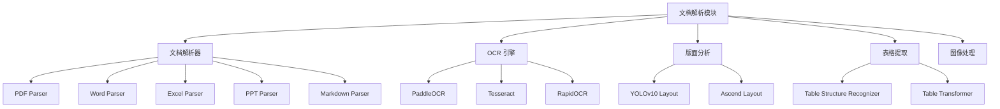

# 文档解析 - 详细说明

## 文档说明
本文档详细描述文档解析模块的业务流程、技术实现、核心组件和配置说明。

⚠️ **编写原则**：
- 不贴大量源代码，只标注函数名和文件位置
- 使用表格、列表展示信息
- 代码示例控制在 10 行以内
- 引用时序图，不重复描述流程细节

---

## 目录
- [1. 功能概述](#1-功能概述)
- [2. 核心业务流程](#2-核心业务流程)
- [3. 数据模型详解](#3-数据模型详解)
- [4. 解析器架构](#4-解析器架构)
- [5. OCR 引擎实现](#5-ocr-引擎实现)
- [6. 版面分析](#6-版面分析)
- [7. 表格提取](#7-表格提取)
- [8. 配置参数详解](#8-配置参数详解)
- [9. 错误处理](#9-错误处理)
- [10. 性能优化](#10-性能优化)
- [11. 最佳实践](#11-最佳实践)

---

## 1. 功能概述

### 1.1 模块定位
文档解析模块是 RAGFlow 的内容提取核心，负责将各种格式的文档转换为可检索的结构化文本。模块采用多层架构设计，支持 10+ 种文档格式，集成多种 OCR 引擎和深度学习模型，实现高精度的文档理解。

核心能力包括：
- **智能文本提取**：支持带格式文档的文本提取，保留文档结构
- **OCR 识别**：集成 PaddleOCR、Tesseract 等多种 OCR 引擎，支持图片文字识别
- **版面分析**：基于深度学习的版面检测，识别标题、段落、表格、图片等元素
- **表格提取**：深度学习表格结构识别，输出结构化表格数据
- **多语言支持**：支持中英文及多种语言的文档解析

### 1.2 主要功能模块



### 1.3 技术特性

| 特性 | 说明 |
|------|------|
| 多格式支持 | PDF、Word、Excel、PPT、Markdown、HTML、JSON、图片等 10+ 种格式 |
| 高精度 OCR | 基于 PaddleOCR，支持中英文混合识别，准确率 > 95% |
| 深度版面分析 | YOLOv10 模型，识别标题、段落、表格、图片、公式等 10+ 种元素 |
| 表格结构识别 | Table Transformer 模型，准确提取复杂表格结构 |
| 并行处理 | 支持多进程并行解析，提升大文档处理速度 |
| 缓存优化 | 解析结果缓存，避免重复解析 |
| 插件扩展 | 支持 MinerU、Docling、TCADP 等第三方解析引擎 |

---

## 2. 核心业务流程

### 2.1 PDF 解析流程

#### 流程图


#### 详细步骤

**步骤 1: 文档加载**
- **解析器**: [RAGFlowPdfParser](../../deepdoc/parser/pdf_parser.py#L50-L102)
- **函数**: `__init__()`
- **说明**: 初始化 PDF 解析器，加载 pdfplumber/PyMuPDF，配置 OCR 和版面识别器

**步骤 2: 页面遍历**
- **函数**: `__call__()` / [parse_into_bboxes()](../../deepdoc/parser/pdf_parser.py#L1189-L1271)
- **说明**: 逐页处理 PDF，提取文本、图像、表格等元素

**步骤 3: 文本提取**
- **函数**: [__images__()](../../deepdoc/parser/pdf_parser.py#L1039-L1177)
- **说明**: 提取页面字符、计算字符位置和样式

**步骤 4: 版面分析**
- **函数**: [_layouts_rec()](../../deepdoc/parser/pdf_parser.py#L345-L351)
- **说明**: 调用版面识别器，检测标题、段落、表格、图片等区域

**步骤 5: 表格提取**
- **函数**: [_extract_table_figure()](../../deepdoc/parser/pdf_parser.py#L754-L927)
- **说明**: 提取表格区域，调用表格结构识别器

**步骤 6: OCR 识别**
- **函数**: [__ocr()](../../deepdoc/parser/pdf_parser.py#L280-L343)
- **说明**: 对图像区域进行 OCR 识别，提取文字

**步骤 7: 内容合并**
- **函数**: [_naive_vertical_merge()](../../deepdoc/parser/pdf_parser.py#L477-L553) / [_concat_downward()](../../deepdoc/parser/pdf_parser.py#L578-L680)
- **说明**: 合并文本块，组装完整段落

#### 关键代码位置
| 组件 | 文件路径 | 函数/类 | 说明 |
|------|---------|---------|------|
| PDF 解析器 | [pdf_parser.py](../../deepdoc/parser/pdf_parser.py#L50) | `RAGFlowPdfParser` | 主解析类 |
| 文本提取 | [pdf_parser.py](../../deepdoc/parser/pdf_parser.py#L1039) | `__images__()` | 提取字符和图像 |
| 版面分析 | [pdf_parser.py](../../deepdoc/parser/pdf_parser.py#L345) | `_layouts_rec()` | 版面检测 |
| 表格提取 | [pdf_parser.py](../../deepdoc/parser/pdf_parser.py#L754) | `_extract_table_figure()` | 表格和图片提取 |
| OCR 识别 | [pdf_parser.py](../../deepdoc/parser/pdf_parser.py#L280) | `__ocr()` | OCR 文字识别 |

---

### 2.2 OCR 识别流程

#### 流程图


#### 详细步骤

**步骤 1: 图像预处理**
- **文件**: [operators.py](../../deepdoc/vision/operators.py)
- **说明**: 图像去噪、增强、二值化、倾斜校正

**步骤 2: 文本检测**
- **组件**: [TextDetector](../../deepdoc/vision/ocr.py#L80-L140)
- **函数**: `__call__()`
- **说明**: 检测文本区域，输出边界框

**步骤 3: 文本识别**
- **组件**: [TextRecognizer](../../deepdoc/vision/ocr.py#L143-L200)
- **函数**: `__call__()`
- **说明**: 识别文本内容，输出文字和置信度

**步骤 4: 后处理**
- **文件**: [postprocess.py](../../deepdoc/vision/postprocess.py)
- **说明**: 文本校正、格式化、过滤低置信度结果

**步骤 5: 结构化输出**
- **组件**: [OCR](../../deepdoc/vision/ocr.py#L203-L280)
- **函数**: `__call__()`
- **说明**: 整合检测和识别结果，输出结构化数据

#### 关键代码位置
| 组件 | 文件路径 | 函数/类 | 说明 |
|------|---------|---------|------|
| OCR 引擎 | [ocr.py](../../deepdoc/vision/ocr.py#L203) | `OCR` | OCR 主类 |
| 文本检测 | [ocr.py](../../deepdoc/vision/ocr.py#L80) | `TextDetector` | 检测文本区域 |
| 文本识别 | [ocr.py](../../deepdoc/vision/ocr.py#L143) | `TextRecognizer` | 识别文本内容 |
| 图像预处理 | [operators.py](../../deepdoc/vision/operators.py) | 各种 Op 类 | 图像处理操作 |
| 后处理 | [postprocess.py](../../deepdoc/vision/postprocess.py) | 后处理函数 | 结果校正和格式化 |

---

### 2.3 表格提取流程

#### 流程图


#### 详细步骤

**步骤 1: 表格检测**
- **函数**: [_table_transformer_job()](../../deepdoc/parser/pdf_parser.py#L194-L278)
- **说明**: 使用 Table Transformer 模型检测表格区域

**步骤 2: 表格结构识别**
- **组件**: [TableStructureRecognizer](../../deepdoc/vision/table_structure_recognizer.py)
- **函数**: `__call__()`
- **说明**: 识别表格行、列、单元格结构

**步骤 3: 单元格内容提取**
- **说明**: 提取每个单元格的文本内容，可能需要 OCR

**步骤 4: 结构化输出**
- **说明**: 输出 Markdown、HTML 或 JSON 格式的表格数据

#### 关键代码位置
| 组件 | 文件路径 | 函数/类 | 说明 |
|------|---------|---------|------|
| 表格检测 | [pdf_parser.py](../../deepdoc/parser/pdf_parser.py#L194) | `_table_transformer_job()` | 检测表格位置 |
| 表格识别 | [table_structure_recognizer.py](../../deepdoc/vision/table_structure_recognizer.py) | `TableStructureRecognizer` | 识别表格结构 |

---

## 3. 数据模型详解

### 3.1 解析结果数据结构

文档解析后输出统一的数据结构，便于后续的分块和向量化处理。

#### BBox (Bounding Box) 数据结构
```python
{
    "text": str,              # 文本内容
    "x0": float,              # 左上角 x 坐标
    "y0": float,              # 左上角 y 坐标
    "x1": float,              # 右下角 x 坐标
    "y1": float,              # 右下角 y 坐标
    "page_number": int,       # 页码
    "layout_type": str,       # 版面类型：title/text/table/figure/caption
    "image": bytes,           # 图像数据（如果是图片）
    "table": list,            # 表格数据（如果是表格）
}
```

#### 字段说明
| 字段 | 类型 | 说明 |
|------|------|------|
| text | String | 文本内容，表格转换为 Markdown 格式 |
| x0, y0, x1, y1 | Float | 边界框坐标，PDF 坐标系 |
| page_number | Integer | 页码，从 0 开始 |
| layout_type | String | 版面类型，支持：title/text/table/figure/caption/header/footer 等 |
| image | Bytes | 图像二进制数据（可选） |
| table | List[List] | 表格二维数组（可选） |

### 3.2 OCR 结果数据结构

```python
{
    "boxes": List[List[float]],    # 边界框坐标列表
    "texts": List[str],            # 识别文本列表
    "scores": List[float],         # 置信度列表
}
```

#### 字段说明
| 字段 | 类型 | 说明 |
|------|------|------|
| boxes | List[List[float]] | 文本框坐标，格式：[[x0,y0], [x1,y1], [x2,y2], [x3,y3]] |
| texts | List[str] | 识别的文本内容 |
| scores | List[float] | 识别置信度，范围 0-1 |

### 3.3 版面分析结果

```python
{
    "category": str,          # 类别：title/text/table/figure/caption
    "bbox": List[float],      # 边界框 [x0, y0, x1, y1]
    "score": float,           # 置信度
}
```

#### 支持的版面类型
| 类型 | 说明 |
|------|------|
| title | 标题 |
| text | 正文段落 |
| table | 表格 |
| figure | 图片/图表 |
| caption | 图表标题 |
| header | 页眉 |
| footer | 页脚 |
| equation | 公式 |
| reference | 参考文献 |

---

## 4. 解析器架构

### 4.1 解析器基类

所有解析器继承统一的基类，提供一致的接口。

**文件位置**: [deepdoc/parser/](../../deepdoc/parser/)

#### 核心解析器列表
| 解析器 | 文件 | 支持格式 | 说明 |
|--------|------|---------|------|
| RAGFlowPdfParser | [pdf_parser.py](../../deepdoc/parser/pdf_parser.py) | PDF | 高精度 PDF 解析，支持版面分析 |
| PlainParser | [pdf_parser.py](../../deepdoc/parser/pdf_parser.py) | PDF | 纯文本 PDF 解析，速度快 |
| VisionParser | [pdf_parser.py](../../deepdoc/parser/pdf_parser.py) | PDF | 基于视觉的 PDF 解析 |
| DocxParser | [docx_parser.py](../../deepdoc/parser/docx_parser.py) | DOCX | Word 文档解析 |
| ExcelParser | [excel_parser.py](../../deepdoc/parser/excel_parser.py) | XLSX, XLS | Excel 表格解析 |
| PptParser | [ppt_parser.py](../../deepdoc/parser/ppt_parser.py) | PPTX | PowerPoint 解析 |
| MarkdownParser | [markdown_parser.py](../../deepdoc/parser/markdown_parser.py) | MD | Markdown 解析 |
| HtmlParser | [html_parser.py](../../deepdoc/parser/html_parser.py) | HTML | HTML 网页解析 |
| JsonParser | [json_parser.py](../../deepdoc/parser/json_parser.py) | JSON | JSON 数据解析 |
| FigureParser | [figure_parser.py](../../deepdoc/parser/figure_parser.py) | JPG, PNG | 图片 OCR 解析 |
| MinerUParser | [mineru_parser.py](../../deepdoc/parser/mineru_parser.py) | PDF | MinerU 高精度解析 |
| DoclingParser | [docling_parser.py](../../deepdoc/parser/docling_parser.py) | PDF | Docling 解析引擎 |
| TCADPParser | [tcadp_parser.py](../../deepdoc/parser/tcadp_parser.py) | PDF | 腾讯云 ADP 解析服务 |

### 4.2 PDF 解析器详解

#### RAGFlowPdfParser 核心方法
| 方法 | 功能 | 说明 |
|------|------|------|
| `__init__()` | 初始化 | 加载 OCR、版面识别器、表格识别器 |
| `__call__()` | 解析入口 | 执行完整解析流程 |
| `parse_into_bboxes()` | 解析为 BBox | 解析并返回边界框列表 |
| `__images__()` | 提取图像 | 提取页面字符和图像 |
| `_layouts_rec()` | 版面分析 | 调用版面识别器 |
| `_extract_table_figure()` | 表格提取 | 提取表格和图片 |
| `__ocr()` | OCR 识别 | 对图像区域 OCR |
| `_naive_vertical_merge()` | 垂直合并 | 合并相邻文本块 |
| `_concat_downward()` | 向下连接 | 连接段落 |
| `_filter_forpages()` | 过滤页码 | 过滤页眉页脚 |
| `total_page_number()` | 获取页数 | 返回 PDF 总页数 |

**代码位置**: [deepdoc/parser/pdf_parser.py](../../deepdoc/parser/pdf_parser.py#L50-L1408)

### 4.3 解析器选择策略

根据文档类型和配置自动选择合适的解析器：

```python
# 伪代码示例
if file_type == "pdf":
    if parser_method == "vision":
        parser = VisionParser()
    elif parser_method == "plain":
        parser = PlainParser()
    elif parser_method == "mineru":
        parser = MinerUParser()
    else:
        parser = RAGFlowPdfParser()
elif file_type == "docx":
    parser = DocxParser()
elif file_type == "xlsx":
    parser = ExcelParser()
# ... 其他格式
```

---

## 5. OCR 引擎实现

### 5.1 OCR 架构

OCR 引擎采用检测 + 识别的两阶段架构。

**文件位置**: [deepdoc/vision/ocr.py](../../deepdoc/vision/ocr.py)

#### OCR 核心组件
| 组件 | 类名 | 功能 |
|------|------|------|
| 文本检测器 | TextDetector | 检测文本区域，输出边界框 |
| 文本识别器 | TextRecognizer | 识别文本内容 |
| OCR 引擎 | OCR | 整合检测和识别 |

### 5.2 OCR 引擎对比

| 引擎 | 优势 | 劣势 | 适用场景 |
|------|------|------|---------|
| PaddleOCR | 精度高，支持中英文，模型轻量 | 依赖 PaddlePaddle | 默认首选 |
| Tesseract | 开源免费，支持 100+ 语言 | 精度较低，中文识别差 | 多语言场景 |
| RapidOCR | 速度快，无依赖 | 精度略低 | 快速识别 |
| EasyOCR | 精度高，支持 80+ 语言 | 模型大，速度慢 | 高精度需求 |

### 5.3 OCR 核心方法

#### TextDetector 方法
| 方法 | 功能 | 说明 |
|------|------|------|
| `__init__()` | 初始化 | 加载检测模型 |
| `__call__()` | 检测文本 | 输入图像，输出边界框 |

#### TextRecognizer 方法
| 方法 | 功能 | 说明 |
|------|------|------|
| `__init__()` | 初始化 | 加载识别模型 |
| `__call__()` | 识别文本 | 输入图像和边界框，输出文本 |

#### OCR 方法
| 方法 | 功能 | 说明 |
|------|------|------|
| `__init__()` | 初始化 | 创建检测器和识别器 |
| `__call__()` | 完整 OCR | 检测 + 识别 |

**代码位置**: [deepdoc/vision/ocr.py](../../deepdoc/vision/ocr.py)

### 5.4 图像预处理

图像预处理是提升 OCR 精度的关键。

**文件位置**: [deepdoc/vision/operators.py](../../deepdoc/vision/operators.py)

#### 预处理操作
| 操作 | 说明 |
|------|------|
| DecodeImage | 图像解码 |
| NormalizeImage | 归一化 |
| ToCHWImage | 转换为 CHW 格式 |
| DetResizeForTest | 检测模型输入 resize |
| RecResizeImg | 识别模型输入 resize |

---

## 6. 版面分析

### 6.1 版面识别器

版面分析用于识别文档的逻辑结构，包括标题、段落、表格、图片等。

**文件位置**: [deepdoc/vision/layout_recognizer.py](../../deepdoc/vision/layout_recognizer.py)

#### 版面识别器列表
| 识别器 | 说明 |
|--------|------|
| LayoutRecognizer | 基础版面识别器 |
| LayoutRecognizer4YOLOv10 | 基于 YOLOv10 的版面识别 |
| AscendLayoutRecognizer | 华为昇腾 NPU 加速版 |

### 6.2 支持的版面类型

| 类型 ID | 类型名称 | 说明 |
|---------|---------|------|
| 0 | title | 标题 |
| 1 | text | 正文 |
| 2 | table | 表格 |
| 3 | figure | 图片 |
| 4 | caption | 图表标题 |
| 5 | header | 页眉 |
| 6 | footer | 页脚 |
| 7 | equation | 公式 |
| 8 | reference | 参考文献 |

### 6.3 版面识别流程

1. **输入**：PDF 页面图像
2. **检测**：使用 YOLOv10 检测各类元素
3. **输出**：边界框 + 类别 + 置信度

#### 核心方法
| 方法 | 功能 | 说明 |
|------|------|------|
| `__init__()` | 初始化 | 加载版面分析模型 |
| `__call__()` | 执行识别 | 输入图像，输出版面元素 |

---

## 7. 表格提取

### 7.1 表格结构识别

表格提取是文档解析的难点之一，需要准确识别表格的行列结构和单元格合并关系。

**文件位置**: [deepdoc/vision/table_structure_recognizer.py](../../deepdoc/vision/table_structure_recognizer.py)

#### 表格识别流程
1. **表格检测**：检测表格区域边界
2. **结构识别**：识别表格的行、列、单元格
3. **单元格提取**：提取每个单元格的内容
4. **结构化输出**：输出 Markdown/HTML 格式

### 7.2 TableStructureRecognizer 方法

| 方法 | 功能 | 说明 |
|------|------|------|
| `__init__()` | 初始化 | 加载表格识别模型 |
| `__call__()` | 识别表格 | 输入表格图像，输出结构化数据 |

### 7.3 表格输出格式

#### Markdown 格式
```markdown
| 列1 | 列2 | 列3 |
|-----|-----|-----|
| 值1 | 值2 | 值3 |
```

#### HTML 格式
```html
<table>
  <tr><th>列1</th><th>列2</th></tr>
  <tr><td>值1</td><td>值2</td></tr>
</table>
```

---

## 8. 配置参数详解

### 8.1 Parser 配置

#### 完整配置结构
```json
{
  "chunk_token_num": 128,
  "layout_recognize": true,
  "raptor": {
    "use_raptor": false
  },
  "filename_embd_weight": 0.1,
  "task_page_size": 12,
  "parser_method": "auto"
}
```

#### 配置项详解
| 配置项 | 类型 | 默认值 | 说明 |
|--------|------|--------|------|
| chunk_token_num | Integer | 128 | 分块 token 数量 |
| layout_recognize | Boolean | true | 是否启用版面分析 |
| raptor.use_raptor | Boolean | false | 是否使用 RAPTOR 分层分块 |
| filename_embd_weight | Float | 0.1 | 文件名嵌入权重 |
| task_page_size | Integer | 12 | 并行处理页数 |
| parser_method | String | "auto" | 解析方法：auto/plain/vision/mineru/docling/tcadp |

### 8.2 OCR 配置

#### 完整配置结构
```python
{
  "lang": ["ch", "en"],
  "use_angle_cls": True,
  "use_gpu": True,
  "det_model": "ch_PP-OCRv3_det",
  "rec_model": "ch_PP-OCRv3_rec",
  "cls_model": "ch_ppocr_mobile_v2.0_cls",
  "det_limit_side_len": 960,
  "det_limit_type": "max",
  "rec_batch_num": 6
}
```

#### 配置项详解
| 配置项 | 类型 | 默认值 | 说明 |
|--------|------|--------|------|
| lang | List[String] | ["ch", "en"] | 支持的语言 |
| use_angle_cls | Boolean | True | 是否使用文字方向分类 |
| use_gpu | Boolean | True | 是否使用 GPU 加速 |
| det_model | String | ch_PP-OCRv3_det | 文本检测模型 |
| rec_model | String | ch_PP-OCRv3_rec | 文本识别模型 |
| det_limit_side_len | Integer | 960 | 检测图像最大边长 |
| rec_batch_num | Integer | 6 | 识别批次大小 |

### 8.3 版面分析配置

```python
{
  "layout_model": "yolov10",
  "conf_threshold": 0.5,
  "iou_threshold": 0.45,
  "use_gpu": True
}
```

#### 配置项详解
| 配置项 | 类型 | 默认值 | 说明 |
|--------|------|--------|------|
| layout_model | String | yolov10 | 版面分析模型 |
| conf_threshold | Float | 0.5 | 置信度阈值 |
| iou_threshold | Float | 0.45 | IOU 阈值 |
| use_gpu | Boolean | True | 是否使用 GPU |

### 8.4 不同场景的配置

#### 场景 1: 高精度解析（学术论文）
```json
{
  "parser_method": "vision",
  "layout_recognize": true,
  "chunk_token_num": 256,
  "task_page_size": 6
}
```
**特点**: 启用完整版面分析，较大分块，降低并行度保证精度

#### 场景 2: 快速解析（纯文本）
```json
{
  "parser_method": "plain",
  "layout_recognize": false,
  "chunk_token_num": 128,
  "task_page_size": 24
}
```
**特点**: 禁用版面分析，提高并行度，适合纯文本 PDF

#### 场景 3: 中文识别优化
```json
{
  "lang": ["ch"],
  "det_model": "ch_PP-OCRv4_det",
  "rec_model": "ch_PP-OCRv4_rec",
  "use_angle_cls": true
}
```
**特点**: 使用最新中文 OCR 模型，启用角度分类

---

## 9. 错误处理

### 9.1 常见错误类型

#### 1. 文件格式不支持
```json
{
  "code": 1001,
  "message": "Unsupported file format: .abc",
  "data": false
}
```
**原因**: 文件格式不在支持列表中  
**解决**: 检查文件扩展名，确认是否支持该格式

#### 2. PDF 解析失败
```json
{
  "code": 1002,
  "message": "Failed to parse PDF: corrupted file",
  "data": false
}
```
**原因**: PDF 文件损坏或加密  
**解决**: 检查 PDF 文件完整性，如果加密需先解密

#### 3. OCR 识别失败
```json
{
  "code": 1003,
  "message": "OCR recognition failed: model not loaded",
  "data": false
}
```
**原因**: OCR 模型未正确加载  
**解决**: 检查模型文件路径，确认依赖安装

#### 4. 内存不足
```json
{
  "code": 1004,
  "message": "Out of memory: document too large",
  "data": false
}
```
**原因**: 文档过大，超出内存限制  
**解决**: 减小 task_page_size，或增加系统内存

#### 5. 版面分析失败
```json
{
  "code": 1005,
  "message": "Layout recognition failed",
  "data": false
}
```
**原因**: 版面分析模型异常  
**解决**: 尝试禁用版面分析或更换模型

### 9.2 错误码说明

| 错误码 | 错误类型 | 说明 |
|--------|---------|------|
| 1001 | FORMAT_NOT_SUPPORTED | 不支持的文件格式 |
| 1002 | PARSE_FAILED | 解析失败 |
| 1003 | OCR_FAILED | OCR 识别失败 |
| 1004 | OUT_OF_MEMORY | 内存不足 |
| 1005 | LAYOUT_FAILED | 版面分析失败 |
| 1006 | TABLE_EXTRACT_FAILED | 表格提取失败 |
| 1007 | MODEL_NOT_FOUND | 模型文件未找到 |

### 9.3 降级策略

当高级功能失败时，自动降级到基础功能：

1. **版面分析失败** → 禁用版面分析，使用纯文本提取
2. **OCR 失败** → 跳过 OCR，仅提取已有文本
3. **表格识别失败** → 降级为纯文本提取
4. **高精度解析失败** → 降级到 PlainParser

---

## 10. 性能优化

### 10.1 并行处理

#### 多进程页面解析
```python
# 配置并行处理页数
{
  "task_page_size": 12  # 每批处理 12 页
}
```
**优化点**:
- 使用进程池并行处理多个页面
- 根据 CPU 核心数调整 task_page_size
- 建议设置为 CPU 核心数的 1-2 倍

#### 批量 OCR 识别
```python
{
  "rec_batch_num": 6  # 批量识别 6 个文本框
}
```
**优化点**:
- 批量调用 OCR 模型，减少推理开销
- GPU 环境可增大批次，CPU 环境建议 4-6

### 10.2 缓存策略

#### 解析结果缓存
- **位置**: 解析结果缓存在内存或 Redis
- **键**: 文件 MD5 + 配置参数的哈希
- **失效**: 文件更新或配置变化时失效

#### OCR 模型缓存
- **位置**: 模型加载后缓存在内存
- **策略**: 单例模式，全局共享
- **优化**: 预加载常用模型

#### 图像预处理缓存
- **位置**: 处理后的图像缓存在磁盘
- **键**: 图像 MD5
- **失效**: 定期清理，LRU 策略

### 10.3 GPU 加速

#### 启用 GPU
```python
{
  "use_gpu": True
}
```
**支持的组件**:
- OCR 文本检测和识别
- 版面分析（YOLOv10）
- 表格结构识别

**性能提升**:
- OCR: 5-10 倍
- 版面分析: 3-5 倍
- 整体: 3-5 倍

### 10.4 内存优化

#### 分页处理
```python
# 避免一次加载整个文档
for page_num in range(total_pages):
    page = load_page(page_num)
    process_page(page)
    del page  # 及时释放内存
```

#### 图像压缩
```python
{
  "det_limit_side_len": 960  # 限制图像尺寸
}
```
**优化点**:
- 降低输入图像分辨率
- 权衡精度和性能

### 10.5 性能指标

| 文档类型 | 页数 | 解析时间 (CPU) | 解析时间 (GPU) | 内存占用 |
|---------|------|---------------|---------------|---------|
| 纯文本 PDF | 100 | 30s | 10s | 500MB |
| 扫描版 PDF | 100 | 5min | 1min | 2GB |
| Word 文档 | 50 | 20s | 15s | 300MB |
| Excel 表格 | 10 | 5s | 5s | 100MB |

---

## 11. 最佳实践

### 11.1 选择合适的解析器

#### 根据文档类型选择

| 文档类型 | 推荐解析器 | 原因 |
|---------|-----------|------|
| 纯文本 PDF | PlainParser | 速度快，无需 OCR |
| 扫描版 PDF | RAGFlowPdfParser | 完整功能，高精度 |
| 学术论文 PDF | VisionParser | 版面复杂，需深度分析 |
| 图片 | FigureParser | 专门的图片 OCR |
| Word/Excel/PPT | 对应专用解析器 | 格式化输出 |

#### 根据精度要求选择

| 精度要求 | 推荐配置 | 说明 |
|---------|---------|------|
| 高精度 | parser_method=vision, layout_recognize=true | 完整版面分析，OCR 识别 |
| 标准精度 | parser_method=auto | 自动选择，平衡速度和精度 |
| 快速提取 | parser_method=plain, layout_recognize=false | 纯文本提取，速度优先 |

### 11.2 优化解析参数

#### 场景 1: 大文档处理
```json
{
  "task_page_size": 24,
  "chunk_token_num": 256,
  "layout_recognize": false
}
```
**特点**: 提高并行度，增大分块，禁用版面分析

#### 场景 2: 复杂版面
```json
{
  "parser_method": "vision",
  "layout_recognize": true,
  "task_page_size": 6,
  "conf_threshold": 0.6
}
```
**特点**: 降低并行度，提高版面识别置信度阈值

#### 场景 3: 低内存环境
```json
{
  "task_page_size": 4,
  "det_limit_side_len": 768,
  "rec_batch_num": 4
}
```
**特点**: 降低并行度，减小图像尺寸，减小批次

### 11.3 处理特殊文档

#### 加密 PDF
```python
# 先解密 PDF
import pikepdf
with pikepdf.open("encrypted.pdf", password="pwd") as pdf:
    pdf.save("decrypted.pdf")
```

#### 扫描版 PDF
```json
{
  "parser_method": "vision",
  "use_angle_cls": true,
  "det_limit_side_len": 1280
}
```
**特点**: 提高图像分辨率，启用角度分类

#### 多栏排版
```json
{
  "layout_recognize": true,
  "parser_method": "vision"
}
```
**特点**: 启用版面分析，自动识别多栏结构

### 11.4 错误恢复

#### 重试机制
```python
max_retries = 3
for i in range(max_retries):
    try:
        result = parser(file_path)
        break
    except Exception as e:
        if i == max_retries - 1:
            raise
        time.sleep(2 ** i)  # 指数退避
```

#### 降级处理
```python
try:
    result = RAGFlowPdfParser()(file_path)
except Exception:
    result = PlainParser()(file_path)  # 降级到简单解析
```

### 11.5 监控和日志

#### 记录解析时间
```python
import time
start = time.time()
result = parser(file_path)
duration = time.time() - start
logger.info(f"Parsed {file_path} in {duration:.2f}s")
```

#### 记录错误
```python
try:
    result = parser(file_path)
except Exception as e:
    logger.error(f"Failed to parse {file_path}: {str(e)}", exc_info=True)
```

---

## 相关文档
- [模块 README](./README.md)
- [PDF 解析时序图](./01-pdf-parsing-sequence.puml)
- [OCR 识别时序图](./02-ocr-recognition-sequence.puml)
- [表格提取时序图](./03-table-extraction-sequence.puml)
