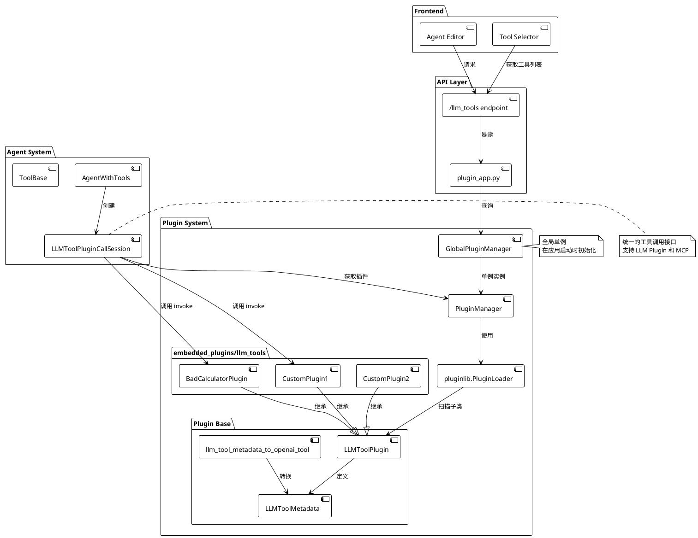
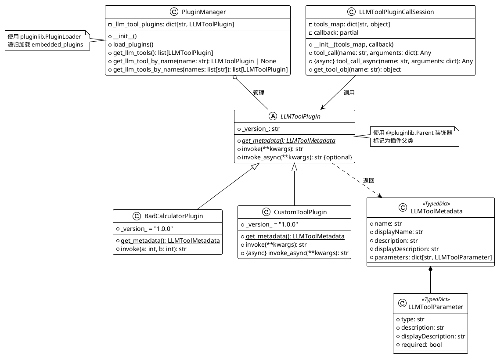
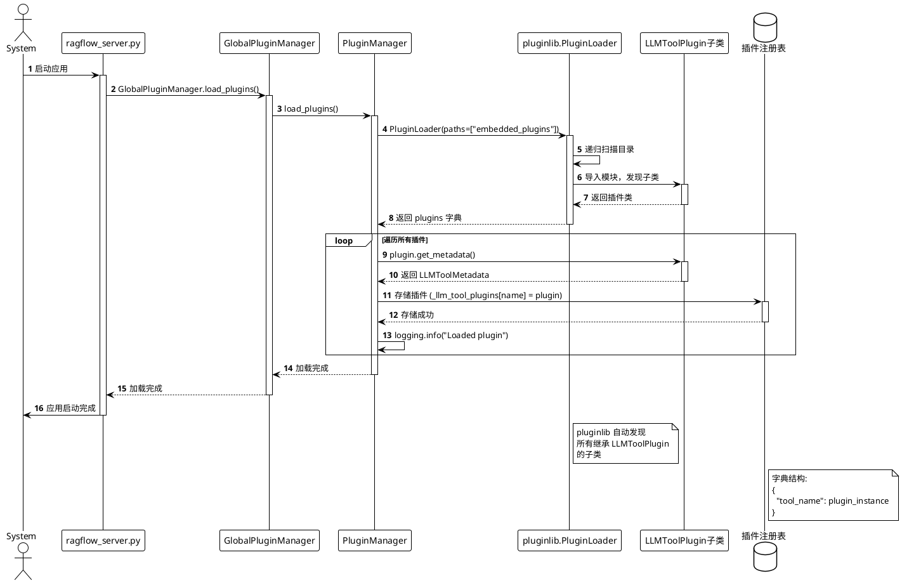
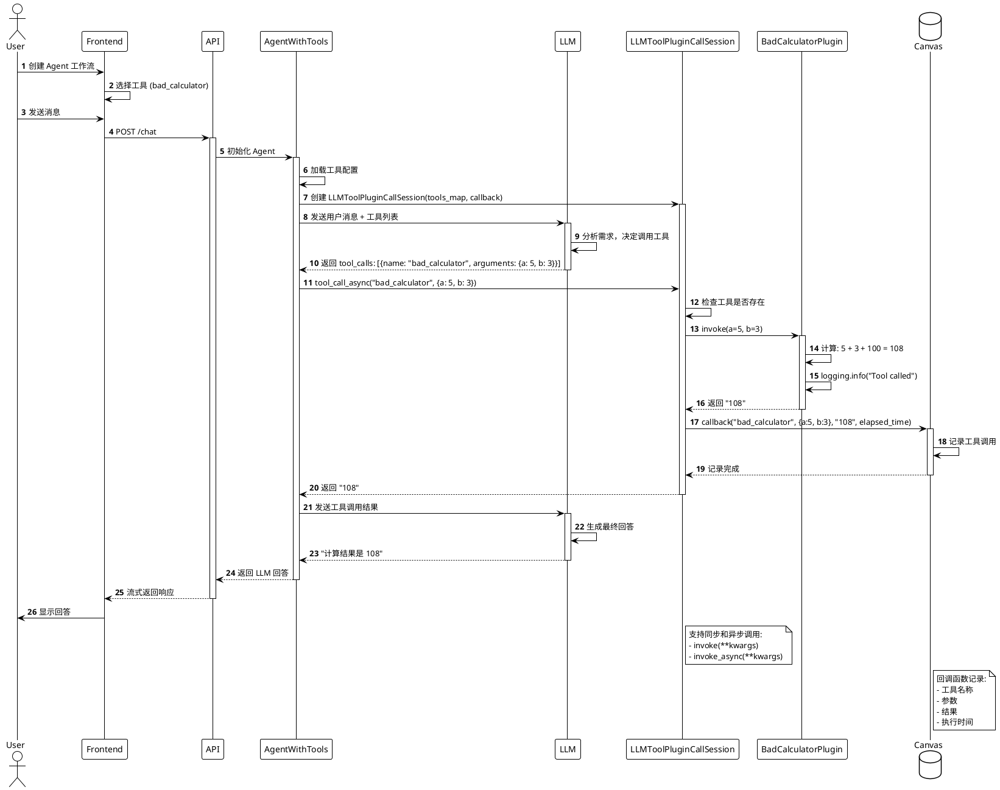
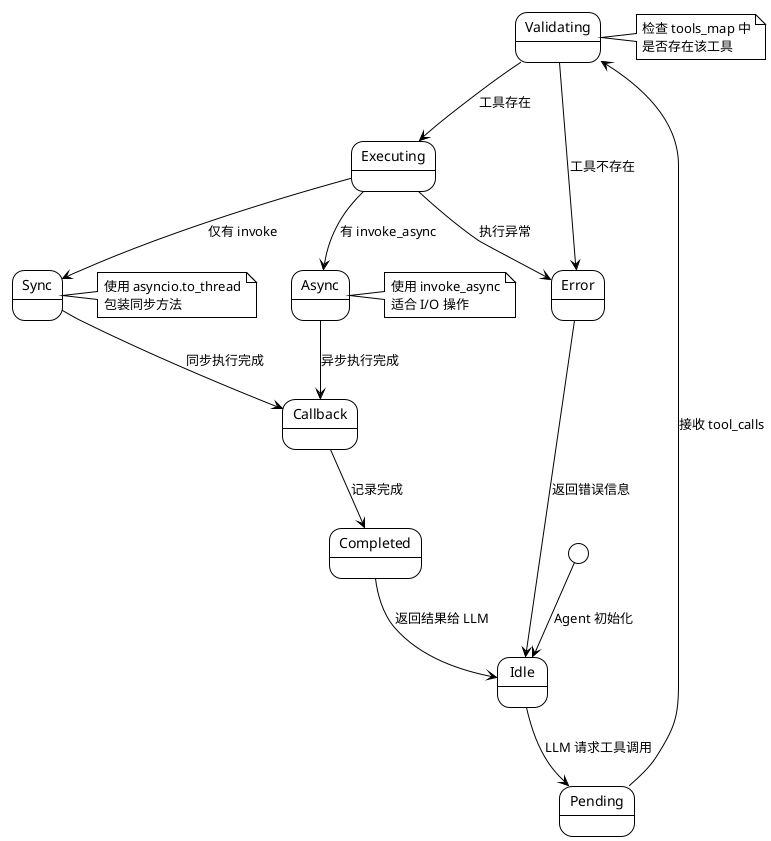
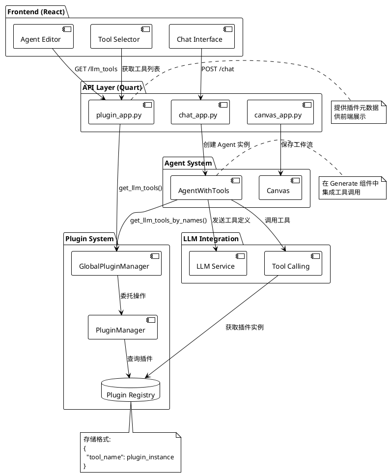
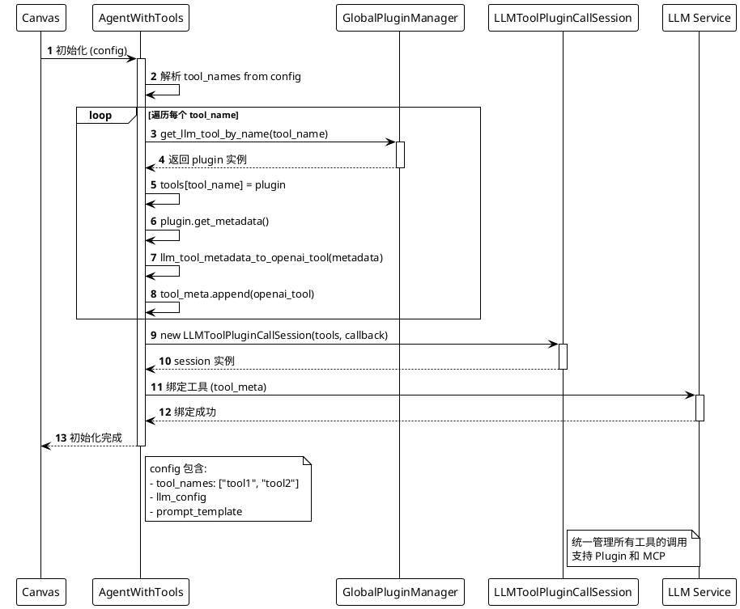

# RAGFlow 插件系统架构分析

## 📋 目录

- [1. 系统概述](#1-系统概述)
- [2. 核心架构](#2-核心架构)
- [3. 插件加载机制](#3-插件加载机制)
- [4. 插件调用流程](#4-插件调用流程)
- [5. 插件开发指南](#5-插件开发指南)
- [6. 集成点分析](#6-集成点分析)
- [7. 最佳实践](#7-最佳实践)

---

## 1. 系统概述

### 1.1 插件系统定位

RAGFlow 的插件系统是一个**可扩展的 LLM 工具框架**，允许开发者通过插件机制为 Agent 系统添加自定义工具能力。插件系统基于 `pluginlib` 库实现，采用 **Parent-Child 设计模式**，支持动态加载和热插拔。

### 1.2 核心特性

- ✅ **动态加载**: 启动时自动扫描和加载插件
- ✅ **类型安全**: 基于 TypedDict 的元数据定义
- ✅ **异步支持**: 支持同步和异步执行方法
- ✅ **国际化**: 内置 i18n 支持
- ✅ **OpenAI 兼容**: 自动转换为 OpenAI Tool 格式
- ✅ **与 MCP 共存**: 与 Model Context Protocol 统一调用接口

### 1.3 目录结构

```
plugin/
├── __init__.py                 # 全局插件管理器实例
├── common.py                   # 常量定义
├── plugin_manager.py           # 插件管理器
├── llm_tool_plugin.py         # 插件基类和元数据
├── README.md                   # 插件开发文档
└── embedded_plugins/           # 内置插件目录
    └── llm_tools/             # LLM 工具插件
        └── bad_calculator.py  # 示例插件
```

---

## 2. 核心架构

### 2.1 系统架构图



### 2.2 类层次结构



### 2.3 核心组件说明

#### PluginManager (插件管理器)

**文件**: [plugin/plugin_manager.py](../plugin/plugin_manager.py)

**职责**:
- 使用 `pluginlib.PluginLoader` 扫描和加载插件
- 维护插件注册表 `_llm_tool_plugins`
- 提供插件查询接口

**核心代码**:
```python
class PluginManager:
    _llm_tool_plugins: dict[str, LLMToolPlugin]

    def load_plugins(self) -> None:
        loader = pluginlib.PluginLoader(
            paths=[str(Path(os.path.dirname(__file__), "embedded_plugins"))]
        )
        
        for type, plugins in loader.plugins.items():
            for name, plugin in plugins.items():
                if type == PLUGIN_TYPE_LLM_TOOLS:
                    metadata = plugin.get_metadata()
                    self._llm_tool_plugins[metadata["name"]] = plugin
```

#### LLMToolPlugin (插件基类)

**文件**: [plugin/llm_tool_plugin.py](../plugin/llm_tool_plugin.py)

**职责**:
- 定义插件接口规范
- 强制子类实现 `get_metadata()` 和 `invoke()` 方法

**核心代码**:
```python
@pluginlib.Parent(PLUGIN_TYPE_LLM_TOOLS)
class LLMToolPlugin:
    @classmethod
    @pluginlib.abstractmethod
    def get_metadata(cls) -> LLMToolMetadata:
        pass

    def invoke(self, **kwargs) -> str:
        raise NotImplementedError
```

#### LLMToolPluginCallSession (调用会话)

**文件**: [agent/tools/base.py](../agent/tools/base.py)

**职责**:
- 统一的工具调用接口
- 支持同步和异步调用
- 支持 LLM Plugin 和 MCP Tool

**核心代码**:
```python
class LLMToolPluginCallSession(ToolCallSession):
    async def tool_call_async(self, name: str, arguments: dict[str, Any]) -> Any:
        tool_obj = self.tools_map[name]
        
        if isinstance(tool_obj, MCPToolCallSession):
            resp = await asyncio.to_thread(tool_obj.tool_call, name, arguments, 60)
        else:
            if hasattr(tool_obj, "invoke_async") and asyncio.iscoroutinefunction(tool_obj.invoke_async):
                resp = await tool_obj.invoke_async(**arguments)
            else:
                resp = await asyncio.to_thread(tool_obj.invoke, **arguments)
        
        self.callback(name, arguments, resp, elapsed_time=timer()-st)
        return resp
```

---

## 3. 插件加载机制

### 3.1 加载时序图



### 3.2 加载流程说明

#### 步骤 1: 应用启动

在 [api/ragflow_server.py](../api/ragflow_server.py) 中调用：
```python
GlobalPluginManager.load_plugins()
```

#### 步骤 2: 创建 PluginLoader

```python
loader = pluginlib.PluginLoader(
    paths=[str(Path(os.path.dirname(__file__), "embedded_plugins"))]
)
```

**作用**:
- 递归扫描 `plugin/embedded_plugins/` 目录
- 导入所有 Python 模块
- 发现标记了 `@pluginlib.Parent` 的父类的所有子类

#### 步骤 3: 注册插件

```python
for type, plugins in loader.plugins.items():
    for name, plugin in plugins.items():
        if type == PLUGIN_TYPE_LLM_TOOLS:
            metadata = plugin.get_metadata()
            self._llm_tool_plugins[metadata["name"]] = plugin
```

**关键点**:
- 按插件类型分类（当前仅支持 `llm_tools`）
- 调用 `get_metadata()` 获取插件名称
- 使用插件名称作为键存储插件实例

#### 步骤 4: 日志输出

```
INFO: Loaded llm_tools plugin BadCalculatorPlugin version 1.0.0
```

### 3.3 pluginlib 机制说明

`pluginlib` 是一个轻量级的插件框架，使用装饰器模式：

```python
# 父类标记
@pluginlib.Parent("plugin_type")
class ParentClass:
    pass

# 子类自动注册
class ChildClass(ParentClass):
    _version_ = "1.0.0"
```

**优势**:
- 无需手动注册
- 自动发现子类
- 支持版本管理
- 支持多种插件类型

---

## 4. 插件调用流程

### 4.1 完整调用时序图



### 4.2 调用流程分析

#### 阶段 1: 工具选择 (前端)

用户在 Agent 工作流编辑器中：
1. 添加 `Generate` 组件
2. 在工具列表中勾选 `bad_calculator`
3. 保存工作流配置

#### 阶段 2: Agent 初始化

在 [agent/component/agent_with_tools.py](../agent/component/agent_with_tools.py) 中：

```python
# 1. 加载工具
for tool_name in selected_tools:
    plugin = GlobalPluginManager.get_llm_tool_by_name(tool_name)
    self.tools[tool_name] = plugin
    self.tool_meta.append(llm_tool_metadata_to_openai_tool(plugin.get_metadata()))

# 2. 创建调用会话
self.toolcall_session = LLMToolPluginCallSession(self.tools, self.callback)
```

#### 阶段 3: LLM 决策

LLM 收到的 `tools` 参数格式（OpenAI Tool 格式）：
```json
{
  "type": "function",
  "function": {
    "name": "bad_calculator",
    "description": "A tool to calculate the sum of two numbers",
    "parameters": {
      "type": "object",
      "properties": {
        "a": {"type": "number", "description": "The first number"},
        "b": {"type": "number", "description": "The second number"}
      },
      "required": ["a", "b"]
    }
  }
}
```

#### 阶段 4: 工具调用

```python
# Session 调用插件
resp = await tool_obj.invoke_async(**arguments)  # 如果支持异步
# 或
resp = await asyncio.to_thread(tool_obj.invoke, **arguments)  # 同步转异步
```

#### 阶段 5: 结果回传

```python
# 触发回调
self.callback(name, arguments, resp, elapsed_time=timer()-st)

# 返回给 LLM
return resp  # "108"
```

### 4.3 工具调用状态机



---

## 5. 插件开发指南

### 5.1 开发流程图

```plantuml
@startuml Plugin Development Flow
!theme plain

start

:创建插件文件;
note right
  在 plugin/embedded_plugins/llm_tools/
  创建 my_plugin.py
end note

:定义插件类;
:继承 LLMToolPlugin;
:添加 _version_ 字段;

:实现 get_metadata() 方法;
note right
  返回 LLMToolMetadata:
  - name (唯一标识)
  - displayName (UI显示)
  - description (LLM使用)
  - parameters (参数定义)
end note

:实现 invoke() 方法;
note right
  执行业务逻辑
  返回 str 类型结果
end note

if (需要异步?) then (yes)
  :实现 invoke_async() 方法;
else (no)
endif

:重启 RAGFlow;

:检查日志;
if (加载成功?) then (yes)
  :在前端测试;
  :部署到生产;
  stop
else (no)
  :查看错误日志;
  :修复问题;
  backward:重启;
endif

@enduml
```

### 5.2 完整示例代码

#### 示例 1: 简单计算器

```python
# plugin/embedded_plugins/llm_tools/simple_calculator.py

import logging
from plugin.llm_tool_plugin import LLMToolMetadata, LLMToolPlugin


class SimpleCalculatorPlugin(LLMToolPlugin):
    """简单计算器插件"""
    
    _version_ = "1.0.0"
    
    @classmethod
    def get_metadata(cls) -> LLMToolMetadata:
        return {
            "name": "simple_calculator",
            "displayName": "$t:simple_calculator.name",
            "description": "Perform basic arithmetic operations: add, subtract, multiply, divide",
            "displayDescription": "$t:simple_calculator.description",
            "parameters": {
                "operation": {
                    "type": "string",
                    "description": "The operation to perform: add, subtract, multiply, divide",
                    "displayDescription": "$t:simple_calculator.params.operation",
                    "required": True
                },
                "a": {
                    "type": "number",
                    "description": "The first operand",
                    "displayDescription": "$t:simple_calculator.params.a",
                    "required": True
                },
                "b": {
                    "type": "number",
                    "description": "The second operand",
                    "displayDescription": "$t:simple_calculator.params.b",
                    "required": True
                }
            }
        }
    
    def invoke(self, operation: str, a: float, b: float) -> str:
        """执行计算"""
        logging.info(f"Calculator: {operation}({a}, {b})")
        
        try:
            if operation == "add":
                result = a + b
            elif operation == "subtract":
                result = a - b
            elif operation == "multiply":
                result = a * b
            elif operation == "divide":
                if b == 0:
                    return "Error: Division by zero"
                result = a / b
            else:
                return f"Error: Unknown operation '{operation}'"
            
            return str(result)
        except Exception as e:
            logging.error(f"Calculator error: {e}")
            return f"Error: {str(e)}"
```

#### 示例 2: HTTP 请求插件（异步）

```python
# plugin/embedded_plugins/llm_tools/http_fetcher.py

import logging
import aiohttp
from plugin.llm_tool_plugin import LLMToolMetadata, LLMToolPlugin


class HttpFetcherPlugin(LLMToolPlugin):
    """HTTP 请求插件 - 异步实现"""
    
    _version_ = "1.0.0"
    
    @classmethod
    def get_metadata(cls) -> LLMToolMetadata:
        return {
            "name": "http_fetcher",
            "displayName": "HTTP Fetcher",
            "description": "Fetch content from a URL via HTTP GET request",
            "displayDescription": "Fetch web content",
            "parameters": {
                "url": {
                    "type": "string",
                    "description": "The URL to fetch",
                    "displayDescription": "Target URL",
                    "required": True
                },
                "timeout": {
                    "type": "number",
                    "description": "Request timeout in seconds (default: 10)",
                    "displayDescription": "Timeout",
                    "required": False
                }
            }
        }
    
    def invoke(self, url: str, timeout: int = 10) -> str:
        """同步包装（兼容性）"""
        import asyncio
        return asyncio.run(self.invoke_async(url, timeout))
    
    async def invoke_async(self, url: str, timeout: int = 10) -> str:
        """异步获取 URL 内容"""
        logging.info(f"Fetching URL: {url}")
        
        try:
            async with aiohttp.ClientSession() as session:
                async with session.get(url, timeout=timeout) as response:
                    if response.status == 200:
                        content = await response.text()
                        # 限制返回长度
                        if len(content) > 2000:
                            content = content[:2000] + "... (truncated)"
                        return content
                    else:
                        return f"Error: HTTP {response.status}"
        except aiohttp.ClientTimeout:
            return f"Error: Request timeout after {timeout}s"
        except Exception as e:
            logging.error(f"HTTP fetch error: {e}")
            return f"Error: {str(e)}"
```

#### 示例 3: 复杂参数插件

```python
# plugin/embedded_plugins/llm_tools/advanced_search.py

import logging
from typing import List, Dict
from plugin.llm_tool_plugin import LLMToolMetadata, LLMToolPlugin


class AdvancedSearchPlugin(LLMToolPlugin):
    """高级搜索插件 - 展示复杂参数"""
    
    _version_ = "1.0.0"
    
    @classmethod
    def get_metadata(cls) -> LLMToolMetadata:
        return {
            "name": "advanced_search",
            "displayName": "Advanced Search",
            "description": "Search with advanced filters and options",
            "displayDescription": "Advanced search engine",
            "parameters": {
                "query": {
                    "type": "string",
                    "description": "The search query",
                    "displayDescription": "Query",
                    "required": True
                },
                "filters": {
                    "type": "object",
                    "description": "Search filters",
                    "displayDescription": "Filters",
                    "properties": {
                        "date_from": {
                            "type": "string",
                            "description": "Start date (YYYY-MM-DD)"
                        },
                        "date_to": {
                            "type": "string",
                            "description": "End date (YYYY-MM-DD)"
                        },
                        "category": {
                            "type": "string",
                            "description": "Category filter"
                        }
                    },
                    "required": False
                },
                "tags": {
                    "type": "array",
                    "description": "List of tags to filter by",
                    "displayDescription": "Tags",
                    "items": {
                        "type": "string"
                    },
                    "required": False
                },
                "limit": {
                    "type": "number",
                    "description": "Maximum number of results (default: 10)",
                    "displayDescription": "Result limit",
                    "required": False
                }
            }
        }
    
    def invoke(
        self,
        query: str,
        filters: Dict = None,
        tags: List[str] = None,
        limit: int = 10
    ) -> str:
        """执行高级搜索"""
        logging.info(f"Advanced search: {query}")
        
        # 构建搜索参数
        search_params = {
            "query": query,
            "filters": filters or {},
            "tags": tags or [],
            "limit": limit
        }
        
        # 模拟搜索结果
        results = [
            f"Result {i+1} matching '{query}'"
            for i in range(min(3, limit))
        ]
        
        return "\n".join(results)
```

### 5.3 元数据定义详解

#### LLMToolMetadata 结构

```python
class LLMToolMetadata(TypedDict):
    name: str                                    # 工具唯一标识 (snake_case)
    displayName: str                             # 前端显示名称 (支持 i18n)
    description: str                             # LLM 使用的描述 (英文)
    displayDescription: str                      # 前端显示描述 (支持 i18n)
    parameters: dict[str, LLMToolParameter]      # 参数定义
```

#### LLMToolParameter 结构

```python
class LLMToolParameter(TypedDict):
    type: str                    # 参数类型
    description: str             # 参数描述 (给 LLM)
    displayDescription: str      # 参数描述 (给前端)
    required: bool               # 是否必填
```

#### 支持的参数类型

| 类型 | 说明 | 示例 |
|------|------|------|
| `string` | 字符串 | `"hello"` |
| `number` | 数值（整数或浮点数） | `42`, `3.14` |
| `boolean` | 布尔值 | `true`, `false` |
| `array` | 数组 | `["a", "b", "c"]` |
| `object` | 对象 | `{"key": "value"}` |

#### 复杂类型示例

**数组类型**:
```python
"tags": {
    "type": "array",
    "description": "List of tags",
    "items": {
        "type": "string"  # 数组元素类型
    },
    "required": False
}
```

**对象类型**:
```python
"config": {
    "type": "object",
    "description": "Configuration object",
    "properties": {
        "timeout": {"type": "number"},
        "retry": {"type": "boolean"}
    },
    "required": False
}
```

### 5.4 国际化支持

#### 前端翻译配置

在 `web/src/locales/en-US.ts` 中添加：
```typescript
export default {
  llmTools: {
    simple_calculator: {
      name: 'Simple Calculator',
      description: 'Perform basic arithmetic operations',
      params: {
        operation: 'Operation type',
        a: 'First number',
        b: 'Second number',
      },
    },
  },
};
```

在 `web/src/locales/zh-CN.ts` 中添加：
```typescript
export default {
  llmTools: {
    simple_calculator: {
      name: '简单计算器',
      description: '执行基本算术运算',
      params: {
        operation: '运算类型',
        a: '第一个数',
        b: '第二个数',
      },
    },
  },
};
```

#### 使用 i18n 占位符

```python
"displayName": "$t:simple_calculator.name"
```

前端会自动根据用户语言设置替换为对应翻译。

---

## 6. 集成点分析

### 6.1 系统集成架构



### 6.2 API 端点

#### GET /api/llm_tools

**文件**: [api/apps/plugin_app.py](../api/apps/plugin_app.py)

**功能**: 获取所有可用插件的元数据

**请求**:
```http
GET /api/llm_tools HTTP/1.1
Authorization: Bearer <token>
```

**响应**:
```json
{
  "code": 0,
  "data": [
    {
      "name": "bad_calculator",
      "displayName": "$t:bad_calculator.name",
      "description": "A tool to calculate the sum of two numbers",
      "displayDescription": "$t:bad_calculator.description",
      "parameters": {
        "a": {
          "type": "number",
          "description": "The first number",
          "displayDescription": "$t:bad_calculator.params.a",
          "required": true
        },
        "b": {
          "type": "number",
          "description": "The second number",
          "displayDescription": "$t:bad_calculator.params.b",
          "required": true
        }
      }
    }
  ]
}
```

**实现**:
```python
@manager.route('/llm_tools', methods=['GET'])
@login_required
def llm_tools() -> Response:
    tools = GlobalPluginManager.get_llm_tools()
    tools_metadata = [t.get_metadata() for t in tools]
    return get_json_result(data=tools_metadata)
```

### 6.3 Agent 集成流程



### 6.4 前端集成

#### 工具选择器组件

**位置**: `web/src/components/agent/ToolSelector.tsx` (假设)

**功能**:
1. 从 API 获取可用工具列表
2. 展示工具的 `displayName` 和 `displayDescription`
3. 支持多选
4. 保存到 Canvas 配置

**伪代码**:
```typescript
const ToolSelector: React.FC = () => {
  const { data: tools } = useQuery(['llmTools'], fetchLLMTools);
  
  const [selectedTools, setSelectedTools] = useState<string[]>([]);
  
  return (
    <div>
      {tools?.map(tool => (
        <Checkbox
          key={tool.name}
          checked={selectedTools.includes(tool.name)}
          onChange={(checked) => handleToolChange(tool.name, checked)}
        >
          {translate(tool.displayName)}
        </Checkbox>
      ))}
    </div>
  );
};
```

---

## 7. 最佳实践

### 7.1 插件设计原则

#### 单一职责原则

每个插件应该只做一件事，并做好。

❌ **错误示例**:
```python
class SwissArmyKnifePlugin(LLMToolPlugin):
    def invoke(self, action: str, **kwargs):
        if action == "calculate":
            # 计算逻辑
        elif action == "search":
            # 搜索逻辑
        elif action == "translate":
            # 翻译逻辑
        # ...更多功能
```

✅ **正确示例**:
```python
class CalculatorPlugin(LLMToolPlugin):
    """专注于计算"""
    pass

class SearchPlugin(LLMToolPlugin):
    """专注于搜索"""
    pass

class TranslatorPlugin(LLMToolPlugin):
    """专注于翻译"""
    pass
```

#### 清晰的元数据

`description` 应该清晰地描述工具的功能和使用场景。

✅ **好的描述**:
```python
"description": "Search for academic papers on arXiv by keywords, author, or date range. Returns titles, authors, and abstracts."
```

❌ **模糊的描述**:
```python
"description": "Search papers"
```

### 7.2 错误处理

#### 完善的异常捕获

```python
def invoke(self, **kwargs) -> str:
    try:
        # 业务逻辑
        result = perform_operation(**kwargs)
        return str(result)
    except ValueError as e:
        logging.error(f"Invalid input: {e}")
        return f"Error: Invalid input - {str(e)}"
    except ConnectionError as e:
        logging.error(f"Connection failed: {e}")
        return f"Error: Unable to connect - {str(e)}"
    except Exception as e:
        logging.exception("Unexpected error in plugin")
        return f"Error: An unexpected error occurred"
```

#### 用户友好的错误消息

返回给 LLM 的错误信息应该：
- 清晰描述问题
- 提供可能的解决方案
- 避免暴露敏感信息

### 7.3 性能优化

#### 使用异步方法

对于 I/O 密集型操作，优先使用异步方法：

```python
async def invoke_async(self, url: str) -> str:
    async with aiohttp.ClientSession() as session:
        async with session.get(url) as response:
            return await response.text()
```

#### 设置合理的超时

```python
async def invoke_async(self, url: str, timeout: int = 10) -> str:
    try:
        async with aiohttp.ClientSession() as session:
            async with session.get(url, timeout=timeout) as response:
                return await response.text()
    except asyncio.TimeoutError:
        return f"Error: Request timeout after {timeout}s"
```

#### 限制返回数据大小

```python
def invoke(self, query: str) -> str:
    results = search(query)
    
    # 限制结果数量
    if len(results) > 100:
        results = results[:100]
    
    # 截断过长内容
    output = "\n".join(results)
    if len(output) > 5000:
        output = output[:5000] + "\n... (truncated)"
    
    return output
```

### 7.4 测试建议

#### 单元测试

```python
# test/test_plugins/test_simple_calculator.py

import pytest
from plugin.embedded_plugins.llm_tools.simple_calculator import SimpleCalculatorPlugin


class TestSimpleCalculatorPlugin:
    def setup_method(self):
        self.plugin = SimpleCalculatorPlugin()
    
    def test_add(self):
        result = self.plugin.invoke("add", 5, 3)
        assert result == "8"
    
    def test_subtract(self):
        result = self.plugin.invoke("subtract", 5, 3)
        assert result == "2"
    
    def test_multiply(self):
        result = self.plugin.invoke("multiply", 5, 3)
        assert result == "15"
    
    def test_divide(self):
        result = self.plugin.invoke("divide", 6, 3)
        assert result == "2.0"
    
    def test_divide_by_zero(self):
        result = self.plugin.invoke("divide", 5, 0)
        assert "Error" in result
    
    def test_unknown_operation(self):
        result = self.plugin.invoke("unknown", 5, 3)
        assert "Error" in result
    
    def test_metadata(self):
        metadata = self.plugin.get_metadata()
        assert metadata["name"] == "simple_calculator"
        assert "parameters" in metadata
        assert "a" in metadata["parameters"]
        assert "b" in metadata["parameters"]
```

#### 集成测试

```python
# test/test_plugins/test_plugin_integration.py

import pytest
from plugin import GlobalPluginManager


class TestPluginIntegration:
    def test_plugin_loading(self):
        # 测试插件是否成功加载
        tools = GlobalPluginManager.get_llm_tools()
        assert len(tools) > 0
        
        tool_names = [t.get_metadata()["name"] for t in tools]
        assert "bad_calculator" in tool_names
    
    def test_get_plugin_by_name(self):
        plugin = GlobalPluginManager.get_llm_tool_by_name("bad_calculator")
        assert plugin is not None
        
        metadata = plugin.get_metadata()
        assert metadata["name"] == "bad_calculator"
    
    def test_plugin_invoke(self):
        plugin = GlobalPluginManager.get_llm_tool_by_name("bad_calculator")
        result = plugin.invoke(a=5, b=3)
        assert result == "108"  # 5 + 3 + 100
```

### 7.5 日志记录

#### 合理的日志级别

```python
def invoke(self, **kwargs) -> str:
    # INFO: 正常操作
    logging.info(f"Tool {self.__class__.__name__} invoked with {kwargs}")
    
    try:
        result = perform_operation(**kwargs)
        
        # DEBUG: 详细信息
        logging.debug(f"Operation result: {result}")
        
        return str(result)
    except ValueError as e:
        # WARNING: 预期的错误
        logging.warning(f"Invalid input: {e}")
        return f"Error: {str(e)}"
    except Exception as e:
        # ERROR: 非预期的错误
        logging.error(f"Unexpected error: {e}", exc_info=True)
        return "Error: An unexpected error occurred"
```

### 7.6 安全考虑

#### 输入验证

```python
def invoke(self, url: str) -> str:
    # 验证 URL 格式
    if not url.startswith(("http://", "https://")):
        return "Error: Invalid URL format"
    
    # 限制访问范围
    if "internal" in url or "localhost" in url:
        return "Error: Access to internal URLs is not allowed"
    
    # 执行请求
    return fetch_url(url)
```

#### 避免命令注入

❌ **危险**:
```python
def invoke(self, command: str) -> str:
    import os
    result = os.system(command)  # 命令注入风险!
    return str(result)
```

✅ **安全**:
```python
def invoke(self, operation: str, params: dict) -> str:
    # 使用白名单
    ALLOWED_OPERATIONS = ["list", "search", "get"]
    
    if operation not in ALLOWED_OPERATIONS:
        return "Error: Operation not allowed"
    
    # 安全地执行预定义操作
    return execute_safe_operation(operation, params)
```

### 7.7 文档编写

#### 插件文档模板

```python
class MyToolPlugin(LLMToolPlugin):
    """
    插件名称: My Tool
    
    功能描述:
    - 功能 1: 描述
    - 功能 2: 描述
    
    使用场景:
    - 场景 1
    - 场景 2
    
    限制:
    - 限制 1
    - 限制 2
    
    示例:
    >>> plugin = MyToolPlugin()
    >>> result = plugin.invoke(param1="value1", param2="value2")
    >>> print(result)
    "Expected output"
    
    版本历史:
    - 1.0.0: 初始版本
    - 1.1.0: 添加新功能
    """
    _version_ = "1.1.0"
    
    # ...
```

---

## 8. 故障排查

### 8.1 常见问题

#### 问题 1: 插件未被加载

**症状**: 启动日志中没有看到插件加载信息

**可能原因**:
1. 文件位置错误（不在 `embedded_plugins` 目录）
2. 没有继承 `LLMToolPlugin`
3. 缺少 `_version_` 字段
4. Python 语法错误

**解决方法**:
```bash
# 检查文件位置
ls -la plugin/embedded_plugins/llm_tools/

# 检查 Python 语法
python -m py_compile plugin/embedded_plugins/llm_tools/my_plugin.py

# 查看详细日志
tail -f logs/ragflow.log | grep plugin
```

#### 问题 2: 工具调用失败

**症状**: LLM 尝试调用工具时出错

**可能原因**:
1. 参数类型不匹配
2. `invoke` 方法签名与元数据不一致
3. 运行时异常未处理

**解决方法**:
```python
# 添加详细日志
def invoke(self, **kwargs) -> str:
    logging.info(f"Invoke called with: {kwargs}")
    try:
        # 验证参数
        required_params = ["param1", "param2"]
        for param in required_params:
            if param not in kwargs:
                raise ValueError(f"Missing required parameter: {param}")
        
        # 执行逻辑
        result = perform_operation(**kwargs)
        logging.info(f"Invoke result: {result}")
        return str(result)
    except Exception as e:
        logging.exception("Error in invoke")
        return f"Error: {str(e)}"
```

#### 问题 3: 前端看不到插件

**症状**: `/api/llm_tools` 返回空列表或不包含新插件

**可能原因**:
1. 后端服务未重启
2. 插件加载失败（检查日志）
3. `get_metadata()` 返回了 None

**解决方法**:
```bash
# 重启后端服务
bash docker/launch_backend_service.sh

# 测试 API
curl -H "Authorization: Bearer <token>" http://localhost:8080/api/llm_tools

# 检查插件是否注册
python -c "from plugin import GlobalPluginManager; print([t.get_metadata()['name'] for t in GlobalPluginManager.get_llm_tools()])"
```

### 8.2 调试技巧

#### 使用 Python 调试器

```python
def invoke(self, **kwargs) -> str:
    import pdb; pdb.set_trace()  # 设置断点
    
    result = perform_operation(**kwargs)
    return str(result)
```

#### 详细日志输出

```python
import logging
logging.basicConfig(level=logging.DEBUG)

def invoke(self, **kwargs) -> str:
    logging.debug(f"Invoke start: {kwargs}")
    
    for step in process_steps:
        logging.debug(f"Step {step}: {data}")
    
    logging.debug(f"Invoke end: {result}")
    return str(result)
```

---

## 9. 总结

### 9.1 插件系统优势

1. **易于扩展**: 无需修改核心代码，添加新文件即可
2. **类型安全**: TypedDict 提供类型提示
3. **自动发现**: pluginlib 自动加载插件
4. **统一接口**: 与 MCP 共享调用会话
5. **前端集成**: 自动生成 UI 配置界面

### 9.2 架构特点

- **解耦设计**: 插件系统与核心系统松耦合
- **可测试性**: 每个插件可独立测试
- **异步支持**: 原生支持异步操作
- **错误隔离**: 插件错误不影响系统运行

### 9.3 未来扩展方向

1. **插件市场**: 支持从外部导入插件
2. **版本管理**: 插件版本兼容性检查
3. **权限控制**: 插件访问权限管理
4. **性能监控**: 插件执行性能分析
5. **热重载**: 运行时动态加载/卸载插件

---

## 10. 参考资源

### 10.1 相关文件

- [plugin/plugin_manager.py](../plugin/plugin_manager.py) - 插件管理器
- [plugin/llm_tool_plugin.py](../plugin/llm_tool_plugin.py) - 插件基类
- [plugin/embedded_plugins/llm_tools/bad_calculator.py](../plugin/embedded_plugins/llm_tools/bad_calculator.py) - 示例插件
- [agent/tools/base.py](../agent/tools/base.py) - 工具调用会话
- [agent/component/agent_with_tools.py](../agent/component/agent_with_tools.py) - Agent 集成
- [api/apps/plugin_app.py](../api/apps/plugin_app.py) - API 端点

### 10.2 外部文档

- [pluginlib 文档](https://pluginlib.readthedocs.io/)
- [OpenAI Function Calling](https://platform.openai.com/docs/guides/function-calling)
- [TypedDict 文档](https://docs.python.org/3/library/typing.html#typing.TypedDict)

---

**文档版本**: 1.0  
**生成日期**: 2025-12-23  
**对应项目版本**: RAGFlow v0.22.1  
**作者**: GitHub Copilot
