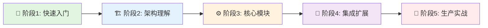
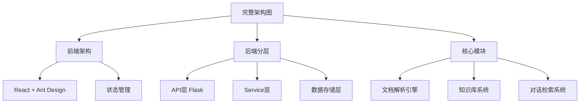
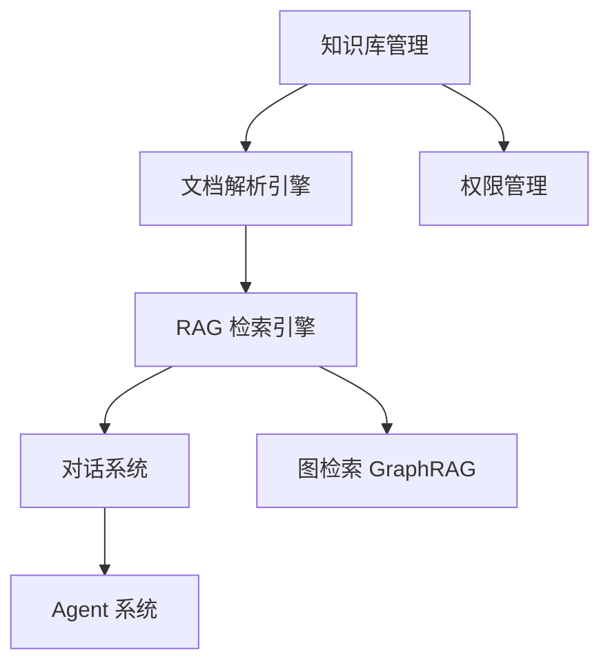
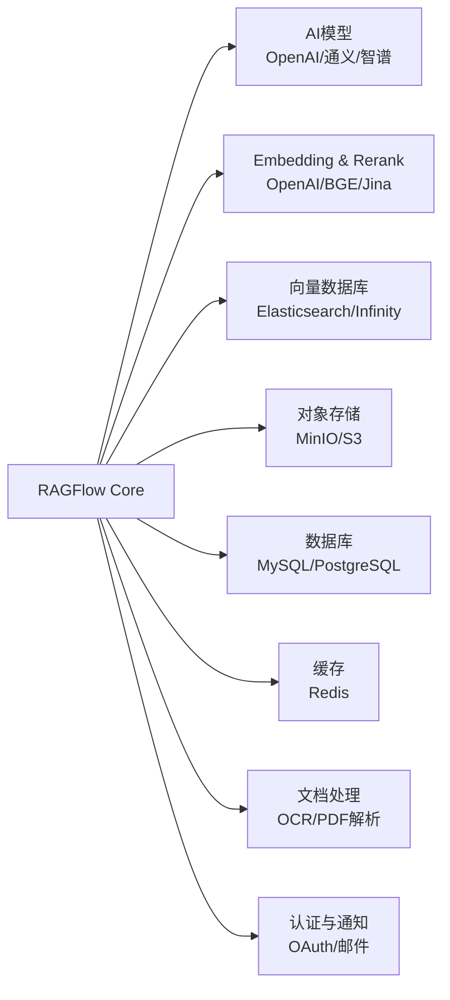

# 🗺️ RAGFlow 学习地图

> **从入门到精通：RAGFlow 架构的完整学习路径**  
> 适合架构师、开发者、AI 工程师系统性学习 RAGFlow


---

## 📖 如何使用这份学习地图

本学习地图基于 **认知难度递进** 和 **实战应用场景** 设计，分为 5 个阶段：



**预计学习时间**：
- **速成路径**（核心能力）：3-5 天
- **深度路径**（架构设计）：2-3 周
- **专家路径**（源码级）：1-2 个月

---

## 🌱 阶段1：快速入门（1-2天）

**学习目标**：了解 RAGFlow 是什么、能做什么、如何快速上手

### 📚 必读文档

| 序号 | 文档 | 核心收获 | 阅读时间 |
|------|------|---------|---------|
| 1.1 | [01-overview/project-overview.md](./01-overview/project-overview.md) | 项目定位、技术栈、代码结构 | 30 分钟 |
| 1.2 | [01-overview/README.md](./01-overview/README.md) | 概览文档导航 | 10 分钟 |
| 1.3 | [官方 README](./README.md) | 快速部署与体验 | 15 分钟 |
| 1.4 | [官方文档](https://ragflow.io/docs/) | 产品功能与使用指南 | 20 分钟 |

### 🎯 实践任务

- [ ] **任务 1.1**：使用 Docker Compose 部署 RAGFlow 本地环境
- [ ] **任务 1.2**：创建第一个知识库并上传文档
- [ ] **任务 1.3**：体验文档解析功能（PDF、Word、PPT）
- [ ] **任务 1.4**：创建一个对话助手并测试问答效果
- [ ] **任务 1.5**：尝试不同的文档分块策略

### ✅ 通关标准

- [ ] 能够独立部署 RAGFlow 并访问前端界面
- [ ] 理解 RAGFlow 的 4 大核心能力（深度文档解析、模板化分块、引用溯源、兼容多模型）
- [ ] 知道 RAGFlow 的技术栈（前端 React、后端 Python Flask、数据库 MySQL/Elasticsearch）

---

## 🏗️ 阶段2：架构理解（3-5天）

**学习目标**：掌握 RAGFlow 的系统架构、分层设计、组件关系

### 🖥️ 架构图学习路径



### 📚 必读文档

| 序号 | 文档 | 核心收获 | 阅读时间 |
|------|------|---------|---------|
| 2.1 | [02-architecture/system-architecture.md](./02-architecture/system-architecture.md) | 完整系统架构与组件关系 | 40 分钟 |
| 2.2 | [02-architecture/system-component-architecture.puml](./02-architecture/system-component-architecture.puml) | 架构图源码（可编辑） | 20 分钟 |
| 2.3 | [03-layers/01-presentation-layer.md](./03-layers/01-presentation-layer.md) | 表示层（前端架构） | 25 分钟 |
| 2.4 | [03-layers/02-gateway-layer.md](./03-layers/02-gateway-layer.md) | 网关层设计 | 15 分钟 |
| 2.5 | [03-layers/03-api-service-layer.md](./03-layers/03-api-service-layer.md) | API 服务层设计 | 20 分钟 |
| 2.6 | [03-layers/04-business-logic-layer.md](./03-layers/04-business-logic-layer.md) | 业务逻辑层设计 | 30 分钟 |
| 2.7 | [03-layers/05-data-access-layer.md](./03-layers/05-data-access-layer.md) | 数据访问层（ORM） | 25 分钟 |
| 2.8 | [04-core-modules/README.md](./04-core-modules/README.md) | 核心模块总览 | 20 分钟 |

### 🎨 关键架构图

**必看架构图**（按优先级）：
1. ⭐ [system-component-architecture.puml](./02-architecture/system-component-architecture.puml) - RAGFlow 完整架构图
2. [data-architecture.puml](./05-data-architecture/data-architecture.puml) - 数据架构设计
3. [data-flow.puml](./05-data-architecture/data-flow.puml) - 数据流转图
4. [data-model-er.puml](./05-data-architecture/data-model-er.puml) - 数据模型 ER 图

### 🎯 实践任务

- [ ] **任务 2.1**：理解 7 层架构设计（表示层→网关层→API服务层→业务逻辑层→数据访问层→基础设施层→外部服务层）
- [ ] **任务 2.3**：阅读 ORM 架构笔记 `07-others/ORM-ARCHITECTURE-NOTES.md`
- [ ] **任务 2.4**：找到 7 个核心模块的入口代码（知识库、对话、Agent、文档解析、RAG检索、权限、图检索）
- [ ] **任务 2.5**：了解 RAGFlow 的模块组织方式和依赖关系

### ✅ 通关标准

- [ ] 能够画出 RAGFlow 的七层架构（表示层、网关层、API服务层、业务逻辑层、数据访问层、基础设施层、外部服务层）
- [ ] 理解前后端分离和分层架构的好处
- [ ] 知道 7 大核心模块的职责与关系（知识库、对话、Agent、文档解析、RAG检索、权限、图检索）

---

## ⚙️ 阶段3：核心模块深度（7-10天）

**学习目标**：深入理解 RAGFlow 的核心模块的设计与实现

### 📊 模块学习顺序（推荐）

按照 **依赖关系** 和 **复杂度** 设计学习路径：



### 📚 分模块学习路径

#### 🔧 3.1 知识库管理（Knowledge Base）⭐ 基础模块

**为什么先学**：所有模块都依赖知识库的管理

| 文档 | 核心收获 | 难度 |
|------|---------|------|
| [01-knowledge-base/README.md](./04-core-modules/01-knowledge-base/README.md) | 知识库创建、配置、管理 | ⭐ |
| [01-knowledge-base/knowledge-base-management.md](./04-core-modules/01-knowledge-base/knowledge-base-management.md) | 知识库管理详细文档 | ⭐⭐ |
| 时序图：6 个完整流程 | 创建、上传、解析、搜索、更新、删除 | ⭐⭐ |

**关键时序图**：
- `01-create-kb-sequence.puml` - 创建知识库流程
- `02-upload-document-sequence.puml` - 文档上传流程
- `03-parse-document-sequence.puml` - 文档解析流程
- `04-vector-search-sequence.puml` - 向量搜索流程
- `qa-data-flow.puml` - 问答数据流

**实践任务**：
- [ ] 理解知识库的生命周期（创建→配置→文档管理→删除）
- [ ] 阅读 6 个时序图，理解完整流程
- [ ] 尝试通过 API 创建并配置一个知识库
- [ ] 理解知识库的数据模型和存储设计

---

#### 🔧 3.2 文档解析引擎（Document Parsing）⭐⭐⭐ 核心模块

**为什么重要**：RAGFlow 最强大的能力，深度文档理解是其核心竞争力

| 文档 | 核心收获 | 阅读时间 |
|------|---------|---------|
| [04-document-parsing/README.md](./04-core-modules/04-document-parsing/README.md) | 文档解析架构与解析策略 | 45 分钟 |
| [04-document-parsing/document-parsing-management.md](./04-core-modules/04-document-parsing/document-parsing-management.md) | 文档解析详细文档 | 40 分钟 |
| 源码：`deepdoc/` | 深度文档解析实现 | 60 分钟 |

**关键源码**（RAGFlow 项目）：
- `deepdoc/parser/` - 各类文档解析器（pdf_parser.py、docx_parser.py、excel_parser.py、ppt_parser.py、html_parser.py、markdown_parser.py 等）
- `deepdoc/vision/` - OCR 与表格识别（ocr.py、t_ocr.py、table_structure_recognizer.py、layout_recognizer.py）
- `rag/app/` - 分块策略模板（naive.py、qa.py、resume.py、book.py、paper.py、laws.py、table.py、manual.py 等）
- `api/apps/document_app.py` - 文档管理 API

**实践任务**：
- [ ] 理解文档解析的完整流程（上传→解析→提取→结构化）
- [ ] 阅读 PDF 解析器实现（`deepdoc/parser/pdf_parser.py`）
- [ ] 测试不同类型文档的解析效果（文本 PDF vs 扫描 PDF）
- [ ] **理解多模态处理**：阅读 `deepdoc/vision/` 目录下的 OCR 实现（`ocr.py`、`t_ocr.py`）
- [ ] **理解表格识别**：阅读 `table_structure_recognizer.py` 的表格结构识别实现
- [ ] **理解版面分析**：阅读 `layout_recognizer.py` 的文档版面识别

---

#### 🔧 3.3 RAG 检索引擎（RAG Retrieval）⭐⭐⭐ 核心模块

**为什么重要**：结合了分块策略与检索，决定 RAG 效果的关键

| 文档 | 核心收获 | 阅读时间 |
|------|---------|---------|
| [05-rag-retrieval/README.md](./04-core-modules/05-rag-retrieval/README.md) | RAG 检索架构与策略 | 40 分钟 |
| [05-rag-retrieval/rag-retrieval-management.md](./04-core-modules/05-rag-retrieval/rag-retrieval-management.md) | RAG 检索详细文档 | 45 分钟 |
| 时序图：3 个完整流程 | 混合检索、重排序、上下文组装 | ⭐⭐⭐ |

**关键源码**（RAGFlow 项目）：
- `rag/app/` - 分块策略模板（naive.py、qa.py、resume.py、book.py、paper.py、laws.py、table.py、manual.py、email.py、presentation.py 等）
- `rag/nlp/` - 文本处理与分词（search.py、query.py、rag_tokenizer.py、term_weight.py）
- `rag/svr/` - 检索服务（task_executor.py、sync_data_source.py）
- `api/apps/search_app.py` - 搜索 API
- `api/db/services/document_service.py` - 文档分块服务

**实践任务**：
- [ ] 理解不同分块策略（通用、QA、表格、简历、书籍、论文、法律、财报）
- [ ] 测试不同模板对检索效果的影响
- [ ] 创建一个自定义分块模板
- [ ] 理解分块大小与重叠度的权衡
- [ ] 分析智能分块（基于语义）的实现

---

#### 🔧 3.4 向量检索与上下文组装（Vector Search & Context）⭐⭐⭐ 核心模块

**为什么重要**：RAG 的核心流程，决定问答的准确性

**说明**：向量检索功能已包含在 3.3 RAG 检索引擎模块中，本节重点补充以下内容：

| 文档 | 核心收获 | 阅读时间 |
|------|---------|---------|
| [05-rag-retrieval/01-hybrid-search-sequence.puml](./04-core-modules/05-rag-retrieval/01-hybrid-search-sequence.puml) | 混合检索时序图 | 15 分钟 |
| [05-rag-retrieval/02-reranking-sequence.puml](./04-core-modules/05-rag-retrieval/02-reranking-sequence.puml) | 重排序时序图 | 15 分钟 |
| [05-rag-retrieval/03-context-assembly-sequence.puml](./04-core-modules/05-rag-retrieval/03-context-assembly-sequence.puml) | 上下文组装时序图 | 15 分钟 |
| [05-data-architecture/data-flow.puml](./05-data-architecture/data-flow.puml) | 数据流转图 | 15 分钟 |

**关键代码**：
- `rag/svr/task_executor.py` - 任务执行器（包含检索逻辑）
- `rag/nlp/search.py` - 搜索服务（文本处理与检索）
- `api/db/services/dialog_service.py` - 对话检索集成
- `api/apps/search_app.py` - 搜索 API

**实践任务**：
- [ ] 理解混合检索策略（向量检索 + 关键词检索）
- [ ] 阅读 3 个时序图，理解检索的完整流程
- [ ] 测试不同检索参数对结果的影响（top_k、similarity_threshold）
- [ ] 理解 Rerank 机制的作用
- [ ] 分析多路召回策略
- [ ] 理解上下文组装的策略（最大长度、窗口大小）

---

#### 🔧 3.5 对话系统（Chat Dialog）⭐⭐ 核心模块

**为什么重要**：用户交互的核心，串联检索与生成

| 文档 | 核心收获 | 阅读时间 |
|------|---------|--------- |
| [02-chat-dialog/README.md](./04-core-modules/02-chat-dialog/README.md) | 对话系统架构 | 35 分钟 |
| [02-chat-dialog/chat-dialog-management.md](./04-core-modules/02-chat-dialog/chat-dialog-management.md) | 对话管理详细文档 | 40 分钟 |
| 时序图：5 个完整流程 | 创建对话、同步对话、流式对话、反馈、检索集成 | ⭐⭐ |

**关键源码**（RAGFlow 项目）：
- `api/apps/dialog_app.py` - 对话 API
- `api/apps/conversation_app.py` - 会话管理 API
- `api/db/services/dialog_service.py` - 对话服务层（包含引用溯源实现）
- `api/db/services/conversation_service.py` - 会话服务层
- `rag/prompts/citation_prompt.md` - 引用生成提示词模板

**关键时序图**：
- `01-create-dialog-sequence.puml` - 创建对话流程
- `02-sync-chat-sequence.puml` - 同步对话流程
- `03-stream-chat-sequence.puml` - 流式对话流程
- `04-message-feedback-sequence.puml` - 消息反馈流程
- `05-retrieval-integration-sequence.puml` - 检索集成流程

**实践任务**：
- [ ] 理解对话的完整生命周期（用户提问→检索→生成→返回）
- [ ] 阅读 5 个时序图，理解对话的各种模式
- [ ] 理解对话上下文管理策略
- [ ] 分析流式响应的实现（SSE）
- [ ] 测试同步对话与流式对话的区别
- [ ] **理解引用溯源机制**：阅读 `dialog_service.py` 中的 `insert_citations` 和 `repair_bad_citation_formats` 函数
- [ ] **理解引用提示词**：查看 `rag/prompts/citation_prompt.md` 和 `citation_plus.md` 如何生成带引用的答案

---

### ✅ 通关标准（阶段3）

- [ ] 能够独立阅读并理解任意一个核心模块的源码和时序图
- [ ] 理解知识库管理的完整生命周期
- [ ] 理解文档解析引擎的深度解析能力（PDF、OCR、表格）
- [ ] 掌握 RAG 检索的完整流程（分块策略 + 混合检索 + 重排序）
- [ ] 理解对话系统的同步与流式模式
- [ ] 掌握 Agent 系统的 Canvas 设计与工具调用
- [ ] 理解权限管理的 RBAC 模型与多租户隔离

---

## 🔌 阶段4：集成扩展（3-5天）

**学习目标**：掌握 RAGFlow 与外部服务的集成方式

### 📚 必读文档

| 序号 | 文档 | 核心收获 | 阅读时间 |
|------|------|---------|---------|
| 4.1 | [06-ThirdParty/01-大语言模型集成.md](./06-ThirdParty/01-大语言模型集成.md) | 多模型接入 | 30 分钟 |
| 4.2 | [06-ThirdParty/02-文本嵌入与重排序集成.md](./06-ThirdParty/02-文本嵌入与重排序集成.md) | Embedding 与 Rerank 模型 | 25 分钟 |
| 4.3 | [06-ThirdParty/03-向量数据库集成.md](./06-ThirdParty/03-向量数据库集成.md) | Elasticsearch/Infinity/Milvus | 25 分钟 |
| 4.4 | [06-ThirdParty/04-对象存储集成.md](./06-ThirdParty/04-对象存储集成.md) | MinIO/S3 配置 | 20 分钟 |
| 4.5 | [06-ThirdParty/05-数据源连接器集成.md](./06-ThirdParty/05-数据源连接器集成.md) | 外部数据源接入 | 25 分钟 |
| 4.6 | [06-ThirdParty/06-数据库与缓存集成.md](./06-ThirdParty/06-数据库与缓存集成.md) | MySQL/Redis 配置 | 20 分钟 |
| 4.7 | [06-ThirdParty/07-文档处理集成.md](./06-ThirdParty/07-文档处理集成.md) | OCR、PDF 解析服务 | 25 分钟 |
| 4.8 | [06-ThirdParty/10-认证与通知集成.md](./06-ThirdParty/10-认证与通知集成.md) | OAuth、消息通知 | 25 分钟 |

### 🔧 集成方式学习路径



**关键源码**（RAGFlow 项目）：
- `rag/llm/` - LLM、Embedding、Rerank 模型抽象层（chat_model.py、embedding_model.py、rerank_model.py、ocr_model.py、cv_model.py 等）
- `conf/` - 配置文件（llm_factories.json、service_conf.yaml 等）
- `intergrations/` - 第三方集成（chatgpt-on-wechat、extension_chrome、firecrawl）

### 🎯 实践任务

- [ ] **任务 4.1**：配置多个 LLM 模型（OpenAI + 本地模型）
- [ ] **任务 4.2**：配置 Embedding 模型与 Rerank 模型
- [ ] **任务 4.3**：配置 Elasticsearch 或 Infinity 向量库
- [ ] **任务 4.4**：配置对象存储（MinIO 或云服务商）
- [ ] **任务 4.5**：配置 MySQL/PostgreSQL 数据库
- [ ] **任务 4.6**：配置 Redis 缓存
- [ ] **任务 4.7**：配置 OCR 服务（本地或云服务）
- [ ] **任务 4.8**：配置 OAuth 认证或邮件通知

### ✅ 通关标准

- [ ] 能够配置多种 AI 模型并理解适配器模式
- [ ] 理解向量数据库的选型标准（性能、成本、功能）
- [ ] 能够独立集成一个外部服务（如消息平台）
- [ ] 理解 RAGFlow 的可扩展性设计

---

## 🚀 阶段5：生产实战（持续）

**学习目标**：掌握生产环境部署、性能优化、故障排查

### 📚 必读文档

| 序号 | 文档 | 核心收获 | 难度 |
|------|------|---------|------|
| 5.1 | 官方部署文档 | 部署方式（Docker/K8s） | ⭐⭐ |
| 5.2 | [05-data-architecture/README.md](./05-data-architecture/README.md) | 数据架构总览 | ⭐⭐ |
| 5.3 | [05-data-architecture/data-architecture.md](./05-data-architecture/data-architecture.md) | 数据库设计与优化 | ⭐⭐⭐ |
| 5.4 | [07-others/ORM-ARCHITECTURE-NOTES.md](./07-others/ORM-ARCHITECTURE-NOTES.md) | ORM 架构设计 | ⭐⭐⭐ |

**关键源码**（RAGFlow 项目）：
- `docker/` - Docker 部署配置（docker-compose.yml、entrypoint.sh、launch_backend_service.sh）
- `helm/` - Helm Charts（K8s 部署）
- `conf/` - 配置文件（service_conf.yaml、llm_factories.json、mapping.json）
- `api/db/` - 数据库模型（db_models.py、services/）

### 🎯 实践任务

- [ ] **任务 5.1**：部署 RAGFlow 到云服务器（阿里云/AWS）
- [ ] **任务 5.2**：配置 HTTPS 与域名
- [ ] **任务 5.3**：配置 Nginx 反向代理与负载均衡
- [ ] **任务 5.4**：性能压测（压测工具：Locust、JMeter）
- [ ] **任务 5.5**：监控 RAGFlow 的性能指标（CPU、内存、响应时间）
- [ ] **任务 5.6**：数据库优化（MySQL 索引、Elasticsearch/Infinity 调优）
- [ ] **任务 5.7**：配置日志收集与分析
- [ ] **任务 5.8**：配置 Redis 任务队列监控
- [ ] **任务 5.9**：理解 ORM 架构设计（阅读 ORM-ARCHITECTURE-NOTES.md）
- [ ] **任务 5.10**：数据模型优化与迁移

### ✅ 通关标准

- [ ] 能够独立部署 RAGFlow 到生产环境
- [ ] 知道如何排查性能问题
- [ ] 理解 RAGFlow 的扩展性设计（水平扩展）
- [ ] 掌握数据库优化技巧

---

## 🎓 学习路径推荐（按角色）

### 👨‍💼 架构师路径

**目标**：理解 RAGFlow 的架构设计与技术选型

```
阶段1 → 阶段2 → 阶段3（核心模块总览）→ 阶段4 → 阶段5（重点：扩展性与性能）
```

**关键文档**：
- [02-architecture](./02-architecture/README.md)（架构设计）
- [04-core-modules](./04-core-modules/README.md)（模块设计）
- [05-data-architecture](./05-data-architecture/README.md)（数据库设计）

---

### 👨‍💻 开发者路径

**目标**：基于 RAGFlow 进行二次开发或贡献代码

```
阶段1 → 阶段2 → 阶段3（深度学习文档解析 & 分块策略）→ 阶段4（集成开发）
```

**关键文档**：
- [04-core-modules/04-document-parsing](./04-core-modules/04-document-parsing/README.md)（文档解析开发）
- [04-core-modules/05-rag-retrieval](./04-core-modules/05-rag-retrieval/README.md)（RAG 检索与分块策略）
- [04-core-modules/03-agent](./04-core-modules/03-agent/README.md)（Agent 开发）
- [07-others/ORM-ARCHITECTURE-NOTES.md](./07-others/ORM-ARCHITECTURE-NOTES.md)（ORM 架构）

---

### 🤖 AI 工程师路径

**目标**：理解 RAG 应用的工程化最佳实践

```
阶段1 → 阶段3.2（文档解析）→ 阶段3.3（RAG检索）→ 阶段3.4（对话系统）→ 阶段4（集成）
```

**关键文档**：
- [04-core-modules/04-document-parsing](./04-core-modules/04-document-parsing/README.md)（深度文档理解）
- [04-core-modules/05-rag-retrieval](./04-core-modules/05-rag-retrieval/README.md)（RAG 优化与分块策略）
- [04-core-modules/02-chat-dialog](./04-core-modules/02-chat-dialog/README.md)（对话系统）
- [06-ThirdParty/01-大语言模型集成.md](./06-ThirdParty/01-大语言模型集成.md)
- [06-ThirdParty/02-文本嵌入与重排序集成.md](./06-ThirdParty/02-文本嵌入与重排序集成.md)

---

### 🎓 学生/初学者路径

**目标**：快速上手并理解 RAGFlow 的核心能力

```
阶段1 → 阶段2（重点：架构图）→ 阶段3（选择 1-2 个感兴趣的模块）
```

**关键文档**：
- [01-overview](./01-overview/project-overview.md)（项目概述）
- [02-architecture](./02-architecture/system-architecture.md)（架构图）
- [04-core-modules/01-knowledge-base](./04-core-modules/01-knowledge-base/README.md)（知识库管理）
- [04-core-modules/04-document-parsing](./04-core-modules/04-document-parsing/README.md)（文档解析）

---

## 📊 学习进度追踪

### 📈 完成度自测表

| 阶段 | 预计时间 | 完成度 | 通关日期 |
|------|---------|--------|---------|
| 🌱 阶段1：快速入门 | 1-2天 | ☐ | - |
| 🏗️ 阶段2：架构理解 | 3-5天 | ☐ | - |
| ⚙️ 阶段3：核心模块 | 7-10天 | ☐ | - |
| 🔌 阶段4：集成扩展 | 3-5天 | ☐ | - |
| 🚀 阶段5：生产实战 | 持续 | ☐ | - |

### 🏅 技能徽章系统

完成特定学习目标后，可以解锁对应徽章：

- 🏆 **RAGFlow 入门者**：完成阶段1
- 🏆 **架构理解者**：完成阶段2
- 🏆 **知识库专家**：深度掌握知识库管理模块
- 🏆 **文档解析大师**：深度掌握文档解析模块（PDF、OCR、表格）
- 🏆 **RAG 检索专家**：深度掌握 RAG 检索模块（混合检索、重排序）
- 🏆 **对话系统专家**：深度掌握对话系统模块
- 🏆 **Agent 工程师**：深度掌握 Agent 系统（Canvas、工具调用）
- 🏆 **权限管理专家**：深度掌握权限管理模块
- 🏆 **GraphRAG 专家**：掌握图检索能力
- 🏆 **集成专家**：完成阶段4
- 🏆 **生产实战者**：完成阶段5
- 🏆 **RAGFlow 贡献者**：向 RAGFlow 贡献代码并被合并

---

## 🛠️ 学习工具推荐

### 📖 文档阅读

- **PlantUML 预览**：VS Code 插件 `PlantUML`
- **Markdown 预览**：VS Code 插件 `Markdown Preview Enhanced`
- **架构图绘制**：draw.io、Excalidraw

### 🔍 代码阅读

- **IDE**：VS Code + Python 插件
- **代码导航**：VS Code 内置 Go to Definition
- **AI 辅助**：GitHub Copilot、Cursor

### 🧪 实验环境

- **本地部署**：Docker Desktop
- **云服务器**：阿里云、AWS、Azure
- **数据库工具**：MySQL Workbench（MySQL）、DBeaver（通用）、Kibana（Elasticsearch）、RedisInsight（Redis）

---

## 📎 补充资源

### 🌐 官方资源

- **官方文档**：https://ragflow.io/docs/
- **GitHub 仓库**：https://github.com/infiniflow/ragflow
- **社区讨论**：GitHub Discussions

### 📖 推荐阅读

- **RAG 理论**：《Retrieval-Augmented Generation for Knowledge-Intensive NLP Tasks》
- **文档解析**：深度学习在文档理解中的应用
- **AI 应用开发**：《构建 LLM 应用》（O'Reilly）
- **RAG 实践**：LangChain、LlamaIndex 文档

### 🎥 视频教程

- RAGFlow 官方教程
- RAGFlow 使用案例分享

---

## 💡 学习建议

### ✅ 推荐做法

- **边学边做**：理论结合实践，每学完一个模块立即动手实验
- **画图理解**：用 PlantUML 或手绘架构图，加深理解
- **源码阅读**：不要只看文档，结合源码学习
- **做笔记**：用 Markdown 记录学习心得
- **提问题**：不懂的地方去 GitHub Discussions 提问

### ⚠️ 避免陷阱

- **不要跳跃学习**：按照学习路径循序渐进
- **不要只看不做**：实践是最好的老师
- **不要死磕细节**：先理解整体，再深入细节
- **不要孤军奋战**：加入社区，与其他学习者交流

---

## 📞 获取帮助

### 🆘 遇到问题怎么办？

1. **查文档**：先在 `ragflow-analysis/` 目录搜索相关文档
2. **看源码**：结合源码理解实现细节
3. **问社区**：去 GitHub Discussions 提问
4. **查 Issue**：在 GitHub Issues 搜索相关问题

---

## 🎉 结语

RAGFlow 是一个专注于深度文档理解的开源 RAG 引擎。通过系统学习本学习地图，你将：

- ✅ 掌握 RAGFlow 的完整架构设计
- ✅ 理解深度文档解析的技术实现
- ✅ 掌握 RAG 应用的工程化最佳实践
- ✅ 具备基于 RAGFlow 进行二次开发的能力
- ✅ 了解如何部署 RAGFlow 到生产环境

**祝你学习愉快！🎓**

---

**最后更新**：2025-12-29  
**维护者**：RAGFlow 项目分析  
**贡献**：欢迎通过 Pull Request 改进本学习地图
